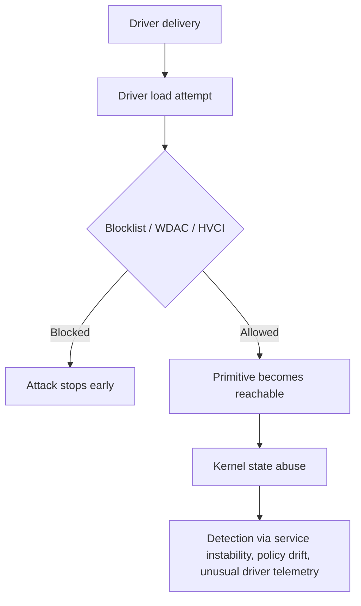
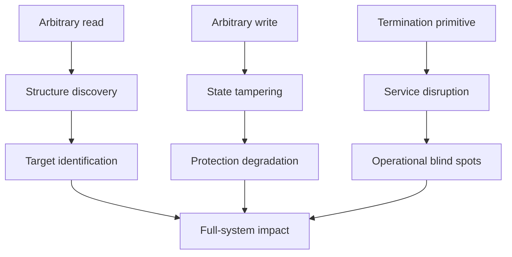

> **Warning**
> This article is intended for defensive research, reverse engineering education, and authorized lab work only.

## Introduction

There is a difference between *having code that runs* and *having a primitive that changes the security model*. BYOVD sits in that second category. Once a signed but vulnerable driver gives an attacker reliable kernel-level capabilities, the discussion stops being about one process, one protection, or one EDR product. It becomes a question of trust collapse inside the operating system.

That is why BYOVD keeps showing up in both real intrusions and advanced security research. The vulnerable driver is rarely the final objective. It is the bridge. A weak IOCTL, an unchecked pointer, or an unsafe memcpy-like path becomes the starting point for actions that user mode was never meant to perform directly. The source module frames exactly this transition: moving from kernel primitives to full-system impact through a sequence of increasingly meaningful consequences. 

This post expands that idea. Rather than treating each technique as an isolated trick, we will look at the broader pattern behind them: why kernel primitives matter, how they reshape Windows trust boundaries, why post-exploitation protections often become fragile after a successful driver load, and what defenders should actually monitor if they want to stop this class of attack.

## Why BYOVD matters

BYOVD, or *Bring Your Own Vulnerable Driver*, is one of the clearest examples of a modern trust inversion. Windows is designed to trust signed kernel drivers because the kernel cannot function without trusted code at that level. But if a signed driver exposes unsafe functionality, that trust is inherited by code that never earned it.

The source material uses this pattern as the foundation for the entire article. A vulnerable signed driver is loaded, an exposed IOCTL is used to interact with kernel memory, and that kernel capability becomes the basis for broader system impact. That is the key lesson: the driver is not just another binary. It is a permission amplifier.

A useful way to think about BYOVD is this:

- A user-mode payload normally negotiates with Windows security boundaries.
- A kernel primitive rewrites or bypasses those boundaries.
- The vulnerable driver is the mechanism that turns one into the other.

That distinction matters because many detections are still userland-centric. They look for suspicious API patterns, classic injection chains, or known malware behaviors. But if the decisive action is happening through a trusted kernel driver, those detections may only see weak secondary artifacts.

> **Note**
> In mature BYOVD investigations, the most important question is often not “what did the user-mode binary do?” but “what kernel authority did the driver expose?”

## Primitive-first thinking

The original module correctly centers the idea of *kernel primitives*. That is the most important conceptual improvement anyone can make when studying this area. The real payload is not “kill process,” “disable PPL,” or “gain SYSTEM.” The real payload is the primitive that makes those effects possible.

A primitive is a minimal but powerful capability, such as:

- Arbitrary read.
- Arbitrary write.
- Arbitrary object reference manipulation.
- Arbitrary process termination.
- Allocation or mapping in privileged memory contexts.

Once you understand the primitive, the downstream impact becomes easier to reason about. A process termination primitive is narrower than a read/write primitive, but it still has serious defensive implications if it can target security tooling. A kernel arbitrary write primitive is more severe because it allows direct tampering with security-relevant state. The source material repeatedly demonstrates this pattern by starting from vulnerable-driver IOCTLs and then building larger outcomes around them.

### Why primitives matter more than technique names

Technique names can mislead people into thinking they are studying many different attacks. In reality, several “different” techniques are only different presentations of the same primitive. If an attacker can write controlled bytes to the right kernel structure, multiple downstream protections may fail for the same underlying reason.

For example:

| Primitive | Typical effect | Why it matters |
|---|---|---|
| Arbitrary process termination | Security tool instability, service interruption | Creates immediate operational blind spots |
| Arbitrary kernel read | Structure discovery, pointer recovery, state inspection | Enables reliable follow-on manipulation |
| Arbitrary kernel write | Tampering with process or policy state | Turns low-level access into trust boundary failure |
| Arbitrary allocation or mapping | Controlled placement of data or objects | Expands post-exploitation options |

This is why defenders should classify BYOVD alerts by exposed capability, not only by the driver filename or family.

## Trust boundaries in Windows

Windows does not apply all protections equally. Some boundaries live in user mode, some are enforced through policy, and others depend on kernel-managed state. The source text spends significant time around structures such as `EPROCESS`, build-dependent offsets, and protection fields, which is a strong clue that the article is really about *where Windows stores trust* as much as it is about exploitation.

That is the central insight to surface in a blog post.

When people hear “LSASS protection,” “PPL,” or “driver signing enforcement,” they often imagine those as abstract security features floating above the system. In practice, those protections depend on concrete state, policy flags, object attributes, code integrity decisions, and kernel-enforced rules. If a vulnerable driver gives unauthorized write access into that ecosystem, the protection can degrade from “hard barrier” to “mutable field.”

### The uncomfortable truth

A surprising number of post-exploitation protections are powerful **until** an attacker obtains a stable kernel primitive. After that point:

- Access checks may still exist, but the attacker can alter the checked state.
- Security products may still run, but their protected status may no longer mean much.
- Integrity enforcement may still be configured, but the attacker may target the mechanism that holds the configuration.

That is the real reason BYOVD matters. It is not merely privilege escalation. It is security model interference.

## Research workflow

One of the strongest parts of the source is the repeated emphasis on how these findings are discovered: reverse engineering drivers, identifying IOCTL paths, inspecting decompiled handlers, and understanding exactly what the driver fails to validate. That deserves expansion because it is where high-quality research begins.

A disciplined BYOVD workflow usually looks like this:

1. Identify the driver and its load conditions.
2. Reverse exposed device interfaces and IOCTL handlers.
3. Classify the reachable primitive.
4. Determine whether the primitive is bounded, typed, or fully arbitrary.
5. Map the primitive to possible security impact.
6. Validate in a lab with strong containment and clear rollback.

The source explicitly ties this process to reverse engineering, decompilation, and kernel structure inspection through tools like WinDbg. That research-centric framing is worth keeping because it elevates the post above a generic walkthrough.

### What reverse engineers actually look for

A good reverse engineer is not just hunting for “a vulnerability.” They are hunting for *a capability boundary that the driver accidentally exports*. Common red flags include:

- User-supplied pointers used without probing or validation.
- memcpy-style paths that trust caller-provided source or destination addresses.
- IOCTLs that expose raw memory operations.
- Kernel object operations with no authorization model.
- Unrestricted process, thread, or handle manipulation.

That is why even a tiny code path can have outsized impact. Ten lines of unsafe driver code can create consequences larger than thousands of lines of hardened user-mode code.

> **Tip**
> When documenting a vulnerable driver, describe the primitive first and the demo second. The primitive is the durable lesson.

## From primitive to impact

The source organizes its content into a sequence of effects: process termination, PPL deactivation, DSE deactivation, privilege escalation, and repeated service termination. Rather than reframe those as isolated “tricks,” a stronger blog presents them as examples on an impact ladder.

### Impact ladder

| Stage | Capability class | Security meaning |
|---|---|---|
| Driver loads successfully | Initial trust breach | Signed kernel trust has been borrowed |
| Kernel primitive obtained | Authority expansion | The attacker now acts through ring 0 logic |
| Process or service tampering | Operational impact | Defensive tooling may become unstable |
| Protected-state tampering | Trust boundary erosion | High-value controls become mutable |
| Privilege boundary failure | Full local dominance | Subsequent actions inherit maximum authority |
| Repeated or automated reuse | Persistence of effect | Temporary impact becomes sustained impact |

This ladder tells a clearer story than a purely exploit-centric format. It helps the reader understand that a vulnerable driver is not dangerous because of one flashy demo, but because of the cascade it enables.

## Protected Process Light

The source devotes a major section to PPL and describes it as a Windows mechanism used to protect sensitive processes such as antimalware engines and LSASS. It also notes that these protections are represented in process-related kernel state and can become a target when a kernel write primitive exists. That framing is important and should stay. 

A better blog explanation is to treat PPL as *resistance against ordinary tampering*, not invincibility. PPL raises the bar for handle access and process interaction. It works very well against user-mode abuse. But PPL still depends on kernel-enforced process metadata. Once a hostile actor can directly influence that metadata through an unauthorized kernel path, the protection model changes.

### Why this matters conceptually

PPL is valuable because it protects high-value processes from easy inspection, dumping, and termination. But BYOVD research reminds us of a deeper rule:

> If the attacker can modify the data structure that the protection relies on, the protection becomes a policy suggestion rather than a hard wall.

This is not a criticism of PPL. It is a reminder that post-exploitation features must be understood relative to the attacker’s current privilege tier. The source handles this idea through its process-structure discussion and offset-driven walkthrough, which is exactly the right conceptual direction even if the raw module is more operational than a public blog should be.

### A useful analogy

Think of PPL like a secure badge reader on a data-center door. It is strong against people without internal building access. But if someone already controls the room that stores the badge permissions database, the badge reader is no longer the decisive defense. The security feature still exists; the trust behind it has been compromised.

## Code integrity and DSE

The source also includes a DSE-focused section and treats code integrity state as another target once a stable kernel primitive is available. This is a natural continuation of the same story: after process trust, the next interesting target is policy trust.

Driver Signature Enforcement exists to prevent unsigned or unauthorized kernel drivers from being loaded. It is one of the most important barriers in the platform because once untrusted code enters the kernel, every downstream assumption becomes weaker. The source’s discussion makes the key point clearly: if the system can be convinced, coerced, or tampered into weakening that check, the impact extends beyond one vulnerable driver.

### Why DSE is strategically important

A vulnerable driver is dangerous on its own. But a vulnerable driver that also enables further kernel policy tampering is more serious because it can become a stepping stone rather than a single-use asset. That is why hardening around code integrity, HVCI, and blocklists matters so much. The source repeatedly highlights Kernel Isolation, Memory Integrity, and the Microsoft Vulnerable Driver Blocklist as critical defensive controls, and that point deserves front-and-center placement in the rewrite.

### Defensive reading of the problem

A blue-team reader should not interpret DSE tampering discussion as just another technique. They should interpret it as evidence that:

- The attack has already crossed a major trust boundary.
- The system’s future driver load decisions may no longer be trustworthy.
- Containment urgency has increased because platform protections themselves may have been touched.

That is a very different incident posture from ordinary malware cleanup.

## Privilege escalation as a consequence

The source later moves to local privilege escalation and frames it as another natural downstream effect of kernel read/write capabilities. That is exactly how it should be explained. SYSTEM is not the “magic trick.” It is the logical consequence of controlling sensitive kernel-managed process state.

A stronger article should emphasize that local privilege escalation in this context is less about credentials and more about *authority reassignment*. Once a kernel primitive exists, many traditional escalation obstacles become less relevant because the attacker is no longer negotiating with user-mode security boundaries in the normal way.

### Why this breaks common assumptions

Many defenders still associate LPE with things like service misconfigurations, token impersonation APIs, UAC bypasses, or weak ACLs. Those are valid categories, but BYOVD is different. It is not asking Windows for more privileges through the front door. It is rewriting or bypassing the rules from below.

That distinction affects both detection and triage:

- The user-mode binary may look unimpressive.
- The suspicious action may be concentrated in driver interaction.
- The real evidence may live in kernel telemetry, driver load events, or policy-state changes.

## The detection problem

One of the most interesting themes in the source is the repeated observation that “the real detection surface is the driver, not the userland executable.” That is one of the strongest lines in the entire module, and it should become a central thesis of the blog.

This is where many organizations lose the BYOVD battle. They over-index on payload signatures and under-invest in driver trust monitoring. If the vulnerable driver is already loaded and functioning, user-mode behavior may appear surprisingly quiet or generic compared with the consequences it triggers.

### What defenders should actually prioritize

A mature detection strategy should pay close attention to:

- New or unusual kernel driver loads.
- Drivers known to be vulnerable or unusual for the environment.
- Changes in code integrity or kernel isolation posture.
- Repeated crashes or restarts of security-critical services.
- Security product instability with no obvious user-mode root cause.
- Administrative service creation tied to suspicious driver paths.
- Unexpected access or tampering around trusted-but-rare kernel components.

The source also describes repeated service restarts as one of the few reliable artifacts in some scenarios. That is exactly the kind of observation a strong blog should elevate: even when the immediate payload seems quiet, operational instability often leaks the truth.

### Example: service crash telemetry

Suppose a security service restarts once after a patch or update. That is not especially interesting. But if a protected security service terminates unexpectedly multiple times in a short window, and that pattern aligns with a previously unseen driver load, the event deserves very different treatment.

That is the kind of correlation that catches BYOVD-class behavior:

- Driver load event.
- Security service instability.
- Policy-hardening features unexpectedly disabled or absent.
- A low-noise user-mode process talking to a device object.

None of these alone is definitive. Together, they are highly suspicious.

## Why repetitive effects matter

The source’s final major technique discusses the idea of repeating a process-termination effect over time rather than executing it once. The most important idea there is not the loop itself. It is the concept of *persistence of effect*. That phrase is worth preserving because it captures an important security principle.

A primitive can be low sophistication and still produce serious impact if it is:

- Reliable.
- Fast.
- Reusable.
- Hard to interrupt at the source.

This matters because many defenders intuitively discount “simple” primitives. A primitive that only terminates a process may sound less severe than arbitrary kernel write. But if that termination can be repeatedly applied against security tooling with low visibility, the operational impact can still be substantial.

### Better way to present it

For a public blog, avoid emphasizing how to automate or optimize the loop. Instead, explain the defensive lesson:

- Some protections are resilient to one crash but not to repeated disruption.
- Automatic service recovery can become a visible telemetry trail.
- Repetition turns a transient fault into a sustained blind spot.

That framing is more insightful and more defensible.

## Hardening guidance

The source repeatedly points to two major defenses: Memory Integrity and the Microsoft Vulnerable Driver Blocklist. Those should become the center of the hardening section, because they directly target the attack at its most decisive point: driver load and kernel trust. 

### Priority controls

| Control | Why it matters |
|---|---|
| Microsoft Vulnerable Driver Blocklist | Prevents known bad drivers from loading |
| Memory Integrity / HVCI | Raises the cost of kernel tampering and hardens code integrity paths |
| WDAC or equivalent allowlisting | Restricts what can execute and load in the environment |
| Least privilege for administration | Reduces the ease of staging and loading drivers |
| Driver inventory monitoring | Makes unusual kernel components easier to spot |
| Alerting on security-service instability | Captures repeated disruptive side effects |

### Practical advice for enterprises

- Treat driver governance as a first-class security problem, not an endpoint afterthought.
- Inventory what drivers are normal for your fleet.
- Investigate any signed driver that appears outside expected software baselines.
- Verify that memory integrity and related kernel protections are not merely “supported” but actually enabled.
- Audit exceptions that allow legacy or rare drivers.
- Correlate driver loads with service health, kernel isolation state, and endpoint product telemetry.

> **Warning**
> A signed driver should never be treated as synonymous with a safe driver. Signed code can still expose dangerous primitives.

## Safer lab methodology

The source includes an exercise section built around kernel structures, offsets, debugger inspection, and proof-of-concept validation. For a safer and more publishable blog, keep the methodology emphasis but remove the “build this weaponized chain” tone.

A stronger lab section should encourage:

- Isolated, throwaway VMs.
- Snapshots before every major experiment.
- Kernel debugging for observation, not just manipulation.
- Documentation of build-specific differences.
- Symbol-based reasoning instead of hardcoded assumptions.
- Measurement of detection artifacts and policy state before and after a test.

### Good research questions

Instead of asking “can I make this exploit work,” ask:

- What exact primitive does this driver export?
- Is the primitive arbitrary, constrained, or type-confused?
- What Windows trust boundary depends on the targeted state?
- What telemetry appears before, during, and after the primitive is used?
- Which mitigations fail, and which fail closed?
- Which mitigations stop the chain at the driver-load stage?

Those questions produce stronger writeups and better defenders.

## Writing improvements over the raw module

The source already has strong ingredients, but it reads like a direct training module export in places. A better public article should improve several things:

### 1. Explain before demonstrating

The source often presents a concept and then quickly shifts into implementation detail. In a polished blog, each section should first answer:

- What is this protection?
- Why does it exist?
- What trust boundary does it enforce?
- Why does a kernel primitive affect it?

Only then should you show examples, diagrams, or references.

### 2. Replace “trick lists” with cause-and-effect

Rather than “Technique 1, Technique 2, Technique 3,” use a narrative arc:

- Primitive discovery.
- Trust boundary identification.
- Effect generation.
- Detection gaps.
- Defensive opportunities.

This makes the post feel like original research rather than notes.

### 3. Emphasize build variance

The source mentions that offsets change between Windows builds. That is more than a practical note. It is an important research lesson. Kernel work is version-sensitive, and reliable findings require symbol awareness, validation discipline, and environmental documentation.

### 4. Elevate the defensive insight

The source already contains a strong defensive idea: the vulnerable driver is the true chokepoint. That should become the article’s organizing principle. It is more useful than raw “success screenshots,” and it gives the post lasting value.

## Example diagrams

Chirpy supports Mermaid, so this post can become much more visually engaging without relying on screenshots. The following diagrams fit the article well.

### Attack chain model

### Defensive chokepoints

### Primitive-to-impact map

## Suggested callouts

To make the post feel more alive in Chirpy, use callouts like these:

> **Note**
> The most important artifact in many BYOVD cases is not the userland payload but the appearance of an unusual driver with kernel authority.

> **Tip**
> When documenting a vulnerable driver, classify the reachable primitive before discussing screenshots or proof-of-concept results.

> **Warning**
> If a trusted security service crashes repeatedly and a new driver appeared shortly before it, investigate the driver first.

## Closing thoughts

The biggest lesson from BYOVD research is not that Windows protections are weak. It is that they are layered, and the wrong kernel primitive can cut beneath several layers at once. The source material demonstrates this clearly through its progression from primitive discovery to trust-boundary interference and then to full-system consequence.

That is why defenders should stop thinking about BYOVD as a niche exploit category and start treating it as a trust-governance problem. Signed drivers are part of the operating system’s root of enforcement. When one of them exposes unsafe power to the wrong caller, the issue is no longer just code execution. It is control over the logic that decides what the rest of the platform is allowed to trust.

If this article leaves you with one idea, let it be this: in BYOVD scenarios, the driver is rarely just a component. It is the entire battlefield.
